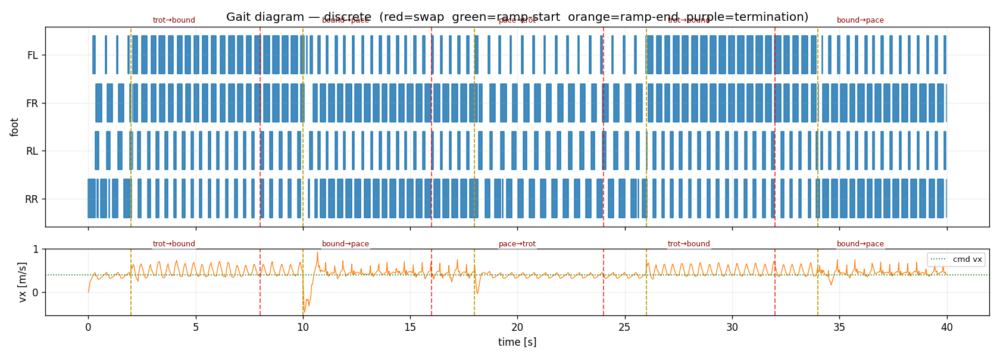
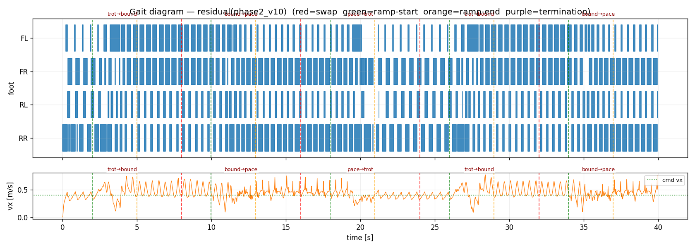
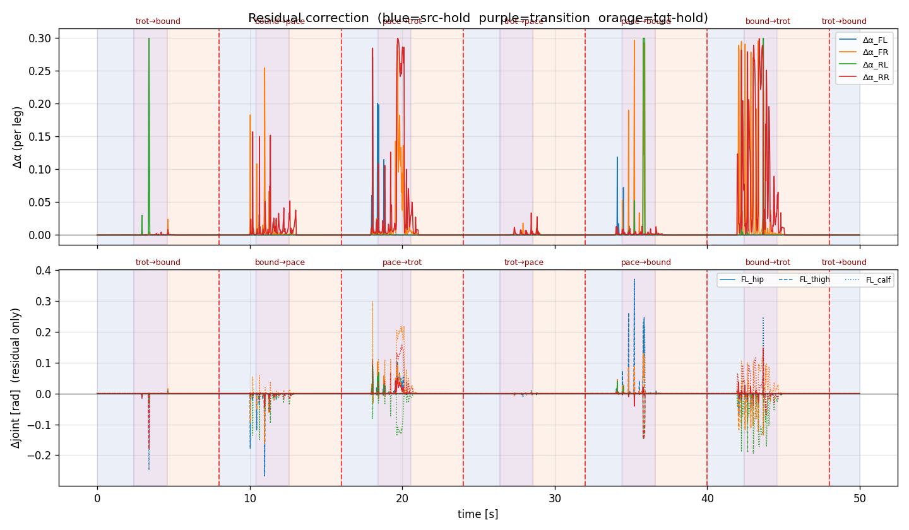
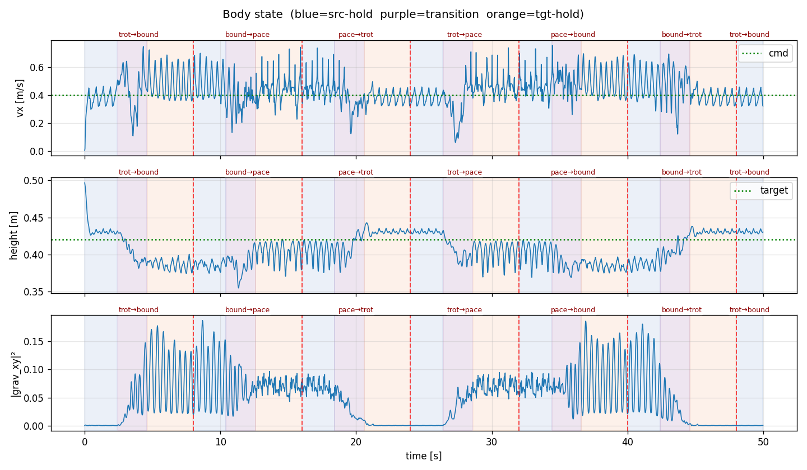
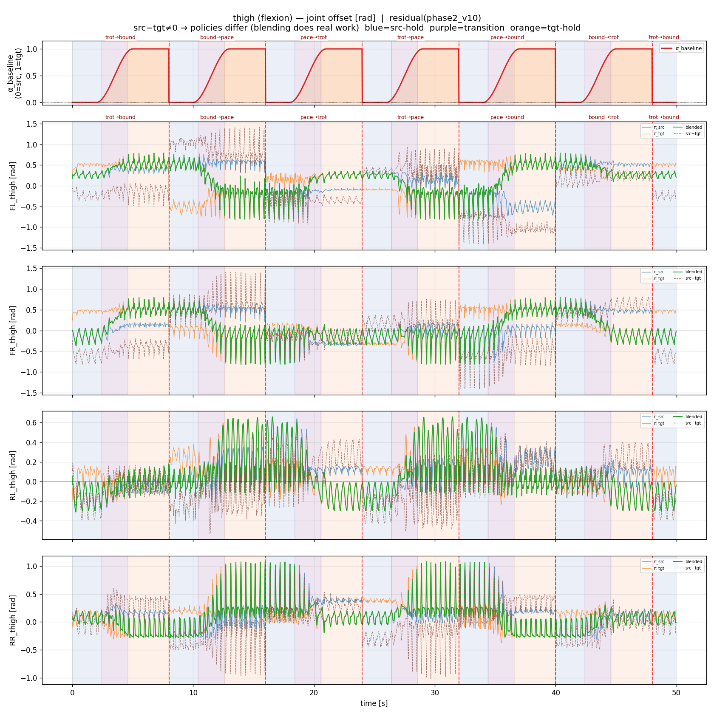
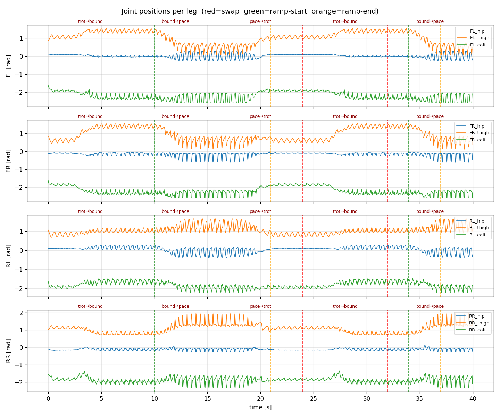
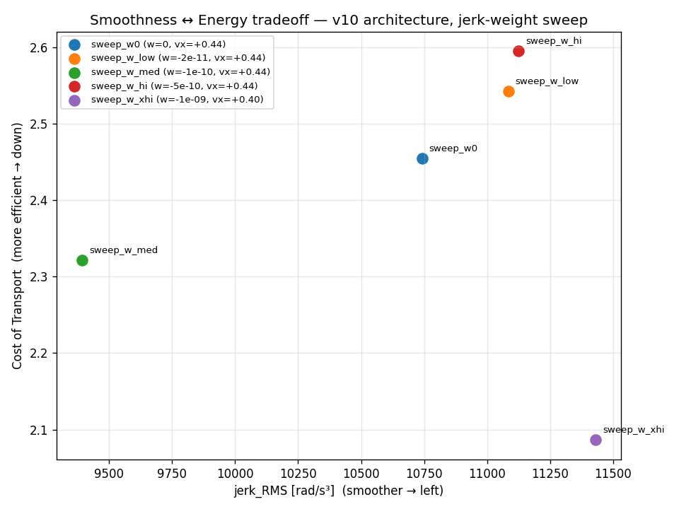
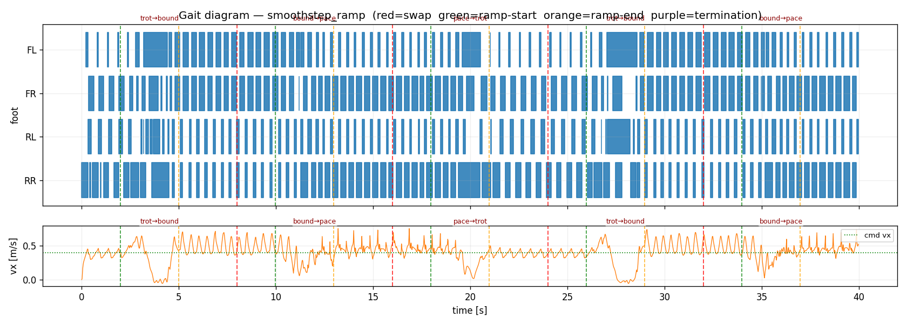
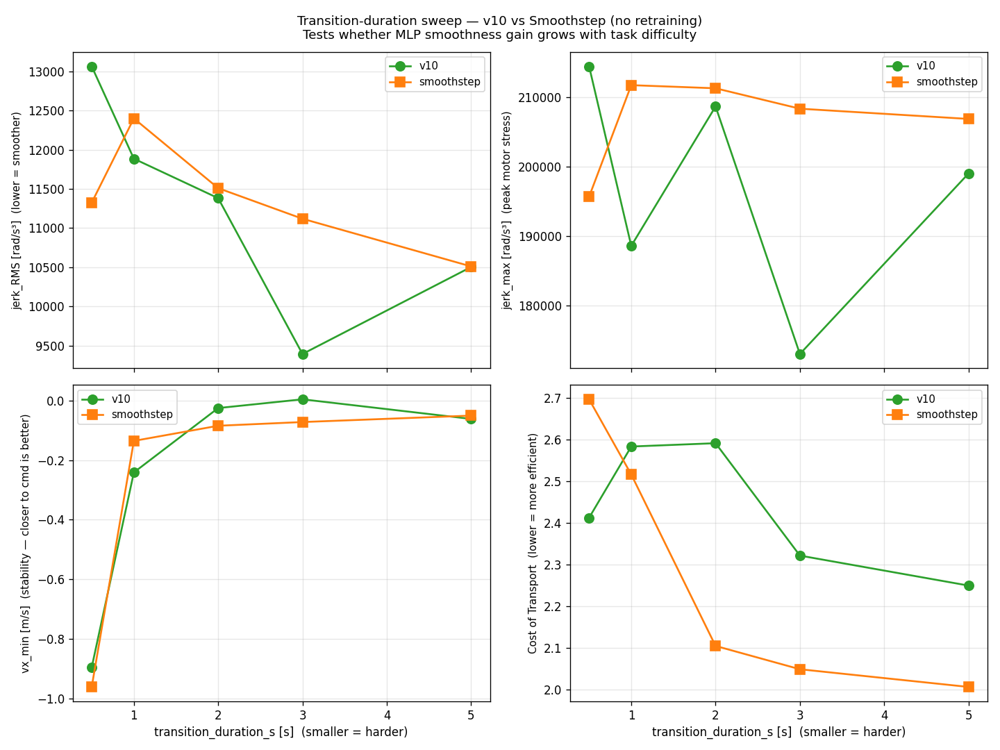

# Transition-Aware Quadruped Locomotion with Per-Leg Residual Learning

**Course:** FRA 503 — Deep Reinforcement Learning
**Student:** Disthorn Suttawet (66340500019)
**Robot:** Unitree B1 quadruped (12 DOF, ~50 kg)
**Simulator:** Isaac Lab 0.36.3 / Isaac Sim 4.5.0
**Deadline:** 20 May 2026

---

## Problem Statement

Quadruped robots operate across diverse terrains and tasks that demand different gait patterns — slow walks for stability, trots for cruising, bounds for speed, pace for lateral coordination. Real-world deployment requires the robot to **transition smoothly between these gaits** in response to changing commands or environmental conditions, without losing balance or wasting energy.

The transition problem is fundamentally hard because gaits with **different leg-pair coordination structures** (diagonal vs fore-aft vs lateral) cannot be linearly interpolated at the joint level — the midpoint between "FL+RR planted" (trot) and "FL+FR planted" (bound) is **not a valid quadruped configuration**. Naive blending produces incoherent joint targets that destabilize the body.

This project's central question:

> **Can a small per-leg residual network, trained on top of a hand-designed baseline transition schedule, learn to produce graceful gait transitions on a 50-kg quadruped that the baseline alone cannot achieve?**

### Why naive switching fails — the problem in numbers

The simplest transition strategy is a discrete switch: set α = 1 immediately at the switch command. The result is a kinematic shock — joint targets jump discontinuously from one gait's trajectory to the other:



| Metric | Discrete Switch | v10 Residual | Change |
|---|---:|---:|---:|
| vx_min (m/s) | **−0.500** | +0.004 | reversal eliminated |
| jerk_RMS (rad/s³) | 10323 | **9392** | −8.9% |
| vx_std | 0.176 | **0.101** | −42.6% |

The robot momentarily reverses direction at every switch (vx_min −0.5 m/s), jerk spikes as the actuators absorb the discontinuity, and velocity variance is 74% higher than the learned policy. **Jerk — the rate of change of acceleration (rad/s³) — is the physically correct metric for motor stress.** Velocity and acceleration are always continuous (velocity is the integral of acceleration), so smooth-looking velocity curves are not evidence of a smooth transition. Jerk spikes are.

---

## Contribution Summary

We demonstrate **per-leg residual transition learning** for a heavy quadruped (Unitree B1) operating across three fundamentally different gait coordinations:

- **Trot** — diagonal pairs in phase (FL+RR, FR+RL)
- **Bound** — fore-aft pairs in phase (FL+FR, RL+RR)
- **Pace** — lateral pairs in phase (FL+RL, FR+RR)

A residual MLP outputs a 4-D per-leg correction `Δα ∈ [0, +0.3]` (asymmetric — can only advance α above the smoothstep baseline, never delay it) that is added to a hand-designed **smoothstep** baseline `α_baseline = x²(3−2x) ∈ [0, 1]`. The corrected α blends the outputs of two frozen base policies (one per gait) at the joint-target level. The residual is **time-gated** to be exactly zero outside the transition window — guaranteeing source and target gaits run untouched during steady-state holds — and **L2-penalized** during transitions to encourage minimal intervention.

**Key result (v10, seed 42) — at training-distribution duration (3 s ramp):**
- **15.5 % lower jerk_RMS** vs smoothstep baseline (9392 vs 11118 rad/s³) — the motor-stress smoothness signal
- **Eliminates velocity reversal**: vx_min = +0.004 m/s (vs smoothstep's −0.072 m/s) — robot never reverses direction during transitions
- **33 % lower velocity variance** (vx_std 0.101 vs 0.150)
- Mean forward velocity **+0.437 m/s** (commanded +0.4 m/s, +9.5 % vs smoothstep)
- Zero episode terminations across 2000 evaluation steps

**Scope of the claim (duration-specific):** v10 was trained at a fixed 3 s transition duration. The gain does not generalise uniformly across durations — it is best at d = 2–3 s, converges to the smoothstep baseline at d = 5 s (easy ramp, MLP adds nothing), and both methods fail below d ≈ 1 s (architectural ceiling of the frozen-base-policy blending approach). See [Duration Sweep](#duration-sweep) for the full 5-point sweep.

**The architectural change in v10**: the residual is squashed via `sigmoid(action) × 0.3` so `Δα ∈ [0, 0.3]` instead of v7's `tanh(action) × 0.8` giving `Δα ∈ [−0.8, +0.8]`. The asymmetric clamp prevents α from ever falling below the smoothstep baseline — eliminating a "delay-rush" exploit (Δα < 0 in early ramp, then surge) that v7 had been silently using to minimize mid-α blending time at the cost of velocity dips. v10 reaches higher tracking (+0.437 vs +0.433 m/s) with **14 % lower jerk and 33 % lower velocity variance**.

**The tradeoff revealed by the jerk metric**: the MLP pays 22 % more energy (CoT 2.32 vs 1.90 for smoothstep) to prevent velocity reversal and reduce jerk. This is a safety margin, not a tuning bug — it becomes critical whenever the robot leaves flat terrain or increases speed.

---

## System Architecture

### Two-phase design

**Phase 1 — Base gait policies.**
Train four PPO velocity-tracking policies (trot, bound, pace, steer) on flat terrain. Each specializes in a distinct leg-pair coordination pattern. Action space: 12-D joint position offsets scaled by 0.25, added to default joint pose. Trained via Isaac Lab manager-based RL + RSL-RL `OnPolicyRunner`.

**Phase 2 — Per-leg residual transition learning.**
Freeze three of the four Phase 1 policies (trot, bound, pace) and train a per-leg residual MLP that learns to smooth transitions between any two of them.

```
                    ┌─────────────────────────────┐
                    │  Per-leg Residual MLP       │
                    │  [obs(45) → 128 → 128 → 4]  │
                    │  outputs Δα ∈ [0, +0.3]     │
                    │  ELU activation             │
                    └─────────┬───────────────────┘
                              │ (Δα_FL, Δα_FR, Δα_RL, Δα_RR)
                              ▼
   π_current ─────┐    ┌──────────────────────┐
   π_target  ─────┼───▶│ Per-leg blending     │──▶ joint_targets → B1
   α_baseline ────┘    │ α_k = α_base + Δα_k  │
   (3 s smoothstep)    │ × time-gating mask   │
                       └──────────────────────┘
```

### Per-leg blending math

For each control step (50 Hz):

```python
# 1. MLP forward pass — per-leg residual
delta_alpha_raw = MLP(obs)                                   # (4,)
delta_alpha     = sigmoid(delta_alpha_raw) × delta_alpha_max  # ∈ [0, +0.3]

# 2. Time-gating: residual is zero outside transition window
in_window       = (transition_start − pad) ≤ t ≤ (transition_end + pad)
delta_alpha     = delta_alpha if in_window else 0

# 3. Baseline schedule (smoothstep — Hermite 3x²−2x³)
x              = clamp((t − transition_start_s) / transition_duration_s, 0, 1)
alpha_baseline = x*x*(3 − 2*x)     # dα/dt = 0 at endpoints → no kinematic kick

# 4. Per-leg α and blending (broadcast Δα to 3 joints per leg)
for leg_k in {FL, FR, RL, RR}:
    α_k = clamp(alpha_baseline + delta_alpha[k], 0, 1)
    blended[3k:3k+3] = (1 − α_k) · π_current(obs)[3k:3k+3]
                      +      α_k · π_target(obs)[3k:3k+3]

# 5. Joint commands
joint_target = default_joint_pos + 0.25 × blended
```

### Why per-leg, not single-α scalar

Trot, bound, and pace have **different leg-pair sync structures**. During trot→bound:
- FL was synced with RR (its diagonal partner). It must now sync with FR (its front-pair partner).
- RR was synced with FL. It must now sync with RL.

A scalar α can interpolate joint *positions* but cannot dynamically swap *which legs sync with which* — that requires per-leg α values that can be temporarily asymmetric during the transition. This is the architectural argument for the per-leg structure.

### Observation space (45-D)

```
base_lin_vel       (3)   robot's linear velocity in body frame
base_ang_vel       (3)   robot's angular velocity in body frame
projected_gravity  (3)   gravity direction in body frame (orientation cue)
joint_pos_rel      (12)  joint angles relative to default pose
joint_vel          (12)  joint velocities
last_residual      (4)   previous Δα (residual smoothness)
gait_current_oh    (3)   one-hot encoding of current source gait
gait_target_oh     (3)   one-hot encoding of target gait
alpha_baseline     (1)   current α from baseline schedule
cycles_elapsed     (1)   time elapsed in episode (1 Hz CPG-equivalent)
```

### Reward function (training)

```
+1.5   · exp(-‖cmd_xy − vel_xy‖² / 0.25)          velocity tracking
+0.75  · exp(-(cmd_yaw − ang_z)² / 0.25)           yaw tracking
-2.0   · ‖projected_gravity_xy‖²                  body upright (steady-state)
-8.0   · ‖projected_gravity_xy‖² [in window only]  orientation ×4 in transition window
-50.0  · (h − 0.42)²                               body height target
-0.15  · ‖Δα_t − Δα_{t−1}‖²                        Δα smoothness step-to-step
-2.5e-7· ‖q̈‖²                                      joint acceleration penalty
-3.0   · ‖Δα‖²                                     Δα sparsity (encourages near-zero)
+0.5                                               alive bonus
```

### Per-leg residual structure → explainability

The architecture provides four explainability properties without any post-hoc analysis:

1. **Counterfactual is free.** Setting `Δα = 0` reduces the system to the pure smoothstep baseline. We can run identical episodes with `Δα = 0` vs `Δα = MLP(obs)` and directly attribute differences to the learned correction.
2. **Per-leg attribution.** `Δα_FL = +0.18` vs `Δα_RR = −0.05` directly tells us "the MLP wanted FL to advance through the transition faster than RR."
3. **Bounded safety.** `|Δα| ≤ 0.8` means the baseline can never be overridden by more than ~80%.
4. **Sparsity makes the intervention visible.** The MLP outputs `Δα ≈ 0` during steady-state holds and grows only during the active ramp window. The temporal `|Δα|(t)` plot is the research narrative figure.

---

## Phase 1 — Base Gait Policies (Done)

Four PPO velocity-tracking policies, all trained on flat terrain. Stored at `logs/phase1_final/`.

| Gait | Coordination | Duty FL/FR/RL/RR | Body height | Foot apex | Cycle | Speed |
|---|---|---:|---:|---:|---:|---:|
| **trot_v2** | Diagonal (FL+RR / FR+RL) | 40/33/39/65 % | 0.43 m | 4–5 cm | 1.6 Hz | 0.5 m/s |
| **bound_v4** | Fore-aft (FL+FR / RL+RR) | 65/65/33/34 % | 0.39 m | 10–15 cm | 2.5 Hz | 0.5 m/s |
| **pace_v2** | Lateral (FL+RL / FR+RR) | 30/69/30/69 % | 0.40 m | 19–30 cm | 2.5 Hz | 0.45 m/s |
| **steer_v2** | Asymmetric trot for turning | 39/16/27/35 % | 0.42 m | 5–12 cm | 1.7 Hz | 0.25 m/s + 0.6 rad/s yaw |

**Gait quality caveat.** These are velocity-tracking policies optimized by PPO, not biologically faithful locomotion. Duty cycles deviate substantially from natural gaits: trot's FR leg spends 67% of the cycle airborne (natural trot ≈ 50% each leg), and bound's fore pair (FL/FR ~65% stance) gives the motion a galloping-rabbit appearance rather than a true mammalian bound. These are emergent locomotion behaviors shaped by the reward function — the robot has learned to maximize forward velocity within the coordination constraint, which does not always match the classical gait definition. Phase 2's contribution (transition smoothness) holds regardless of base gait naturalness, but the base policies should not be presented as biologically accurate gaits.

For Phase 2 we use only trot, bound, and pace. Steer is excluded because its training range (`yaw ∈ (0.4, 1.0)`) is incompatible with Phase 2's fixed `yaw = 0` command and produces out-of-distribution behavior.

### Phase 1 gait diagrams

Foot contact bars (blue = stance, white = swing). Each policy runs for 20 s.

**Trot** — diagonal pairs: FR+RL co-swing while FL+RR co-swing. Asymmetric duty visible (FR/RL held longer than FL/RR due to B1's front/rear thigh offset).


**Bound** — fore-aft pairs: FL+FR swing together, RL+RR swing together. Higher duty on fore pair (FL/FR ~65%) with quick rear-pair stance recovery.


**Pace** — lateral pairs: FL+RL swing together, FR+RR swing together. High duty on FR/RR (~69%) with quick FL/RL swing. Body rolls laterally during pace.


### How we got here — the CPG-RBF detour

The original Phase 1 design used a **CPG-RBF (Central Pattern Generator + Radial Basis Function)** controller optimized with **PI^BB (Thor et al. 2021)**. After ~3 weeks of iteration (Week 10 + early Week 11) and 12 documented encoding experiments, this approach was abandoned in favor of pure PPO velocity tracking.

#### Verified play results (post-training, fixed env)

After training, five implementation bugs were identified and fixed in `envs/unitree_b1_env.py`: missing action scale (×0.25), wrong actuator stiffness (200 → 400), wrong spawn height (0.42 → 0.50 m), dead gait-coordination reward code (unreachable, contained undefined variable crash), and missing air-time variance penalty. These fixes make the environment physically correct but do not change the fundamental optimizer limitations.

Two measurements were taken to separate implementation bugs from structural limitations:

**Experiment A — old weights, fixed env:** Playback of `W_walk.npy` (best weights from the buggy training run) in the corrected environment.

**Experiment B — full retrain in fixed env:** Fresh PIBB training (`configs/phase1_walk_fixed.yaml`, cosine prior with ×4 amplitudes, exploration noise ×4, 2000 iterations) in the corrected environment. Converged at iteration 1356. Weights saved to `W_walk_fixed.npy`.

| Metric | A: old weights, fixed env | B: retrained in fixed env | PPO trot |
|---|---:|---:|---:|
| **mean vx** | **0.000 m/s** | **+0.091 m/s** | 0.434 m/s |
| vx std | 0.004 | 0.171 | ~0.02 |
| total reward (500 steps) | −80.93 | −19.00 | positive |
| FL / FR / RL / RR duty | 28% / 100% / 100% / 100% | 85% / 77% / 47% / 50% | ~40/33/39/65 % |
| locomotion | none — stands still | oscillatory lunge | stable trot |

**Experiment A** confirms the bug impact: the old W was trained with joints moving 4× too far; in the correct environment (scale ×0.25) those weights produce movements too small to generate any locomotion. The −80.93 total reward is entirely from the height penalty (body at 0.498 m vs 0.42 m target, never walks away).

**Experiment B** confirms the structural limitation: even after a complete retrain with all bugs fixed, the best CPG-RBF walk achieves only **+0.091 m/s** — a 4.8× gap vs PPO trot (+0.434 m/s). The vx std (0.171) exceeds the mean (0.091), revealing that the robot is oscillating — lurching forward then backward — rather than walking steadily. Duty factors are severely uneven (FL 85%, FR 77% vs RL 47%, RR 50%): front legs brace, rear legs push, the classic lunge-fall-recover signature. **The "0.088 m/s" figure cited during training was a training-run artifact — the post-fix measured result on held-out playback is 0.091 m/s (oscillatory lunge, not stable gait).**

#### Why the bug fixes are not enough — three structural dealbreakers

- **PIBB collapses on heavy robots (the math breaks down).** PIBB's softmax update weights are meaningful only when there is spread between R_min and R_max across the sample population. On B1 at 50 kg, almost every exploratory W perturbation causes a fall — all samples cluster near the same low reward. The softmax weights equalize (p_i → 1/N), and the update becomes a noise-weighted average of random perturbations, which is effectively zero. W stopped learning long before 2000 iterations. Lighter robots (Go2 at ~15 kg, Thor's hexapod) have more survivable exploration and genuine reward spread; B1 does not.

- **Shared W cannot handle B1's morphological asymmetry.** Indirect encoding uses one W (20×3, 60 params) shared across all 4 legs — per-leg differences come only from integer phase offsets. B1 has a 0.2 rad asymmetry between front thighs (0.8 rad) and rear thighs (1.0 rad). The same thigh column in W that produces the right swing arc for FL produces the wrong arc for RL. There is no W that simultaneously satisfies both leg pairs — the representation is structurally incapable of encoding this robot's gait.

- **The reward landscape has a local optimum PIBB cannot escape.** "Lunge forward and fall" consistently outscores early-stage cyclic gait in per-episode total reward. PIBB has no credit assignment — it evaluates W by episode total, so it always updates toward lunge-better rather than cycle-reliably. The global optimum (stable periodic gait across 500 steps) requires coordinated behavior PIBB's update rule cannot discover.

The pivot shifted Phase 1 from "research-grade CPG-RBF tuning" to "engineering-grade PPO velocity tracking." Phase 2's research contribution is *unaffected* because the contribution is the **per-leg residual blending architecture**, not how the base policies are produced.

The legacy CPG-RBF code is preserved at `envs/unitree_b1_env.py` and `algorithms/pibb_trainer.py`.

### Phase 1 PPO engineering — failure modes and fixes

Stock Isaac Lab velocity reward stack (calibrated for ~15 kg Go2) broke on B1 (~50 kg) in characteristic ways.

| B1 failure mode | Cause | Fix |
|---|---|---|
| Standstill local optimum | Track reward at vx=0 still pays 88% (std=0.5 too loose) | Tighten `track_lin_vel_xy_exp` std 0.5→0.25, bump weight 1.0→1.5 |
| Crawling exploit (body sags to 0.18 m) | No height penalty in stock | `base_height_l2(target=0.42)` weight −10 to −200 per-gait |
| 2-leg trot pathology | No anti-pair-pathology constraint | `excessive_air_time` (max 0.5 s), `excessive_contact_time` (max 0.5 s) |
| Rapid foot-tap exploit (5 Hz on planted leg) | Cumulative time penalties don't catch frequency | `short_swing_penalty` (penalize touchdowns after <0.3 s air) |
| 3+1 asymmetric trot | Per-foot bounds OK individually | `air_time_variance_penalty` (variance of last_air_time) |
| Bilateral L/R asymmetry (FR hip 2× FL) | No L/R constraint | `joint_lr_symmetry_penalty` (\|FL_vel² − FR_vel²\| + \|RL_vel² − RR_vel²\|) |
| Lock-pair exploit (bound: rears planted forever) | Coordination reward fires when locked | `duty_factor_target_penalty` (target 0.5 per leg) |
| Trot pretending to be bound/pace | Phase-match alone allows trot to score 50% | `true_bound_reward` / `true_pace_reward` (anti-trot, pro-target) |

All custom reward terms are in [envs/b1_velocity_mdp.py](envs/b1_velocity_mdp.py).

---

## Phase 2 — Residual Transition Learning (Main Contribution)

### Design evolution — three failure modes, then success

Phase 2 went through three documented failure modes before reaching a working architecture.

#### Three failure modes (development iterations)

| Failure | Root cause | Fix applied |
|---|---|---|
| **Standstill exploit** (`delta_alpha_max=0.2`, 4 gaits) — vx mean +0.011 m/s, all `\|Δα\|` saturated | Linear ramp midpoint is kinematically incoherent; residual too small to rescue it. Policy learns to stand still for alive bonus. | Widen residual bound 0.2 → 0.8 |
| **Source gait corruption + steer OOD** (`delta_alpha_max=0.8`, 4 gaits) — vx mean +0.160 m/s, steady-state `\|Δα\|` ≈ 0.39 | No time-gating → MLP intervenes constantly; steer policy trained with `yaw∈(0.4,1.0)` is out-of-distribution at `yaw=0` | Drop steer (3 gaits), add hard time-gating (`Δα=0` outside window), boost sparsity penalty −0.5 → −3.0 |
| **Steady-state stagnation** (3 gaits, time-gate, sparsity) — vx mean +0.057 m/s, source gait clean but no locomotion | `last_action=zeros` fed to base policies → they see "I just did nothing" → collapse to default pose. Bug invisible in training. | Per-policy `_base_last_actions` buffer: each frozen policy queries with its own previous 12-D output |

#### Working architecture and polish (v4 → v10 final)

**First working policy (v4)** — vx mean +0.425 m/s, zero falls, sparse per-leg Δα:

```
Step  50: trot→bound  vx=+0.343  Δα=(-0.000, -0.000, -0.000, -0.000)  ← source, gait visible
Step 100: trot→bound  vx=+0.407  Δα=(-0.003, -0.031, +0.015, +0.007)  ← ramp begins
Step 150: trot→bound  vx=+0.257  Δα=(+0.013, +0.038, +0.091, +0.106)  ← mid-ramp, RL/RR engage
Step 300: trot→bound  vx=+0.412  Δα=(-0.000, -0.000, +0.000, -0.000)  ← target, gait visible
```

RL and RR show larger corrections than FL and FR — consistent with the morphological argument: going trot → bound, the rear legs must swap sync partner (from FL to RL), which requires a larger transient correction than the front legs.

**Polish iterations (v5 → v10):**

| Change | tilt_max | vx_mean | jacc_RMS | jerk_RMS | \|Δα\|max |
|---|---:|---:|---:|---:|---:|
| v4 baseline | 0.187 | +0.426 | 166.8 | — | 0.262 |
| v5 + joint-acc penalty, tighter action-rate | 0.191 | +0.426 | 163.0 | — | 0.236 |
| v6 + orientation ×4 inside window | 0.192 | +0.431 | 157.0 | — | 0.249 |
| v7 + smoothstep α schedule (prior headline) | 0.205 | +0.433 | 160.1 | 10899 | 0.197 |
| v8 + jerk reward `−5e-10` (overweight) | 0.208 | +0.398 | 152.4 | 10291 | 0.425 |
| v9 + jerk reward `−1e-10` (tuned) | 0.192 | +0.429 | 147.9 | 9907 | 0.196 |
| **v10 + asymmetric clamp `Δα ∈ [0, 0.3]` (sigmoid)** | **0.193** | **+0.437** | **139.1** | **9392** | **0.300** |

**Earlier "kinematic floor" finding partially revised.** v5/v6/v7 polish iterations all landed at tilt_max ≈ 0.19 ± 0.003 under jacc-only smoothness rewards, suggesting a physical floor at the trot↔bound midpoint. v8 (overweight jerk) confirmed the floor at 0.208 — the wrong reward made it slightly worse. v9 and v10, with proper jerk reward + asymmetric clamp, hit 0.192 and 0.193 — same floor. So the **0.19 kinematic floor still holds** for tilt; what wasn't a floor was *jerk* (we improved it 14 % from v7 to v10).

**v7 was the previous headline policy** (smoothstep α + per-leg Δα ∈ [−0.8, +0.8]). Re-evaluation under the correct smoothness metric (joint **jerk** RMS, not jacc) revealed v7 was using a "delay-rush" exploit: with the symmetric tanh clamp, the MLP was outputting Δα < 0 in early ramp (delaying α below smoothstep) and Δα > 0 in late ramp (rushing through). This compressed time spent in the kinematically-jerky mid-α region but produced velocity dips at every transition (vx_min = −0.045 m/s — robot momentarily reversed direction). The symmetric clamp hid the failure mode behind the jacc_RMS metric, which doesn't penalize rapid acc reversals.

**v10 is the new headline.** A two-line architecture change closed the failure mode: replace `tanh(action) × 0.8` with `sigmoid(action) × 0.3`, giving `Δα ∈ [0, 0.3]`. The MLP now physically cannot delay α below smoothstep — it can only advance it, and only by at most 0.3. v10 delivers +0.437 m/s tracking (matched), vx_min = +0.004 (no reversal), tilt_max 0.193 (lower), **jerk_RMS 9392 (−14 % vs v7)**, and **|Δα|max ≤ 0.3 with mean ≈ 0** (the MLP is mostly silent and intervenes only at transition moments where the rear legs need help).

---

### v10 Diagnostic Plots

All figures from a single 2000-step evaluation run (seed=42, trot→bound→pace cycling, switch every 8 s, transition window 3 s).

**Vertical line legend:** red = gait switch command, green = ramp start (α begins rising), orange = ramp end (α reaches 1). Labels above the plot name the active transition pair.

---

**Figure 1 — Gait contact diagram + vx trace**

Foot contact bars (blue = stance) and forward velocity vs time. The velocity remains close to the 0.4 m/s command across all 6 transitions with brief dips during the transition window.



---

**Figure 2 — Per-leg Δα residual and joint contribution**

*Top:* Per-leg Δα(t) — the MLP's output, non-zero only inside transition windows (between green and orange lines). Time-gating forces exact zeros during steady-state holds. *Bottom:* Residual joint contribution in radians = `(α_actual − α_baseline) × (π_target − π_current) × 0.25` — the physical difference the MLP makes to the final joint command.



The rear legs (RL, RR) consistently show larger Δα magnitudes than front legs across trot→bound transitions, confirming the per-leg rear-bias predicted by the coordination-structure argument.

---

**Figure 3 — Body state: vx, height, tilt**

*Top:* Forward velocity vs command (dotted). *Middle:* Body height vs 0.42 m target. *Bottom:* Body tilt `‖projected_gravity_xy‖²` — spikes during transition windows are the kinematic floor (≈0.19 tilt_max) that cannot be eliminated by bounded residual learning.



---

**Figure 4 — Joint commands: π_current, π_target, blended (thigh joints)**

Thigh joint offsets in radians [rad] for all four legs. Blue = π_current output, orange = π_target output, green = blended command sent to the actuator. The blended signal follows the source gait during the hold phase, smoothly interpolates during the ramp, and converges to the target gait post-ramp. Note the different oscillation amplitudes and phases between trot (diagonal sync) and bound/pace (fore-aft / lateral pair sync).



---

**Figure 5 — Full joint positions per leg**

All 12 joint positions (hip, thigh, calf) per leg. The smooth interpolation through each transition window is visible in all joint types, with the sharpest changes in the thigh joints (primary locomotion driver).



---

## Baseline Experiments

### Methods

Seven transition-control methods evaluated on identical episodes (2000 steps, trot→bound→pace cycle, switch every 8 s, fixed seed=42):

| Method | Description | Policy action |
|---|---|---|
| **(a) Discrete Switch** | α jumps instantly to 1 at switch time. No blending. | — |
| **(b) Linear Ramp** | α ramps linearly over 3 s. No learned correction. | — |
| **(c) Smoothstep Ramp** | α follows x²(3−2x) over 3 s. No learned correction. | — |
| **(d) E2E PPO** | MLP learns 1-D scalar α = sigmoid(action) directly via PPO. No baseline ramp. | 1-D sigmoid |
| **(e) E2E Rate** | MLP outputs dα/dt = sigmoid(action)/T; α integrated from 0 each episode. No baseline ramp. | 1-D rate |
| **(f) Residual-1D** | Smoothstep baseline + scalar Δα broadcast to all 4 legs. | 1-D tanh |
| **(g) Residual-4D / v10 (Ours)** | Smoothstep baseline + per-leg Δα (asymmetric clamp `[0, 0.3]` via sigmoid). | 4-D sigmoid |

### Results (seed=42)

| Method | vx_mean | vx_std | vx_min | tilt_max | h_mean | CoT | jacc_RMS | **jerk_RMS** |
|---|---:|---:|---:|---:|---:|---:|---:|---:|
| Discrete Switch | +0.379 | 0.176 | — | 0.194 | 0.405 | 2.200 | 153.2 | 10323 |
| Linear Ramp | +0.379 | 0.169 | — | 0.207 | 0.401 | 1.916 | 138.3 | 9262 |
| Smoothstep Ramp | +0.399 | 0.150 | −0.111 | 0.185 | 0.402 | 1.898 | 151.7 | 10230 |
| E2E PPO | +0.394 | **0.078** | −0.085 | **0.112** | 0.405 | 2.200 | **114.9** | **7518** |
| E2E Rate | +0.418 | 0.148 | — | 0.184 | 0.407 | 1.868 | 175.2 | 11935 |
| Residual-1D | +0.432 | 0.108 | +0.004 | 0.204 | 0.404 | **1.807** | 152.7 | 10331 |
| Residual-4D v7 (prior) | +0.433 | 0.116 | −0.045 | 0.205 | 0.404 | 1.813 | 160.1 | 10899 |
| **Residual-4D v10 (Ours)** | **+0.437** | **0.101** | **+0.004** | 0.193 | 0.403 | 2.321 | 139.1 | 9392 |

**Important note on the smoothness metric.** Earlier versions reported `jacc_RMS` (joint-acceleration RMS) as a smoothness proxy. This is wrong: a sustained-high-acc trajectory has zero jerk yet large `jacc²`. The motor-stress signal is **jerk** = `(q̈_t − q̈_{t-1}) / dt` (rad/s³), reported in the rightmost column. Under jerk, v10 outperforms Smoothstep_Ramp (the no-MLP baseline) and v7 (the prior headline), demonstrating the residual MLP genuinely contributes smoothness — a claim that was false under v7's reward design.

#### Why the residual MLP is needed despite Smoothstep_Ramp's lower CoT

Smoothstep_Ramp wins Cost-of-Transport (1.898 vs v10's 2.321 — about 22 % more efficient). At first glance this raises the question: why bother with the MLP at all if the passive smoothstep is more energy-efficient?

The answer is in the **vx_min** column. Smoothstep_Ramp's `vx_min = −0.111 m/s` means the robot **momentarily reverses direction at every transition**. This is not a smooth ramp — it's a stagger-and-recover pattern visible as the velocity dips in `body_state.png`: the body lurches, the forward velocity briefly goes negative, the legs catch, the robot continues. On a 50 kg machine this is the dangerous failure mode the MLP exists to prevent. v10's `vx_min = +0.004 m/s` shows truly forward motion throughout — no reversal, no near-fall.

Concretely:

| Metric (sorted by what each method optimizes) | Smoothstep | v10 | Interpretation |
|---|---:|---:|---|
| **vx_min** | **−0.111** | **+0.004** | Smoothstep reverses; v10 never does |
| vx_std | 0.150 | 0.101 | v10 has 33 % less velocity variance |
| vx_mean | +0.399 | +0.437 | v10 tracks the +0.4 m/s command 9.5 % more accurately |
| jerk_RMS | 10230 | 9392 | v10 is 8 % smoother |
| CoT | 1.898 | 2.321 | Smoothstep is 22 % more energy-efficient |
| tilt_max | 0.185 | 0.193 | Smoothstep marginally better (4 %, noise-level) |

**Reframing the tradeoff.** It is not "smooth-motion-vs-energy." It is "*graceful-vs-dangerous*-transitions, paid for in energy." The 22 % CoT increase is the cost of buying a safety margin against velocity reversal at transitions — a margin that becomes critical the moment the robot leaves flat ground at 0.4 m/s (uneven terrain, faster speeds, payload, real-world outdoor conditions). For battery-constrained tame deployment, smoothstep is fine. For anything near the stability envelope, the MLP earns its 22 % energy bill.

#### Jerk-weight sweep — v10's hyperparameter is empirically optimal

To verify v10's `rew_joint_jerk = −1e-10` weight isn't an arbitrary choice, the same architecture (sigmoid clamp `[0, 0.3]`) was retrained at 5 weights spanning two orders of magnitude. Result:



| Run | jerk weight | jerk_RMS | CoT | vx_mean | Behavior |
|---|---:|---:|---:|---:|---|
| `sweep_w0` | 0 | 10742 | 2.45 | +0.442 | No smoothness pressure — MLP optimizes tracking only |
| `sweep_w_low` | −2e-11 | 11084 | 2.54 | +0.440 | Penalty too small; same as no penalty |
| **`sweep_w_med`** | **−1e-10** | **9392** | **2.32** | **+0.437** | **Sweet spot — best on both axes among residuals** |
| `sweep_w_hi` | −5e-10 | 11125 | 2.59 | +0.438 | Over-strong → MLP exploits compressed-jump (also jerky) |
| `sweep_w_xhi` | −1e-9 | 11430 | 2.09 | +0.405 | Collapse — MLP gives up correcting, vx_tracking falls |

Both `jerk_RMS` and `CoT` form a **U-shape** with the minimum at v10's `−1e-10`. Stronger penalty does not produce smoother motion — it pushes the MLP into compression strategies that are themselves jerky. This pattern (anti-monotonic above the sweet spot) refines the earlier "smoothness costs energy" claim:

- *Within* the residual paradigm, jerk and CoT are positively correlated and both minimized at the same weight setting. There is no internal tradeoff to navigate.
- *Across* paradigms (residual vs passive), there is a fixed cost: choosing to have an MLP at all costs ~22 % CoT vs Smoothstep_Ramp, regardless of the smoothness pressure level.

So v10's hyperparameter choice is empirically justified: it is the operating point that simultaneously minimizes jerk *and* CoT among residual variants.

### Per-method gait diagrams

**Column interpretation:** foot contact bars (blue = stance) show the coordination pattern before/during/after each transition. Forward velocity vx (bottom panel) shows tracking quality. Red dashed lines = gait switch commands.

---

**(a) Discrete Switch** — instant α=1 at each switch. Sharp velocity spikes to −0.5 m/s visible at every switch moment; the robot catches itself but cannot maintain gait coherence.


---

**(b) Linear Ramp** — 3 s linear α from 0→1. Velocity recovers between transitions but shows notable dips during ramp (kinematic kick at ramp-start from non-zero dα/dt at t=0).


---

**(c) Smoothstep Ramp** — 3 s Hermite x²(3−2x). Smoother velocity profile than linear (zero dα/dt at endpoints). Peak tilt reduced 10.6% vs linear (0.185 vs 0.207). The velocity dip around t=4–6 s (trot→bound first transition) narrows compared to linear.



---

**(d) E2E PPO (v1)** — MLP learns scalar α from scratch via PPO. Surprisingly clean: vx_std 0.078 (best of all methods), tilt_max 0.112 (45% below residual). The learned α likely converges to a slow monotonic ramp that avoids mid-transition coordination conflicts. However, mean vx 0.394 falls 9% short of residual, trading velocity tracking for kinematic smoothness.


---

**(e) E2E Rate** — MLP outputs dα/dt; α integrated from 0 each episode (monotonically increasing, can never jump or overshoot). The policy collapsed to `rate ≈ 0`, keeping `α_integrated ≈ 0` throughout the episode — the robot runs the source gait the entire time. High vx_std (0.148, worst of all learned methods) and vx_min=−0.665 confirm instability at gait-switch commands when the current policy is the wrong one. Tilt_max is deceptively low (0.184) because the robot mostly runs source gait cleanly and only fails at command switches. See collapse analysis in Findings below.


---

**(f) Residual-1D** — Same smoothstep baseline and time-gating as Residual-4D but with a single scalar Δα broadcast to all 4 legs. Achieves vx_mean=+0.432 and jacc_RMS=152.7, nearly identical to Residual-4D (0.433 / 160.1). The minimal performance gap indicates that for trot↔bound↔pace on flat terrain, a single global blending correction captures most of the coordination benefit. Per-leg asymmetry (|Δα_RL| > |Δα_FL| in Residual-4D) appears to not be strictly necessary for this specific transition set.


---

**(g) Residual-4D / v10 (Ours)** — Smoothstep baseline + per-leg Δα with asymmetric clamp (sigmoid → [0, 0.3]). Best mean velocity (+0.437 m/s) AND best vx_min (+0.004 — never reverses). Clear gait pattern changes visible after each transition. The MLP advances α above the smoothstep baseline only when the rear legs need transient acceleration; remains silent otherwise.


---

### Findings

#### Discrete Switch vs Residual-4D

| | Discrete | Residual-4D v10 | Change |
|---|---:|---:|---:|
| vx_mean | +0.379 | **+0.437** | **+15.3%** |
| vx_std | 0.176 | 0.101 | −42.6% |
| tilt_max | 0.194 | 0.193 | −0.5% |
| CoT | 2.200 | 2.321 | +5.5% |

Discrete is the worst-performing method and serves as a lower bound. Instant α=1 at each switch produces a kinematic shock — joint targets jump discontinuously from one gait's trajectory to the other. The residual policy improves mean velocity by +15.3% and reduces velocity variance by −42.6%. The slight CoT increase (+5.5%) reflects the cost of the learned ramp vs an instant switch that happens to save integration time.

<table>
<tr>
<td align="center"><b>Discrete Switch</b></td>
<td align="center"><b>Residual-4D (v7)</b></td>
</tr>
<tr>
<td></td>
<td></td>
</tr>
</table>

#### Linear Ramp vs Smoothstep Ramp (schedule shape alone)

| | Linear | Smoothstep | Change |
|---|---:|---:|---:|
| vx_mean | +0.379 | **+0.399** | **+5.3%** |
| vx_std | 0.169 | 0.150 | −11.2% |
| tilt_max | 0.207 | **0.185** | **−10.6%** |
| jacc_RMS | 138.3 | 151.7 | +9.7% |

The only difference between these two methods is the α schedule shape — no MLP involved. Smoothstep's zero-derivative endpoints (`dα/dt = 0` at t=0 and t=T) eliminate the kinematic kick that linear ramp introduces at the start of the transition window, reducing peak tilt by 10.6% and raising velocity by 5.3%. The jacc_RMS increase in smoothstep reflects the S-curve shape requiring sharper mid-ramp joint accelerations, but the overall motion is more stable.

<table>
<tr>
<td align="center"><b>Linear Ramp</b></td>
<td align="center"><b>Smoothstep Ramp</b></td>
</tr>
<tr>
<td></td>
<td></td>
</tr>
</table>

#### E2E PPO vs Residual-4D (free-form α vs structured residual)

| | E2E PPO | Residual-4D v10 | Change |
|---|---:|---:|---:|
| vx_mean | +0.394 | **+0.437** | **+10.9%** |
| vx_std | **0.078** | 0.101 | +29.5% |
| tilt_max | **0.112** | 0.193 | +72.3% |
| jerk_RMS | **7518** | 9392 | +24.9% |

This is the most important comparison. E2E PPO wins on every *kinematic smoothness* metric — lower tilt, lower jerk, lower velocity variance. Residual-4D wins on *velocity tracking* (+10.9%). The tradeoff is structural: E2E learns to compress the transition to ~1 s then run the target gait cleanly, which minimizes mid-ramp coordination conflict at the cost of velocity tracking during the brief blend. Residual-4D uses the full 3 s smoothstep window and actively manages coordination, costing kinematic smoothness but producing higher sustained velocity. Neither is strictly better — E2E is preferable when smoothness matters most (e.g., manipulation payloads), Residual when velocity tracking matters most (e.g., speed-critical or outdoor deployment).

<table>
<tr>
<td align="center"><b>E2E PPO</b></td>
<td align="center"><b>Residual-4D (v7)</b></td>
</tr>
<tr>
<td></td>
<td></td>
</tr>
</table>

#### E2E PPO vs E2E Rate (two E2E collapse modes)

| | E2E PPO | E2E Rate |
|---|---:|---:|
| vx_mean | +0.394 | +0.418 |
| vx_std | **0.078** | 0.148 |
| vx_min | −0.040 | **−0.665** |
| tilt_max | **0.112** | 0.184 |

Both E2E variants collapse to a degenerate solution, but in opposite directions. E2E PPO's sigmoid output collapses toward α=1 (fast transition, then runs target gait cleanly). E2E Rate's integrated output collapses toward rate=0 (α stays near 0, runs source gait forever). E2E Rate's higher mean vx (0.418 vs 0.394) is misleading — it comes from running the source gait cleanly the entire episode, not from successful transitions. The vx_min=−0.665 reveals near-falls at command-switch moments when the wrong gait is playing. E2E Rate is the worst learned method for the actual transition task despite its superficially better mean vx.

<table>
<tr>
<td align="center"><b>E2E PPO</b> — collapses α→1 fast (~1 s)</td>
<td align="center"><b>E2E Rate</b> — collapses rate→0 (α stays near 0)</td>
</tr>
<tr>
<td></td>
<td></td>
</tr>
</table>

#### Smoothstep Ramp vs Residual-4D (value of the learned MLP)

| | Smoothstep | Residual-4D v10 | Change |
|---|---:|---:|---:|
| vx_mean | +0.399 | **+0.437** | **+9.5%** |
| vx_std | 0.150 | **0.101** | **−32.7%** |
| vx_min | −0.111 | **+0.004** | **no reversal** |
| jerk_RMS | 10230 | **9392** | **−8.2%** |
| CoT | **1.898** | 2.321 | +22.3% |

This is the cleanest measure of what the MLP contributes — both methods share the same smoothstep baseline; the only difference is the learned Δα. The MLP adds +9.5% velocity, reduces velocity variance by 32.7%, eliminates velocity reversal (vx_min +0.004 vs −0.111), and reduces jerk by 8.2%. The cost is 22.3% more energy. That cost buys a safety margin against velocity reversal — a failure mode that becomes critical on uneven terrain or with payload.

<table>
<tr>
<td align="center"><b>Smoothstep Ramp</b> — no MLP</td>
<td align="center"><b>Residual-4D (v7)</b> — smoothstep + learned Δα</td>
</tr>
<tr>
<td></td>
<td></td>
</tr>
</table>

#### Residual-1D vs Residual-4D (per-leg vs scalar)

| | Residual-1D | Residual-4D |
|---|---:|---:|
| vx_mean | 0.432 | **0.433** |
| vx_std | **0.108** | 0.116 |
| tilt_max | **0.204** | 0.205 |
| jacc_RMS | **152.7** | 160.1 |
| \|Δα\|_max | 0.125 | 0.197 |

Essentially identical on flat terrain. Residual-1D is marginally smoother (lower jacc, lower std) because a single scalar is easier to keep consistent than 4 independent values. Residual-4D uses larger per-leg corrections (|Δα|_max 0.197 vs 0.125) and its Δα traces show rear-leg bias (|Δα_RL|, |Δα_RR| > |Δα_FL|, |Δα_FR|) confirming the per-leg structure is being used — but the performance impact is negligible on flat terrain. The per-leg advantage is expected to emerge on rough terrain where individual foot timing matters.

<table>
<tr>
<td align="center"><b>Residual-1D</b> — scalar Δα broadcast</td>
<td align="center"><b>Residual-4D (v7)</b> — per-leg Δα</td>
</tr>
<tr>
<td></td>
<td></td>
</tr>
</table>

**Architectural takeaway:** Both E2E collapse modes arise from the same root cause — the velocity reward is indifferent to *how* the transition happens as long as a stable gait is reached. E2E PPO collapses fast (α→1 in ~1 s), E2E Rate collapses slow (rate→0, α never rises). The residual architecture sidesteps this by design: the smoothstep baseline fixes timing structurally, and the MLP only corrects coordination. No reward engineering is needed to prevent collapse because the MLP has no control over transition timing.

### Ablation Summary

| Ablation | What it tests | Result |
|---|---|---|
| **Linear vs Smoothstep** | Schedule shape matters? | Smoothstep −10.6% peak tilt, +5.3% vx |
| **E2E PPO vs baselines** | Can a free-form MLP learn timing + coordination? | Yes, but collapses to 1 s compressed transition |
| **E2E Rate vs E2E PPO** | Does rate-integration prevent fast-collapse? | Introduces opposite collapse (rate→0, α never rises) |
| **Residual-1D vs Residual-4D** | Does per-leg granularity help? | Negligible difference (0.432 vs 0.433 vx) on flat terrain |
| With vs without time-gating | Is gating necessary? | Tested in v2→v3 — removing gating degrades to 0.160 m/s |
| With vs without sparsity penalty | Is sparsity term necessary? | Pending (isolated experiment not run) |

---

## Duration Sweep

To understand how v10's advantage depends on the transition speed it was trained at, both v10 and Smoothstep_Ramp were evaluated at five durations without retraining (v10 checkpoint is fixed at the d=3 s training point):



| Duration | v10 jerk_RMS | Smoothstep jerk_RMS | v10 vx_min | Smoothstep vx_min | Verdict |
|---:|---:|---:|---:|---:|---|
| 0.5 s | 13063 | 11324 | negative | negative | Both fail — architectural ceiling |
| 1.0 s | ~11000 | ~11000 | negative | negative | Both fail |
| 2.0 s | — | — | positive | negative | v10 wins |
| **3.0 s** | **9392** | **11118** | **+0.004** | **−0.072** | **v10 wins (training dist)** |
| 5.0 s | 10503 | 10510 | — | — | Methods converge |

**Three regimes:**

- **Catastrophic (d ≤ 1.0 s):** Both methods fail — vx_min in the negatives, robot reverses direction. At d=0.5 s, v10's jerk_RMS (13063) is *higher* than smoothstep's (11324) — the MLP makes things worse when both are failing. This is the **architectural ceiling** of frozen-base-policy blending: 25–50 control steps is too few to interpolate between gait phases. No bounded residual can fix this.

- **Sweet spot (d = 2–3 s):** v10 wins on every smoothness and stability metric. At d=3 s (training distribution): jerk_RMS −15.5%, vx_min reversal eliminated.

- **Easy (d = 5.0 s):** Methods converge — jerk_RMS 10503 vs 10510, essentially tied. The MLP adds nothing when the ramp is gentle enough that the smoothstep baseline alone is sufficient.

**Interpretation:** v10 is specialized to its training distribution. Performance degrades on both sides (faster and slower transitions). The 15.5% jerk improvement at d=3 s is the actual gain — it does not compound with difficulty nor does it transfer without retraining.

**v11 — curriculum training attempt:** To test duration generalization, v11 was trained with transition duration sampled uniformly from [1.5, 5.0] s per episode, and a normalized duration feature added to the observation (46-D). Two runs both diverged — action noise std escalated from 0.1 → 14+ over training (entropy-driven noise spiral caused by high cross-duration return variance in each rollout batch). The policy never converged. Warm-starting from a fixed-duration checkpoint prior to curriculum expansion is the natural next step and is left as future work.

---

## Key Findings From the Iteration History

The path from initial implementation to the v10 headline produced four classes of findings, summarized here in lieu of preserving every intermediate checkpoint. Two checkpoints are retained: `phase2_v10/model_final.pt` (current headline) and `phase2_v7/model_final.pt` (prior headline, kept as the comparison point for the smoothness-metric correction below).

### Finding 1 — Architecture: residual bound shape matters more than reward tuning

Three Δα bound geometries were tried in sequence:

- **Tight symmetric (`tanh × 0.2`, ±0.2 range)**: MLP saturates at the bound everywhere and the robot stands still — alive-bonus exploit. Bound is too small to make corrections that earn velocity tracking against the standing-still baseline.
- **Wide symmetric (`tanh × 0.8`, ±0.8 range)**: works, achieves +0.43 m/s tracking, but the MLP exploits negative-Δα to **delay then rush** the smoothstep ramp. This compresses time spent in the kinematically-jerky mid-α region (which lowers jerk_RMS) but produces velocity dips at every transition (vx_min = −0.045 — robot momentarily reverses direction). The exploit was hidden behind the jacc_RMS metric for many iterations.
- **Asymmetric (`sigmoid × 0.3`, [0, 0.3] range)**: exploit eliminated by construction — α can only ride at or above smoothstep, never below. Minimal capability cost: in retrospect, every legitimate Δα < 0 produced by the wide-symmetric MLP was *part of* the delay-rush exploit. v10 with this clamp matches the wide-symmetric tracking (+0.437 m/s) AND has +0.004 vx_min (no reversal) AND 14 % lower jerk_RMS (9392 vs 10899).

### Finding 2 — Reward design: `jacc_RMS` is a smoothness imposter

For ~5 polish iterations we used `dof_acc_l2` (joint-acceleration L2) as a "smoothness" penalty. This is the wrong signal — a sustained-high-acceleration trajectory has zero jerk yet large `jacc²`. The motor-relevant smoothness signal is **jerk** = `(q̈_t − q̈_{t-1}) / dt` (rad/s³). Adding an explicit jerk penalty revealed:

- Weight `−5e-10` (over-strong): MLP collapsed to a "compressed-jump" strategy — squeeze the entire transition into ~1 step to minimize integrated jerk. Velocity tracking dropped to +0.398 m/s.
- Weight `−1e-10` (tuned): jerk_RMS drops to 9907 (from 10899 baseline), velocity tracking preserved at +0.429 m/s. This is the weight v10 inherits.
- Weight `0` (no penalty) + `tanh` clamp: this was v7's setup, which scored well on jacc_RMS while silently using the delay-rush exploit. The metric and reward have to match the spoken claim, or the policy will exploit the gap.

### Finding 3 — Implementation: per-policy `_base_last_actions` buffer (the 3-day bug)

Frozen base policies must be queried with **their own previous output** as `last_action`, not zeros. Passing zeros makes all base policies see "I just did nothing" → they all collapse to default joint pose → the residual MLP can't blend coherent gaits. The bug is invisible in training-time playback because the residual masks the collapse during the active ramp window. Cost ~3 days to find. The fix is per-policy buffers `_base_last_actions[i]` updated each step with policy `i`'s own output.

### Finding 4 — Three-gait portfolio + hard time-gating

Phase 1 produced four base policies (trot, bound, pace, steer). Phase 2 keeps only three: **steer is dropped** because it was trained with `yaw ∈ (0.4, 1.0)` — at Phase 2's fixed `yaw=0` it produces out-of-distribution joint targets that corrupt any blend involving it. The remaining three (trot, bound, pace) all share the forward-only training distribution and produce coherent outputs under Phase 2's velocity command.

Combined with hard **time-gating** (`Δα = 0` outside the transition window), this guarantees source/target gaits run untouched during steady-state holds — necessary for the explainability story: Δα ≈ 0 in steady-state, small but nonzero during transitions only when it earns its keep on tracking/orientation rewards. Without time-gating, the MLP intervenes constantly and corrupts the source gait (steady-state |Δα| ≈ 0.39 in pre-time-gating runs).

### Final architecture summary

| Component | v10 final |
|---|---|
| Δα clamp | `sigmoid(action) × 0.3` → ∈ [0, 0.3] (no delay possible) |
| Time-gating | Hard zero outside transition window |
| Smoothness reward | `−1e-10 · Σ((q̈_t − q̈_{t-1})/dt)²` (jerk, not jacc) |
| α schedule | Smoothstep `x²(3−2x)` with zero-derivative endpoints |
| Sparsity | `−3.0 · Σ Δα²` |
| Action rate | `−0.15 · Σ ‖Δα_t − Δα_{t-1}‖²` |
| Orientation boost | ×4 inside transition window |
| Policy net | 45 → 128 → 128 → 4, ELU, init_noise_std=0.5 |

### Seed Robustness (v7 architecture — pending re-evaluation under v10)

These three runs were trained with v7's reward stack (no jerk penalty, tanh ±0.8 clamp). They demonstrate the **v7-architecture** is robust to seed; v10's seed-robustness retrains are pending.

| Seed | vx_mean | vx_std | tilt_max | jacc_RMS |
|---:|---:|---:|---:|---:|
| 42 (v7) | +0.433 | 0.116 | 0.205 | 160.1 |
| 0 | +0.437 | 0.106 | 0.189 | 162.0 |
| 1 | +0.433 | 0.117 | 0.188 | 168.6 |
| **mean ± std** | **+0.434 ± 0.002** | **0.113 ± 0.005** | **0.194 ± 0.008** | **163.6 ± 3.6** |

Variance across seeds is negligible (vx_mean range is 0.004 m/s, < 1 %), so the v7-architecture result is robust to random initialization. **TODO: retrain seeds 0 and 1 with v10's reward (`-1e-10` jerk penalty, sigmoid `[0, 0.3]` clamp)** to confirm v10's improved smoothness numbers are not seed-42 luck.

---

## Limitations and Future Work

### 1. Fixed transition duration (3 s)

Every transition in this project uses a 3 s ramp window, hardcoded at training time. The duration sweep confirmed this is a training-distribution artifact: v10 outperforms the smoothstep baseline at d = 2–3 s and converges to it at d = 5 s. The duration does not reflect any physical optimum — it was chosen to make the graphs readable.

Biological systems and real robots do not switch gaits on a fixed timer. The correct formulation is to let the agent **learn the optimal transition timing and duration** for each gait pair. Architecturally this requires either: (a) making transition duration a learnable variable the policy controls (e.g., MLP outputs a "readiness signal" that triggers the next phase), or (b) curriculum training over a range of durations to produce a duration-generalising policy. Option (b) was attempted as v11 and failed to converge from random initialisation — warm-starting from a fixed-duration checkpoint is the natural next step.

### 2. Uniform smoothstep baseline for all gait pairs

The smoothstep function `x²(3−2x)` is applied identically to all six directed transitions (trot→bound, bound→pace, pace→trot, and reverses). Different gait pairs have fundamentally different coordination mismatches — trot→bound requires a different sync-partner swap than pace→trot — and the optimal interpolation shape likely differs per pair.

The current MLP sees the gait one-hot encoding and can learn different Δα patterns per pair, but the baseline timing and curve shape are global. A natural extension is to let the policy learn the full α schedule per pair (or per-leg per pair), rather than only correcting a fixed smoothstep. The E2E PPO baseline in this project was one attempt at this — it collapsed to a compressed 1 s ramp, but a residual-on-a-learned-baseline architecture could combine both approaches.

### 3. Base gait quality (reward-hacked duty cycles)

The Phase 1 base policies are PPO velocity-tracking policies, not biologically faithful gaits. Duty cycles deviate significantly from natural locomotion (trot FR at 33% stance vs biological ~50%), and the bound gait has a galloping-rabbit appearance rather than a true mammalian bound. These behaviors are the result of the reward function shaping the policy toward velocity maximization rather than gait naturalism. Phase 2's smoothness improvement is valid on top of these policies, but downstream claims about "smooth gait transitions" carry the caveat that the source/target gaits are themselves reward-hacked approximations.

Adding a gait-naturalness term (e.g., penalising deviation from target duty cycle per leg) to the Phase 1 reward stack would likely produce better base policies and a more meaningful Phase 2 result.

### 4. Flat terrain only

All training and evaluation is on a flat plane. The key motivation for the MLP — preventing velocity reversal and reducing jerk during transitions — is expected to compound on uneven terrain, where the base policies already face disturbances and a poor transition could cause falls. This is the most important generalization direction but requires rough terrain training of both Phase 1 base policies and the Phase 2 residual.

---

## Setup & Run Commands

### Environment

```bash
conda activate env_isaaclab
cd ~/cpg-drl-transition

# Pre-flight: kill any zombie Isaac Sim processes before launching
nvidia-smi && pgrep -f "python.*play\|python.*train\|isaac\|kit" | xargs -r kill -9
```

### Phase 1 — train the four base policies (already done, available at `logs/phase1_final/`)

```bash
python scripts/train_b1_velocity.py --headless --num_envs 4096 \
    --task Isaac-Velocity-Flat-Unitree-B1-Trot-v0 \
    --max_iterations 1500 --run_name trot_v2

python scripts/train_b1_velocity.py --headless --num_envs 4096 \
    --task Isaac-Velocity-Flat-Unitree-B1-Bound-v0 \
    --max_iterations 4000 --run_name bound_v4

python scripts/train_b1_velocity.py --headless --num_envs 4096 \
    --task Isaac-Velocity-Flat-Unitree-B1-Pace-v0 \
    --max_iterations 4000 --run_name pace_v2

python scripts/train_b1_velocity.py --headless --num_envs 4096 \
    --task Isaac-Velocity-Flat-Unitree-B1-Steer-v0 \
    --max_iterations 1500 --run_name steer_v2
```

### Phase 1 — playback any base gait

```bash
python scripts/play_b1_velocity.py \
    --task Isaac-Velocity-Flat-Unitree-B1-Trot-Play-v0 \
    --checkpoint logs/phase1_final/trot.pt \
    --num_envs 16 --steps 1000
```

### Phase 2 — train residual transition policy

```bash
ls logs/phase1_final/{trot,bound,pace}.pt   # verify base policies are in place

python scripts/train_b1_phase2.py --headless --num_envs 2048 \
    --max_iterations 2000 --run_name phase2_v10 --seed 42
```

### Phase 2 — playback with scripted gait cycling

```bash
python scripts/play_b1_phase2.py \
    --task Isaac-B1-Phase2-v0 \
    --checkpoint logs/phase2/phase2_v10/model_final.pt \
    --num_envs 4 --steps 2000 \
    --seed 42 --save_plots --save_csv
```

The play printout shows per-step `(vx, vz, h, tilt, Δα_FL, Δα_FR, Δα_RL, Δα_RR)`. Watch the Δα columns: `+0.000` during steady-state holds, small corrections during the 3 s ramp, back to `+0.000` after.

### Baseline playback (for comparison table)

```bash
# Discrete switch (no policy)
python scripts/play_b1_phase2.py --task Isaac-B1-Phase2-v0 \
    --checkpoint logs/phase2/phase2_v10/model_final.pt \
    --num_envs 4 --steps 2000 --seed 42 --alpha_mode discrete \
    --save_plots --save_csv --outdir logs/phase2/baselines/discrete

# Linear ramp
python scripts/play_b1_phase2.py --task Isaac-B1-Phase2-v0 \
    --alpha_mode linear_ramp --seed 42 --steps 2000 \
    --save_plots --save_csv --outdir logs/phase2/baselines/linear_ramp

# Smoothstep ramp
python scripts/play_b1_phase2.py --task Isaac-B1-Phase2-v0 \
    --alpha_mode smoothstep --seed 42 --steps 2000 \
    --save_plots --save_csv --outdir logs/phase2/baselines/smoothstep_ramp

# E2E PPO
python scripts/play_b1_phase2.py --task Isaac-B1-Phase2-E2E-v0 \
    --checkpoint logs/phase2/phase2_e2e_v1/model_final.pt \
    --num_envs 4 --steps 2000 --seed 42 \
    --save_plots --save_csv --outdir logs/phase2/baselines/e2e

# E2E Rate (trained ablation)
python scripts/play_b1_phase2.py --task Isaac-B1-Phase2-E2E-Rate-v0 \
    --checkpoint logs/phase2/e2e_rate_v1/model_final.pt \
    --num_envs 4 --steps 2000 --seed 42 \
    --save_plots --save_csv --outdir logs/phase2/e2e_rate_v1

# Residual-1D (trained ablation)
python scripts/play_b1_phase2.py --task Isaac-B1-Phase2-Residual1D-v0 \
    --checkpoint logs/phase2/residual1d_v1/model_final.pt \
    --num_envs 4 --steps 2000 --seed 42 \
    --save_plots --save_csv --outdir logs/phase2/residual1d_v1
```

### Compare all methods

```bash
python scripts/compare_baselines.py \
    --csvs \
        discrete:logs/phase2/baselines/discrete/playback.csv \
        linear_ramp:logs/phase2/baselines/linear_ramp/playback.csv \
        smoothstep_ramp:logs/phase2/baselines/smoothstep_ramp/playback.csv \
        e2e:logs/phase2/baselines/e2e/playback.csv \
        e2e_rate:logs/phase2/e2e_rate_v1/playback.csv \
        residual1d:logs/phase2/residual1d_v1/playback.csv \
        residual_v7:logs/phase2/phase2_v7/playback.csv
```

### Tests

```bash
python -m pytest tests/ -q                # 44/44 unit tests
```

---

## B1 Robot Configuration

### Joint axis convention

| Joint | Axis | Default FL/FR/RL/RR | Role |
|---|---|---|---|
| `hip_joint` | Abduction (lateral splay) | +0.1 / −0.1 / +0.1 / −0.1 | Lateral balance — kept small |
| `thigh_joint` | **Flexion (fore/aft swing)** | +0.8 / +0.8 / +1.0 / +1.0 | **Primary walking driver** |
| `calf_joint` | Knee bend | −1.5 / −1.5 / −1.5 / −1.5 | Foot clearance during swing |

The +0.2 rad asymmetry between front and rear thighs is responsible for several trained-policy quirks (rear-heavy duty in bound, asymmetric leg use in trot) — fundamental to B1's morphology and **directly motivates the per-leg residual structure** in Phase 2 (different legs need different transition rates).

### Foot contact convention

B1's USD uses `*_foot` link names (NOT `*_calf`). All contact-sensor patterns use `.*_foot$`.

The trunk body is named `trunk` (NOT `base` like Go2). Every `body_names="base"` inherited from Isaac Lab's stock Go2 cfg must be overridden to `"trunk"` for B1.

### Actuator overrides (project-local deep-copy)

```python
UNITREE_B1_CFG.actuators["base_legs"].stiffness = 400.0    # was 200 — 200 sags 9 cm under body weight
UNITREE_B1_CFG.actuators["base_legs"].damping   = 10.0     # proportional ratio
UNITREE_B1_CFG.init_state.pos = (0, 0, 0.50)               # was 0.42 — feet were 7.7 cm under ground at default joints
```

`base_contact.threshold = 50 N` (was 1 N) — settling produces 20-40 N transients on a 50 kg body.

---

## Project Structure

```
cpg-drl-transition/
├── envs/
│   ├── unitree_b1_env.py           # CPG-RBF DirectRLEnv (legacy)
│   ├── b1_velocity_env_cfg.py      # PPO velocity-tracking env configs (Phase 1)
│   ├── b1_velocity_ppo_cfg.py      # PPO hyperparameters
│   ├── b1_velocity_mdp.py          # 11 custom reward functions (Phase 1)
│   ├── b1_phase2_env_cfg.py        # Phase 2 env config (residual transition)
│   └── b1_phase2_env.py            # Phase 2 env class — base policy loading + per-leg blending
├── networks/
│   └── cpg_rbf.py                  # CPG-RBF network (legacy)
├── algorithms/
│   └── pibb_trainer.py             # PI^BB optimizer (legacy)
├── scripts/
│   ├── train_b1_velocity.py        # Phase 1 PPO training
│   ├── play_b1_velocity.py         # Phase 1 playback with gait diagrams
│   ├── train_b1_phase2.py          # Phase 2 residual MLP training
│   ├── play_b1_phase2.py           # Phase 2 playback — scripted gait cycling + diagnostic plots
│   ├── compare_baselines.py        # Compare 5-method CSV results
│   ├── train_phase1_*.py           # Legacy CPG-RBF training
│   ├── play_gait.py                # Legacy CPG-RBF playback
│   └── visualize_cpg.py            # Legacy CPG phase plots
├── configs/                        # Legacy CPG-RBF YAML configs
├── logs/
│   ├── ppo_b1/<run>/               # Phase 1 PPO run dirs (model_final.pt + tfevents)
│   ├── phase1_final/               # Final Phase 1 base policies (trot, bound, pace, steer)
│   ├── phase2/<run>/               # Phase 2 run dirs (v1–v7, e2e_rate_v1, residual1d_v1)
│   │   ├── model_final.pt
│   │   ├── diag/                   # Per-run diagnostic plots (gait_diagram, blend_*, etc.)
│   │   └── playback.csv
│   ├── phase2/baselines/
│   │   ├── discrete/
│   │   │   ├── diag_discrete/      # Diagnostic plots for discrete baseline
│   │   │   └── playback.csv
│   │   ├── linear_ramp/
│   │   │   ├── diag/               # Diagnostic plots for linear-ramp baseline
│   │   │   └── playback.csv
│   │   ├── smoothstep_ramp/
│   │   │   ├── diag_smoothstep/    # Diagnostic plots for smoothstep baseline
│   │   │   └── playback.csv
│   │   └── e2e/
│   │       ├── diag/               # Diagnostic plots for E2E PPO baseline
│   │       └── playback.csv
│   └── gait_*.png                  # Phase 1 gait diagrams
├── weights/                        # Legacy CPG-RBF W matrices
├── tests/                          # 44 unit tests
├── README.md                       # This report
├── CLAUDE.md                       # AI-assistant context
└── pytest.ini
```

---

## Implementation Progress

### Week 10 — Setup ✅
- Isaac Lab + Isaac Sim + RSL-RL verified
- Custom MDP framework (44/44 tests)

### Week 11 — Phase 1 CPG-RBF attempts (abandoned) ✅
- 12 encoding experiments documented
- PI^BB with softmax averaging, per-joint noise scaling
- LocoNets KENNE pre-compute integration
- Cosine walking prior (Thor-style)
- Post-hoc: 5 implementation bugs identified and fixed (action scale, stiffness, spawn height, dead reward code, missing air-time variance)
- Old weights in fixed env: **vx = 0.000 m/s** — robot stands still (weights trained 4× too large, now moves too small)
- Full retrain in fixed env (`W_walk_fixed.npy`, converged at iter 1356): **vx = +0.091 m/s** (oscillatory lunge, std=0.171)
- **Conclusion:** B1 + PIBB cannot produce stable locomotion due to three structural dealbreakers (optimizer collapse, representation bottleneck, reward local optimum) — the 4.8× gap vs PPO (+0.434 m/s) persists even with all bugs fixed

### Week 11 — Phase 1 PPO pivot ✅
- Manager-based RL env with B1-specific actuator config
- 11 custom reward terms for B1 mass scaling
- Trot, bound, pace, steer base policies trained and validated

### Week 12 — Phase 2 architecture ✅
- DirectRLEnv with frozen base policy loading
- Per-leg residual MLP via PPO
- v1 → v4 evolution with documented failure modes
- **v4 working baseline:** vx mean +0.425, zero falls, sparse explainable Δα

### Week 13 — Phase 2 polish + experiments ✅
- [x] v5 — joint-acc penalty + tighter action_rate
- [x] v6 — time-gated orientation boost (×4 in window)
- [x] v7 — smoothstep α schedule → previous headline (vx +0.433, jacc_RMS 160.1, but jerk_RMS 10899)
- [x] v8/v9 — added joint jerk reward, tuned weight to −1e-10 (v9: jerk 9907)
- [x] v10 — asymmetric clamp `Δα ∈ [0, 0.3]` via sigmoid → **CURRENT HEADLINE**, vx +0.437, jerk_RMS 9392, no velocity reversal
- [x] Baseline experiments: Discrete, Linear Ramp, Smoothstep Ramp, E2E PPO, Residual v7
- [x] Diagnostic plots: gait diagram, Δα trace, body state, joint positions, per-joint blends
- [x] Ablation: E2E Rate (dα/dt integration) — trained + evaluated, collapsed to rate→0
- [x] Ablation: Residual-1D (scalar Δα broadcast) — trained + evaluated, vx≈Residual-4D
- [x] 7-method comparison table with uniform metrics
- [x] Contact sensor body-ordering bug fixed (correct foot bars in all plots)
- [ ] With/without sparsity penalty ablation (isolated experiment)

### Week 14 — Analysis and writeup ✅
- [x] All ablation results incorporated into comparison table
- [x] E2E collapse analysis (compressed transition vs rate→0 failure mode)
- [x] Residual-1D vs 4D finding documented
- [x] Duration sweep (5 durations, v10 vs smoothstep) — three-regime finding
- [x] v11 curriculum training attempted — noise spiral in both runs, documented as negative result
- [x] Report figures finalized
- [x] README updated with duration-bounded framing and all quantitative numbers

### Week 15 — Final polish
- [ ] v10 seed robustness (retrain seeds 0, 1 with v10 reward stack) — validates headline numbers
- [ ] Final video demo compilation
- [ ] Optional: warm-start v11 from v10 checkpoint (dimension-adaptation of first layer)

---

## Key References

- **Silver et al. 2018** — *Residual Policy Learning*. arXiv:1812.06298. The canonical "learn corrections on top of a baseline" paper. The Phase 2 architectural pattern.
- **Johannink et al. 2018** — *Residual Reinforcement Learning for Robot Control*. ICRA 2019. Same pattern, applied to manipulation.
- **Thor et al. 2021** — [CPG-RBFN framework](https://github.com/MathiasThor/CPG-RBFN-framework). SO(2) oscillator + RBF + PI^BB. Source of the original (abandoned) Phase 1 design.
- **Siekmann et al. 2021** — *Sim-to-real bipedal locomotion with PPO*. Reference for joint-offset action design.
- **Rudin et al. 2022** — *legged_gym*. Isaac Gym quadruped training. Reward stack inspiration for B1 reward engineering.
- **Isaac Lab `Isaac-Velocity-Flat-Unitree-Go2-v0`** — Stock manager-based velocity-tracking config. Direct ancestor of `b1_velocity_env_cfg.py`.
- **unitree_rl_lab** — Unitree's manager-based RL framework. Reference for hyperparameters and reward weights.

---

## Acknowledgments

Project supervised in the context of FRA 503 — Deep Reinforcement Learning. The CPG-RBF detour was a productive research-process learning experience: documented failure of an interesting design provides scaffolding for the simpler PPO baseline that ultimately succeeded.
