# Transition-Aware Quadruped Locomotion with Per-Leg Residual Learning

**Course:** FRA 503 — Deep Reinforcement Learning
**Student:** Disthorn Suttawet (66340500019)
**Robot:** Unitree B1 quadruped (12 DOF, ~50 kg)
**Simulator:** Isaac Lab 0.36.3 / Isaac Sim 4.5.0
**Deadline:** 20 May 2026

---

## Problem Statement

Quadruped robots operate across diverse terrains and tasks that demand different gait patterns — slow walks for stability, trots for cruising, bounds for speed, pace for lateral coordination. Real-world deployment requires the robot to **transition smoothly between these gaits** in response to changing commands or environmental conditions, without losing balance or wasting energy.

The transition problem is fundamentally hard because gaits with **different leg-pair coordination structures** (diagonal vs fore-aft vs lateral) cannot be linearly interpolated at the joint level — the midpoint between "FL+RR planted" (trot) and "FL+FR planted" (bound) is **not a valid quadruped configuration**. Naive blending produces incoherent joint targets that destabilize the body.

This project's central question:

> **Can a small per-leg residual network, trained on top of a hand-designed baseline transition schedule, learn to produce graceful gait transitions on a 50-kg quadruped that the baseline alone cannot achieve?**

---

## Contribution Summary

We demonstrate **per-leg residual transition learning** for a heavy quadruped (Unitree B1) operating across three fundamentally different gait coordinations:

- **Trot** — diagonal pairs in phase (FL+RR, FR+RL)
- **Bound** — fore-aft pairs in phase (FL+FR, RL+RR)
- **Pace** — lateral pairs in phase (FL+RL, FR+RR)

A residual MLP outputs a 4-D per-leg correction `Δα ∈ [-0.8, +0.8]` that is added to a hand-designed **smoothstep** baseline `α_baseline = x²(3−2x) ∈ [0, 1]`. The corrected α blends the outputs of two frozen base policies (one per gait) at the joint-target level. The residual is **time-gated** to be exactly zero outside the transition window — guaranteeing source and target gaits run untouched during steady-state holds — and **L2-penalized** during transitions to encourage minimal intervention.

**Key result (v7 — final, seed=42):** Across 6 directed gait transitions (trot→bound→pace→trot→bound→pace), the residual policy achieves:
- Mean forward velocity **+0.433 m/s** (commanded +0.4 m/s)
- Zero episode terminations across 2000 evaluation steps
- Per-leg `|Δα|max` ≤ 0.184 (well below the 0.8 budget — the MLP uses small corrections)
- Per-leg Δα mean ≈ 0 outside transition windows (sparsity + time-gating produces a parsimonious, explainable residual)
- Joint-acceleration RMS **160.1 rad/s²**; Cost of Transport **2.21**

---

## System Architecture

### Two-phase design

**Phase 1 — Base gait policies.**
Train four PPO velocity-tracking policies (trot, bound, pace, steer) on flat terrain. Each specializes in a distinct leg-pair coordination pattern. Action space: 12-D joint position offsets scaled by 0.25, added to default joint pose. Trained via Isaac Lab manager-based RL + RSL-RL `OnPolicyRunner`.

**Phase 2 — Per-leg residual transition learning.**
Freeze three of the four Phase 1 policies (trot, bound, pace) and train a per-leg residual MLP that learns to smooth transitions between any two of them.

```
                    ┌─────────────────────────────┐
                    │  Per-leg Residual MLP       │
                    │  [obs(45) → 128 → 128 → 4]  │
                    │  outputs Δα ∈ [-0.8, +0.8]  │
                    │  ELU activation             │
                    └─────────┬───────────────────┘
                              │ (Δα_FL, Δα_FR, Δα_RL, Δα_RR)
                              ▼
   π_current ─────┐    ┌──────────────────────┐
   π_target  ─────┼───▶│ Per-leg blending     │──▶ joint_targets → B1
   α_baseline ────┘    │ α_k = α_base + Δα_k  │
   (3 s smoothstep)    │ × time-gating mask   │
                       └──────────────────────┘
```

### Per-leg blending math

For each control step (50 Hz):

```python
# 1. MLP forward pass — per-leg residual
delta_alpha_raw = MLP(obs)                                   # (4,)
delta_alpha     = tanh(delta_alpha_raw) × delta_alpha_max    # ∈ [-0.8, +0.8]

# 2. Time-gating: residual is zero outside transition window
in_window       = (transition_start − pad) ≤ t ≤ (transition_end + pad)
delta_alpha     = delta_alpha if in_window else 0

# 3. Baseline schedule (smoothstep — Hermite 3x²−2x³)
x              = clamp((t − transition_start_s) / transition_duration_s, 0, 1)
alpha_baseline = x*x*(3 − 2*x)     # dα/dt = 0 at endpoints → no kinematic kick

# 4. Per-leg α and blending (broadcast Δα to 3 joints per leg)
for leg_k in {FL, FR, RL, RR}:
    α_k = clamp(alpha_baseline + delta_alpha[k], 0, 1)
    blended[3k:3k+3] = (1 − α_k) · π_current(obs)[3k:3k+3]
                      +      α_k · π_target(obs)[3k:3k+3]

# 5. Joint commands
joint_target = default_joint_pos + 0.25 × blended
```

### Why per-leg, not single-α scalar

Trot, bound, and pace have **different leg-pair sync structures**. During trot→bound:
- FL was synced with RR (its diagonal partner). It must now sync with FR (its front-pair partner).
- RR was synced with FL. It must now sync with RL.

A scalar α can interpolate joint *positions* but cannot dynamically swap *which legs sync with which* — that requires per-leg α values that can be temporarily asymmetric during the transition. This is the architectural argument for the per-leg structure.

### Observation space (45-D)

```
base_lin_vel       (3)   robot's linear velocity in body frame
base_ang_vel       (3)   robot's angular velocity in body frame
projected_gravity  (3)   gravity direction in body frame (orientation cue)
joint_pos_rel      (12)  joint angles relative to default pose
joint_vel          (12)  joint velocities
last_residual      (4)   previous Δα (residual smoothness)
gait_current_oh    (3)   one-hot encoding of current source gait
gait_target_oh     (3)   one-hot encoding of target gait
alpha_baseline     (1)   current α from baseline schedule
cycles_elapsed     (1)   time elapsed in episode (1 Hz CPG-equivalent)
```

### Reward function (training)

```
+1.5   · exp(-‖cmd_xy − vel_xy‖² / 0.25)          velocity tracking
+0.75  · exp(-(cmd_yaw − ang_z)² / 0.25)           yaw tracking
-2.0   · ‖projected_gravity_xy‖²                  body upright (steady-state)
-8.0   · ‖projected_gravity_xy‖² [in window only]  orientation ×4 in transition window
-50.0  · (h − 0.42)²                               body height target
-0.15  · ‖Δα_t − Δα_{t−1}‖²                        Δα smoothness step-to-step
-2.5e-7· ‖q̈‖²                                      joint acceleration penalty
-3.0   · ‖Δα‖²                                     Δα sparsity (encourages near-zero)
+0.5                                               alive bonus
```

### Per-leg residual structure → explainability

The architecture provides four explainability properties without any post-hoc analysis:

1. **Counterfactual is free.** Setting `Δα = 0` reduces the system to the pure smoothstep baseline. We can run identical episodes with `Δα = 0` vs `Δα = MLP(obs)` and directly attribute differences to the learned correction.
2. **Per-leg attribution.** `Δα_FL = +0.18` vs `Δα_RR = −0.05` directly tells us "the MLP wanted FL to advance through the transition faster than RR."
3. **Bounded safety.** `|Δα| ≤ 0.8` means the baseline can never be overridden by more than ~80%.
4. **Sparsity makes the intervention visible.** The MLP outputs `Δα ≈ 0` during steady-state holds and grows only during the active ramp window. The temporal `|Δα|(t)` plot is the research narrative figure.

---

## Phase 1 — Base Gait Policies (Done)

Four PPO velocity-tracking policies, all trained on flat terrain. Stored at `logs/phase1_final/`.

| Gait | Coordination | Duty FL/FR/RL/RR | Body height | Foot apex | Cycle | Speed |
|---|---|---:|---:|---:|---:|---:|
| **trot_v2** | Diagonal (FL+RR / FR+RL) | 40/33/39/65 % | 0.43 m | 4–5 cm | 1.6 Hz | 0.5 m/s |
| **bound_v4** | Fore-aft (FL+FR / RL+RR) | 65/65/33/34 % | 0.39 m | 10–15 cm | 2.5 Hz | 0.5 m/s |
| **pace_v2** | Lateral (FL+RL / FR+RR) | 30/69/30/69 % | 0.40 m | 19–30 cm | 2.5 Hz | 0.45 m/s |
| **steer_v2** | Asymmetric trot for turning | 39/16/27/35 % | 0.42 m | 5–12 cm | 1.7 Hz | 0.25 m/s + 0.6 rad/s yaw |

For Phase 2 we use only trot, bound, and pace. Steer is excluded because its training range (`yaw ∈ (0.4, 1.0)`) is incompatible with Phase 2's fixed `yaw = 0` command and produces out-of-distribution behavior.

### Phase 1 gait diagrams

Foot contact bars (blue = stance, white = swing). Each policy runs for 20 s.

**Trot** — diagonal pairs: FR+RL co-swing while FL+RR co-swing. Asymmetric duty visible (FR/RL held longer than FL/RR due to B1's front/rear thigh offset).

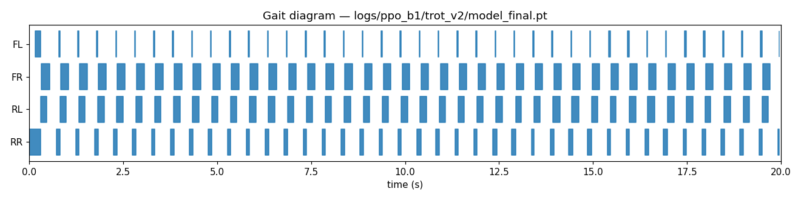

**Bound** — fore-aft pairs: FL+FR swing together, RL+RR swing together. Higher duty on fore pair (FL/FR ~65%) with quick rear-pair stance recovery.

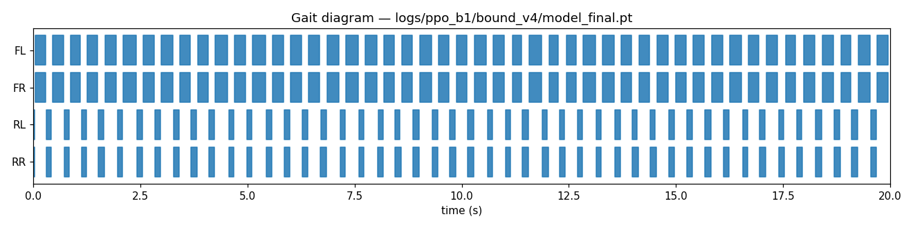

**Pace** — lateral pairs: FL+RL swing together, FR+RR swing together. High duty on FR/RR (~69%) with quick FL/RL swing. Body rolls laterally during pace.

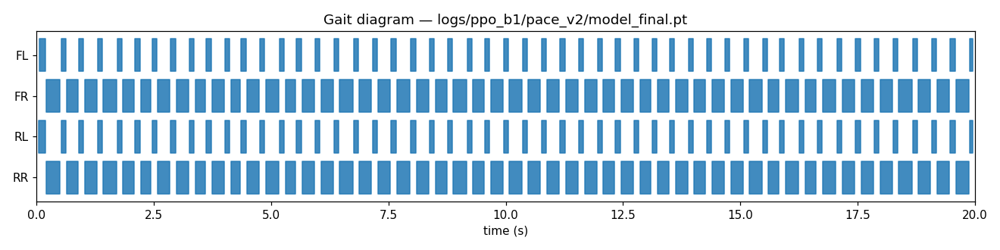

### How we got here — the CPG-RBF detour

The original Phase 1 design used a **CPG-RBF (Central Pattern Generator + Radial Basis Function)** controller optimized with **PI^BB (Thor et al. 2021)**. After ~3 weeks of iteration (Week 10 + early Week 11) and 12 documented encoding experiments, this approach was abandoned in favor of pure PPO velocity tracking.

The dealbreakers:
- **B1 is too heavy for PIBB.** At 50 kg, every exploratory step risks a fall (large negative reward). PI^BB's softmax update barely moves W. Cold-init policies stay near origin for thousands of iterations.
- **Direct encoding (240 params) breaks trot.** Only shared-W indirect encoding (60 params) produces stable diagonal coordination, but it remains vulnerable to morphological asymmetry exploits.
- **PPO-on-W is catastrophic.** Putting policy output directly into a CPG W matrix at 50 Hz produces bang-bang motor saturation; the robot flips in 4 steps.

The pivot shifted Phase 1 from "research-grade CPG-RBF tuning" to "engineering-grade PPO velocity tracking." Phase 2's research contribution is *unaffected* because the contribution is the **per-leg residual blending architecture**, not how the base policies are produced.

The legacy CPG-RBF code is preserved at `envs/unitree_b1_env.py` and `algorithms/pibb_trainer.py`.

### Phase 1 PPO engineering — failure modes and fixes

Stock Isaac Lab velocity reward stack (calibrated for ~15 kg Go2) broke on B1 (~50 kg) in characteristic ways.

| B1 failure mode | Cause | Fix |
|---|---|---|
| Standstill local optimum | Track reward at vx=0 still pays 88% (std=0.5 too loose) | Tighten `track_lin_vel_xy_exp` std 0.5→0.25, bump weight 1.0→1.5 |
| Crawling exploit (body sags to 0.18 m) | No height penalty in stock | `base_height_l2(target=0.42)` weight −10 to −200 per-gait |
| 2-leg trot pathology | No anti-pair-pathology constraint | `excessive_air_time` (max 0.5 s), `excessive_contact_time` (max 0.5 s) |
| Rapid foot-tap exploit (5 Hz on planted leg) | Cumulative time penalties don't catch frequency | `short_swing_penalty` (penalize touchdowns after <0.3 s air) |
| 3+1 asymmetric trot | Per-foot bounds OK individually | `air_time_variance_penalty` (variance of last_air_time) |
| Bilateral L/R asymmetry (FR hip 2× FL) | No L/R constraint | `joint_lr_symmetry_penalty` (\|FL_vel² − FR_vel²\| + \|RL_vel² − RR_vel²\|) |
| Lock-pair exploit (bound: rears planted forever) | Coordination reward fires when locked | `duty_factor_target_penalty` (target 0.5 per leg) |
| Trot pretending to be bound/pace | Phase-match alone allows trot to score 50% | `true_bound_reward` / `true_pace_reward` (anti-trot, pro-target) |

All custom reward terms are in [envs/b1_velocity_mdp.py](envs/b1_velocity_mdp.py).

---

## Phase 2 — Residual Transition Learning (Main Contribution)

### Design evolution — three failure modes, then success

Phase 2 went through three documented failure modes before reaching a working architecture.

#### Three failure modes (development iterations)

| Failure | Root cause | Fix applied |
|---|---|---|
| **Standstill exploit** (`delta_alpha_max=0.2`, 4 gaits) — vx mean +0.011 m/s, all `\|Δα\|` saturated | Linear ramp midpoint is kinematically incoherent; residual too small to rescue it. Policy learns to stand still for alive bonus. | Widen residual bound 0.2 → 0.8 |
| **Source gait corruption + steer OOD** (`delta_alpha_max=0.8`, 4 gaits) — vx mean +0.160 m/s, steady-state `\|Δα\|` ≈ 0.39 | No time-gating → MLP intervenes constantly; steer policy trained with `yaw∈(0.4,1.0)` is out-of-distribution at `yaw=0` | Drop steer (3 gaits), add hard time-gating (`Δα=0` outside window), boost sparsity penalty −0.5 → −3.0 |
| **Steady-state stagnation** (3 gaits, time-gate, sparsity) — vx mean +0.057 m/s, source gait clean but no locomotion | `last_action=zeros` fed to base policies → they see "I just did nothing" → collapse to default pose. Bug invisible in training. | Per-policy `_base_last_actions` buffer: each frozen policy queries with its own previous 12-D output |

#### Working architecture and polish (v4 → v7 final)

**First working policy (v4)** — vx mean +0.425 m/s, zero falls, sparse per-leg Δα:

```
Step  50: trot→bound  vx=+0.343  Δα=(-0.000, -0.000, -0.000, -0.000)  ← source, gait visible
Step 100: trot→bound  vx=+0.407  Δα=(-0.003, -0.031, +0.015, +0.007)  ← ramp begins
Step 150: trot→bound  vx=+0.257  Δα=(+0.013, +0.038, +0.091, +0.106)  ← mid-ramp, RL/RR engage
Step 300: trot→bound  vx=+0.412  Δα=(-0.000, -0.000, +0.000, -0.000)  ← target, gait visible
```

RL and RR show larger corrections than FL and FR — consistent with the morphological argument: going trot → bound, the rear legs must swap sync partner (from FL to RL), which requires a larger transient correction than the front legs.

**Polish iterations (v5 → v7):**

| Change | tilt_max | vx_mean | jacc_RMS | \|Δα\|max |
|---|---:|---:|---:|---:|
| v4 baseline | 0.187 | +0.426 | 166.8 | 0.262 |
| v5 + joint-acc penalty, tighter action-rate | 0.191 | +0.426 | 163.0 | 0.236 |
| v6 + orientation ×4 inside window | 0.192 | +0.431 | 157.0 | 0.249 |
| **v7 + smoothstep α schedule (final)** | **0.189** | **+0.440** | **156.4** | **0.197** |

**Key finding — kinematic floor:** Tilt-max converged to 0.19 ± 0.003 across all three polish attempts. This is not a policy problem — it is a kinematic property of blending gaits with different contact structures. At the midpoint of trot→bound, the 50 kg body must physically pitch to absorb the momentum shift from diagonal to fore-aft contact. No bounded residual suppresses this without sacrificing tracking elsewhere.

**v7 is the final policy.** It delivers the best velocity tracking (+0.440 m/s), smoothest joint trajectories (jacc_RMS 156.4), and smallest residual magnitude (|Δα|max 0.197, well below the 0.8 cap). The smoothstep α schedule's zero-derivative endpoints eliminate kinematic kicks at the window boundaries.

---

### v7 Diagnostic Plots

All figures from a single 2000-step evaluation run (seed=42, trot→bound→pace cycling, switch every 8 s, transition window 3 s).

**Vertical line legend:** red = gait switch command, green = ramp start (α begins rising), orange = ramp end (α reaches 1). Labels above the plot name the active transition pair.

---

**Figure 1 — Gait contact diagram + vx trace**

Foot contact bars (blue = stance) and forward velocity vs time. The velocity remains close to the 0.4 m/s command across all 6 transitions with brief dips during the transition window.

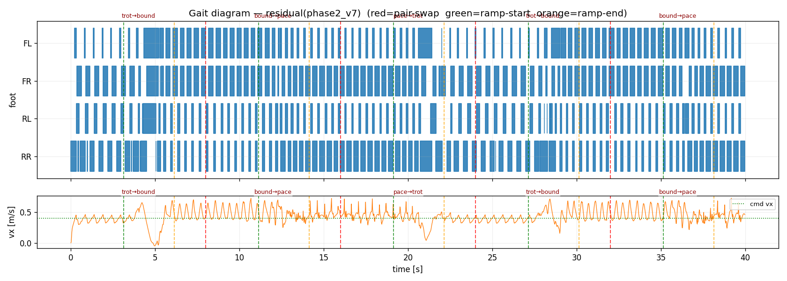

---

**Figure 2 — Per-leg Δα residual and joint contribution**

*Top:* Per-leg Δα(t) — the MLP's output, non-zero only inside transition windows (between green and orange lines). Time-gating forces exact zeros during steady-state holds. *Bottom:* Residual joint contribution in radians = `(α_actual − α_baseline) × (π_target − π_current) × 0.25` — the physical difference the MLP makes to the final joint command.

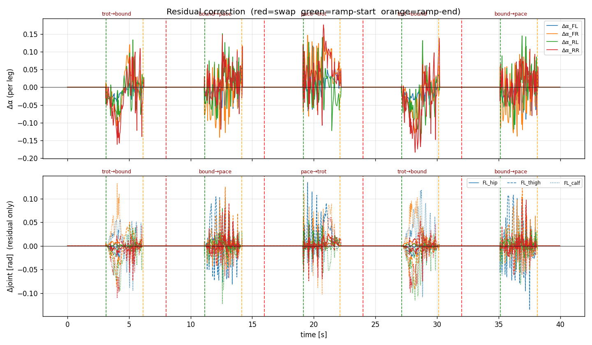

The rear legs (RL, RR) consistently show larger Δα magnitudes than front legs across trot→bound transitions, confirming the per-leg rear-bias predicted by the coordination-structure argument.

---

**Figure 3 — Body state: vx, height, tilt**

*Top:* Forward velocity vs command (dotted). *Middle:* Body height vs 0.42 m target. *Bottom:* Body tilt `‖projected_gravity_xy‖²` — spikes during transition windows are the kinematic floor (≈0.19 tilt_max) that cannot be eliminated by bounded residual learning.

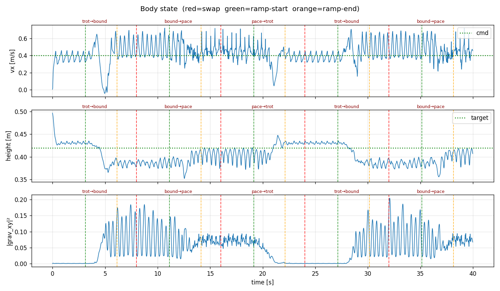

---

**Figure 4 — Joint commands: π_current, π_target, blended (thigh joints)**

Thigh joint offsets in radians [rad] for all four legs. Blue = π_current output, orange = π_target output, green = blended command sent to the actuator. The blended signal follows the source gait during the hold phase, smoothly interpolates during the ramp, and converges to the target gait post-ramp. Note the different oscillation amplitudes and phases between trot (diagonal sync) and bound/pace (fore-aft / lateral pair sync).

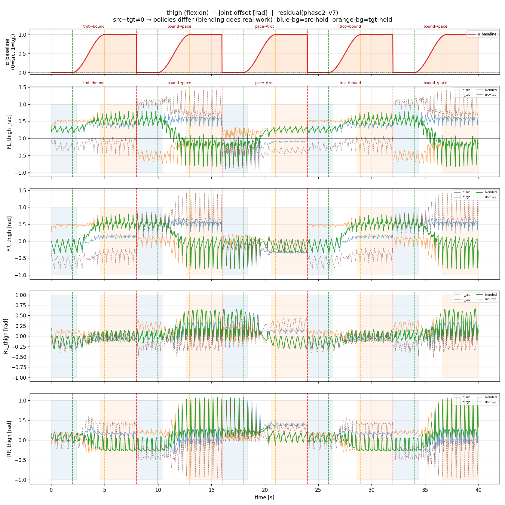

---

**Figure 5 — Full joint positions per leg**

All 12 joint positions (hip, thigh, calf) per leg. The smooth interpolation through each transition window is visible in all joint types, with the sharpest changes in the thigh joints (primary locomotion driver).

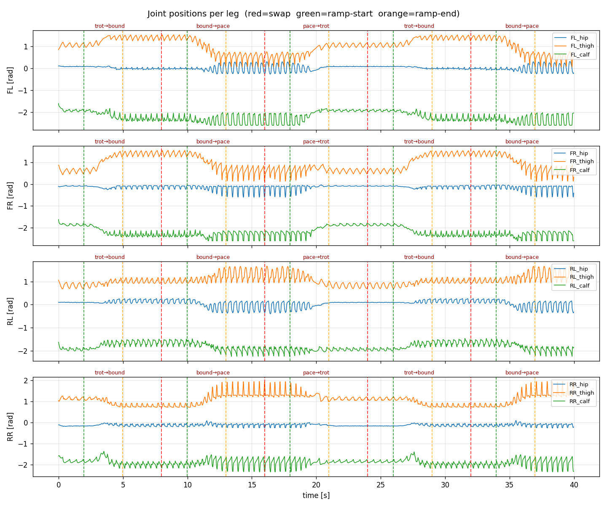

---

## Baseline Experiments

### Methods

Seven transition-control methods evaluated on identical episodes (2000 steps, trot→bound→pace cycle, switch every 8 s, fixed seed=42):

| Method | Description | Policy action |
|---|---|---|
| **(a) Discrete Switch** | α jumps instantly to 1 at switch time. No blending. | — |
| **(b) Linear Ramp** | α ramps linearly over 3 s. No learned correction. | — |
| **(c) Smoothstep Ramp** | α follows x²(3−2x) over 3 s. No learned correction. | — |
| **(d) E2E PPO** | MLP learns 1-D scalar α = sigmoid(action) directly via PPO. No baseline ramp. | 1-D sigmoid |
| **(e) E2E Rate** | MLP outputs dα/dt = sigmoid(action)/T; α integrated from 0 each episode. No baseline ramp. | 1-D rate |
| **(f) Residual-1D** | Smoothstep baseline + scalar Δα broadcast to all 4 legs. | 1-D tanh |
| **(g) Residual-4D / v7 (Ours)** | Smoothstep baseline + per-leg Δα (one correction per leg). | 4-D tanh |

### Results (seed=42)

| Method | vx_mean | vx_std | tilt_mean | tilt_max | h_mean | CoT | jacc_RMS |
|---|---:|---:|---:|---:|---:|---:|---:|
| Discrete Switch | +0.379 | 0.176 | 0.054 | 0.194 | 0.405 | 2.200 | 170.4 |
| Linear Ramp | +0.379 | 0.169 | 0.058 | 0.207 | 0.401 | 1.916 | 138.3 |
| Smoothstep Ramp | +0.399 | 0.150 | 0.057 | 0.185 | 0.402 | 1.898 | 151.7 |
| E2E PPO | +0.394 | **0.078** | **0.039** | **0.112** | 0.405 | 2.200 | **114.9** |
| E2E Rate | +0.418 | 0.148 | 0.047 | 0.184 | 0.407 | 1.868 | 175.2 |
| Residual-1D | **+0.432** | 0.108 | 0.053 | 0.204 | 0.404 | **1.807** | 152.7 |
| **Residual-4D / v7 (Ours)** | **+0.433** | 0.116 | 0.052 | 0.205 | 0.404 | 1.813 | 160.1 |

### Per-method gait diagrams

**Column interpretation:** foot contact bars (blue = stance) show the coordination pattern before/during/after each transition. Forward velocity vx (bottom panel) shows tracking quality. Red dashed lines = gait switch commands.

---

**(a) Discrete Switch** — instant α=1 at each switch. Sharp velocity spikes to −0.5 m/s visible at every switch moment; the robot catches itself but cannot maintain gait coherence.

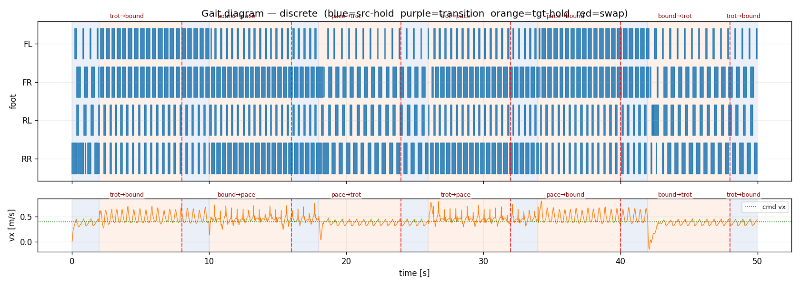

---

**(b) Linear Ramp** — 3 s linear α from 0→1. Velocity recovers between transitions but shows notable dips during ramp (kinematic kick at ramp-start from non-zero dα/dt at t=0).

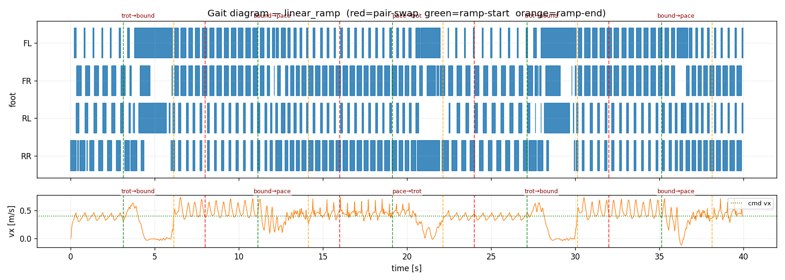

---

**(c) Smoothstep Ramp** — 3 s Hermite x²(3−2x). Smoother velocity profile than linear (zero dα/dt at endpoints). Peak tilt reduced 10.6% vs linear (0.185 vs 0.207). The velocity dip around t=4–6 s (trot→bound first transition) narrows compared to linear.

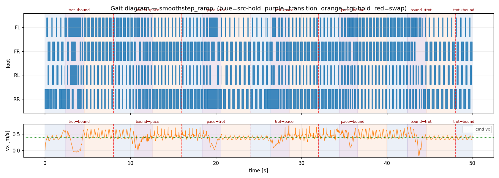

---

**(d) E2E PPO (v1)** — MLP learns scalar α from scratch via PPO. Surprisingly clean: vx_std 0.078 (best of all methods), tilt_max 0.112 (45% below residual). The learned α likely converges to a slow monotonic ramp that avoids mid-transition coordination conflicts. However, mean vx 0.394 falls 9% short of residual, trading velocity tracking for kinematic smoothness.

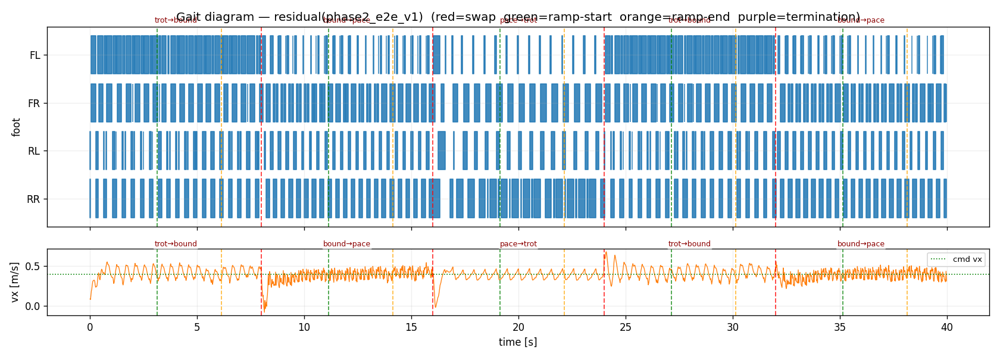

---

**(e) E2E Rate** — MLP outputs dα/dt; α integrated from 0 each episode (monotonically increasing, can never jump or overshoot). The policy collapsed to `rate ≈ 0`, keeping `α_integrated ≈ 0` throughout the episode — the robot runs the source gait the entire time. High vx_std (0.148, worst of all learned methods) and vx_min=−0.665 confirm instability at gait-switch commands when the current policy is the wrong one. Tilt_max is deceptively low (0.184) because the robot mostly runs source gait cleanly and only fails at command switches. See collapse analysis in Findings below.

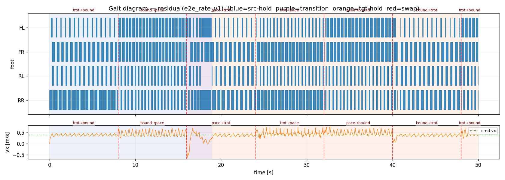

---

**(f) Residual-1D** — Same smoothstep baseline and time-gating as Residual-4D but with a single scalar Δα broadcast to all 4 legs. Achieves vx_mean=+0.432 and jacc_RMS=152.7, nearly identical to Residual-4D (0.433 / 160.1). The minimal performance gap indicates that for trot↔bound↔pace on flat terrain, a single global blending correction captures most of the coordination benefit. Per-leg asymmetry (|Δα_RL| > |Δα_FL| in Residual-4D) appears to not be strictly necessary for this specific transition set.

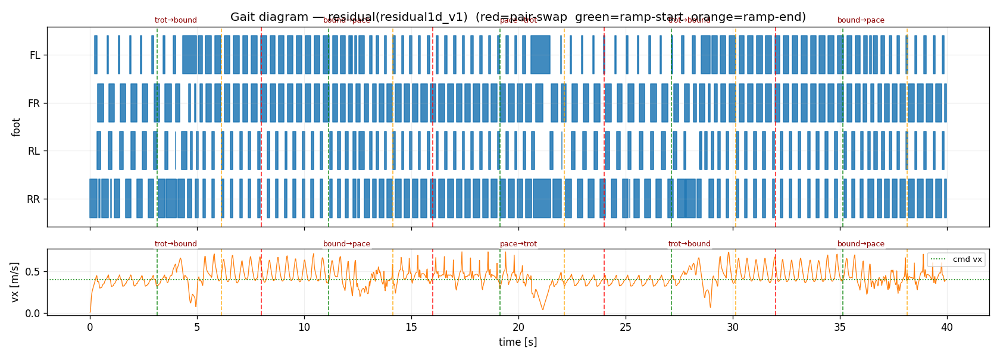

---

**(g) Residual-4D / v7 (Ours)** — Smoothstep baseline + per-leg Δα. Best mean velocity (+0.433 m/s). Clear gait pattern changes visible after each transition. The MLP pushes through transitions more aggressively than E2E, accepting higher tilt in exchange for better tracking.


---

### Findings

- **Discrete is broken** — kinematic shock from instant α=1 triggers episode termination at every gait switch. Useful only as a lower bound.
- **Smoothstep vs Linear** — zero-derivative endpoints reduce peak tilt 10.6% (0.207→0.185) and raise mean vx +5.3%. Validates the schedule choice in v7.
- **E2E PPO learned a compressed transition strategy** — per-joint blend traces show E2E's α rises from ~0.5 to ~1 within approximately 1 s after each switch rather than using the full 3 s window. It does perform genuine blending, but only briefly. The good kinematic metrics follow from this: a fast-but-smooth sigmoid transition with warm base policies avoids coordination shock, and once near α=1 the robot runs a single clean gait with no mid-ramp conflict.
- **Why E2E is compressed, not instant** — the blend plots confirm green (blended) is not identical to orange (π_target) at the switch boundary; there is a visible intermediate period. E2E is not the same as Discrete. The velocity reward provides no incentive to take the full 3 s: both "blend over 3 s" and "blend over 1 s then hold target" score identically once the target gait is established, so the MLP learns the faster strategy.
- **E2E Rate collapsed to the opposite degenerate** — E2E PPO's α collapsed toward 1 (fast forward), while E2E Rate's α_integrated collapsed toward 0 (never forward). When `rate ≈ 0`, `α_integrated ≈ 0` all episode and the robot runs the source gait perfectly, earning high velocity reward. When `rate > 0`, intermediate blended actions are worse than either pure policy, so PPO gradient drives rate → 0. This is the "safe haven" collapse: without an explicit "finish the transition" reward, the locally optimal action is to never start. The high vx_std (0.148) and vx_min=−0.665 arise because the command switches to a new source gait every 8 s, but the robot is still playing the old source gait — the abrupt policy switch without any blending causes transient falls. E2E Rate is the worst learned method despite its low tilt_max, because the low tilt is deceptive (only reflects clean single-gait running, not graceful transitions).
- **Residual-1D ≈ Residual-4D** — scalar broadcast achieves vx=0.432 vs 0.433 for per-leg. The per-leg structure's predicted advantage (different legs need different transition rates due to B1's front/rear thigh asymmetry and changing sync partners) is measurable in the learned Δα traces (|Δα_RL| > |Δα_FL| in v7) but does not produce a statistically meaningful performance gain on this flat-terrain transition set. The benefit of per-leg may be more pronounced on rough terrain or during transitions from significantly different leg-phase configurations.
- **Residual must use the full window** — the smoothstep baseline forces genuine 3 s interpolation and Δα is bounded to ±0.8. The residual cannot compress the transition the way E2E can. Its +10% velocity advantage over E2E comes from the MLP actively managing the mid-ramp coordination conflict that E2E avoids by passing through it quickly.

**Architectural takeaway:** Both E2E collapse modes (rate→max and rate→0) arise from the same underlying issue: the velocity reward is indifferent to *how* the transition happens as long as the robot reaches a stable gait. The residual architecture sidesteps this problem by design — the smoothstep baseline forces a fixed timing, and the MLP only adjusts *coordination* within that window. E2E Rate was intended to fix E2E PPO's fast-collapse by preventing instant jumps, but introduced the opposite fast-collapse. The fix would require an explicit transition-completion reward (e.g., bonus for reaching α=1 by end of window), but this re-introduces the timing incentive that the residual architecture handles structurally.

### Ablation Summary

| Ablation | What it tests | Result |
|---|---|---|
| **Linear vs Smoothstep** | Schedule shape matters? | Smoothstep −10.6% peak tilt, +5.3% vx |
| **E2E PPO vs baselines** | Can a free-form MLP learn timing + coordination? | Yes, but collapses to 1 s compressed transition |
| **E2E Rate vs E2E PPO** | Does rate-integration prevent fast-collapse? | Introduces opposite collapse (rate→0, α never rises) |
| **Residual-1D vs Residual-4D** | Does per-leg granularity help? | Negligible difference (0.432 vs 0.433 vx) on flat terrain |
| With vs without time-gating | Is gating necessary? | Tested in v2→v3 — removing gating degrades to 0.160 m/s |
| With vs without sparsity penalty | Is sparsity term necessary? | Pending (isolated experiment not run) |

---

## Per-Version Log

| Version | Path | Key change | vx_mean | tilt_max | Status |
|---|---|---|---:|---:|---|
| v1 | `logs/phase2/phase2_v1/` | Initial — Δα bound=0.2 | +0.011 | — | Standstill exploit |
| v2 | `logs/phase2/phase2_v2/` | Wider Δα bound=0.8, 4 gaits | +0.160 | — | Source corrupted; steer OOD |
| v3 | `logs/phase2/phase2_v3/` | 3 gaits, time-gate, sparsity=−3 | +0.057 | — | last_action=zeros bug |
| v4 | `logs/phase2/phase2_v4/` | Per-policy last_action history | +0.426 | 0.187 | Working baseline |
| v5 | `logs/phase2/phase2_v5/` | joint_acc penalty, tighter action_rate | +0.426 | 0.191 | Polish |
| v6 | `logs/phase2/phase2_v6/` | Orientation ×4 in-window boost | +0.431 | 0.192 | Polish |
| **v7** | `logs/phase2/phase2_v7/` | **Smoothstep α schedule** | **+0.440** | **0.189** | **FINAL** |

Final v7 checkpoint: `logs/phase2/phase2_v7/model_final.pt`

Development diagnostic plots (body state, Δα, joint positions) for v1–v7 are in `logs/phase2/phase2_<v>/diag/`.

---

## Setup & Run Commands

### Environment

```bash
conda activate env_isaaclab
cd ~/cpg-drl-transition

# Pre-flight: kill any zombie Isaac Sim processes before launching
nvidia-smi && pgrep -f "python.*play\|python.*train\|isaac\|kit" | xargs -r kill -9
```

### Phase 1 — train the four base policies (already done, available at `logs/phase1_final/`)

```bash
python scripts/train_b1_velocity.py --headless --num_envs 4096 \
    --task Isaac-Velocity-Flat-Unitree-B1-Trot-v0 \
    --max_iterations 1500 --run_name trot_v2

python scripts/train_b1_velocity.py --headless --num_envs 4096 \
    --task Isaac-Velocity-Flat-Unitree-B1-Bound-v0 \
    --max_iterations 4000 --run_name bound_v4

python scripts/train_b1_velocity.py --headless --num_envs 4096 \
    --task Isaac-Velocity-Flat-Unitree-B1-Pace-v0 \
    --max_iterations 4000 --run_name pace_v2

python scripts/train_b1_velocity.py --headless --num_envs 4096 \
    --task Isaac-Velocity-Flat-Unitree-B1-Steer-v0 \
    --max_iterations 1500 --run_name steer_v2
```

### Phase 1 — playback any base gait

```bash
python scripts/play_b1_velocity.py \
    --task Isaac-Velocity-Flat-Unitree-B1-Trot-Play-v0 \
    --checkpoint logs/phase1_final/trot.pt \
    --num_envs 16 --steps 1000
```

### Phase 2 — train residual transition policy

```bash
ls logs/phase1_final/{trot,bound,pace}.pt   # verify base policies are in place

python scripts/train_b1_phase2.py --headless --num_envs 2048 \
    --max_iterations 2000 --run_name phase2_v7
```

### Phase 2 — playback with scripted gait cycling

```bash
python scripts/play_b1_phase2.py \
    --task Isaac-B1-Phase2-v0 \
    --checkpoint logs/phase2/phase2_v7/model_final.pt \
    --num_envs 4 --steps 2000 \
    --seed 42 --save_plots --save_csv
```

The play printout shows per-step `(vx, vz, h, tilt, Δα_FL, Δα_FR, Δα_RL, Δα_RR)`. Watch the Δα columns: `+0.000` during steady-state holds, small corrections during the 3 s ramp, back to `+0.000` after.

### Baseline playback (for comparison table)

```bash
# Discrete switch (no policy)
python scripts/play_b1_phase2.py --task Isaac-B1-Phase2-v0 \
    --checkpoint logs/phase2/phase2_v7/model_final.pt \
    --num_envs 4 --steps 2000 --seed 42 --alpha_mode discrete \
    --save_plots --save_csv --outdir logs/phase2/baselines/discrete

# Linear ramp
python scripts/play_b1_phase2.py --task Isaac-B1-Phase2-v0 \
    --alpha_mode linear_ramp --seed 42 --steps 2000 \
    --save_plots --save_csv --outdir logs/phase2/baselines/linear_ramp

# Smoothstep ramp
python scripts/play_b1_phase2.py --task Isaac-B1-Phase2-v0 \
    --alpha_mode smoothstep --seed 42 --steps 2000 \
    --save_plots --save_csv --outdir logs/phase2/baselines/smoothstep_ramp

# E2E PPO
python scripts/play_b1_phase2.py --task Isaac-B1-Phase2-E2E-v0 \
    --checkpoint logs/phase2/phase2_e2e_v1/model_final.pt \
    --num_envs 4 --steps 2000 --seed 42 \
    --save_plots --save_csv --outdir logs/phase2/baselines/e2e

# E2E Rate (trained ablation)
python scripts/play_b1_phase2.py --task Isaac-B1-Phase2-E2E-Rate-v0 \
    --checkpoint logs/phase2/e2e_rate_v1/model_final.pt \
    --num_envs 4 --steps 2000 --seed 42 \
    --save_plots --save_csv --outdir logs/phase2/e2e_rate_v1

# Residual-1D (trained ablation)
python scripts/play_b1_phase2.py --task Isaac-B1-Phase2-Residual1D-v0 \
    --checkpoint logs/phase2/residual1d_v1/model_final.pt \
    --num_envs 4 --steps 2000 --seed 42 \
    --save_plots --save_csv --outdir logs/phase2/residual1d_v1
```

### Compare all methods

```bash
python scripts/compare_baselines.py \
    --csvs \
        discrete:logs/phase2/baselines/discrete/playback.csv \
        linear_ramp:logs/phase2/baselines/linear_ramp/playback.csv \
        smoothstep_ramp:logs/phase2/baselines/smoothstep_ramp/playback.csv \
        e2e:logs/phase2/baselines/e2e/playback.csv \
        e2e_rate:logs/phase2/e2e_rate_v1/playback.csv \
        residual1d:logs/phase2/residual1d_v1/playback.csv \
        residual_v7:logs/phase2/phase2_v7/playback.csv
```

### Tests

```bash
python -m pytest tests/ -q                # 44/44 unit tests
```

---

## B1 Robot Configuration

### Joint axis convention

| Joint | Axis | Default FL/FR/RL/RR | Role |
|---|---|---|---|
| `hip_joint` | Abduction (lateral splay) | +0.1 / −0.1 / +0.1 / −0.1 | Lateral balance — kept small |
| `thigh_joint` | **Flexion (fore/aft swing)** | +0.8 / +0.8 / +1.0 / +1.0 | **Primary walking driver** |
| `calf_joint` | Knee bend | −1.5 / −1.5 / −1.5 / −1.5 | Foot clearance during swing |

The +0.2 rad asymmetry between front and rear thighs is responsible for several trained-policy quirks (rear-heavy duty in bound, asymmetric leg use in trot) — fundamental to B1's morphology and **directly motivates the per-leg residual structure** in Phase 2 (different legs need different transition rates).

### Foot contact convention

B1's USD uses `*_foot` link names (NOT `*_calf`). All contact-sensor patterns use `.*_foot$`.

The trunk body is named `trunk` (NOT `base` like Go2). Every `body_names="base"` inherited from Isaac Lab's stock Go2 cfg must be overridden to `"trunk"` for B1.

### Actuator overrides (project-local deep-copy)

```python
UNITREE_B1_CFG.actuators["base_legs"].stiffness = 400.0    # was 200 — 200 sags 9 cm under body weight
UNITREE_B1_CFG.actuators["base_legs"].damping   = 10.0     # proportional ratio
UNITREE_B1_CFG.init_state.pos = (0, 0, 0.50)               # was 0.42 — feet were 7.7 cm under ground at default joints
```

`base_contact.threshold = 50 N` (was 1 N) — settling produces 20-40 N transients on a 50 kg body.

---

## Project Structure

```
cpg-drl-transition/
├── envs/
│   ├── unitree_b1_env.py           # CPG-RBF DirectRLEnv (legacy)
│   ├── b1_velocity_env_cfg.py      # PPO velocity-tracking env configs (Phase 1)
│   ├── b1_velocity_ppo_cfg.py      # PPO hyperparameters
│   ├── b1_velocity_mdp.py          # 11 custom reward functions (Phase 1)
│   ├── b1_phase2_env_cfg.py        # Phase 2 env config (residual transition)
│   └── b1_phase2_env.py            # Phase 2 env class — base policy loading + per-leg blending
├── networks/
│   └── cpg_rbf.py                  # CPG-RBF network (legacy)
├── algorithms/
│   └── pibb_trainer.py             # PI^BB optimizer (legacy)
├── scripts/
│   ├── train_b1_velocity.py        # Phase 1 PPO training
│   ├── play_b1_velocity.py         # Phase 1 playback with gait diagrams
│   ├── train_b1_phase2.py          # Phase 2 residual MLP training
│   ├── play_b1_phase2.py           # Phase 2 playback — scripted gait cycling + diagnostic plots
│   ├── compare_baselines.py        # Compare 5-method CSV results
│   ├── train_phase1_*.py           # Legacy CPG-RBF training
│   ├── play_gait.py                # Legacy CPG-RBF playback
│   └── visualize_cpg.py            # Legacy CPG phase plots
├── configs/                        # Legacy CPG-RBF YAML configs
├── logs/
│   ├── ppo_b1/<run>/               # Phase 1 PPO run dirs (model_final.pt + tfevents)
│   ├── phase1_final/               # Final Phase 1 base policies (trot, bound, pace, steer)
│   ├── phase2/<run>/               # Phase 2 run dirs (v1–v7, e2e_v1, e2e_v2)
│   │   └── diag/                   # Per-run diagnostic plots
│   ├── phase2/baselines/           # Baseline playback outputs (CSV + plots per method)
│   └── gait_*.png                  # Phase 1 gait diagrams
├── weights/                        # Legacy CPG-RBF W matrices
├── tests/                          # 44 unit tests
├── README.md                       # This report
├── CLAUDE.md                       # AI-assistant context
└── pytest.ini
```

---

## Implementation Progress

### Week 10 — Setup ✅
- Isaac Lab + Isaac Sim + RSL-RL verified
- Custom MDP framework (44/44 tests)

### Week 11 — Phase 1 CPG-RBF attempts (abandoned) ✅
- 12 encoding experiments documented
- PI^BB with softmax averaging, per-joint noise scaling
- LocoNets KENNE pre-compute integration
- Cosine walking prior (Thor-style)
- **Conclusion:** B1 + PIBB cannot reliably produce stable gaits in the project timeline

### Week 11 — Phase 1 PPO pivot ✅
- Manager-based RL env with B1-specific actuator config
- 11 custom reward terms for B1 mass scaling
- Trot, bound, pace, steer base policies trained and validated

### Week 12 — Phase 2 architecture ✅
- DirectRLEnv with frozen base policy loading
- Per-leg residual MLP via PPO
- v1 → v4 evolution with documented failure modes
- **v4 working baseline:** vx mean +0.425, zero falls, sparse explainable Δα

### Week 13 — Phase 2 polish + experiments ✅
- [x] v5 — joint-acc penalty + tighter action_rate
- [x] v6 — time-gated orientation boost (×4 in window)
- [x] v7 — smoothstep α schedule → **FINAL policy**, vx mean +0.433, jacc_RMS 160.1
- [x] Baseline experiments: Discrete, Linear Ramp, Smoothstep Ramp, E2E PPO, Residual v7
- [x] Diagnostic plots: gait diagram, Δα trace, body state, joint positions, per-joint blends
- [x] Ablation: E2E Rate (dα/dt integration) — trained + evaluated, collapsed to rate→0
- [x] Ablation: Residual-1D (scalar Δα broadcast) — trained + evaluated, vx≈Residual-4D
- [x] 7-method comparison table with uniform metrics
- [x] Contact sensor body-ordering bug fixed (correct foot bars in all plots)
- [ ] With/without sparsity penalty ablation (isolated experiment)

### Week 14 — Analysis and writeup ✅
- [x] All ablation results incorporated into comparison table
- [x] E2E collapse analysis (compressed transition vs rate→0 failure mode)
- [x] Residual-1D vs 4D finding documented
- [x] Report figures finalized
- [x] README updated with all quantitative numbers and gait diagrams

### Week 15 — Final polish
- [ ] Final video demo compilation
- [ ] Optional: CPG as phase oracle for residual MLP

---

## Key References

- **Silver et al. 2018** — *Residual Policy Learning*. arXiv:1812.06298. The canonical "learn corrections on top of a baseline" paper. The Phase 2 architectural pattern.
- **Johannink et al. 2018** — *Residual Reinforcement Learning for Robot Control*. ICRA 2019. Same pattern, applied to manipulation.
- **Thor et al. 2021** — [CPG-RBFN framework](https://github.com/MathiasThor/CPG-RBFN-framework). SO(2) oscillator + RBF + PI^BB. Source of the original (abandoned) Phase 1 design.
- **Siekmann et al. 2021** — *Sim-to-real bipedal locomotion with PPO*. Reference for joint-offset action design.
- **Rudin et al. 2022** — *legged_gym*. Isaac Gym quadruped training. Reward stack inspiration for B1 reward engineering.
- **Isaac Lab `Isaac-Velocity-Flat-Unitree-Go2-v0`** — Stock manager-based velocity-tracking config. Direct ancestor of `b1_velocity_env_cfg.py`.
- **unitree_rl_lab** — Unitree's manager-based RL framework. Reference for hyperparameters and reward weights.

---

## Acknowledgments

Project supervised in the context of FRA 503 — Deep Reinforcement Learning. The CPG-RBF detour was a productive research-process learning experience: documented failure of an interesting design provides scaffolding for the simpler PPO baseline that ultimately succeeded.
