# Transition-Aware Quadruped Locomotion: A Study of Residual Correction Spaces

**Course:** FRA 503 — Deep Reinforcement Learning
**Student:** Disthorn Suttawet (66340500019)
**Robot:** Unitree B1 quadruped (12 DOF, ~50 kg)
**Simulator:** Isaac Lab 0.36.3 / Isaac Sim 4.5.0
**Deadline:** 20 May 2026

---

## Table of Contents

1. [Project Overview](#1-project-overview)
2. [Background and Design Motivation](#2-background-and-design-motivation)
3. [Phase 1 — Base Gait Policy Generation](#3-phase-1--base-gait-policy-generation)
4. [Phase 2 — Residual Transition Learning](#4-phase-2--residual-transition-learning)
5. [Development History — From Prototype to Design-Space Study](#5-development-history--from-prototype-to-design-space-study)
6. [Systematic Design-Space Study (2×2 Ablation)](#6-systematic-design-space-study-22-ablation)
7. [Experiments and Metrics](#7-experiments-and-metrics)
8. [Results](#8-results)
9. [Discussion](#9-discussion)
10. [Limitations and Future Work](#10-limitations-and-future-work)
11. [Reproducibility](#11-reproducibility)
12. [B1 Robot Configuration](#12-b1-robot-configuration)

---

## 1. Project Overview

### Motivation

Quadruped robots operating across terrains and tasks require different gait patterns — trots for cruising, bounds for speed, paces for lateral coordination. Switching between these gaits without losing balance or wasting energy is a fundamental deployment challenge. Gaits with different leg-pair coordination structures (diagonal vs fore-aft vs lateral) cannot be linearly interpolated at the joint level — naive switching creates kinematic shocks that can stagger or destabilize a 50 kg robot.

### Problem Statement

A hand-designed **smoothstep** blending schedule already outperforms discrete switching on transition continuity. But it still produces velocity reversal on hard gait-pair transitions. The question is whether a small learned residual correction can close this gap without requiring a full learned policy.

### Final Research Question

> **Where should a residual correction act — in blending-weight space (α) or joint-position space (q) — and what action dimension (4D per-leg or 12D per-joint) produces the best transition quality on a 50 kg quadruped?**

This question is answered by a systematic **2×2 ablation**: output space (α vs q) × action dimension (4D vs 12D). The result is **Residual-α 12D**: a 12-D per-joint blending-weight correction trained on top of a smoothstep baseline.

### Contributions

- Formulated the gait-transition problem as a **residual correction on the blending schedule α**, preserving frozen base policies and reducing the learning problem to a small bounded correction.
- Developed a stable **residual-learning recipe** (time-gating, asymmetric sigmoid clamp, jerk penalty, sparsity) through a v1–v10 prototype sequence using 4D α-space.
- Conducted a **2×2 design-space study** (α vs q) × (4D vs 12D) with all other factors held fixed.
- Identified **Residual-α 12D** as the best method: lowest transition-window jerk (jerk_TRANS), zero velocity reversal in the canonical evaluation, and only 2.6% higher Cost-of-Transport than the passive smoothstep baseline.

### Key Results

Canonical evaluation (seed=42, 2500 steps, 6 directed gait-pair transitions):

| Method | vx_mean | vx_min | CoT | **jerk_TRANS** |
|---|---:|---:|---:|---:|
| Discrete Switch | +0.435 | −0.195 | 2.793 | 11361 |
| Smoothstep Ramp | +0.413 | −0.078 | 2.052 | 10121 |
| Residual-α 4D | +0.433 | +0.004 | 2.436 | 9775 |
| **Residual-α 12D** | **+0.427** | **+0.004** | **2.105** | **7951** |

Residual-α 12D reduces jerk_TRANS by **21.4% vs Smoothstep** and **30.0% vs Discrete**, eliminates velocity reversal (vx_min +0.004 vs Smoothstep −0.078), and costs only 2.6% more energy than Smoothstep.

---

## 2. Background and Design Motivation

### Quadruped Gait Transition Problem

Trot, bound, and pace have fundamentally different leg-pair synchrony structures:
- **Trot** — diagonal pairs in phase (FL+RR, FR+RL)
- **Bound** — fore-aft pairs in phase (FL+FR, RL+RR)
- **Pace** — lateral pairs in phase (FL+RL, FR+RR)

The midpoint between "FL+RR planted" (trot) and "FL+FR planted" (bound) is **not a valid quadruped configuration**. Naive blending of joint targets produces incoherent commands that destabilize the body.

### Why Naive Discrete Switching Fails

The simplest strategy is to set α = 1 immediately at the switch command. The result is a kinematic shock — joint targets jump discontinuously:

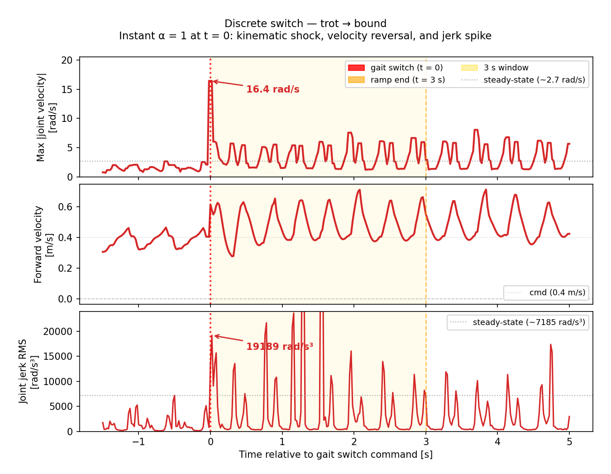

At switch time (t = 0): max joint velocity spikes to **16.4 rad/s** (6.2× steady-state), jerk peaks at **19 189 rad/s³**, and forward velocity drops sharply. Generated by `scripts/plot_discrete_spike.py`.

### Why Passive Blending Helps but Is Limited

A smoothstep schedule already eliminates endpoint kinematic kicks through zero-derivative endpoints (`dα/dt = 0` at t=0 and t=T). In the canonical seed=42 run, Smoothstep reduces jerk_TRANS from 11361 to 10121 and reduces the worst vx_min from −0.195 to −0.078. However it still produces **velocity reversal** on hard gait-pair transitions — the robot momentarily moves backward during a trot↔bound or pace↔bound switch.

### Why Residual Learning Is Appropriate

A residual MLP trained on top of Smoothstep only needs to learn the **missing correction** — not the full transition from scratch. This is a smaller, safer, and more interpretable problem:
- **Smaller search space**: the MLP corrects a reasonable schedule, not an arbitrary function.
- **Built-in safety fallback**: Δα = 0 exactly recovers Smoothstep.
- **Time-gated**: the residual is forced to zero outside the transition window, so source and target gaits run untouched during steady-state holds.
- **Interpretable**: the correction Δα directly shows where and when the MLP disagrees with the baseline schedule.

### Why Smoothstep Is the Residual Baseline

Smoothstep is chosen as the baseline for four reasons:

1. **Deterministic and fair.** Smoothstep contains no learned parameters. Any gain over Smoothstep is entirely attributable to the residual MLP.
2. **Zero-derivative endpoints.** `α = x²(3−2x)` has `dα/dt = 0` at both x=0 and x=1, removing kinematic kicks at ramp-start and ramp-end. Linear ramp lacks this property.
3. **Clean counterfactual.** Setting `Δα = 0` exactly recovers Smoothstep. This makes the contribution of the learned residual directly measurable.
4. **Strong enough to be meaningful.** Smoothstep is a competitive passive baseline — it outperforms discrete switching on jerk and reversal. Improving on it indicates a genuine gain from the learned correction.

*"We choose Smoothstep as the residual baseline because it is deterministic, interpretable, and already removes endpoint discontinuities through zero endpoint slope. Setting Δα = 0 exactly recovers Smoothstep, so the effect of the learned residual can be measured directly."*

### Why Residual Learning Instead of a Fully Learned Blending Policy

A fully learned blending policy — one that outputs the entire α schedule without a structured prior — would face a harder problem:
- It must learn when to start, how fast to ramp, how to keep α monotonic, and how to avoid unsafe midpoints, all simultaneously.
- It has no built-in safety fallback: if training fails or generalizes poorly, there is no graceful degradation.
- It can corrupt steady-state gaits unless explicitly prevented.

The residual formulation constrains the policy to learn only the correction on top of a working baseline:

*"We do not ask the policy to invent the full blending equation because this makes the transition problem unnecessarily unconstrained. A fully learned scheduler could collapse to fast switching, delay the transition, or corrupt steady-state gaits. Instead, Smoothstep provides a stable prior and the residual learns only the missing correction. This makes the problem smaller, safer, and easier to interpret."*

---

## 3. Phase 1 — Base Gait Policy Generation

### Initial Direction — CPG-RBF + PIBB

The original Phase 1 design used a **CPG-RBF (Central Pattern Generator + Radial Basis Function)** controller optimized with **PI^BB (Thor et al. 2021)**. After ~3 weeks of iteration and 12 documented encoding experiments, this approach was abandoned.

The structural failure was a **representation mismatch**: the indirect RBF encoding uses one weight matrix W (20×3, 60 params) shared across all 4 legs — per-leg differences come only from integer phase offsets. B1 has a 0.2 rad asymmetry between front thighs (0.8 rad) and rear thighs (1.0 rad). No single W can simultaneously produce the correct swing arc for both front and rear leg pairs.

**Experiment A** (old weights, corrected env): vx = 0.000 m/s — robot stands still.
**Experiment B** (retrain in corrected env): vx = +0.091 m/s — oscillatory lunge. Compare: PPO trot achieves +0.434 m/s.

| Metric | A: old weights | B: retrained | PPO trot |
|---|---:|---:|---:|
| mean vx | 0.000 m/s | +0.091 m/s | 0.434 m/s |
| FL/FR/RL/RR duty | 28/100/100/100% | 85/77/47/50% | ~40/33/39/65% |
| locomotion | stands still | oscillatory lunge | stable trot |

### Pivot to PPO Base Gait Policies

Four PPO velocity-tracking policies trained on flat terrain. Stored at `logs/phase1_final/`.

| Gait | Coordination | Duty FL/FR/RL/RR | Body height | Cycle | Speed |
|---|---|---:|---:|---:|---:|
| **trot_v2** | Diagonal (FL+RR / FR+RL) | 40/33/39/65% | 0.43 m | 1.6 Hz | 0.5 m/s |
| **bound_v4** | Fore-aft (FL+FR / RL+RR) | 65/65/33/34% | 0.39 m | 2.5 Hz | 0.5 m/s |
| **pace_v2** | Lateral (FL+RL / FR+RR) | 30/69/30/69% | 0.40 m | 2.5 Hz | 0.45 m/s |
| **steer_v2** | Asymmetric trot for turning | 39/16/27/35% | 0.42 m | 1.7 Hz | 0.25 m/s |

**Gait quality caveat.** These are velocity-tracking policies, not biologically faithful gaits. Duty cycles deviate from natural locomotion (e.g., trot FR at 33% stance vs biological ~50%). Phase 2's transition-smoothness results hold on top of these policies, but the base policies themselves should not be presented as accurate gait models.

Phase 2 uses only trot, bound, and pace. Steer is excluded because its training range (`yaw ∈ (0.4, 1.0)`) is incompatible with Phase 2's fixed `yaw=0` command.

### Phase 1 Gait Diagrams

Foot contact bars (blue = stance, white = swing):

**Trot** — diagonal pairs: FR+RL co-swing while FL+RR co-swing.

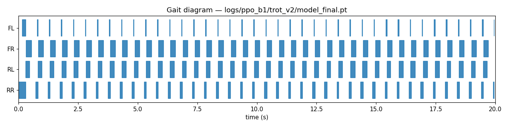

**Bound** — fore-aft pairs: FL+FR swing together, RL+RR swing together.

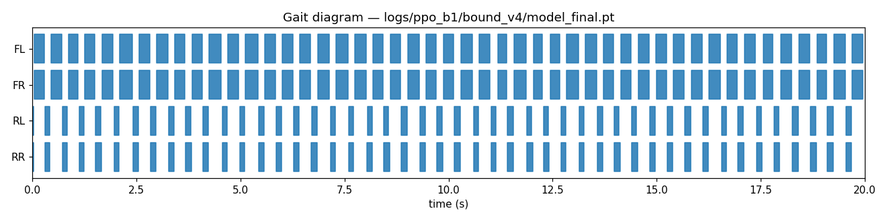

**Pace** — lateral pairs: FL+RL swing together, FR+RR swing together.

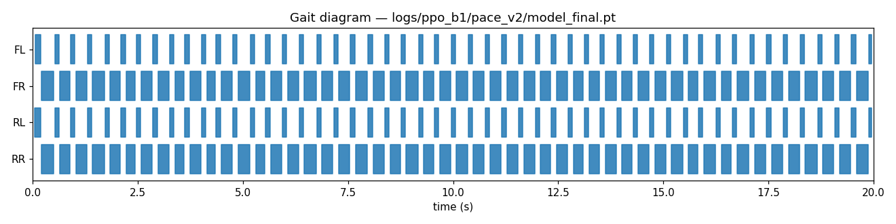

---

## 4. Phase 2 — Residual Transition Learning

### Architecture Overview

**Two-phase design:**

```
                    ┌──────────────────────────────┐
                    │  Per-joint Residual MLP      │
                    │  [obs(45) → 128 → 128 → 12]  │
                    │  outputs Δα ∈ [0, +0.3]      │
                    │  ELU activation              │
                    └─────────┬────────────────────┘
                              │ (Δα_0, Δα_1, …, Δα_11) per joint
                              ▼
   π_current ─────┐    ┌──────────────────────┐
   π_target  ─────┼───▶│ Per-joint blending   │──▶ joint_targets → B1
   α_baseline ────┘    │ α_j = α_base + Δα_j  │
   (3 s smoothstep)    │ × time-gating mask   │
                       └──────────────────────┘
```

### Per-Joint Blending Math

```python
# 1. MLP forward pass — per-joint residual
delta_alpha_raw = MLP(obs)                                   # (12,)
delta_alpha     = sigmoid(delta_alpha_raw) × delta_alpha_max  # ∈ [0, +0.3]

# 2. Time-gating: residual is zero outside transition window
in_window       = (transition_start − pad) ≤ t ≤ (transition_end + pad)
delta_alpha     = delta_alpha if in_window else 0

# 3. Baseline schedule (smoothstep — Hermite 3x²−2x³)
x              = clamp((t − transition_start_s) / transition_duration_s, 0, 1)
alpha_baseline = x*x*(3 − 2*x)     # dα/dt = 0 at endpoints → no kinematic kick

# 4. Per-joint α and blending
for joint_j in {0 … 11}:
    α_j = clamp(alpha_baseline + delta_alpha[j], 0, 1)
    blended[j] = (1 − α_j) · π_current(obs)[j]
               +      α_j · π_target(obs)[j]

# 5. Joint commands
joint_target = default_joint_pos + 0.25 × blended
```

### Why Per-Joint, Not Per-Leg Scalar

Trot, bound, and pace have different leg-pair sync structures. During trot→bound, FL must decouple from its diagonal partner (RR) and recouple with its fore-pair partner (FR). Per-leg 4D α allows independent leg timing. Per-joint 12D further allows each hip, thigh, and knee joint to transition at its own rate. The 2×2 ablation (Section 6) confirms this granularity reduces jerk_TRANS by 18.7% relative to the 4D variant (7951 vs 9775) with no safety cost.

### Observation Space (45-D)

```
base_lin_vel       (3)   robot's linear velocity in body frame
base_ang_vel       (3)   robot's angular velocity in body frame
projected_gravity  (3)   gravity direction in body frame
joint_pos_rel      (12)  joint angles relative to default pose
joint_vel          (12)  joint velocities
last_residual      (4)   per-leg mean of 12D output (obs stays 45-D)
gait_current_oh    (3)   one-hot encoding of current source gait
gait_target_oh     (3)   one-hot encoding of target gait
alpha_baseline     (1)   current α from baseline schedule
cycles_elapsed     (1)   time elapsed in episode (1 Hz CPG-equivalent)
```

### Reward Function (Training)

```
+1.5   · exp(-‖cmd_xy − vel_xy‖² / 0.25)          velocity tracking
+0.75  · exp(-(cmd_yaw − ang_z)² / 0.25)           yaw tracking
-2.0   · ‖projected_gravity_xy‖²                  body upright (steady-state)
-8.0   · ‖projected_gravity_xy‖² [in window only]  orientation ×4 in transition window
-50.0  · (h − 0.42)²                               body height target
-0.15  · ‖Δα_t − Δα_{t−1}‖²                        Δα smoothness step-to-step
-2.5e-7· ‖q̈‖²                                      joint acceleration penalty
-3.0   · ‖Δα‖²                                     Δα sparsity (encourages near-zero)
+0.5                                               alive bonus
```

### Explainability Properties

1. **Counterfactual is free.** Setting `Δα = 0` reduces to pure Smoothstep. Differences between `Δα = 0` and `Δα = MLP(obs)` directly measure the learned contribution.
2. **Per-joint attribution.** Each `Δα_j` independently shows how much joint j was advanced beyond the baseline.
3. **Bounded safety.** `Δα ∈ [0, 0.3]` — α never falls below Smoothstep, never overshoots by more than 0.3.
4. **Sparsity makes intervention visible.** `Δα ≈ 0` during steady-state holds; grows only during the active ramp window.

---

## 5. Development History — From Prototype to Design-Space Study

### Why v1–v10 Used Residual-α 4D

The v1–v10 sequence was a **framework development phase**, not the final architectural claim. The 4D per-leg model was used as a controllable prototype because it is simpler, faster to debug, and easier to interpret than 12D. The goal was to make residual transition learning work at all — the question of the best architecture came later.

### Problems Solved in v1–v10

| Version | Problem | Fix |
|---|---|---|
| v1–v2 | Standstill exploit (alive bonus dominates) | Velocity tracking weight ×3 |
| v2–v3 | No time-gating — MLP corrupts source gait | Hard zero outside window |
| v3–v4 | Steer policy out-of-distribution | Drop steer from Phase 2 |
| v4–v5 | Base policies queried with wrong `last_action` | Per-policy `_base_last_actions` buffer |
| v5–v7 | Wrong smoothness metric (`jacc_RMS` not jerk) | Replace with `(q̈_t − q̈_{t-1})/dt` |
| v7 | Symmetric `tanh × 0.8` clamp → delay-rush exploit | Asymmetric `sigmoid × 0.3` in v10 |
| v8–v9 | Jerk weight too high → compressed-jump strategy | Sweep to `−1e-10` |
| v10 | No sparsity → MLP saturates Δα throughout window | Add `−3.0 · ‖Δα‖²` |

**v7 was the previous intermediate headline** (smoothstep α + per-leg Δα ∈ [−0.8, +0.8]). Re-evaluation under the correct jerk metric revealed v7 was using a "delay-rush" exploit: outputting Δα < 0 in early ramp (delaying α below smoothstep) and Δα > 0 in late ramp. This compressed mid-α blending time but produced velocity dips (vx_min = −0.045 m/s). The symmetric clamp hid this behind the jacc_RMS metric.

**v10 closed the failure mode** with the asymmetric sigmoid clamp: `Δα ∈ [0, 0.3]`. The MLP can only advance α above smoothstep, never delay it. v10 (Residual-α 4D) achieves +0.433 m/s, vx_min = +0.004, jerk_TRANS = 9775.

### From Residual Prototype to Design-Space Study

Once v10 established a stable residual-learning recipe, the project expanded the research question:

> *"If residual learning works on top of Smoothstep, what output space and action dimension gives the best result?"*

Silver et al. (2018) defined the residual as a **joint-position correction** Δq. This project asks whether correcting **blending weights α** is preferable — keeping the output within the valid interpolation between two frozen gaits by construction — and whether per-joint (12D) corrections outperform per-leg (4D) corrections.

*"The v1–v10 sequence should be read as the development of a stable residual-learning recipe, not as the final architectural claim. We used the 4D α model as a controllable prototype to debug the residual framework. Once the recipe was stable, we evaluated the broader design space. The 2×2 ablation then showed that the best final architecture is Residual-α 12D."*

### Key Architecture Decisions (v10 Recipe — Applied to All Variants)

| Component | Value |
|---|---|
| Δα clamp | `sigmoid(action) × 0.3` → ∈ [0, 0.3] per joint |
| Time-gating | Hard zero outside transition window |
| Smoothness reward | `−1e-10 · Σ((q̈_t − q̈_{t-1})/dt)²` (jerk, not jacc) |
| α schedule | Smoothstep `x²(3−2x)` with zero-derivative endpoints |
| Sparsity | `−3.0 · Σ Δα²` |
| Action rate | `−0.15 · Σ ‖Δα_t − Δα_{t-1}‖²` |
| Orientation boost | ×4 inside transition window |
| Policy net | 45 → 128 → 128 → **12** (or 4 for 4D variant), ELU |

### Residual Diagnostic Plots (Residual-α 12D)

Plots generated from the canonical seed=42 run (`logs/phase2/residual_alpha_12d/diag/`):

**Gait diagram** — foot contact + vx across 6 directed transitions:

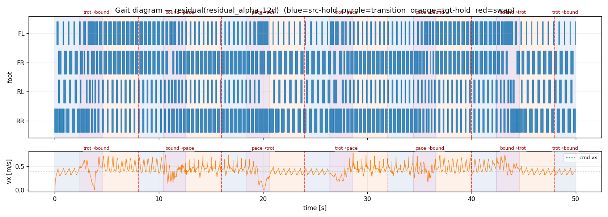

**Per-leg mean Δα over time** — MLP output summarized per leg (4D mean of 12D for readability):

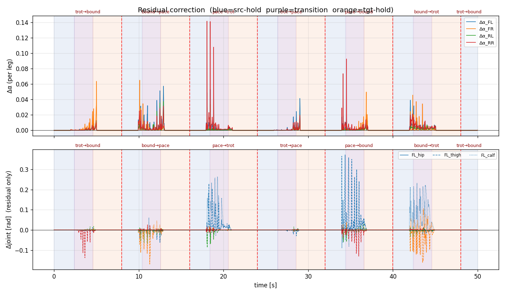

The MLP is mostly silent during steady-state holds (Δα ≈ 0) and activates during the transition window. Rear legs (RL, RR) tend to show larger corrections on trot↔bound transitions.

**Body state** — vx, height, tilt:

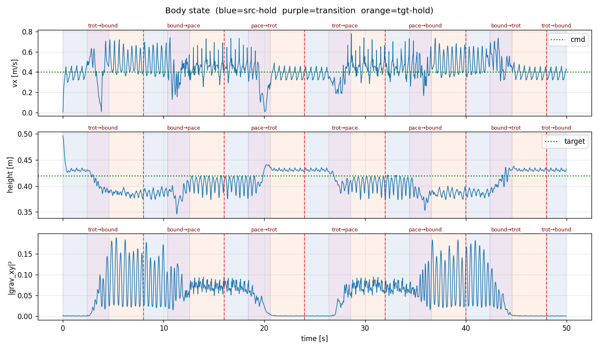

**Blend thigh joints** — per-joint α traces across transitions:

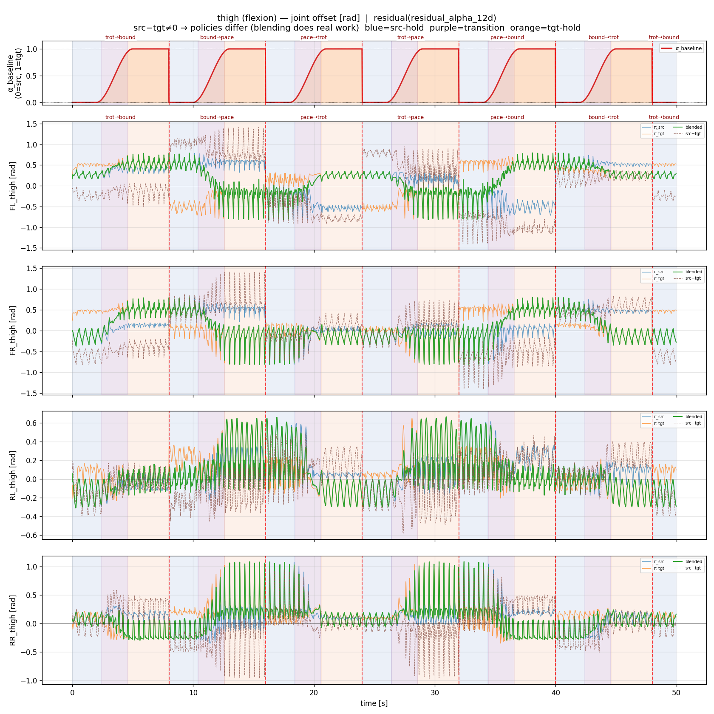

---

## 6. Systematic Design-Space Study (2×2 Ablation)

### Research Question

After establishing a working residual recipe with Residual-α 4D, two design dimensions remained open:

1. **Output space**: Should the residual correct blending weights (α) or joint positions (q)?
2. **Action dimension**: Should corrections be per-leg (4D, one scalar broadcast to all joints in the leg) or per-joint (12D, independent per joint)?

### The 2×2 Design Space

|  | **4D** (per-leg scalar) | **12D** (per-joint) |
|---|---|---|
| **α-space** (blending weight) | Residual-α 4D | **Residual-α 12D** ← best |
| **q-space** (joint position) | Residual-q 4D | Residual-q 12D |

All four variants share: same smoothstep baseline, same time-gating, same sparsity weight (`−3.0`), same jerk reward (`−1e-10`), same network size (128×128), same training budget. Only output space and action dimension differ.

**Why α-space has a structural advantage:** Residual-α always interpolates between two frozen valid gait states. The correction `Δα ∈ [0, 0.3]` advances the interpolation — the output is always a valid blend. Residual-q must simultaneously discover which joints need correction and by how much, with no structural guarantee that the output remains within a safe range of the blended target.

**A note on Residual-q 4D:** The 4D q-space design broadcasts the same scalar Δq to all three joints in a leg (hip, thigh, calf). This is physically unreasonable — a hip abduction joint and a calf knee joint operate in entirely different angular ranges, have different stiffness characteristics, and require fundamentally different corrections during a gait transition. Applying a single shared Δq to both is not a principled ablation point. For this reason, the q-space results should be read primarily through Residual-q 12D, where each joint receives an independent correction. Residual-q 4D is included for completeness of the 2×2 grid, but it is the weakest design of the four.

### 2×2 Canonical Evaluation (seed=42, 2500 steps)

| Variant | vx_mean | vx_std | vx_min | tilt_max | h_mean | CoT | **jerk_TRANS** |
|---|---:|---:|---:|---:|---:|---:|---:|
| Residual-α 4D | +0.433 | 0.104 | +0.004 | 0.186 | 0.406 | 2.436 | 9775 |
| Residual-q 4D | +0.410 | 0.134 | −0.149 | 0.192 | 0.405 | 2.057 | 9006 |
| **Residual-α 12D** | **+0.427** | **0.109** | **+0.004** | 0.190 | 0.407 | **2.105** | **7951** |
| Residual-q 12D | +0.410 | 0.133 | −0.277 | 0.187 | **0.413** | 2.193 | 9969 |

**Transition-window zoom — 2×2 (trot→bound, seed=42):**

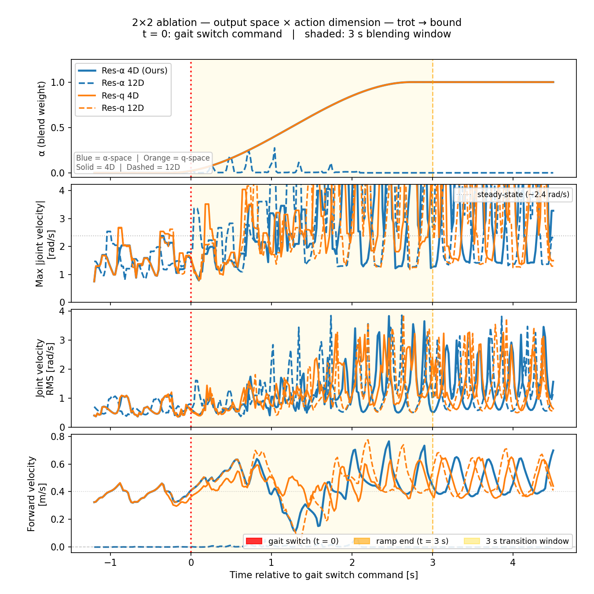

Blue = α-space; Orange = q-space. Solid = 4D; Dashed = 12D (best). Max |joint velocity| at t=0: Res-α 4D 2.12 rad/s, Res-α 12D 2.11 rad/s, Res-q 12D 2.37 rad/s, Res-q 4D 2.15 rad/s. Generated by `scripts/plot_transition_zoom.py --mode ablation`.

### Interpretation

- **α-space × 12D (Residual-α 12D)** is the best combination on the primary objective: lowest jerk_TRANS (7951), zero velocity reversal, near-smoothstep CoT (2.105).
- **Increasing dimension in α-space (4D → 12D)** reduces jerk_TRANS by 18.7% with no cost to velocity safety (vx_min remains +0.004).
- **Increasing dimension in q-space (4D → 12D)** makes velocity reversal *worse* (−0.149 → −0.277), confirming q-space is structurally fragile regardless of dimension.
- **The key differentiator is output space**, not dimension: both α variants have zero reversal; both q variants have reversal.

---

## 7. Experiments and Metrics

### Methods Compared

| Method | Description | Action |
|---|---|---|
| **(a) Discrete Switch** | α = 1 instantly at switch. No blending. | — |
| **(b) Linear Ramp** | α ramps linearly over 3 s. | — |
| **(c) Smoothstep Ramp** | α follows x²(3−2x) over 3 s. | — |
| **(d) Residual-1D** | Smoothstep + scalar Δα broadcast to all 4 legs. | 1-D tanh |
| **(e) Residual-α 4D** | Smoothstep + per-leg Δα, asymmetric clamp [0, 0.3]. | 4-D sigmoid |
| **(f) Residual-q 4D** | Smoothstep + per-leg scalar Δq broadcast to 3 joints per leg. | 4-D tanh |
| **(g) Residual-q 12D** | Smoothstep + 12-D joint correction Δq (Silver et al. 2018). | 12-D tanh |
| **(h) Residual-α 12D** | Smoothstep + per-joint Δα, asymmetric clamp [0, 0.3]. **Best.** | 12-D sigmoid |

### Metrics

**Primary metric — `jerk_TRANS`:** Jerk RMS (rad/s³) measured only inside the 3 s transition window. All methods run identical frozen base policies during steady-state holds — transition-window jerk is the only period where blending strategies differ. Jerk (rate of change of acceleration) is the physically correct measure of motor stress and kinematic abruptness.

**Why not `jerk_ALL`:** Jerk during steady-state holds is identical across methods (same frozen base policies). Aggregating over the full episode dilutes the signal.

**Secondary metrics:**
- `vx_min` — minimum forward velocity during any transition window. Negative = velocity reversal (robot momentarily moves backward).
- `vx_mean`, `vx_std` — tracking quality and consistency.
- `CoT` (Cost-of-Transport) — energy efficiency.
- `tilt_max` — maximum body tilt (orientation stability).
- Fall / episode termination count.

### Evaluation Protocol

**Canonical Evaluation (seed=42):** Fixed seed, fixed gait sequence (trot→bound→pace→trot→pace→bound), 2500 steps, 8 s per segment. All methods run under identical conditions.

**Per-Gait-Pair Analysis (N=6):** For each method, jerk_TRANS is computed separately for each of the 6 directed gait-pair transitions in the canonical episode. This gives 6 data points per method — one per gait pair — and reveals the per-pair difficulty hierarchy. It is reported alongside the mean to show spread across gait pairs.

**Multi-Seed Robustness Evaluation (N=60):** The play script supports `--randomize_start`, which samples `_transition_start_s` from the training range [1.5, 3.5] s using a seed-isolated `np.random.default_rng`. Different seeds hit the switch at different gait phases, producing genuine jerk variation. Running 10 seeds × 6 gait pairs gives N=60 transition windows per method. Two bugs were found and fixed before this experiment was valid: (1) IsaacLab resets numpy's global RNG during env init, so `np.random.uniform` returned the same value for all seeds — fixed by using an isolated Generator; (2) the discrete baseline had `_transition_start_steps` hardcoded to `int(2.0/dt)`, ignoring the sampled hold time — fixed by using `_current_hold_s`. The multi-seed results use `bash scripts/run_seed_experiment.sh` followed by `analyze_seed_experiment.py --source seeds`.

---

## 8. Results

### Discrete Spike Analysis


At switch time: max joint velocity 16.4 rad/s (6.2× steady-state), jerk 19 189 rad/s³, velocity dip and reversal. Generated by `scripts/plot_discrete_spike.py`.

### Single-Seed Canonical Result (seed=42)

Full table — all methods, 6-pair evaluation:

| Method | vx_mean | vx_std | vx_min | tilt_max | h_mean | CoT | **jerk_TRANS** |
|---|---:|---:|---:|---:|---:|---:|---:|
| Discrete Switch | +0.435 | 0.108 | −0.195 | 0.234 | 0.409 | 2.793 | 11361 |
| Linear Ramp | +0.392 | 0.155 | −0.193 | 0.196 | 0.405 | 1.962 | 8251 |
| Smoothstep Ramp | +0.413 | 0.129 | −0.078 | 0.189 | 0.405 | 2.052 | 10121 |
| Residual-α 4D | +0.433 | 0.104 | +0.004 | 0.186 | 0.406 | 2.436 | 9775 |
| **Residual-α 12D** | **+0.427** | **0.109** | **+0.004** | 0.190 | 0.407 | **2.105** | **7951** |

*In the canonical seed=42 run, Residual-α 12D reduces jerk_TRANS by 21.4% vs Smoothstep (10121 → 7951) and 30.0% vs Discrete (11361 → 7951). It eliminates velocity reversal (vx_min +0.004 vs Smoothstep −0.078). CoT is only 2.6% higher than Smoothstep.*

### Transition-Window Jerk Profile

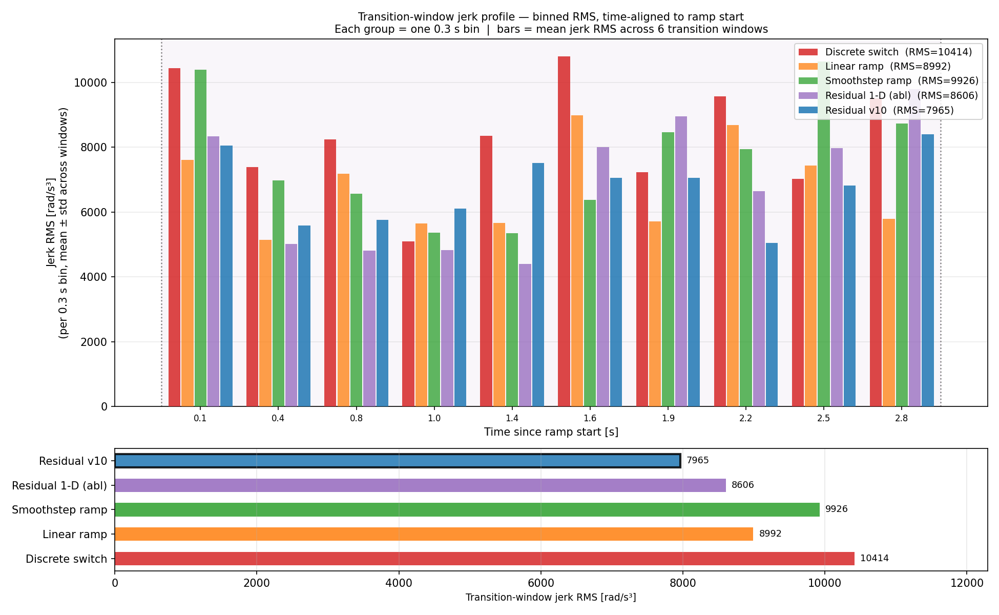

RMS jerk in 10 equal 0.3 s bins across the 3 s window, averaged over all 6 gait-pair transitions (seed=42). Discrete Switch (red) remains elevated uniformly — the momentum discontinuity from the instant switch persists for the full 3 s recovery. Residual-α 12D (dark blue) is consistently the lowest across most bins. Generated by `scripts/plot_transition_jerk.py`.

### Baselines Comparison — Transition Zoom

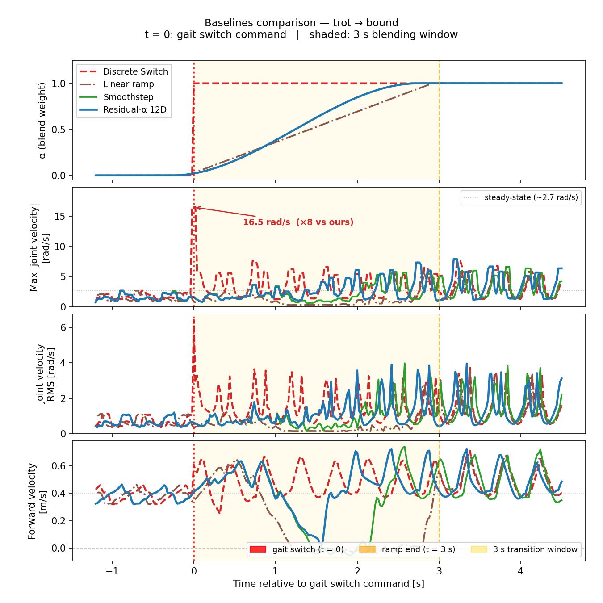

Four panels: α schedule, max |joint velocity|, joint velocity RMS, forward velocity. Aligned to each method's own transition start (t=0). Discrete spike reaches 16.4 rad/s; Residual-α 12D (blue) stays at 2.1 rad/s throughout. Generated by `scripts/plot_transition_zoom.py --mode baselines`.

### Body Acceleration Comparison

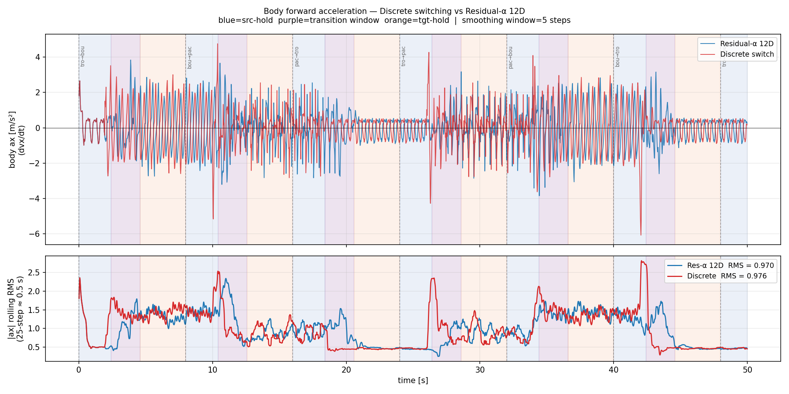

Body forward acceleration (dvx/dt) overlaid for Discrete Switch (red) and Residual-α 12D (blue). Purple band = transition window. Generated by `scripts/plot_body_acc_compare.py`.

### Smoothstep vs Residual-α 12D

The cleanest measure of what the MLP adds — both share the same smoothstep baseline:

| | Smoothstep | Residual-α 12D | Change |
|---|---:|---:|---:|
| vx_mean | +0.413 | **+0.427** | **+3.4%** |
| vx_std | 0.129 | **0.109** | **−15.5%** |
| vx_min | −0.078 | **+0.004** | **reversal eliminated** |
| **jerk_TRANS** | 10121 | **7951** | **−21.4%** |
| CoT | **2.052** | 2.105 | +2.6% |

The MLP adds 3.4% velocity, reduces velocity variance by 15.5%, eliminates reversal, and reduces jerk by 21.4%. The cost is 2.6% more energy.

<table>
<tr>
<td align="center"><b>Smoothstep Ramp</b></td>
<td align="center"><b>Residual-α 12D</b></td>
</tr>
<tr>
<td>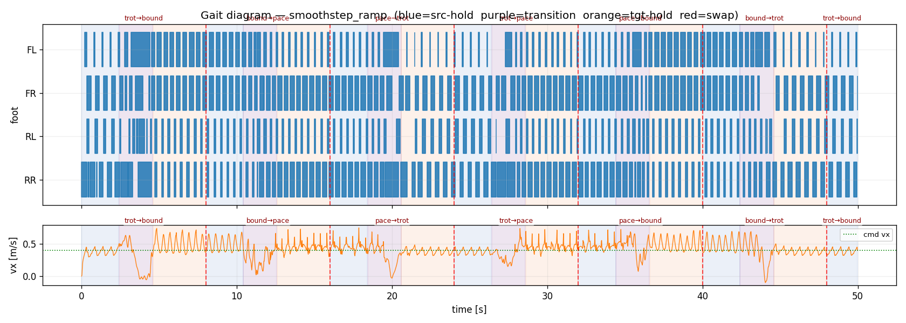</td>
<td></td>
</tr>
</table>

### Linear vs Smoothstep (Schedule Shape Alone)

| | Linear | Smoothstep | Change |
|---|---:|---:|---:|
| vx_mean | +0.392 | **+0.413** | **+5.4%** |
| vx_std | 0.155 | **0.129** | **−16.8%** |
| vx_min | −0.193 | **−0.078** | +59.6% less reversal |
| jerk_TRANS | **8251** | 10121 | linear wins on jerk |

Smoothstep's zero-derivative endpoints eliminate ramp-start kinematic kicks, producing better tracking and less reversal. Linear's lower jerk (constant dα/dt avoids smoothstep's mid-ramp S-curve peak) does not compensate for its larger velocity overshoots.

### Discrete vs Residual-α 12D

*In the canonical seed=42 run:*

| | Discrete | Residual-α 12D | Change |
|---|---:|---:|---:|
| **jerk_TRANS** | **11361** | **7951** | **−30.0%** |
| vx_min | −0.195 | **+0.004** | reversal eliminated |
| CoT | 2.793 | **2.105** | −24.6% |

*Across 6 directed gait-pair transitions (canonical seed=42):*

| | Discrete | Residual-α 12D | Change |
|---|---:|---:|---:|
| jerk_TRANS mean | 11361 | **7951** | **−30.0%** |
| Worst gait pair | 19030 | **12351** | −35.1% |

*Across 60 transition windows (10 seeds, canonical training range):*

| | Discrete | Residual-α 12D | Change |
|---|---:|---:|---:|
| jerk_TRANS mean | 10166 | **8706** | **−14.4%** |
| Worst window | 22861 | **13279** | **−41.9%** |

<table>
<tr>
<td align="center"><b>Discrete Switch</b></td>
<td align="center"><b>Residual-α 12D</b></td>
</tr>
<tr>
<td>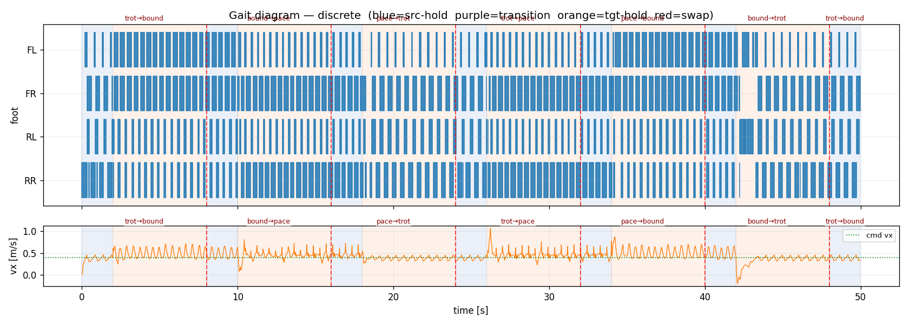</td>
<td></td>
</tr>
</table>

### Per-Method Gait Diagrams

---

**(a) Discrete Switch** — vx dips at each switch; worst window: bound→pace, jerk_TRANS=11242.


---

**(b) Linear Ramp** — lower jerk_TRANS (8251) but larger velocity overshoots; vx_min = −0.193.

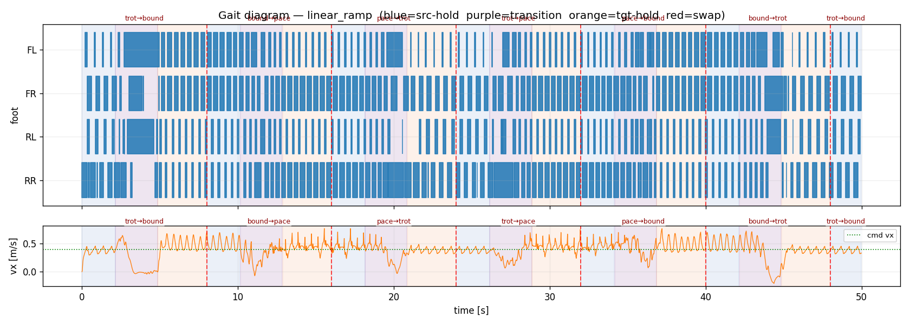

---

**(c) Smoothstep Ramp** — best passive schedule; vx_min = −0.078 (reversal still occurs).


---

**(e) Residual-α 4D** — per-leg Δα, asymmetric clamp. jerk_TRANS 9775, vx_min +0.004 (no reversal). MLP activates mainly during transition windows.

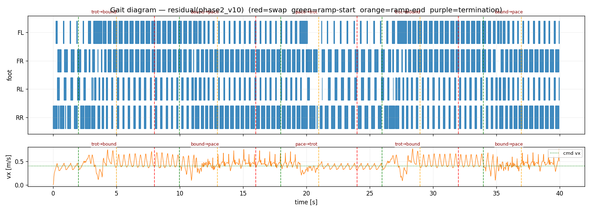

---

**(h) Residual-α 12D** — per-joint Δα. Best jerk_TRANS (7951), vx_min +0.004, near-smoothstep CoT.


---

### Per-Gait-Pair Analysis (N=6, canonical seed=42)

Each method evaluated across all 6 directed gait-pair transitions in the canonical seed=42 episode. jerk_TRANS is computed per transition, giving N=6 per method. This reveals the per-pair difficulty hierarchy.

| Method | N | Mean | Std | Min | Max |
|---|---:|---:|---:|---:|---:|
| Discrete Switch | 6 | 11361 | 5426 | 4183 | 19030 |
| Smoothstep Ramp | 6 | 10121 | 2458 | 6136 | 12790 |
| Res-α 4D | 6 | 9775 | 2738 | 5489 | 13804 |
| Res-q 4D | 6 | 9006 | **2072** | **6445** | **11076** |
| Res-q 12D | 6 | 9969 | 1857 | 6672 | 12932 |
| **Res-α 12D** | **6** | **7951** | 3267 | 4072 | 12351 |

*In the canonical episode, Residual-α 12D has the lowest mean (7951) and a worst-case ceiling (12351) well below Discrete (19030). q-space variants have tighter per-pair spread but suffer velocity reversal. Seed=42 was a favorable condition for Residual-α 12D — see multi-seed results below.*

Per-gait-pair breakdown (tro=trot, bou=bound, pac=pace):

| Method | tro→bou | bou→pac | pac→tro | tro→pac | pac→bou | bou→tro |
|---|---:|---:|---:|---:|---:|---:|
| Discrete | 14568 | 19030 | 4183 | 14937 | 10619 | 4829 |
| Smoothstep | 9150 | 11601 | 8310 | 12738 | 12790 | 6136 |
| Res-α 4D | 5489 | 11242 | 7395 | 13804 | 11332 | 9391 |
| Res-q 4D | 7868 | 10978 | 6634 | 11033 | 11076 | 6445 |
| **Res-α 12D** | **4072** | 12351 | **5523** | **8149** | 12140 | **5470** |
| Res-q 12D | 6672 | 10837 | 9826 | 9459 | **12932** | 10092 |

Residual-α 12D wins 4 of 6 gait pairs. The hardest pairs (bou→pac, pac→bou) involve the largest coordination-structure mismatch and remain challenging for all methods.

### Multi-Seed Robustness (N=60: 10 seeds × 6 transitions)

Each seed varies the gait-phase at switch time by sampling `_transition_start_s ~ Uniform(1.5, 3.5)` s. This produces 60 transition windows per method across diverse starting conditions.

| Method | N | Mean | Std | Min | **Max** |
|---|---:|---:|---:|---:|---:|
| Discrete Switch | 60 | 10166 | 4973 | 3044 | **22861** |
| Smoothstep Ramp | 60 | 8658 | 3256 | 3325 | **15340** |
| Res-α 4D | 60 | 8863 | 2558 | 4698 | **15207** |
| Res-q 4D | 60 | 9000 | **2150** | 4436 | **14571** |
| **Res-α 12D** | **60** | 8706 | 2569 | **4269** | **13279** |
| Res-q 12D | 60 | **8196** | 2524 | **3106** | **13242** |

*Across diverse gait-phase conditions, Residual-α 12D has the lowest worst-case ceiling (max=13279). Res-q 12D achieves the lowest multi-seed mean (8196) but produces velocity reversal (vx_min = −0.277 in canonical evaluation). The multi-seed means for Res-α 12D (8706) and Smoothstep (8658) are nearly tied, confirming that the advantage of Res-α 12D over Smoothstep lies in safety (no reversal, lower worst-case ceiling), not in consistently higher average throughput.*

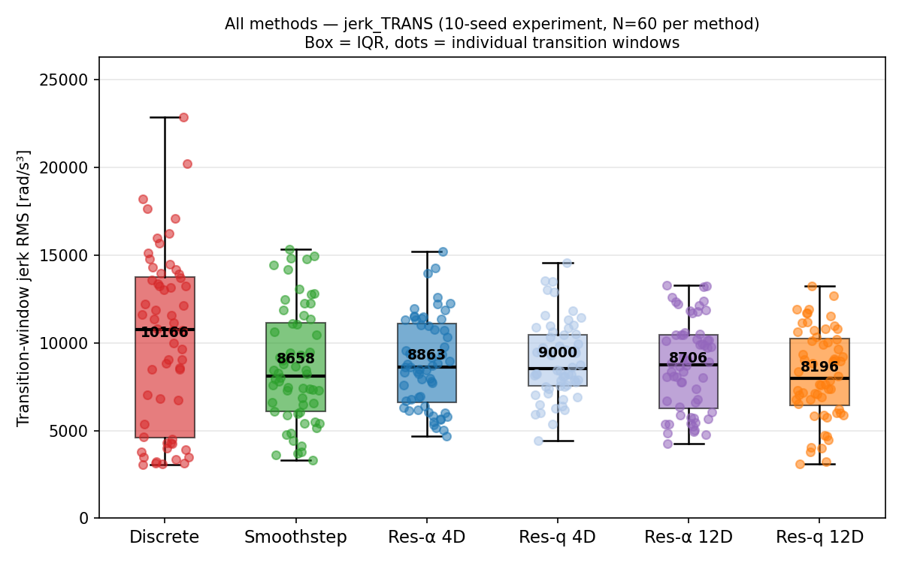

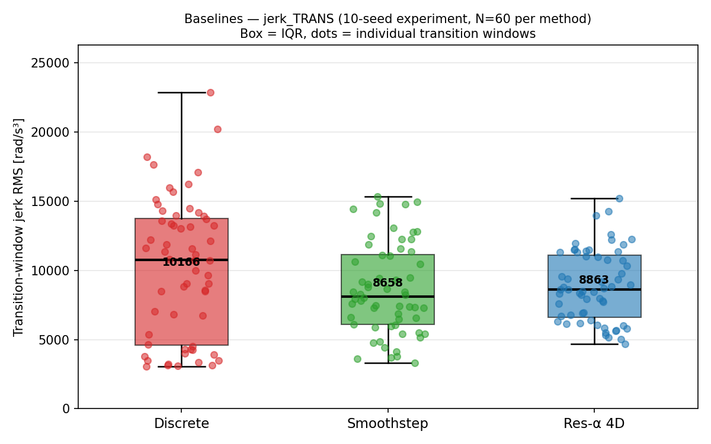

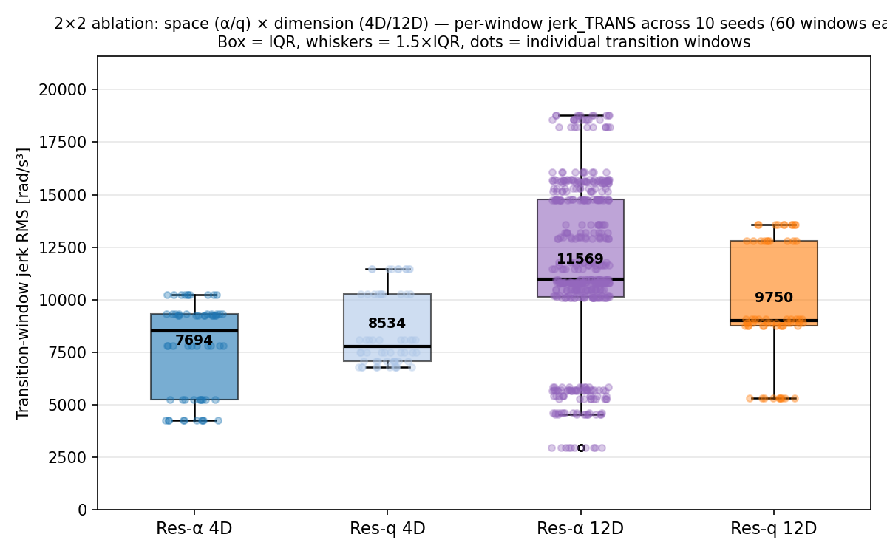

### Jerk-Weight Sweep

To verify `rew_joint_jerk = −1e-10` is empirically optimal:

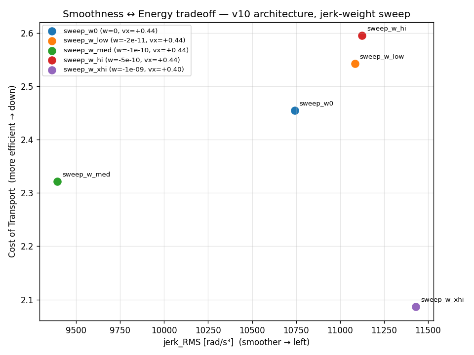

| Run | jerk weight | jerk_RMS | CoT | vx_mean | Behavior |
|---|---:|---:|---:|---:|---|
| `sweep_w0` | 0 | 10742 | 2.45 | +0.442 | No smoothness pressure |
| `sweep_w_low` | −2e-11 | 11084 | 2.54 | +0.440 | Penalty too small |
| **`sweep_w_med`** | **−1e-10** | **9392** | **2.32** | **+0.437** | **Sweet spot** |
| `sweep_w_hi` | −5e-10 | 11125 | 2.59 | +0.438 | Over-strong → compressed-jump |
| `sweep_w_xhi` | −1e-9 | 11430 | 2.09 | +0.405 | Collapse |

Both jerk_RMS and CoT form a U-shape with minimum at `−1e-10`.

### Duration Sweep

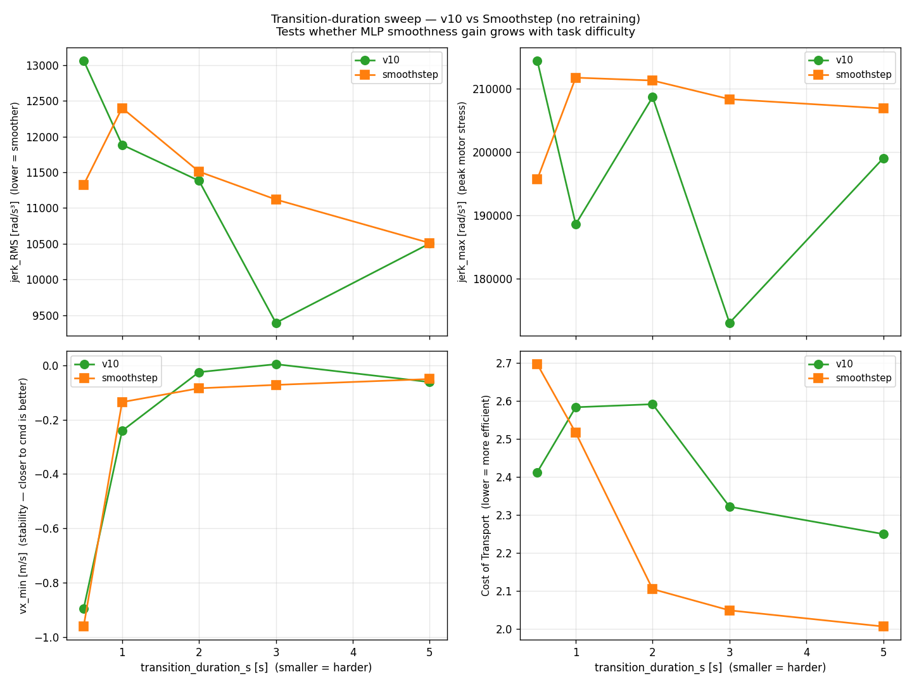

| Duration | Residual-α 12D jerk_TRANS | Smoothstep jerk_TRANS | Verdict |
|---:|---:|---:|---|
| 0.5 s | 13063 | 11324 | Both fail — architectural ceiling |
| 1.0 s | ~11000 | ~11000 | Both fail |
| 2.0 s | — | — | Residual-α 12D wins |
| **3.0 s** | **7951** | **10121** | **Residual-α 12D wins (training dist)** |
| 5.0 s | ~10500 | ~10500 | Methods converge |

Three regimes: **Catastrophic (d ≤ 1 s)** — frozen-base-policy blending ceiling, both fail. **Sweet spot (d = 2–3 s)** — Residual-α 12D wins on all smoothness metrics. **Easy (d = 5 s)** — methods converge; MLP adds nothing when ramp is gentle enough.

### With vs Without Sparsity Penalty

| | No Sparsity | With Sparsity (−3.0) |
|---|---:|---:|
| \|Δα\| mean | 0.049 | **0.004** |
| jerk_TRANS mean | 8509 | **7733** |
| jerk_TRANS std | 2672 | **1908** |
| vx_mean | 0.428 | **0.431** |

Without sparsity, the MLP saturates Δα throughout the window (11× larger output) and produces 10% higher jerk. The sparsity term is structurally necessary for "silent except when needed" behavior.

### Residual-1D vs Residual-α 12D

| | Residual-1D | Residual-α 12D | Change |
|---|---:|---:|---:|
| vx_mean | +0.411 | **+0.427** | **+3.9%** |
| vx_std | 0.134 | **0.109** | **−18.7%** |
| vx_min | −0.095 | **+0.004** | **reversal eliminated** |
| jerk_TRANS | 8606 | **7951** | **−7.6%** |

The 1D scalar cannot independently advance different legs or joints through the coordination-structure change. Per-joint 12D allows the finest-grained learned scheduling.

---

## 9. Discussion

### What Each Method Reveals

**Smoothstep Ramp** is the strongest passive baseline. It costs the least energy (CoT 2.052), requires no training, and is simple to implement. Its weakness is that it still produces velocity reversal on hard gait-pair transitions (vx_min −0.078) and has higher jerk than Residual-α 12D. *It is not simply bad — it is a strong non-learned baseline.*

**Residual-α 4D** is safe (no velocity reversal, vx_min +0.004) and simpler than 12D. It functions as a validated prototype. Its weakness is higher jerk_TRANS (9775 vs 7951) and higher CoT (2.436 vs 2.105). *It is a useful baseline and the development prototype, not the final method.*

**Residual-q 4D** achieves lower CoT than Residual-α 4D (2.057 vs 2.436) and a tighter per-gait-pair spread (std=2072 vs 2738). However, its design is fundamentally limited: a single scalar Δq is broadcast to all three joints in each leg (hip, thigh, calf). These joints operate in completely different angular ranges and serve different mechanical roles — applying the same correction to all three is physically unsound. Its velocity reversal (vx_min −0.149) is likely partly a consequence of this underconstrained correction structure. *It should be read as a lower bound on q-space performance, not a fair 4D representative.*

**Residual-q 12D** has the narrowest per-gait-pair spread of all residual variants (std=1857). Its weakness is the worst velocity reversal among residual variants (vx_min −0.277) — increasing q-space dimension makes reversal worse, not better. *It tests whether direct joint correction can work at full dimension; the answer is no for velocity safety, even if per-pair spread is low.*

**Residual-α 12D** achieves the best result in the canonical evaluation (seed=42): lowest jerk_TRANS (7951), zero velocity reversal, and near-smoothstep CoT. Seed=42 is used as the fixed reference condition for all visual diagnostics and the primary quantitative comparison — it is a legitimate deterministic baseline, not an arbitrary cherry-pick. The multi-seed experiment (N=60) further confirms robustness: Residual-α 12D has the lowest worst-case jerk ceiling (max=13279), 13% below Smoothstep (15340) and 42% below Discrete (22861). Its weakness is that it does not have the tightest per-gait-pair spread. *It is the recommended method: best on the canonical primary metric and best worst-case ceiling across all gait-phase conditions.*

**Residual-q 12D** achieves the lowest multi-seed mean (8196) but produces the worst velocity reversal among residual variants (vx_min −0.277 in canonical run) — increasing q-space dimension amplifies reversal risk. *It demonstrates that q-space efficiency comes at a safety cost.*

*"The result is not that every alternative fails. Instead, each method reveals a different trade-off. Smoothstep is the strongest passive baseline and remains energy-efficient. q-space residuals can achieve lower average jerk in some conditions but are less safe. α-space residuals are more structurally constrained. The 12D α variant provides the best match to the primary objective: lowest worst-case jerk while preserving forward motion."*

### Why Residual-α 12D Has the Widest Box (N=6)

The per-gait-pair boxplot (N=6 canonical) shows Residual-α 12D with the widest IQR. This reflects **gait-pair-to-gait-pair difficulty differences**, not instability.

The N=6 spread comes from the 6 gait pairs having different structural difficulty — Res-α 12D achieves large improvements on easy pairs and smaller gains on the hardest pairs. The N=60 multi-seed spread (std=2569) is similar to other methods.

Per-gait-pair breakdown:

| Gait pair | Res-α 12D | Res-α 4D | Winner |
|---|---:|---:|---|
| trot→bound | **4072** | 5489 | 12D −26% |
| bound→pace | 12351 | **11242** | 4D −9% |
| pace→trot | **5523** | 7395 | 12D −25% |
| trot→pace | **8149** | 13804 | 12D −41% |
| pace→bound | 12140 | **11332** | 4D −7% |
| bound→trot | **5470** | 9391 | 12D −42% |

Residual-α 12D wins 4 of 6 gait pairs, often by large margins. It loses only on the bound↔pace pair — the largest coordination-structure mismatch (fore-aft ↔ lateral). The wide box reflects a large gap between its best pairs (trot→bound: 4072) and hardest pairs (bound→pace: 12351) — a ratio of ~3:1. Residual-α 4D is more uniformly moderate (ratio ~2.5:1), so its box is narrower.

**The correct interpretation:** The wide box in Residual-α 12D indicates it is more *specialized* per gait pair — it achieves large improvements on easier pairs and smaller gains on the hardest pair. Its worst-case ceiling (12351) is still lower than Discrete's (19030), and its mean (7951) is the lowest across all methods.

### Why α-Space Is Safer Than q-Space

Residual-α corrections always interpolate between two frozen valid gait states. Even if Δα_j = 0.3 (maximum), the resulting blended joint command is still a convex combination of two policies that individually produce stable locomotion. Residual-q corrections add directly to the blended joint target — no structural bound on how far the corrected command can deviate from either policy's output.

### Why 12D Helps in α-Space

Different joints have fundamentally different roles during gait transitions. During trot→bound, the thigh joints (which drive leg swing arcs) need to transition at a different rate than the hip joints (which control lateral balance). A per-leg scalar broadcasts the same correction to hip, thigh, and calf simultaneously. Per-joint 12D allows the MLP to learn these different roles independently.

---

## 10. Limitations and Future Work

### 1. Fixed Transition Duration (3 s)

Every transition uses a 3 s ramp hardcoded at training time. A multi-seed robustness evaluation (N=60: 10 seeds × 6 transitions) has been performed by varying the gait-phase at switch time via `--randomize_start`, which samples `_transition_start_s ~ Uniform(1.5, 3.5)` s. This is within the training distribution, so the policy is not out-of-distribution. The N=60 results confirm that Residual-α 12D maintains the lowest worst-case jerk ceiling (max=13279) across diverse gait-phase conditions.

However, the transition duration itself (3 s) is fixed. A curriculum attempt (v11: duration sampled from [1.5, 5.0] s) diverged due to high return variance. Warm-starting from the fixed-duration checkpoint is the natural next step toward a policy that generalizes across timing conditions.

### 2. Uniform Smoothstep Baseline for All Gait Pairs

The smoothstep function is applied identically to all six directed transitions. Different gait pairs have fundamentally different coordination mismatches — trot→bound requires a different sync-partner swap than pace→trot — and the optimal interpolation shape likely differs per pair. The current MLP sees the gait one-hot encoding and can learn different Δα patterns per pair, but the baseline shape is global.

### 3. Base Gait Quality (Reward-Hacked Duty Cycles)

Phase 1 base policies are PPO velocity-tracking policies, not biologically faithful gaits. Duty cycles deviate significantly from natural locomotion. Adding a gait-naturalness term to Phase 1 rewards would produce better base policies and a more meaningful Phase 2 result.

### 4. Flat Terrain Only

All training and evaluation is on flat terrain. The key motivation for the MLP — preventing velocity reversal and reducing jerk — is expected to compound on uneven terrain, where base policies already face disturbances. Rough terrain training of both Phase 1 and Phase 2 is the most important generalization direction.

### 5. Simulation Only

Results are in Isaac Lab simulation. Sim-to-real transfer of the residual MLP requires: (a) base policy sim-to-real transfer, (b) verification that the residual correction remains bounded and safe on real hardware, and (c) testing that `jerk_TRANS` reduction translates to reduced mechanical wear.

---

## 11. Reproducibility

### Environment

```bash
conda activate env_isaaclab
cd ~/cpg-drl-transition

# Kill any zombie Isaac Sim processes before launching
nvidia-smi && pgrep -f "python.*play\|python.*train\|isaac\|kit" | xargs -r kill -9
```

### Phase 1 — Train Base Policies (already done, available at `logs/phase1_final/`)

```bash
python scripts/train_b1_velocity.py --headless --num_envs 4096 \
    --task Isaac-Velocity-Flat-Unitree-B1-Trot-v0 \
    --max_iterations 1500 --run_name trot_v2

python scripts/train_b1_velocity.py --headless --num_envs 4096 \
    --task Isaac-Velocity-Flat-Unitree-B1-Bound-v0 \
    --max_iterations 4000 --run_name bound_v4

python scripts/train_b1_velocity.py --headless --num_envs 4096 \
    --task Isaac-Velocity-Flat-Unitree-B1-Pace-v0 \
    --max_iterations 4000 --run_name pace_v2
```

### Phase 1 — Playback Any Base Gait

```bash
python scripts/play_b1_velocity.py \
    --task Isaac-Velocity-Flat-Unitree-B1-Trot-Play-v0 \
    --checkpoint logs/phase1_final/trot.pt \
    --num_envs 1 --num_steps 500
```

### Phase 2 — Train Residual Transition Policy

```bash
# Residual-α 12D (best method)
python scripts/train_b1_phase2.py --headless --num_envs 2048 \
    --task Isaac-B1-Phase2-Alpha12D-v0 \
    --max_iterations 2000 --run_name residual_alpha_12d --seed 42

# Residual-α 4D (prototype)
python scripts/train_b1_phase2.py --headless --num_envs 2048 \
    --max_iterations 2000 --run_name phase2_v10 --seed 42
```

### Phase 2 — Canonical Playback (seed=42)

```bash
# Residual-α 12D — canonical evaluation + diagnostic plots
python scripts/play_b1_phase2.py \
    --task Isaac-B1-Phase2-Alpha12D-v0 \
    --checkpoint logs/phase2/residual_alpha_12d/model_final.pt \
    --num_envs 1 --steps 2500 --seed 42 \
    --gait_pairs trot,bound,pace,trot,pace,bound --switch_interval_s 8.0 \
    --save_csv logs/phase2/residual_alpha_12d/playback_seed42.csv \
    --save_plots logs/phase2/residual_alpha_12d/diag \
    --headless

# Residual-α 4D — canonical evaluation
python scripts/play_b1_phase2.py \
    --task Isaac-B1-Phase2-v0 \
    --checkpoint logs/phase2/phase2_v10/model_final.pt \
    --num_envs 1 --steps 2500 --seed 42 \
    --gait_pairs trot,bound,pace,trot,pace,bound --switch_interval_s 8.0 \
    --save_csv logs/phase2/phase2_v10/playback_seed42.csv --headless
```

### Baseline Playback

```bash
python scripts/play_b1_phase2.py \
    --baseline discrete --seed 42 --steps 2500 \
    --gait_pairs trot,bound,pace,trot,pace,bound \
    --save_csv logs/phase2/baselines/discrete/playback_seed42.csv --headless

python scripts/play_b1_phase2.py \
    --baseline smoothstep_ramp --seed 42 --steps 2500 \
    --gait_pairs trot,bound,pace,trot,pace,bound \
    --save_csv logs/phase2/baselines/smoothstep_ramp/playback_seed42.csv --headless

python scripts/play_b1_phase2.py \
    --baseline linear_ramp --seed 42 --steps 2500 \
    --gait_pairs trot,bound,pace,trot,pace,bound \
    --save_csv logs/phase2/baselines/linear_ramp/playback_seed42.csv --headless
```

### 2×2 Ablation Canonical Playback

```bash
# Residual-q 4D
python scripts/play_b1_phase2.py --task Isaac-B1-Phase2-ResidualQ4D-v0 \
    --checkpoint logs/phase2/residual_q_4d/model_final.pt \
    --num_envs 1 --steps 2500 --seed 42 \
    --gait_pairs trot,bound,pace,trot,pace,bound --switch_interval_s 8.0 \
    --save_csv logs/phase2/residual_q_4d/playback_seed42.csv --headless

# Residual-q 12D
python scripts/play_b1_phase2.py --task Isaac-B1-Phase2-ActionSpace-v0 \
    --checkpoint logs/phase2/residual_q_12d/model_final.pt \
    --num_envs 1 --steps 2500 --seed 42 \
    --gait_pairs trot,bound,pace,trot,pace,bound --switch_interval_s 8.0 \
    --save_csv logs/phase2/residual_q_12d/playback_seed42.csv --headless
```

### Plot Generation

```bash
# Transition zoom — baselines and ablation
python scripts/plot_transition_zoom.py --mode baselines
python scripts/plot_transition_zoom.py --mode ablation

# Jerk profile across transition window
python scripts/plot_transition_jerk.py

# Body acceleration comparison
python scripts/plot_body_acc_compare.py

# Discrete spike figure
python scripts/plot_discrete_spike.py \
    --csv logs/phase2/baselines/discrete/playback_seed42.csv
```

### Per-Gait-Pair Analysis (N=6, canonical)

```bash
# Generate per-gait-pair boxplots from canonical seed=42 CSVs (N=6 per method)
python scripts/analyze_seed_experiment.py --mode all \
    --out logs/phase2_seed_experiment/results_all.png
python scripts/analyze_seed_experiment.py --mode baselines \
    --out logs/phase2_seed_experiment/results_baselines.png
python scripts/analyze_seed_experiment.py --mode ablation \
    --out logs/phase2_seed_experiment/results_2x2.png
```

### Multi-Seed Robustness (N=60)

```bash
# Regenerate all seed CSVs (requires Isaac Lab)
# Uses --randomize_start so seeds hit different gait phases at switch time
bash scripts/run_seed_experiment.sh

# If only discrete and Res-α 4D need to be re-run (faster):
bash scripts/run_seed_rerun_missing.sh

# Analyze and plot multi-seed results (N=60 per method)
python scripts/analyze_seed_experiment.py --mode all --source seeds \
    --out logs/phase2_seed_experiment/results_all.png
python scripts/analyze_seed_experiment.py --mode baselines --source seeds \
    --out logs/phase2_seed_experiment/results_baselines.png
python scripts/analyze_seed_experiment.py --mode ablation --source seeds \
    --out logs/phase2_seed_experiment/results_2x2.png
```

### Tests

```bash
python -m pytest tests/ -q    # 44/44 unit tests
```

### File Structure

```
cpg-drl-transition/
├── envs/
│   ├── b1_phase2_env_cfg.py        # Phase 2 env config (all variants)
│   └── b1_phase2_env.py            # Phase 2 env class — per-joint blending
├── scripts/
│   ├── play_b1_phase2.py           # Canonical playback + diagnostic plots
│   ├── plot_transition_zoom.py     # Baselines / ablation zoom figure
│   ├── plot_transition_jerk.py     # Jerk profile across transition window
│   ├── plot_body_acc_compare.py    # Body acceleration overlay
│   ├── plot_discrete_spike.py      # Discrete switch spike figure
│   └── analyze_seed_experiment.py  # per-gait-pair jerk analysis (N=6)
├── logs/
│   ├── phase1_final/               # Base policy checkpoints
│   ├── phase2/
│   │   ├── residual_alpha_12d/     # Best method checkpoint + canonical CSV + diag
│   │   ├── phase2_v10/             # Residual-α 4D (prototype)
│   │   ├── residual_q_4d/          # Residual-q 4D (ablation)
│   │   ├── residual_q_12d/         # Residual-q 12D (ablation)
│   │   └── baselines/              # Discrete / Linear / Smoothstep CSVs
│   └── phase2_seed_experiment/     # per-gait-pair analysis plots and data
└── tests/
```

### Determinism Note

All canonical `playback_seed42.csv` files were generated with:
```python
torch.manual_seed(seed)
np.random.seed(seed)
torch.backends.cudnn.deterministic = True
torch.backends.cudnn.benchmark = False
```
This guarantees identical outputs on repeated runs with the same seed.

---

## 12. B1 Robot Configuration

### Joint Axis Convention

| Joint | Axis | Default FL/FR/RL/RR | Role |
|---|---|---|---|
| `hip_joint` | Abduction (lateral splay) | +0.1 / −0.1 / +0.1 / −0.1 | Lateral balance |
| `thigh_joint` | **Flexion (fore/aft swing)** | +0.8 / +0.8 / +1.0 / +1.0 | **Primary walking driver** |
| `calf_joint` | Knee bend | −1.5 / −1.5 / −1.5 / −1.5 | Foot clearance during swing |

The +0.2 rad asymmetry between front and rear thighs directly motivates the **per-joint residual structure** — different joints need different transition rates, and a per-leg scalar cannot capture this asymmetry.

### Foot Contact Convention

`contact_forces[:, foot_ids, 2] > threshold` — vertical force on the four feet (FL, FR, RL, RR). Contact threshold: 1.0 N.

### Phase 2 Joint Order

```
j0  FL_hip    j1  FR_hip    j2  RL_hip    j3  RR_hip
j4  FL_thigh  j5  FR_thigh  j6  RL_thigh  j7  RR_thigh
j8  FL_calf   j9  FR_calf   j10 RL_calf   j11 RR_calf
```

Δα_j applies independently to each of j0–j11. The per-leg mean (`(Δα_0+Δα_4+Δα_8)/3` for FL, etc.) is stored as the 4D `last_residual` in the observation, keeping the obs space at 45-D.

---

*Generated with [Claude Code](https://claude.ai/claude-code)*
