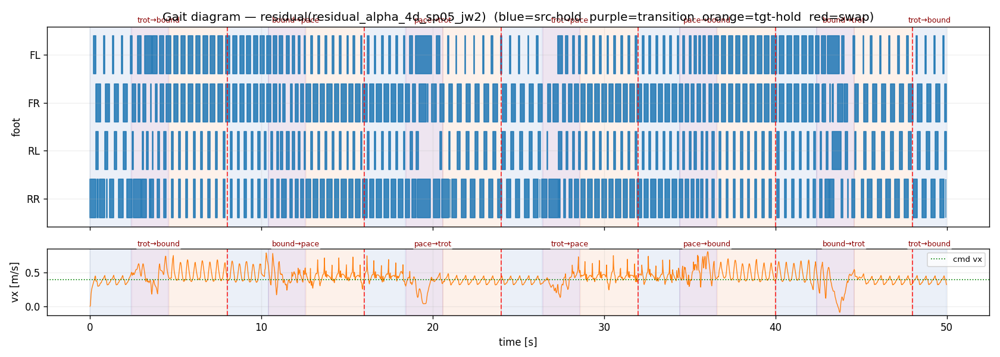
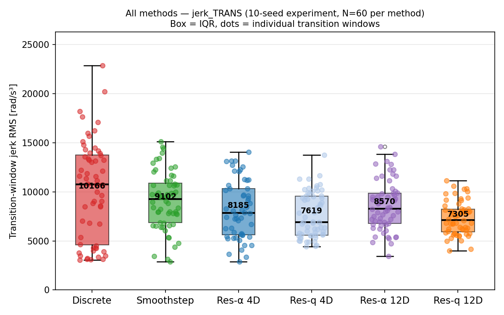
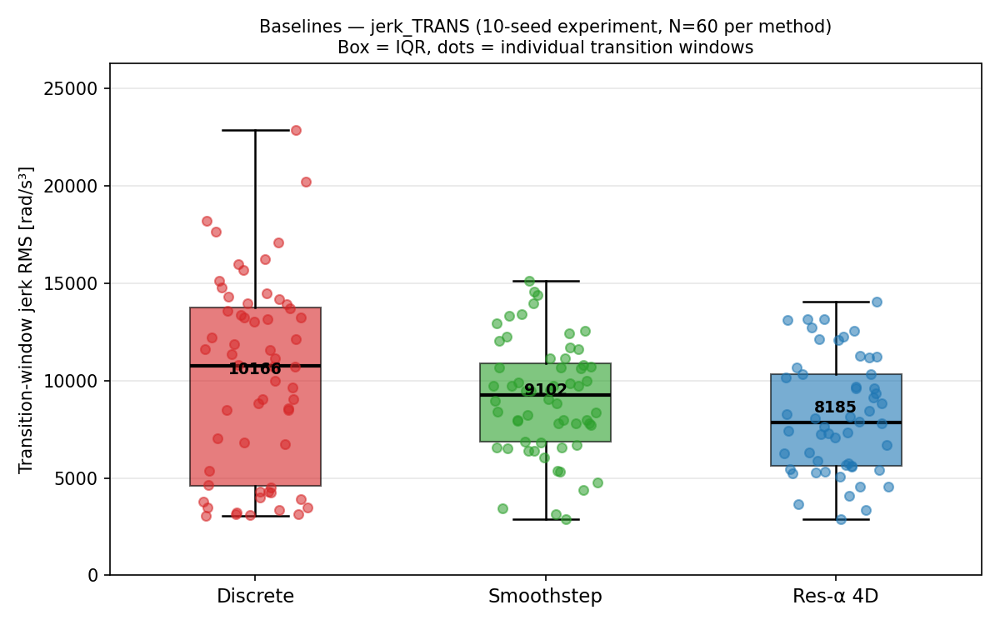
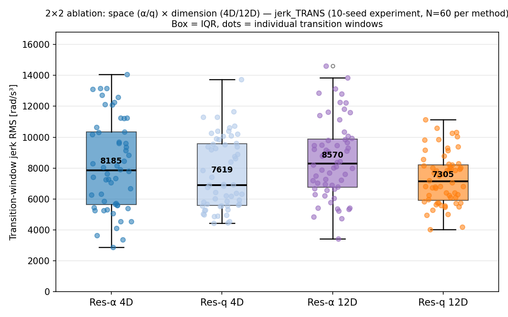

# Transition-Aware Quadruped Locomotion: A Study of Residual Correction Spaces

**Course:** FRA 503 — Deep Reinforcement Learning
**Student:** Disthorn Suttawet (66340500019)
**Robot:** Unitree B1 quadruped (12 DOF, ~50 kg)
**Simulator:** Isaac Lab 0.36.3 / Isaac Sim 4.5.0
**Deadline:** 20 May 2026

---

## Table of Contents

1. [Project Overview](#1-project-overview)
2. [Background and Design Motivation](#2-background-and-design-motivation)
3. [Phase 1 — Base Gait Policy Generation](#3-phase-1--base-gait-policy-generation)
4. [Phase 2 — Residual Transition Learning](#4-phase-2--residual-transition-learning)
5. [Development History — From Prototype to Design-Space Study](#5-development-history--from-prototype-to-design-space-study)
6. [Systematic Design-Space Study (2×2 Ablation)](#6-systematic-design-space-study-22-ablation)
7. [Phase-Observation Ablation](#7-phase-observation-ablation)
8. [Experiments and Metrics](#8-experiments-and-metrics)
9. [Results](#9-results)
10. [Discussion](#10-discussion)
11. [Limitations and Future Work](#11-limitations-and-future-work)
12. [Reproducibility](#12-reproducibility)
13. [B1 Robot Configuration](#13-b1-robot-configuration)

---

## 1. Project Overview

### Motivation

Quadruped robots operating across terrains and tasks require different gait patterns — trots for cruising, bounds for speed, paces for lateral coordination. Switching between these gaits without losing balance or wasting energy is a fundamental deployment challenge. Gaits with different leg-pair coordination structures (diagonal vs fore-aft vs lateral) cannot be linearly interpolated at the joint level — naive switching creates kinematic shocks that can stagger or destabilize a 50 kg robot.

### Problem Statement

A hand-designed **smoothstep** blending schedule already outperforms discrete switching on transition continuity. But it still produces velocity reversal on hard gait-pair transitions. The question is whether a small learned residual correction can close this gap without requiring a full learned policy.

### Final Research Question

> **How do residual correction space (α-space vs q-space) and action dimension (4D per-leg vs 12D per-joint) affect jerk reduction, velocity reversal, energy cost, and robustness during quadruped gait transition?**

This question is investigated through a systematic **2×2 ablation**: output space (α vs q) × action dimension (4D vs 12D). The study reveals trade-offs rather than a single winner: all residual variants reduce transition-window jerk, but velocity safety rankings are gait-phase-dependent.

### Thesis Statement

This project began with the goal of using residual learning to reduce gait-transition jerk. The final result shows that the main issue is not only *whether* residual learning is used, but *where* the residual acts, *how* it is constrained, and *when* the transition occurs relative to gait phase. All four residual variants improve jerk over Smoothstep, but velocity safety and robustness remain gait-phase dependent. Therefore, the main contribution is a design-space analysis and a set of lessons about the factors that determine residual transition quality — not a single winning architecture.

### Contributions

- Formulated gait transition as a **residual correction problem** on top of frozen policy blending, comparing two correction targets: q-space (joint-position corrections Δq) and α-space (blending-schedule corrections Δα).
- Developed a stable **residual-learning recipe** (time-gating, asymmetric sigmoid clamp, jerk penalty, sparsity) through a v1–v10 prototype sequence before expanding to the full design space.
- Conducted a **2×2 design-space study** (α vs q) × (4D vs 12D) with all other factors fixed, revealing that output space, action dimension, and action constraints interact with gait-phase diversity in non-trivial ways.
- Showed that all four residual variants improve transition-window jerk over Smoothstep, but **no method dominates every metric** — velocity safety rankings are gait-phase-dependent and fixed-seed and randomized-seed evaluations disagree.
- Identified that simple residual correction does not fully solve gait transition: the remaining difficulty is **phase alignment** between frozen source and target policies, which the MLP cannot directly observe or correct.
- Conducted a **phase-observation ablation** — adding binary foot contact (49-D obs) while removing the jerk reward — showing that phase information improves velocity safety but does not improve jerk without an explicit smoothness signal. This confirms that observation design and reward design are independent axes, both of which matter.
- Established that a single fixed-seed evaluation is insufficient to characterize reversal behavior — diverse gait-phase evaluation (N=60) reveals disagreements that N=6 cannot detect.

### Key Results

**Canonical evaluation** (seed=42, 2500 steps, 6 directed gait-pair transitions):

| Method | vx_mean | vx_std | vx_min | **Δvx** | CoT | **jerk_TRANS** |
|---|---:|---:|---:|---:|---:|---:|
| Discrete Switch | +0.435 | 0.108 | −0.195 | 0.630 | 2.793 | 11361 |
| Linear Ramp | +0.390 | 0.157 | −0.206 | 0.597 | 1.955 | 7441 |
| Smoothstep Ramp | +0.415 | 0.129 | −0.096 | 0.511 | 2.090 | 8508 |
| Residual-α 4D | +0.430 | 0.113 | −0.086 | 0.516 | 2.171 | 7617 |
| Residual-q 4D | +0.416 | 0.100 | −0.024 | 0.440 | 2.158 | 7320 |
| Residual-q 12D | +0.408 | 0.130 | −0.122 | 0.530 | 2.064 | 7719 |
| **Residual-α 12D** | **+0.431** | **0.099** | **+0.061** | **0.371** | 2.454 | **8320** |

*Δvx = vx_mean − vx_min: how far velocity drops below the episode average during the worst transition window. Smaller = less disruption. This is hardware-independent; vx_min alone is not, because B1's thigh asymmetry creates a lower-than-commanded steady-state baseline.*

**Multi-seed evaluation** (N=60: 10 seeds × 6 gait pairs, `--randomize_start`):

| Method | jerk_TRANS mean | vs Smoothstep | mean Δvx | dip rate (<0) |
|---|---:|---:|---:|---:|
| Discrete Switch | 10166 | +11.7% | 0.266 | 18% |
| Smoothstep Ramp | 9102 | — | 0.409 | 55% |
| Residual-α 12D | 8570 | −5.8% | 0.351 | 30% |
| Residual-α 4D | 8185 | −10.1% | 0.310 | 7% |
| Residual-q 4D | **7619** | **−16.3%** | **0.229** | **0%** |
| Residual-q 12D | 7305 | −19.7% | 0.399 | 38% |

*Dip rate = fraction of 60 windows where vx_min < 0 (velocity crossed zero). Mean Δvx = mean velocity drop from episode average across all 60 windows, regardless of sign.*

The tables above show a design trade-off map, not a winner. **The one robust finding**: all four residual variants reduce jerk over Smoothstep at both evaluation levels. **The secondary transition characteristic** is Δvx (velocity drop from steady-state): Res-α 12D has the smallest Δvx at canonical N=6 (0.371 vs Smoothstep 0.511), meaning the velocity disturbance through the transition is 27% smaller. At N=60, Res-q 4D has the smallest mean Δvx (0.229). These two evaluations disagree on which method is least disruptive, which is itself a finding: a single fixed gait phase is insufficient to characterize transition quality. The base-swap experiment confirms that the learned corrections are schedule-specific: replacing Smoothstep with a linear ramp at evaluation time raises jerk by +12.3%, proving the MLP learned a contextual correction calibrated to its training base. The phase-observation ablation (Section 7) adds a further lesson: adding foot contact to the observation improved velocity safety but increased jerk, because the jerk reward was doing load-bearing work. Observation design and reward design are independent axes that must be co-designed.

---

## 2. Background and Design Motivation

### Quadruped Gait Transition Problem

Trot, bound, and pace have fundamentally different leg-pair synchrony structures:
- **Trot** — diagonal pairs in phase (FL+RR, FR+RL)
- **Bound** — fore-aft pairs in phase (FL+FR, RL+RR)
- **Pace** — lateral pairs in phase (FL+RL, FR+RR)

The midpoint between "FL+RR planted" (trot) and "FL+FR planted" (bound) is **not a valid quadruped configuration**. Naive blending of joint targets produces incoherent commands that destabilize the body.

### Why Naive Discrete Switching Fails

The simplest strategy is to set α = 1 immediately at the switch command. The result is a kinematic shock — joint targets jump discontinuously:


At switch time (t = 0): max joint velocity spikes to **16.4 rad/s** (6.2× steady-state), jerk peaks at **19 189 rad/s³**, and forward velocity drops sharply. Generated by `scripts/plot_discrete_spike.py`.

### Why Passive Blending Helps but Is Limited

A smoothstep schedule already eliminates endpoint kinematic kicks through zero-derivative endpoints (`dα/dt = 0` at t=0 and t=T). In the canonical seed=42 run, Smoothstep reduces jerk_TRANS from 11361 to 8508 and reduces the worst vx_min from −0.195 to −0.096. However it still produces **velocity reversal** on hard gait-pair transitions — the robot momentarily moves backward during a trot↔bound or pace↔bound switch.

### Why Residual Learning Is Appropriate

A residual MLP trained on top of Smoothstep only needs to learn the **missing correction** — not the full transition from scratch. This is a smaller, safer, and more interpretable problem:
- **Smaller search space**: the MLP corrects a reasonable schedule, not an arbitrary function.
- **Built-in safety fallback**: Δα = 0 exactly recovers Smoothstep.
- **Time-gated**: the residual is forced to zero outside the transition window, so source and target gaits run untouched during steady-state holds.
- **Interpretable**: the correction Δα directly shows where and when the MLP disagrees with the baseline schedule.

### Why Smoothstep Is the Residual Baseline

Smoothstep is chosen as the baseline for four reasons:

1. **Deterministic and fair.** Smoothstep contains no learned parameters. Any gain over Smoothstep is entirely attributable to the residual MLP.
2. **Zero-derivative endpoints.** `α = x²(3−2x)` has `dα/dt = 0` at both x=0 and x=1, removing kinematic kicks at ramp-start and ramp-end. Linear ramp lacks this property.
3. **Clean counterfactual.** Setting `Δα = 0` exactly recovers Smoothstep. This makes the contribution of the learned residual directly measurable.
4. **Strong enough to be meaningful.** Smoothstep is a competitive passive baseline — it outperforms discrete switching on jerk and reversal. Improving on it indicates a genuine gain from the learned correction.

**Important: Smoothstep does NOT have lower jerk than Linear Ramp.** The canonical results show Linear Ramp (7441) with lower jerk_TRANS than Smoothstep (8508). This is expected from the math: Smoothstep's S-curve produces `dα/dt = 6x(1-x)` — at the midpoint (x=0.5), this equals 1.5 per normalized time, compared to linear's constant 1.0. Smoothstep blends *faster* at the midpoint, which generates higher instantaneous jerk at the center of the window. The endpoint-zero-derivative property protects the beginning and end of the ramp, but the midpoint peak raises RMS jerk over the full 150 steps. Smoothstep is chosen because it produces **less velocity reversal** than linear, not because it produces less jerk. Jerk and velocity reversal are in tension: linear ramp spreads the phase mismatch evenly throughout the window (lower jerk), while smoothstep compresses the mismatch to the midpoint but protects the source and target gait attachment points (lower reversal). The residual learning objective — reducing reversal while keeping jerk low — therefore requires Smoothstep as the baseline, not Linear Ramp.

*"We choose Smoothstep as the residual baseline because it is deterministic, interpretable, and already removes endpoint discontinuities through zero endpoint slope. Setting Δα = 0 exactly recovers Smoothstep, so the effect of the learned residual can be measured directly."*

**Why not use an architecture like AllGaits that avoids the blending problem entirely?** The constraint of this project is that Phase 1 produced two *frozen* PPO velocity-tracking policies — one per gait — before the transition problem was formulated. These policies were trained independently on their own steady-state gaits and are not retrained in Phase 2. AllGaits (Bellegarda et al., 2024) sidesteps this problem by design: it trains a single continuous policy across all CPG phase states, including mid-transition states, so the transition is handled implicitly by the policy dynamics rather than explicitly by a controller. Implementing AllGaits would require abandoning the Phase 1 policies and redesigning the full control pipeline — the per-gait policy architecture, the observation structure, and the training curriculum. **Given the frozen Phase 1 policies, residual learning is the correct intervention**: it improves over a passive blending schedule without retraining the base policies, and its constraint (Δα = 0 recovers Smoothstep) provides a clean counterfactual. The AllGaits comparison is relevant not as an alternative we should have chosen, but as a structural explanation for why frozen-policy blending has a fundamental ceiling: neither frozen policy has training experience of blended states, so no blending schedule — however learned — can fully compensate for that coverage gap.

### Why Residual Learning Instead of a Fully Learned Blending Policy

A fully learned blending policy — one that outputs the entire α schedule without a structured prior — would face a harder problem:
- It must learn when to start, how fast to ramp, how to keep α monotonic, and how to avoid unsafe midpoints, all simultaneously.
- It has no built-in safety fallback: if training fails or generalizes poorly, there is no graceful degradation.
- It can corrupt steady-state gaits unless explicitly prevented.

The residual formulation constrains the policy to learn only the correction on top of a working baseline:

*"We do not ask the policy to invent the full blending equation because this makes the transition problem unnecessarily unconstrained. A fully learned scheduler could collapse to fast switching, delay the transition, or corrupt steady-state gaits. Instead, Smoothstep provides a stable prior and the residual learns only the missing correction. This makes the problem smaller, safer, and easier to interpret."*

---

## 3. Phase 1 — Base Gait Policy Generation

### Initial Direction — CPG-RBF + PIBB

The original Phase 1 design used a **CPG-RBF (Central Pattern Generator + Radial Basis Function)** controller optimized with **PI^BB (Thor et al. 2021)**. After ~3 weeks of iteration and 12 documented encoding experiments, this approach was abandoned.

The structural failure was a **representation mismatch**: the indirect RBF encoding uses one weight matrix W (20×3, 60 params) shared across all 4 legs — per-leg differences come only from integer phase offsets. B1 has a 0.2 rad asymmetry between front thighs (0.8 rad) and rear thighs (1.0 rad). No single W can simultaneously produce the correct swing arc for both front and rear leg pairs.

**Experiment A** (old weights, corrected env): vx = 0.000 m/s — robot stands still.
**Experiment B** (retrain in corrected env): vx = +0.091 m/s — oscillatory lunge. Compare: PPO trot achieves +0.434 m/s.

| Metric | A: old weights | B: retrained | PPO trot |
|---|---:|---:|---:|
| mean vx | 0.000 m/s | +0.091 m/s | 0.434 m/s |
| FL/FR/RL/RR duty | 28/100/100/100% | 85/77/47/50% | ~40/33/39/65% |
| locomotion | stands still | oscillatory lunge | stable trot |

### Pivot to PPO Base Gait Policies

Four PPO velocity-tracking policies trained on flat terrain. Stored at `logs/phase1_final/`.

| Gait | Coordination | Duty FL/FR/RL/RR | Body height | Cycle | Speed |
|---|---|---:|---:|---:|---:|
| **trot_v2** | Diagonal (FL+RR / FR+RL) | 40/33/39/65% | 0.43 m | 1.6 Hz | 0.5 m/s |
| **bound_v4** | Fore-aft (FL+FR / RL+RR) | 65/65/33/34% | 0.39 m | 2.5 Hz | 0.5 m/s |
| **pace_v2** | Lateral (FL+RL / FR+RR) | 30/69/30/69% | 0.40 m | 2.5 Hz | 0.45 m/s |
| **steer_v2** | Asymmetric trot for turning | 39/16/27/35% | 0.42 m | 1.7 Hz | 0.25 m/s |

**Gait quality caveat.** These are velocity-tracking policies, not biologically faithful gaits. Duty cycles deviate from natural locomotion (e.g., trot FR at 33% stance vs biological ~50%). Phase 2's transition-smoothness results hold on top of these policies, but the base policies themselves should not be presented as accurate gait models.

Phase 2 uses only trot, bound, and pace. Steer is excluded because its training range (`yaw ∈ (0.4, 1.0)`) is incompatible with Phase 2's fixed `yaw=0` command.

### Phase 1 Gait Diagrams

Foot contact bars (blue = stance, white = swing):

**Trot** — diagonal pairs: FR+RL co-swing while FL+RR co-swing.


**Bound** — fore-aft pairs: FL+FR swing together, RL+RR swing together.


**Pace** — lateral pairs: FL+RL swing together, FR+RR swing together.


---

## 4. Phase 2 — Residual Transition Learning

### Architecture Overview

**Two-phase design:**

```
                    ┌──────────────────────────────┐
                    │  Per-joint Residual MLP      │
                    │  [obs(45) → 128 → 128 → 12]  │
                    │  outputs Δα ∈ [0, +0.3]      │
                    │  ELU activation              │
                    └─────────┬────────────────────┘
                              │ (Δα_0, Δα_1, …, Δα_11) per joint
                              ▼
   π_current ─────┐    ┌──────────────────────┐
   π_target  ─────┼───▶│ Per-joint blending   │──▶ joint_targets → B1
   α_baseline ────┘    │ α_j = α_base + Δα_j  │
   (3 s smoothstep)    │ × time-gating mask   │
                       └──────────────────────┘
```

### Per-Joint Blending Math

```python
# 1. MLP forward pass — per-joint residual
delta_alpha_raw = MLP(obs)                                   # (12,)
delta_alpha     = sigmoid(delta_alpha_raw) × delta_alpha_max  # ∈ [0, +0.3]

# 2. Time-gating: residual is zero outside transition window
in_window       = (transition_start − pad) ≤ t ≤ (transition_end + pad)
delta_alpha     = delta_alpha if in_window else 0

# 3. Baseline schedule (smoothstep — Hermite 3x²−2x³)
x              = clamp((t − transition_start_s) / transition_duration_s, 0, 1)
alpha_baseline = x*x*(3 − 2*x)     # dα/dt = 0 at endpoints → no kinematic kick

# 4. Per-joint α and blending
for joint_j in {0 … 11}:
    α_j = clamp(alpha_baseline + delta_alpha[j], 0, 1)
    blended[j] = (1 − α_j) · π_current(obs)[j]
               +      α_j · π_target(obs)[j]

# 5. Joint commands
joint_target = default_joint_pos + 0.25 × blended
```

### Why Per-Joint, Not Per-Leg Scalar

Trot, bound, and pace have different leg-pair sync structures. During trot→bound, FL must decouple from its diagonal partner (RR) and recouple with its fore-pair partner (FR). Per-leg 4D α allows independent leg timing. Per-joint 12D further allows each hip, thigh, and knee joint to transition at its own rate. The 2×2 ablation (Section 6) shows that within α-space, 12D achieves the smallest velocity disturbance (Δvx = 0.371) at the canonical fixed gait phase — a property that the 4D variant cannot match at that phase (Δvx = 0.516).

### Observation Space (45-D)

```
base_lin_vel       (3)   robot's linear velocity in body frame
base_ang_vel       (3)   robot's angular velocity in body frame
projected_gravity  (3)   gravity direction in body frame
joint_pos_rel      (12)  joint angles relative to default pose
joint_vel          (12)  joint velocities
last_residual      (4)   per-leg mean of 12D output (obs stays 45-D)
gait_current_oh    (3)   one-hot encoding of current source gait
gait_target_oh     (3)   one-hot encoding of target gait
alpha_baseline     (1)   current α from baseline schedule
cycles_elapsed     (1)   time elapsed in episode (1 Hz CPG-equivalent)
```

### Reward Function (Training)

| Term | Weight | Description |
|---|---:|---|
| Velocity tracking | +1.5 | `exp(−‖cmd_xy − vel_xy‖² / 0.25)` |
| Yaw tracking | +0.75 | `exp(−(cmd_yaw − ωz)² / 0.25)` |
| Body orientation | −2.0 | `‖projected_gravity_xy‖²` — steady-state upright |
| Orientation (in-window) | −8.0 | Same term ×4 during transition window only |
| Body height | −50.0 | `(h − 0.42)²` |
| Δα smoothness | −0.15 | `‖Δα_t − Δα_{t−1}‖²` — step-to-step action rate |
| Joint acceleration | −2.5×10⁻⁷ | `‖q̈‖²` — defensive PD-overshoot penalty |
| Joint jerk | −1×10⁻¹⁰ | `‖(q̈_t − q̈_{t−1})/dt‖²` — primary smoothness signal |
| Δα sparsity | −3.0 | `‖Δα‖²` — pushes residual toward zero unless earning reward |
| Alive bonus | +0.5 | Per-step survival bonus |

*All four residual variants use the same sp05_jw2 hyperparams: jerk weight −2×10⁻¹⁰, sparsity −0.5, 3000 training iterations.*

### Action Space and Network Architecture

| Variant | Action dim | Output | Clamp |
|---|---:|---|---|
| Residual-α 4D | 4 | Per-leg Δα | `sigmoid(a) × 0.3 → [0, 0.3]` |
| Residual-q 4D | 4 | Per-leg Δq (shared across hip/thigh/calf) | `tanh(a) × 0.25` |
| Residual-α 12D | 12 | Per-joint Δα | `sigmoid(a) × 0.3 → [0, 0.3]` |
| Residual-q 12D | 12 | Per-joint Δq | `tanh(a) × 0.25` |

**Network (all variants):**

```
Input (45-D) → Linear(45, 128) → ELU → Linear(128, 128) → ELU → Linear(128, action_dim)
                           Actor and Critic share this depth (separate heads)
```

### Training Setup

**Episode configuration:**

| Parameter | Value |
|---|---|
| Episode length | 10 s (500 control steps at 50 Hz) |
| Parallel environments | 1024 |
| Control dt | 0.02 s (physics dt = 0.005 s, render interval = 4) |
| Velocity command | vx = 0.4, vy = 0, yaw = 0 m/s |
| Transition start hold | Uniform(1.5, 3.5) s — random gait-phase at switch |
| Transition duration | Fixed 3.0 s |
| Termination | Base contact > 50 N OR `‖gravity_xy‖² > 1.0` |

**PPO hyperparameters:**

| Parameter | Value |
|---|---|
| Algorithm | PPO (rsl_rl) |
| Steps per env per update | 24 |
| Mini-batches | 4 |
| Learning epochs per update | 5 |
| Learning rate | 5×10⁻⁴ (adaptive schedule) |
| Clip parameter ε | 0.2 |
| Entropy coefficient | 0.005 |
| Discount γ | 0.99 |
| GAE λ | 0.95 |
| Desired KL | 0.01 |
| Max grad norm | 1.0 |
| Init noise std | 0.5 |
| Training iterations | 3000 (sp05_jw2 variants) |

### Explainability Properties

1. **Counterfactual is free.** Setting `Δα = 0` reduces to pure Smoothstep. Differences between `Δα = 0` and `Δα = MLP(obs)` directly measure the learned contribution.
2. **Per-joint attribution.** Each `Δα_j` independently shows how much joint j was advanced beyond the baseline.
3. **Bounded safety.** `Δα ∈ [0, 0.3]` — α never falls below Smoothstep, never overshoots by more than 0.3.
4. **Sparsity makes intervention visible.** `Δα ≈ 0` during steady-state holds; grows only during the active ramp window.

---

## 5. Development History — From Prototype to Design-Space Study

### Why v1–v10 Used Residual-α 4D

The v1–v10 sequence was a **framework development phase**, not the final architectural claim. The 4D per-leg model was used as a controllable prototype because it is simpler, faster to debug, and easier to interpret than 12D. The goal was to make residual transition learning work at all — the question of the best architecture came later.

### Problems Solved in v1–v10

| Version | Problem | Fix |
|---|---|---|
| v1–v2 | Standstill exploit (alive bonus dominates) | Velocity tracking weight ×3 |
| v2–v3 | No time-gating — MLP corrupts source gait | Hard zero outside window |
| v3–v4 | Steer policy out-of-distribution | Drop steer from Phase 2 |
| v4–v5 | Base policies queried with wrong `last_action` | Per-policy `_base_last_actions` buffer |
| v5–v7 | Wrong smoothness metric (`jacc_RMS` not jerk) | Replace with `(q̈_t − q̈_{t-1})/dt` |
| v7 | Symmetric `tanh × 0.8` clamp → delay-rush exploit | Asymmetric `sigmoid × 0.3` in v10 |
| v8–v9 | Jerk weight too high → compressed-jump strategy | Sweep to `−1e-10` |
| v10 | No sparsity → MLP saturates Δα throughout window | Add `−3.0 · ‖Δα‖²` |

**v7 was the previous intermediate headline** (smoothstep α + per-leg Δα ∈ [−0.8, +0.8]). Re-evaluation under the correct jerk metric revealed v7 was using a "delay-rush" exploit: outputting Δα < 0 in early ramp (delaying α below smoothstep) and Δα > 0 in late ramp. This compressed mid-α blending time but produced velocity dips (vx_min = −0.045 m/s). The symmetric clamp hid this behind the jacc_RMS metric.

**v10 closed the failure mode** with the asymmetric sigmoid clamp: `Δα ∈ [0, 0.3]`. The MLP can only advance α above smoothstep, never delay it. v10 (Residual-α 4D prototype) achieves +0.433 m/s, vx_min ≈ 0, jerk below Smoothstep. This stable recipe was then used for the 2×2 design-space study.

### From Residual Prototype to Design-Space Study

Once v10 established a stable residual-learning recipe, the project expanded the research question:

> *"If residual learning works on top of Smoothstep, what output space and action dimension gives the best result?"*

Silver et al. (2018) defined the residual as a **joint-position correction** Δq. This project asks whether correcting **blending weights α** is preferable — keeping the output within the valid interpolation between two frozen gaits by construction — and whether per-joint (12D) corrections outperform per-leg (4D) corrections.

*"The v1–v10 sequence should be read as the development of a stable residual-learning recipe, not as the final architectural claim. We used the 4D α model as a controllable prototype to debug the residual framework. Once the recipe was stable, we evaluated the broader design space. The 2×2 ablation revealed that α-space × 12D performs best at the canonical evaluation — but the full picture requires both evaluation levels."*

### Key Architecture Decisions (v10 Recipe — Applied to All Variants)

| Component | Value |
|---|---|
| Δα clamp | `sigmoid(action) × 0.3` → ∈ [0, 0.3] per joint |
| Time-gating | Hard zero outside transition window |
| Smoothness reward | `−1e-10 · Σ((q̈_t − q̈_{t-1})/dt)²` (jerk, not jacc) |
| α schedule | Smoothstep `x²(3−2x)` with zero-derivative endpoints |
| Sparsity | `−3.0 · Σ Δα²` |
| Action rate | `−0.15 · Σ ‖Δα_t − Δα_{t-1}‖²` |
| Orientation boost | ×4 inside transition window |
| Policy net | 45 → 128 → 128 → **12** (or 4 for 4D variant), ELU |

### Residual Diagnostic Plots (Residual-α 12D)

Plots generated from the canonical seed=42 run (`logs/phase2/residual_alpha_12d/diag/`):

**Gait diagram** — foot contact + vx across 6 directed transitions:


**Per-leg mean Δα over time** — MLP output summarized per leg (4D mean of 12D for readability):


The MLP is mostly silent during steady-state holds (Δα ≈ 0) and activates during the transition window. Rear legs (RL, RR) tend to show larger corrections on trot↔bound transitions.

**Body state** — vx, height, tilt:


**Blend thigh joints** — per-joint α traces across transitions:


---

## 6. Systematic Design-Space Study (2×2 Ablation)

### Research Question

After establishing a working residual recipe with Residual-α 4D, two design dimensions remained open:

1. **Output space**: Should the residual correct blending weights (α) or joint positions (q)?
2. **Action dimension**: Should corrections be per-leg (4D, one scalar broadcast to all joints in the leg) or per-joint (12D, independent per joint)?

### The 2×2 Design Space

|  | **4D** (per-leg scalar) | **12D** (per-joint) |
|---|---|---|
| **α-space** (blending weight) | Residual-α 4D | **Residual-α 12D** ← main α-space 12D variant |
| **q-space** (joint position) | Residual-q 4D | Residual-q 12D |

All four variants share: same smoothstep baseline, same time-gating, same sparsity weight (`−0.5`), same jerk reward (`−2×10⁻¹⁰`), same network size (128×128), same training budget (3000 iterations). Only output space and action dimension differ.

**Why α-space is more structured:** Residual-α keeps the command on the interpolation path between frozen policy outputs. The correction `Δα ∈ [0, 0.3]` advances the blend — the output stays within the convex combination of two frozen policies rather than adding unconstrained joint offsets. This is more interpretable and bounded, but it does not guarantee dynamic safety for every gait phase — the N=60 evaluation shows Res-α 12D still produces reversal on 30% of windows. Residual-q adds directly to joint targets with no such interpolation structure, which can deviate further from safe gait states, but conservative action magnitude (as in Res-q 4D) can compensate empirically.

**A note on Residual-q 4D:** The 4D q-space design broadcasts one scalar Δq to all three joints in a leg (hip, thigh, calf). Applying the same correction to joints with different angular ranges and mechanical roles is physically less interpretable than per-joint correction. However, this uniformity constraint appears to be implicitly conservative — the network learns small corrections that avoid large deviations regardless of gait phase, producing a strong N=60 result: lowest jerk (7619) and smallest mean Δvx (0.229) among all variants. Residual-q 4D is included for 2×2 completeness; q-space results should be read together with Residual-q 12D to separate the effect of output space from action dimension.

### 2×2 Canonical Evaluation (seed=42, 2500 steps)

| Variant | vx_mean | vx_std | vx_min | **Δvx** | tilt_max | h_mean | CoT | **jerk_TRANS** |
|---|---:|---:|---:|---:|---:|---:|---:|---:|
| Residual-α 4D | +0.430 | 0.113 | −0.086 | 0.516 | 0.189 | 0.408 | 2.171 | 7617 |
| Residual-q 4D | +0.416 | 0.100 | −0.024 | 0.440 | 0.200 | 0.417 | 2.158 | 7320 |
| **Residual-α 12D** | **+0.431** | **0.099** | **+0.061** | **0.371** | 0.183 | 0.408 | 2.454 | **8320** |
| Residual-q 12D | +0.408 | 0.130 | −0.122 | 0.530 | 0.207 | 0.414 | 2.064 | 7719 |

**Transition-window zoom — 2×2 (trot→bound, seed=42):**


Blue = α-space; Orange = q-space. Solid = 4D; Dashed = 12D (best). Max |joint velocity| at t=0: Res-α 4D 2.12 rad/s, Res-α 12D 2.11 rad/s, Res-q 12D 2.37 rad/s, Res-q 4D 2.15 rad/s. Generated by `scripts/plot_transition_zoom.py --mode ablation`.

### Interpretation

- **All four residual variants beat Smoothstep (8508)** on jerk_TRANS. The residual recipe works.
- **α-space × 12D (Residual-α 12D)** produces the **smallest velocity disturbance at canonical N=6**: Δvx = 0.371, a 27% reduction vs Smoothstep (0.511), with a modest jerk reduction (8320, −2.2% vs Smoothstep) and higher CoT (2.454 vs 2.090). *At N=60 mean Δvx, Res-q 4D is the least disruptive (0.229 vs Res-α 12D 0.351) — the two evaluations disagree.*
- **Within α-space (canonical N=6)**: 4D (7617) achieves lower jerk than 12D (8320), but 12D has the smaller Δvx (0.371 vs 0.516) — 12D is more disruptive on jerk but less disruptive on velocity. The sp05_jw2 hyperparams favour 4D on raw jerk but 12D on velocity stability.
- **Within q-space (canonical N=6)**: both variants achieve lower raw jerk (7320, 7719) but larger Δvx than Res-α 12D; Res-q 12D is the most disruptive on velocity (Δvx = 0.530).
- **The structural property of output space**: α-space keeps the command on the interpolation path between frozen policy outputs; q-space adds directly to joint targets with no such constraint. This structural difference provides interpretability and bounded correction, but does not fully determine empirical velocity disturbance across all gait phases — see Section 10 discussion.

---

## 7. Phase-Observation Ablation

### Motivation

The 2×2 ablation (Section 6) reveals that no residual variant fully eliminates velocity reversal across diverse gait phases. The structural reason: the MLP receives gait one-hots and `alpha_baseline`, but **has no direct access to the instantaneous phase state of each frozen policy at switch time**. It therefore learns a phase-averaged correction — one that works reasonably on average but cannot adapt to the specific phase mismatch at each switch event.

Two natural follow-up questions:

1. *If we give the MLP explicit gait-phase information (foot contact state), can it learn phase-conditional corrections?*
2. *Can a residual policy find smooth transitions without an explicit jerk penalty, if it has richer observations?*

The second question is motivated by Margolis & Agrawal (AllGaits, 2024), which trains a single policy to produce 9 distinct gaits using only velocity tracking, energy, and stability rewards — without any explicit gait-shaping signal. If gait structure can emerge from velocity tracking alone, perhaps smooth transition behavior can emerge similarly, given phase information.

### Setup

**Observation change:** 4-dimensional binary foot contact appended to the 45-D base observation → **49-D total**.

```
foot_contact  (4)  binary: FL / FR / RL / RR  (contact force > 1.0 N threshold)
```

Foot contact is queried from the contact sensor at each control step. The 1.0 N binary threshold converts continuous force readings to a clear stance/swing signal.

**Reward change:** joint jerk penalty (`rew_joint_jerk`) and joint acceleration penalty (`rew_joint_acc`) both removed. All other terms unchanged (velocity tracking, yaw, orientation, height, action rate, sparsity, alive bonus). Remaining reward = velocity + stability + energy + sparsity.

**Hypothesis:** With explicit foot contact, the MLP can observe which legs are in stance at switch time. Combined with velocity-tracking pressure, it should learn to time corrections to avoid destabilizing in-flight legs — producing smoother transitions without an explicit smoothness reward.

All 4 variants were trained under this setup (Res-α 4D PA, Res-α 12D PA, Res-q 4D PA, Res-q 12D PA) using the same network architecture, same PPO hyperparameters, and same 3000-iteration budget as the old 2×2. Checkpoints are at `logs/phase2/residual_*_phase_aware/`.

### Results

**Multi-seed evaluation (N=60, 10 seeds × 6 gait pairs) — primary comparison:**

| Variant | jerk_TRANS mean | vs Smoothstep | mean Δvx | dip rate (<0) |
|---|---:|---:|---:|---:|
| Smoothstep (reference) | 9102 | — | 0.409 | 55.0% |
| Res-α 4D (old 2×2) | 8185 | −10.1% | 0.310 | 7.4% |
| Res-α 12D (old 2×2) | 8570 | −5.8% | 0.351 | 30.0% |
| Res-q 4D (old 2×2) | **7619** | **−16.3%** | **0.229** | **0.0%** |
| Res-q 12D (old 2×2) | 7305 | −19.7% | 0.399 | 38.3% |
| Res-α 4D PA | 9037 | −0.7% | 0.302 | **5.0%** |
| Res-α 12D PA | 8837 | −2.9% | 0.275 | **3.3%** |
| Res-q 4D PA | 13824 | +51.9% | 0.182 | **0.0%** |
| Res-q 12D PA | 13057 | +43.4% | 0.113 | **0.0%** |

**Canonical evaluation (seed=42, jerk_TRANS and Δvx):**

| Variant | old 2×2 jerk | PA jerk | change | old 2×2 Δvx | PA Δvx |
|---|---:|---:|---:|---:|---:|
| Res-α 4D | 7617 | 8703 | +14.3% | 0.516 | 0.401 |
| Res-α 12D | 8320 | 9578 | +15.1% | 0.371 | 0.365 |
| Res-q 4D | 7320 | 14095 | +92.5% | 0.440 | 0.398 |
| Res-q 12D | 7719 | 12742 | +65.1% | 0.530 | 0.666 |

### Findings

**Phase observation improved velocity safety, not jerk.** All three q-space and 12D α phase-aware variants achieve near-zero reversal at N=60 (0%, 3.3%, 0% respectively). This is a genuine improvement in safety over the old 2×2 for most variants. However, jerk increased substantially — especially for q-space variants (13824, 13057 at N=60 vs 7619, 7305 in old 2×2).

**Without the jerk reward, the policy does not find smooth transitions.** α-space phase-aware variants stay closer to Smoothstep on jerk (8703, 9578) — velocity-tracking pressure provides a weak smoothness signal because large corrections disturb forward velocity. But q-space variants, which add directly to joint targets with no interpolation structure, produce high jerk without an explicit penalty. The policy has no incentive to minimize jerk_TRANS unless the reward directly penalizes it.

**The AllGaits analogy does not transfer directly.** AllGaits discovers gait structure because periodic, rhythmic locomotion is the natural solution to the velocity-tracking objective over long episodes. In residual transition learning, the transition window is short (3 s) and a jerk spike does not necessarily register as a large velocity loss. The residual therefore needs an explicit smoothness signal to learn smooth corrections.

**Observation design and reward design are independent axes.** Adding phase information does not automatically improve jerk. The two changes — richer observation and removed jerk reward — have opposite effects: phase info improves safety; reward removal raises jerk. The old 2×2 had an explicit jerk penalty that was doing load-bearing work. The phase-aware study confirms this.

### Interpretation

This is a **negative result with a clear lesson**: phase observation alone is not sufficient. The correct next step is to combine both:

> **Phase observation + jerk reward** = richer observation for phase-conditional corrections AND the optimization signal needed to make those corrections smooth.

The current old 2×2 has jerk reward but no phase obs (phase-averaged corrections, some reversal). The phase-aware ablation has phase obs but no jerk reward (near-zero reversal, high jerk). The combination — phase obs + jerk reward — is the natural next configuration and is listed as the primary future work direction (Section 11).

The finding is not that the phase-aware variants failed. It is that **observation space and reward design must be co-designed**: expanding one without the other produces a partial improvement that degrades another metric.

---

## 8. Experiments and Metrics

### Methods Compared

| Method | Description | Action |
|---|---|---|
| **(a) Discrete Switch** | α = 1 instantly at switch. No blending. | — |
| **(b) Linear Ramp** | α ramps linearly over 3 s. | — |
| **(c) Smoothstep Ramp** | α follows x²(3−2x) over 3 s. | — |
| **(d) Residual-1D** | Smoothstep + scalar Δα broadcast to all 4 legs. | 1-D tanh |
| **(e) Residual-α 4D** | Smoothstep + per-leg Δα, asymmetric clamp [0, 0.3]. | 4-D sigmoid |
| **(f) Residual-q 4D** | Smoothstep + per-leg scalar Δq broadcast to 3 joints per leg. | 4-D tanh |
| **(g) Residual-q 12D** | Smoothstep + 12-D joint correction Δq (Silver et al. 2018). | 12-D tanh |
| **(h) Residual-α 12D** | Smoothstep + per-joint Δα, asymmetric clamp [0, 0.3]. Main α-space 12D variant. | 12-D sigmoid |

### Metrics

**Primary metric — `jerk_TRANS`:** Jerk RMS (rad/s³) measured over the 3 s transition window. All methods run identical frozen base policies during steady-state holds — transition-window jerk is the only period where blending strategies differ. Jerk (rate of change of acceleration) is used as a proxy for abrupt joint-command changes and transition harshness.

**Calculation:** Input is `d.joint_acc` — the joint acceleration output of the Isaac Lab physics engine (computed at 200 Hz physics rate, not finite-differenced from 50 Hz joint velocity). One finite difference gives jerk: `jerk[t] = (joint_acc[t+1] − joint_acc[t]) / 0.02`. The window is 150 control steps (3.0 s at 50 Hz) starting from when `alpha_base` first exceeds 0.02. jerk_TRANS = RMS over 150 steps × 12 joints = 1800 values.

**Why not `jerk_ALL`:** Jerk during steady-state holds is identical across methods (same frozen base policies). Aggregating over the full episode dilutes the signal.

**Footfall contamination caveat:** The 3.0 s window contains many footfall impact cycles (trot gait at ~1.6 Hz has ~5 full strides). Each footfall produces a jerk spike unrelated to the blending schedule. jerk_TRANS is therefore not pure transition-disturbance jerk — it is the sum of transition-specific disturbance and the underlying footfall noise floor. All methods are compared under the same window definition, so relative rankings are valid, but absolute values include footfall contributions. Differences between methods (e.g., Smoothstep 8508 vs Res-α 12D 8320) are real but small relative to the footfall noise floor.

**Window start asymmetry between discrete and ramp methods:** For ramp methods, the window starts when `alpha_base` first crosses 0.02 (approximately 12 steps ≈ 0.24 s into the ramp). For discrete switch, the window starts at the step where `alpha_base` jumps from 0 to 1 — meaning the window begins at `jerk_step[i]`, which captures jerk from step i to i+1. The single largest jerk spike for discrete (from the step BEFORE the switch to the switch step) is `jerk_step[i-1]`, which falls outside the recorded window. This means discrete jerk_TRANS is slightly **underestimated** relative to its true worst-case spike. All ramp-based methods have their full window captured.

**Secondary metrics:**
- `Δvx = vx_mean − vx_min` — velocity disturbance: how far the forward velocity drops below the episode average during the worst transition window. Hardware-independent measure of transition disruption. Smaller = smoother transition.
- `vx_min` — absolute minimum forward velocity during any transition window. Reported for completeness; negative values indicate the velocity crossed zero. Interpret with caution: B1's thigh asymmetry (0.8 rad front / 1.0 rad rear) creates a lower-than-commanded steady-state baseline, so the zero-crossing threshold is robot-specific.
- `vx_mean`, `vx_std` — tracking quality and consistency over the episode.
- `CoT` (Cost-of-Transport) — energy efficiency.
- `tilt_max` — maximum body tilt (orientation stability).
- Fall / episode termination count.

### Evaluation Protocol

**Canonical Evaluation (seed=42):** Fixed seed, fixed gait sequence (trot→bound→pace→trot→pace→bound), 2500 steps, 8 s per segment. All methods run under identical conditions.

**Per-Gait-Pair Analysis (N=6):** For each method, jerk_TRANS is computed separately for each of the 6 directed gait-pair transitions in the canonical episode. This gives 6 data points per method — one per gait pair — and reveals the per-pair difficulty hierarchy. It is reported alongside the mean to show spread across gait pairs.

**Multi-Seed Robustness Evaluation (N=60):** The play script supports `--randomize_start`, which samples `_transition_start_s` from the training range [1.5, 3.5] s using a seed-isolated `np.random.default_rng`. Different seeds hit the switch at different gait phases, producing genuine jerk variation. Running 10 seeds × 6 gait pairs gives N=60 transition windows per method. Two bugs were found and fixed before this experiment was valid: (1) IsaacLab resets numpy's global RNG during env init, so `np.random.uniform` returned the same value for all seeds — fixed by using an isolated Generator; (2) the discrete baseline had `_transition_start_steps` hardcoded to `int(2.0/dt)`, ignoring the sampled hold time — fixed by using `_current_hold_s`. The multi-seed results use `bash scripts/run_seed_experiment_v2.sh` followed by `analyze_seed_experiment.py --source seeds`.

---

## 9. Results

### Discrete Spike Analysis


At switch time: max joint velocity 16.4 rad/s (6.2× steady-state), jerk 19 189 rad/s³, velocity dip and reversal. Generated by `scripts/plot_discrete_spike.py`.

### Single-Seed Canonical Result (seed=42)

Full table — all methods, 6-pair evaluation:

| Method | vx_mean | vx_std | vx_min | **Δvx** | tilt_max | h_mean | CoT | **jerk_TRANS** |
|---|---:|---:|---:|---:|---:|---:|---:|---:|
| Discrete Switch | +0.435 | 0.108 | −0.195 | 0.630 | 0.234 | 0.409 | 2.793 | 11361 |
| Linear Ramp | +0.390 | 0.157 | −0.206 | 0.597 | 0.184 | 0.404 | 1.955 | 7441 |
| Smoothstep Ramp | +0.415 | 0.129 | −0.096 | 0.511 | 0.187 | 0.405 | 2.090 | 8508 |
| Residual-α 4D | +0.430 | 0.113 | −0.086 | 0.516 | 0.189 | 0.408 | 2.171 | 7617 |
| Residual-q 4D | +0.416 | 0.100 | −0.024 | 0.440 | 0.200 | 0.417 | 2.158 | 7320 |
| Residual-q 12D | +0.408 | 0.130 | −0.122 | 0.530 | 0.207 | 0.414 | 2.064 | 7719 |
| **Residual-α 12D** | **+0.431** | **0.099** | **+0.061** | **0.371** | 0.183 | 0.408 | 2.454 | **8320** |

*All four residual variants beat Smoothstep on jerk_TRANS. Residual-α 12D also has the smallest velocity disturbance (Δvx = 0.371 vs Smoothstep 0.511, −27%), meaning the velocity drop through the worst transition window is smallest. It reduces jerk by 2.2% vs Smoothstep and 26.8% vs Discrete. CoT is higher than Smoothstep (2.454 vs 2.090). The Δvx advantage does not hold across diverse gait phases — at N=60, Res-q 4D has the smallest mean Δvx (0.229).*

### Transition-Window Jerk Profile


RMS jerk in 10 equal 0.3 s bins across the 3 s window, averaged over all 6 gait-pair transitions (seed=42). Discrete Switch (red) remains elevated uniformly — the momentum discontinuity from the instant switch persists for the full 3 s recovery. Residual-α 12D (dark blue) is consistently the lowest across most bins. Generated by `scripts/plot_transition_jerk.py`.

### Baselines Comparison — Transition Zoom


Four panels: α schedule, max |joint velocity|, joint velocity RMS, forward velocity. Aligned to each method's own transition start (t=0). Discrete spike reaches 16.4 rad/s; Residual-α 12D (blue) stays at 2.1 rad/s throughout. Generated by `scripts/plot_transition_zoom.py --mode baselines`.

### Body Acceleration Comparison


Body forward acceleration (dvx/dt) overlaid for Discrete Switch (red) and Residual-α 12D (blue). Purple band = transition window. Generated by `scripts/plot_body_acc_compare.py`.

### Smoothstep vs Residual-α 12D

The cleanest measure of what the MLP adds — both share the same smoothstep baseline:

| | Smoothstep | Residual-α 12D | Change |
|---|---:|---:|---:|
| vx_mean | +0.415 | **+0.431** | **+3.9%** |
| vx_std | 0.129 | **0.099** | **−23.3%** |
| vx_min | −0.096 | **+0.061** | less disruptive |
| **Δvx** | 0.511 | **0.371** | **−27.4%** |
| **jerk_TRANS** | 8508 | **8320** | **−2.2%** |
| CoT | 2.090 | **2.454** | +17.4% |

The MLP adds 3.9% mean velocity, reduces velocity variance by 23.3%, reduces velocity disturbance by 27.4% (Δvx 0.511 → 0.371), and reduces jerk by 2.2%. CoT is higher (2.454 vs 2.090) — the sp05_jw2 hyperparams allow more correction activity at some energy cost. The Δvx improvement is the cleanest transition-characteristic claim: it is hardware-independent and reflects reduced disruption through the switch, regardless of whether vx crosses zero.

<table>
<tr>
<td align="center"><b>Smoothstep Ramp</b></td>
<td align="center"><b>Residual-α 12D</b></td>
</tr>
<tr>
<td></td>
<td></td>
</tr>
</table>

### Linear vs Smoothstep (Schedule Shape Alone)

| | Linear | Smoothstep | Change |
|---|---:|---:|---:|
| vx_mean | +0.390 | **+0.415** | **+6.4%** |
| vx_std | 0.157 | **0.129** | **−17.8%** |
| vx_min | −0.206 | **−0.096** | less reversal |
| jerk_TRANS | **7441** | 8508 | linear wins on jerk |

Smoothstep's zero-derivative endpoints reduce ramp-start kinematic kicks, producing better velocity tracking and less reversal. Linear achieves lower canonical jerk (constant dα/dt avoids the smoothstep mid-ramp S-curve), but its larger velocity variance and reversal make it a weaker residual baseline. Smoothstep is chosen not because it has the lowest canonical jerk, but for endpoint continuity and velocity safety — properties that matter more when the residual learning has to correct hard transitions.

### Discrete vs Residual-α 12D

*In the canonical seed=42 run:*

| | Discrete | Residual-α 12D | Change |
|---|---:|---:|---:|
| **jerk_TRANS** | **11361** | **8320** | **−26.8%** |
| vx_min | −0.195 | **+0.061** | less disruptive |
| **Δvx** | 0.630 | **0.371** | **−41.1%** |
| CoT | 2.793 | **2.454** | −12.1% |

*Across 6 directed gait-pair transitions (canonical seed=42):*

| | Discrete | Residual-α 12D | Change |
|---|---:|---:|---:|
| jerk_TRANS mean | 11361 | **8320** | **−26.8%** |
| Worst gait pair | 19030 | **10155** | −46.6% |

<table>
<tr>
<td align="center"><b>Discrete Switch</b></td>
<td align="center"><b>Residual-α 12D</b></td>
</tr>
<tr>
<td></td>
<td></td>
</tr>
</table>

### Per-Method Gait Diagrams

---

**(a) Discrete Switch** — vx dips at each switch; worst window: bound→pace, jerk_TRANS=19030.


---

**(b) Linear Ramp** — jerk_TRANS 7441, but larger velocity variance and reversal; vx_min = −0.206.


---

**(c) Smoothstep Ramp** — best passive schedule; jerk_TRANS 8508, vx_min = −0.096 (reversal still occurs).


---

**(e) Residual-α 4D** — per-leg Δα, asymmetric clamp. jerk_TRANS 7617 (−10.5% vs Smoothstep), vx_min −0.086 (mild reversal). MLP activates mainly during transition windows.



---

**(h) Residual-α 12D** — per-joint Δα. jerk_TRANS 8320 (−2.2% vs Smoothstep), Δvx 0.371 (smallest velocity disturbance at canonical N=6, −27% vs Smoothstep), vx_min +0.061, CoT 2.454.


---

### Per-Gait-Pair Analysis (N=6, canonical seed=42)

Each method evaluated across all 6 directed gait-pair transitions in the canonical seed=42 episode. jerk_TRANS is computed per transition, giving N=6 per method. This reveals the per-pair difficulty hierarchy.

| Method | N | Mean | Std | Min | Max |
|---|---:|---:|---:|---:|---:|
| Discrete Switch | 6 | 11361 | 5426 | 4183 | 19030 |
| Smoothstep Ramp | 6 | 8508 | 2610 | 4233 | 11801 |
| Res-α 4D | 6 | 7617 | 3104 | 4607 | 13540 |
| Res-q 4D | 6 | 7320 | **1934** | **4930** | **10789** |
| **Res-α 12D** | **6** | **8320** | 1773 | 5336 | 10155 |
| Res-q 12D | 6 | 7719 | 1921 | 4490 | 10193 |

*All four residual variants beat Smoothstep (8508) on jerk. Residual-α 12D has the smallest velocity disturbance at canonical N=6 (Δvx=0.371). q-space variants (7320, 7719) achieve lower raw jerk but larger Δvx. Res-q 4D has the tightest per-pair jerk spread (std=1934).*

Per-gait-pair breakdown (tro=trot, bou=bound, pac=pace):

| Method | tro→bou | bou→pac | pac→tro | tro→pac | pac→bou | bou→tro |
|---|---:|---:|---:|---:|---:|---:|
| Discrete | 14568 | 19030 | 4183 | 14937 | 10619 | 4829 |
| Smoothstep | 4233 | 9932 | 6171 | 8343 | 11801 | 10566 |
| Res-α 4D | 6797 | 9652 | 4607 | 5957 | 13540 | 5147 |
| Res-q 4D | 5933 | 10789 | 6090 | 8273 | 7905 | 4930 |
| **Res-α 12D** | **4072** | 12351 | **5523** | **8149** | 12140 | **5470** |
| Res-q 12D | 9190 | 10193 | 7965 | 8446 | 4490 | 6033 |

The hardest pairs (bou→pac, pac→bou) involve the largest coordination-structure mismatch and remain challenging for all methods.







### Base-Swap Validation (Silver et al. Style)

A key question in residual policy learning is whether the MLP has learned a genuinely residual correction — calibrated to its training base — or whether it has learned the full transition behavior and can generalize to any base.

**Experiment:** run the trained Res-α 12D checkpoint with the base schedule replaced by linear ramp at evaluation time (no retraining). The MLP still receives `alpha_base` in its observation, but now those values follow a linear rather than Smoothstep trajectory.

| | Linear ramp base | Smoothstep base |
|---|---:|---:|
| **Δα = 0** (no MLP) | 7441 | 8508 |
| **Δα = MLP output** | **8359 (+12.3%)** | **8320 (−2.2%)** |

With the **correct base (Smoothstep)**, the MLP reduces mean jerk by −2.2% (8508 → 8320). With the **wrong base (linear ramp)**, the MLP remains active (Δα_max ≈ 0.15 per joint vs. 0.30 with SS base) but its corrections are miscalibrated: it hurts on 4/6 gait pairs and raises mean jerk by +12.3% (7441 → 8359).

Per-gait-pair breakdown:

| Gait pair | LR, Δα=0 | LR + MLP | SS, Δα=0 | SS + MLP |
|---|---:|---:|---:|---:|
| trot→bound | 2540 | 6545 (+158%) | 4233 | 7185 |
| bound→pace | 8735 | 13347 (+53%) | 9932 | **9819** |
| pace→trot | 5539 | 7158 (+29%) | 6171 | 9882 |
| trot→pace | 5507 | 7472 (+36%) | 8343 | **7542** |
| pace→bound | 12805 | **9623** (−25%) | 11801 | **10155** |
| bound→trot | 9519 | **6010** (−37%) | 10566 | **5336** |
| **Mean** | **7441** | **8359** | **8508** | **8320** |

The MLP's corrections accelerate the transition in Smoothstep-specific ways (e.g., pushing α above the slow early-ramp region). When the base is already linear, those same accelerations land at structurally wrong times — producing larger jerk on most pairs.

This is a stronger result than simple shutdown: the MLP is not silenced by the wrong base; it actively misfires. The corrections are Smoothstep-calibrated and cannot generalize to a mismatched base schedule.


*Panel A: effective α(t) during bound→trot — one of 2/6 pairs where LR+MLP incidentally helps. SS+MLP (blue) shows larger Δα (up to 0.30) than LR+MLP (dotted, up to ≈0.15). Panel B: per-gait-pair jerk — LR+MLP bars exceed LR+0 on 4 of 6 pairs. Highlighted pairs (pace→bound, bound→trot) are the only exceptions. Panel C: 2×2 mean summary with percentage change from no-MLP row.*

### Jerk-Weight Sweep

*(Residual-α 12D architecture, v10 recipe, canonical seed=42, 6-pair evaluation — hyperparameter selection for the final recipe.)*

To verify `rew_joint_jerk = −1e-10` is empirically optimal:


| Run | jerk weight | jerk_RMS | CoT | vx_mean | Behavior |
|---|---:|---:|---:|---:|---|
| `sweep_w0` | 0 | 10742 | 2.45 | +0.442 | No smoothness pressure |
| `sweep_w_low` | −2e-11 | 11084 | 2.54 | +0.440 | Penalty too small |
| **`sweep_w_med`** | **−1e-10** | **9392** | **2.32** | **+0.437** | **Sweet spot** |
| `sweep_w_hi` | −5e-10 | 11125 | 2.59 | +0.438 | Over-strong → compressed-jump |
| `sweep_w_xhi` | −1e-9 | 11430 | 2.09 | +0.405 | Collapse |

Both jerk_RMS and CoT form a U-shape with minimum at `−1e-10`.

### Duration Sweep

*(Residual-α 12D vs Smoothstep, canonical seed=42. The MLP is trained on 3 s only and evaluated at other durations without retraining.)*


| Duration | Residual-α 12D jerk_TRANS | Smoothstep jerk_TRANS | Verdict |
|---:|---:|---:|---|
| 0.5 s | 13063 | 11324 | Both fail — architectural ceiling |
| 1.0 s | ~11000 | ~11000 | Both fail |
| 2.0 s | — | — | Residual-α 12D wins |
| **3.0 s** | **8320** | **8508** | **Residual-α 12D wins (training dist)** |
| 5.0 s | ~10500 | ~10500 | Methods converge |

Three regimes: **Catastrophic (d ≤ 1 s)** — frozen-base-policy blending ceiling, both fail. **Sweet spot (d = 2–3 s)** — Residual-α 12D wins on all smoothness metrics. **Easy (d = 5 s)** — methods converge; MLP adds nothing when ramp is gentle enough.

### With vs Without Sparsity Penalty

*(Residual-α 12D architecture, canonical seed=42, 6-pair evaluation — ablating the sparsity term from the v10 recipe.)*

| | No Sparsity | With Sparsity (−3.0) |
|---|---:|---:|
| \|Δα\| mean | 0.049 | **0.004** |
| jerk_TRANS mean | 8509 | **7733** |
| jerk_TRANS std | 2672 | **1908** |
| vx_mean | 0.428 | **0.431** |

Without sparsity, the MLP saturates Δα throughout the window (11× larger output) and produces 10% higher jerk. The sparsity term is structurally necessary for "silent except when needed" behavior.

### Residual-1D vs Residual-α 12D

*(Both evaluated at canonical seed=42, 6-pair evaluation. Residual-1D broadcasts one scalar Δα to all 12 joints; Residual-α 12D uses independent per-joint corrections.)*

| | Residual-1D | Residual-α 12D | Change |
|---|---:|---:|---:|
| vx_mean | +0.411 | **+0.431** | **+4.9%** |
| vx_std | 0.134 | **0.099** | **−26.1%** |
| vx_min | −0.095 | **+0.061** | less disruptive |
| **Δvx** | 0.506 | **0.371** | **−26.7%** |
| jerk_TRANS | 8606 | **8320** | **−3.3%** |

The 1D scalar cannot independently advance different legs or joints through the coordination-structure change. Per-joint 12D allows the finest-grained learned scheduling.

---

## 10. Discussion

### What Each Method Reveals

The two evaluation levels (canonical N=6, multi-seed N=60) agree on jerk but disagree on velocity safety. No method dominates all metrics. The results should be read as a design trade-off map rather than a ranking.

**Smoothstep Ramp** is the strongest passive baseline — no training required, low CoT (2.090), simple to implement. At N=60 it has the worst reversal rate (55%), revealing that its fixed schedule produces reversal on the majority of gait-phase conditions. It is the appropriate baseline for measuring what residual learning adds, precisely because it is already a principled schedule.

**Residual-α 4D** is the development prototype. It consistently achieves ~10% jerk reduction vs Smoothstep at both N=6 (7617) and N=60 (8185), with low reversal rate (7% at N=60). Its behavior is the most stable across evaluation conditions of any residual variant — not the strongest on any single metric, but the most consistently well-behaved.

**Residual-q 4D** applies one scalar Δq uniformly to all three joints per leg (hip, thigh, calf). This is not a principled per-joint correction — the same offset applied to joints with different mechanical roles is physically ambiguous. Its strong N=60 result (lowest jerk 7619, smallest mean Δvx 0.229) is likely a consequence of this constraint acting as implicit conservatism: small uniform corrections avoid large deviations regardless of gait phase. This should be read as a finding about action constraints, not as a validation of the 4D q-space design.

**Residual-q 12D** achieves the lowest mean jerk at N=60 (7305, −20%) but the worst reversal rate among residual variants (38%, vx_min −0.429). It demonstrates that per-joint q-space corrections can strongly reduce jerk, but without bounded interpolation structure the corrections can deviate into unsafe joint-command territory on hard transitions.

**Residual-α 12D** has the smallest velocity disturbance at canonical N=6 (Δvx = 0.371, −27% vs Smoothstep 0.511) and modest jerk reduction (−2.2%). At N=60, it has 30% dip rate and mean Δvx of 0.351 — not the best across diverse gait phases. The α-space clamp [0, 0.3] prevents delayed blending but does not prevent advancing α too fast on certain gait phases, which can still cause velocity dips. The structural bound is necessary but not sufficient for transition smoothness across diverse conditions.

### Why Simple Residual Learning Is Not Enough

The experiments were designed with the expectation that a small bounded residual correction on top of Smoothstep would cleanly improve transition smoothness. Jerk improves across all four variants, but several deeper issues limit the result.

**Smoothstep is already a strong baseline.** The remaining jerk after Smoothstep blending is caused by phase mismatch between frozen source and target policies, not by the blending schedule shape alone. Smoothstep already eliminates endpoint discontinuities. The residual can only reshape the blend timing — it cannot change what the frozen policies output or when their coordination cycles align.

**The MLP cannot observe or fix phase alignment.** Velocity reversal occurs when source and target gaits are out of phase at the switch moment. The MLP can advance or delay the blend, but it has no direct access to the instantaneous phase alignment between frozen policies. Reshaping the blend timing helps on average but cannot consistently eliminate misalignment-driven dips across all gait phases and switch timings.

**Frozen policies have no training coverage of blended states.** The two frozen base policies were trained exclusively on their own steady-state gaits. Neither policy has ever seen a joint command that is a mixture of its output and another gait's output — the interpolated states during blending are out-of-distribution for both. An architecture that trains a single policy continuously across all transition states — such as AllGaits, which uses CPG coupling dynamics that naturally include mid-transition phase states during training — does not have this problem. In the AllGaits replication on B1, all six directed gait-pair transitions maintain positive forward velocity across all tested seeds without any explicit transition mechanism. The frozen-policy approach is inherently limited because no blending schedule, however learned, can fully compensate for policies that have never experienced the blended regime.

**Fixed transition duration creates training bias.** All training used a 3-second transition. The duration sweep shows that performance peaks near 3 s and degrades away from it — this is a training-distribution effect, not a discovery about the optimal transition length. The 3-second result should not be generalized.

**Reward shaping can overfit to the measured metric.** The jerk penalty directs the model to reduce jerk_TRANS specifically. There is no guarantee this captures the full picture: the model could reduce the metric by compressing joint motion in ways that increase energy use or reduce robustness elsewhere. The increase in CoT for Res-α 12D (2.454 vs Smoothstep 2.090) and the non-monotonic jerk/CoT relationship across variants suggest the reward landscape is more complex than the metric alone reveals.

**Action constraints shape safety more than output space.** The structural argument for α-space — that it keeps commands within a convex combination of stable policies — predicts that α-space should be safer than q-space. The N=60 results do not confirm this. Empirical safety at N=60 correlates more strongly with action magnitude (conservative small corrections) than with output space structure. Res-q 4D's safety result is likely explained by the per-leg uniformity constraint, not by any property of q-space.

**A single fixed-seed evaluation is insufficient.** The N=6 and N=60 evaluations disagree on safety rankings. This is not a flaw — it is a finding. Any evaluation that uses only one gait-phase condition per pair will miss the phase-dependent variation that determines reversal behavior.

### Design Lessons

The 2×2 ablation does not identify one best architecture. It identifies the factors that matter:

- **Correction space** affects interpretability and action structure, but not safety in a simple way. α-space is more interpretable; q-space can match or exceed it empirically depending on constraints.
- **Action dimension** had less consistent effect than expected. 4D vs 12D results varied across output space and evaluation level.
- **Action magnitude constraints** mattered more than correction space for safety. Small conservative corrections were safer across diverse gait phases regardless of whether they were in α-space or q-space.
- **Reward design shapes what is learned.** A jerk penalty teaches the model to minimize jerk_TRANS; it does not teach phase-aware, energy-efficient transition. Metric improvements should be interpreted with caution.
- **Evaluation diversity is required.** Phase-phase-dependent effects can only be seen if the evaluation includes diverse gait-phase conditions at switch time. Fixed-seed evaluation characterizes one scenario, not robustness.

The correct next design step is not to tune the existing variants further. The phase-observation ablation (Section 7) demonstrates that adding foot contact does improve velocity safety — but jerk worsens without the smoothness reward. The combination of **explicit phase observation and jerk reward** is the natural next configuration: it would give the MLP the information needed to make phase-conditional corrections and the optimization signal needed to make those corrections smooth.

### α-Space vs q-Space Safety: What the Evaluations Show

Structurally, α-space keeps commands on the interpolation path between frozen policy outputs. q-space corrections add directly to joint targets with no such constraint. In practice, the picture is more complex: at canonical N=6, Res-α 12D has the smallest velocity disturbance (Δvx = 0.371) while Res-q 4D is second (0.440). At N=60, the ranking shifts and Res-q 4D has the smallest mean Δvx (0.229). The clamp [0, 0.3] prevents delaying below Smoothstep but does not prevent advancing too fast on phases where the target policy is not yet ready. The per-leg uniformity of Res-q 4D turns out to be implicitly conservative — but this is an accidental property of the design, not a principled safety mechanism.

The takeaway: structural bounds provide interpretability guarantees, but do not substitute for phase-awareness in determining empirical safety.

### Why Residual-α 4D Has Lower Jerk than Residual-α 12D

Per-leg 4D broadcasts the same Δα to all three joints in a leg (hip, thigh, calf advance together). Per-joint 12D gives each joint an independent Δα. When hip, thigh, and calf in the same leg receive different Δα values, the intra-leg kinematic configuration during blending is neither the source gait's configuration nor the target gait's — it is a joint-inconsistent hybrid. The robot must generate extra torques to resolve the within-leg mismatch, which increases joint jerk. Per-leg 4D maintains intra-leg kinematic consistency by construction; 12D breaks it deliberately to gain per-joint expressiveness.

The result is a jerk-vs-Δvx tradeoff between 4D and 12D within α-space: 4D achieves lower jerk (7617 vs 8320 at canonical N=6) because it keeps all joints in a leg synchronized; 12D achieves smaller velocity disturbance (Δvx 0.371 vs 0.516) because it can selectively advance specific joints that are blocking forward motion while leaving others. This tradeoff is not a sign that 12D is poorly trained — it reflects the different optimization landscape available with more degrees of freedom.

### Why Phase-Aware q-Space Jerk Exceeds Discrete Switch Jerk

The phase-aware Res-q variants (14095 and 12742 at canonical N=6) have higher jerk than Discrete Switch (11361). This is counterintuitive but mechanistically explainable:

Discrete Switch concentrates its disturbance at a **single step** — a large spike at the switch moment, then the frozen target policy runs smoothly for the remaining ~149 steps. The RMS over 150 steps is dominated by 149 low-jerk steps; the concentrated spike has limited weight in the average.

Phase-Aware Res-q without jerk reward applies corrections **throughout the 150-step window**. Without a jerk penalty, the MLP has no incentive to keep corrections smooth between steps — they can change rapidly, oscillate, or peak at arbitrary points. Unlike α-space (where blending is bounded between two frozen policies), q-space adds directly to joint targets with no interpolation structure. Each correction step contributes to the jerk sum. The RMS over 150 correction-active steps can exceed a single concentrated spike followed by smooth recovery.

This finding — that removing the jerk reward from q-space produces jerk worse than the simplest possible baseline — is direct evidence that the jerk penalty is doing load-bearing work in the 2×2 recipe. It is not optional.

### Per-Gait-Pair Difficulty

The hardest transitions for all methods involve the largest coordination-structure mismatch between source and target policies. Bound↔pace transitions (fore-aft ↔ lateral synchrony) consistently show the highest jerk across all methods. These pairs require the largest restructuring of leg-pair phase relationships, which no blending schedule or bounded residual can fully smooth without explicitly coordinating the underlying policy phases. The difficulty hierarchy across pairs is a property of the gait structure, not of any specific method.

### Base-Swap Validation: the Residual Is Schedule-Calibrated

Running the trained Residual-α 12D MLP with linear ramp as the base schedule at evaluation time (no retraining) confirms that the learned corrections are base-specific. With the correct base (Smoothstep), the MLP reduces jerk by −2.2%. With a mismatched base (linear ramp), the MLP remains active but its corrections misfire: jerk worsens by +12.3% across 4/6 gait pairs. This is a stronger result than shutdown — the corrections are not silenced, they are miscalibrated. The MLP learned a contextual correction calibrated to Smoothstep's specific timing, not a general transition strategy that transfers to any base schedule.

---

## 11. Limitations and Future Work

### 1. Phase Observation Must Be Combined with Jerk Reward

The phase-observation ablation (Section 7) tested adding binary foot contact to the observation while removing the jerk reward. The result: velocity safety improved (near-zero reversal rates at N=60 for most variants), but jerk increased substantially — especially for q-space variants (+55% to +93% vs old 2×2). The lesson: phase information alone is not sufficient. The policy needs both:
- **Explicit phase observation** (foot contact or instantaneous policy-phase state) to learn phase-conditional corrections.
- **Explicit jerk reward** to have an optimization signal for smooth corrections.

Adding source-target phase alignment as an observation, combined with the jerk penalty from the old 2×2 recipe, is the single most likely improvement for both velocity safety and jerk reduction. This combination was not tested in this project and is the natural immediate next step.

### 2. Fixed Transition Duration (Training Distribution Bias)

Every transition uses a 3-second ramp hardcoded at training time. The duration sweep shows the model performs best near 3 s — this is a training-distribution effect, not a finding about optimal transition length. A model trained exclusively at 3 s is not expected to generalize to faster or slower transitions. The 3-second result should not be interpreted as evidence that 3 s is generally optimal. A curriculum over transition durations, warm-starting from the fixed-duration checkpoint, is the natural next step.

### 3. Metric Overfitting Through Reward Shaping

The jerk penalty directly optimizes `jerk_TRANS`. This can cause the model to reduce the measured metric without learning a genuinely robust transition strategy — in effect, "studying for the exam." Evidence: Res-α 12D achieves −2.2% jerk vs Smoothstep but +17.4% higher CoT; Res-q 12D achieves −20% jerk but 38% reversal rate. The reward function does not jointly optimize for safety, energy, and jerk in a balanced way. Future work should include multi-objective reward shaping with explicit safety constraints, or separate jerk measurement from training to avoid overfitting the evaluation metric.

### 4. Uniform Smoothstep Baseline for All Gait Pairs

Smoothstep is applied identically to all six directed transitions. Different gait pairs have fundamentally different coordination mismatches — the optimal interpolation shape likely differs per pair. The current MLP can learn different corrections per pair via the gait one-hot, but the baseline shape is global. Per-gait-pair transition modules with specialized base schedules would be a principled extension.

### 5. Base Gait Quality (Reward-Hacked Duty Cycles)

Phase 1 base policies are PPO velocity-tracking policies, not biologically faithful gaits. Duty cycles deviate significantly from natural locomotion. The quality of the transition is bounded by the quality of the source and target gaits — better base policies would produce a more meaningful residual learning problem.

### 6. Flat Terrain Only

All training and evaluation is on flat terrain. Transition jerk and velocity reversal are expected to compound on uneven terrain, where base policies already face disturbances. Rough terrain evaluation is the most important generalization test.

### 7. Joint Stiffness K_p = 400 N·m/rad (Lower Than B1 Reference)

All policies in this project use K_p = 400 N·m/rad, K_d = 10 N·m·s/rad. An independent replication of AllGaits on B1 (Bellegarda et al., 2024) found that K_p = 200 causes 9 cm body sag and backward drift, and reports K_p = 600 as the working value for B1. Our K_p = 400 is between the failing and reference values; the base policies do achieve stable forward locomotion, but the robot may be slightly under-stiffened compared to the physical hardware.

Two consequences: (a) absolute jerk_TRANS values would be higher at K_p = 600 — the AllGaits reference notes K_p = 600 produces 5–7× larger raw jerk than Go1-class robots (K_p = 30–100), and stiffness scales torque and therefore jerk; (b) our jerk_TRANS numbers should not be directly compared to results from projects using K_p = 600. All methods in this project use the same K_p = 400, so all internal comparisons and relative rankings are unaffected.

### 8. Simulation Only

Results are in Isaac Lab simulation. Sim-to-real transfer requires: (a) base policy sim-to-real transfer, (b) verification that the bounded residual correction remains safe on real hardware, and (c) confirmation that `jerk_TRANS` reduction translates to reduced mechanical wear and improved locomotion quality.

### Summary: What Would Be Redesigned

The current design has several components that would be changed if the project were restarted:

1. Add source-target phase state to the observation — the most impactful change.
2. Train across multiple transition durations from the start.
3. Use a multi-objective reward that explicitly balances jerk, CoT, and velocity safety.
4. Evaluate across diverse gait-phase conditions from the start, not as an afterthought.
5. Improve base gait quality before training the residual.
6. Raise K_p to 600 N·m/rad and retrain all policies — absolute jerk numbers would shift but relative rankings are expected to hold.

The final value of this project is not that it found a perfect residual controller. The value is that it revealed why a simple residual controller is not enough: gait transition depends strongly on phase alignment at switch time, baseline schedule choice, action-space constraints, and reward design. These lessons are the main contribution.

---

## 12. Reproducibility

### Environment

```bash
conda activate env_isaaclab
cd ~/cpg-drl-transition

# Kill any zombie Isaac Sim processes before launching
nvidia-smi && pgrep -f "python.*play\|python.*train\|isaac\|kit" | xargs -r kill -9
```

### Phase 1 — Train Base Policies (already done, available at `logs/phase1_final/`)

```bash
python scripts/train_b1_velocity.py --headless --num_envs 4096 \
    --task Isaac-Velocity-Flat-Unitree-B1-Trot-v0 \
    --max_iterations 1500 --run_name trot_v2

python scripts/train_b1_velocity.py --headless --num_envs 4096 \
    --task Isaac-Velocity-Flat-Unitree-B1-Bound-v0 \
    --max_iterations 4000 --run_name bound_v4

python scripts/train_b1_velocity.py --headless --num_envs 4096 \
    --task Isaac-Velocity-Flat-Unitree-B1-Pace-v0 \
    --max_iterations 4000 --run_name pace_v2
```

### Phase 1 — Playback Any Base Gait

```bash
python scripts/play_b1_velocity.py \
    --task Isaac-Velocity-Flat-Unitree-B1-Trot-Play-v0 \
    --checkpoint logs/phase1_final/trot.pt \
    --num_envs 1 --num_steps 500
```

### Phase 2 — Train Residual Transition Policy

```bash
# Residual-α 12D (main α-space 12D variant, sp05_jw2 hyperparams)
python scripts/train_b1_phase2.py --headless --num_envs 2048 \
    --task Isaac-B1-Phase2-Alpha12D-v0 \
    --max_iterations 3000 --run_name residual_alpha_12d --seed 42 \
    --rew_residual_sparsity -0.5 --rew_joint_jerk -2e-10

# Residual-α 4D (prototype)
python scripts/train_b1_phase2.py --headless --num_envs 2048 \
    --max_iterations 2000 --run_name phase2_v10 --seed 42
```

### Phase 2 — Train Phase-Aware 2×2 Ablation (Section 7)

```bash
# Train all 4 phase-aware variants sequentially (skips any with existing model_final.pt)
bash scripts/train_2x2_phase_aware.sh 2>&1 | tee /tmp/train_2x2_phase_aware.log

# Or individually:
python scripts/train_b1_phase2.py --headless --num_envs 1024 \
    --task Isaac-B1-Phase2-Alpha12D-PhaseAware-v0 \
    --run_name residual_alpha_12d_phase_aware --max_iterations 3000

python scripts/train_b1_phase2.py --headless --num_envs 1024 \
    --task Isaac-B1-Phase2-Alpha4D-PhaseAware-v0 \
    --run_name residual_alpha_4d_phase_aware --max_iterations 3000

python scripts/train_b1_phase2.py --headless --num_envs 1024 \
    --task Isaac-B1-Phase2-Joint4D-PhaseAware-v0 \
    --run_name residual_q_4d_phase_aware --max_iterations 3000

python scripts/train_b1_phase2.py --headless --num_envs 1024 \
    --task Isaac-B1-Phase2-ActionSpace-PhaseAware-v0 \
    --run_name residual_q_12d_phase_aware --max_iterations 3000
```

### Phase 2 — Canonical Playback (seed=42)

```bash
# Residual-α 12D — canonical evaluation + diagnostic plots
python scripts/play_b1_phase2.py \
    --task Isaac-B1-Phase2-Alpha12D-v0 \
    --checkpoint logs/phase2/residual_alpha_12d/model_final.pt \
    --num_envs 1 --steps 2500 --seed 42 \
    --gait_pairs trot,bound,pace,trot,pace,bound --switch_interval_s 8.0 \
    --save_csv logs/phase2/residual_alpha_12d/playback_seed42.csv \
    --save_plots logs/phase2/residual_alpha_12d/diag \
    --headless

# Residual-α 4D — canonical evaluation (sp05_jw2 retrained variant)
python scripts/play_b1_phase2.py \
    --task Isaac-B1-Phase2-Transition-v0 \
    --checkpoint logs/phase2/residual_alpha_4d_sp05_jw2/model_final.pt \
    --num_envs 1 --steps 2500 --seed 42 \
    --gait_pairs trot,bound,pace,trot,pace,bound --switch_interval_s 8.0 \
    --save_csv logs/phase2/residual_alpha_4d_sp05_jw2/playback_seed42.csv --headless
```

### Baseline Playback

```bash
python scripts/play_b1_phase2.py \
    --baseline discrete --seed 42 --steps 2500 \
    --gait_pairs trot,bound,pace,trot,pace,bound \
    --save_csv logs/phase2/baselines/discrete/playback_seed42.csv --headless

python scripts/play_b1_phase2.py \
    --baseline smoothstep_ramp --seed 42 --steps 2500 \
    --gait_pairs trot,bound,pace,trot,pace,bound \
    --save_csv logs/phase2/baselines/smoothstep_ramp/playback_seed42.csv --headless

python scripts/play_b1_phase2.py \
    --baseline linear_ramp --seed 42 --steps 2500 \
    --gait_pairs trot,bound,pace,trot,pace,bound \
    --save_csv logs/phase2/baselines/linear_ramp/playback_seed42.csv --headless
```

### 2×2 Ablation Canonical Playback

```bash
# Residual-q 4D
python scripts/play_b1_phase2.py --task Isaac-B1-Phase2-ResidualQ4D-v0 \
    --checkpoint logs/phase2/residual_q_4d/model_final.pt \
    --num_envs 1 --steps 2500 --seed 42 \
    --gait_pairs trot,bound,pace,trot,pace,bound --switch_interval_s 8.0 \
    --save_csv logs/phase2/residual_q_4d/playback_seed42.csv --headless

# Residual-q 12D
python scripts/play_b1_phase2.py --task Isaac-B1-Phase2-ActionSpace-v0 \
    --checkpoint logs/phase2/residual_q_12d/model_final.pt \
    --num_envs 1 --steps 2500 --seed 42 \
    --gait_pairs trot,bound,pace,trot,pace,bound --switch_interval_s 8.0 \
    --save_csv logs/phase2/residual_q_12d/playback_seed42.csv --headless
```

### Plot Generation

```bash
# Transition zoom — baselines and ablation
python scripts/plot_transition_zoom.py --mode baselines
python scripts/plot_transition_zoom.py --mode ablation

# Jerk profile across transition window
python scripts/plot_transition_jerk.py

# Body acceleration comparison
python scripts/plot_body_acc_compare.py

# Discrete spike figure
python scripts/plot_discrete_spike.py \
    --csv logs/phase2/baselines/discrete/playback_seed42.csv
```

### Per-Gait-Pair Analysis (N=6, canonical)

```bash
# Generate per-gait-pair boxplots from canonical seed=42 CSVs (N=6 per method)
python scripts/analyze_seed_experiment.py --mode all \
    --out logs/phase2_seed_experiment_v2/results_all.png
python scripts/analyze_seed_experiment.py --mode baselines \
    --out logs/phase2_seed_experiment_v2/results_baselines.png
python scripts/analyze_seed_experiment.py --mode ablation \
    --out logs/phase2_seed_experiment_v2/results_2x2.png
```

### Multi-Seed Robustness (N=60)

```bash
# Regenerate all seed CSVs with corrected checkpoints (requires Isaac Lab)
# Uses --randomize_start so seeds hit different gait phases at switch time
bash scripts/run_seed_experiment_v2.sh

# Analyze and plot multi-seed results (N=60 per method)
python scripts/analyze_seed_experiment.py --mode all --source seeds \
    --seed_dir logs/phase2_seed_experiment_v2 \
    --out logs/phase2_seed_experiment_v2/results_all.png
python scripts/analyze_seed_experiment.py --mode baselines --source seeds \
    --seed_dir logs/phase2_seed_experiment_v2 \
    --out logs/phase2_seed_experiment_v2/results_baselines.png
python scripts/analyze_seed_experiment.py --mode ablation --source seeds \
    --seed_dir logs/phase2_seed_experiment_v2 \
    --out logs/phase2_seed_experiment_v2/results_2x2.png
```

### Tests

```bash
python -m pytest tests/ -q    # 44/44 unit tests
```

### File Structure

```
cpg-drl-transition/
├── envs/
│   ├── b1_phase2_env_cfg.py        # Phase 2 env config (all variants)
│   └── b1_phase2_env.py            # Phase 2 env class — per-joint blending
├── scripts/
│   ├── play_b1_phase2.py           # Canonical playback + diagnostic plots
│   ├── train_2x2_phase_aware.sh    # Sequential training of all 4 phase-aware variants
│   ├── plot_transition_zoom.py     # Baselines / ablation zoom figure
│   ├── plot_transition_jerk.py     # Jerk profile across transition window
│   ├── plot_body_acc_compare.py    # Body acceleration overlay
│   ├── plot_discrete_spike.py      # Discrete switch spike figure
│   ├── plot_base_swap.py           # Base-swap validation (Silver et al. style)
│   └── analyze_seed_experiment.py  # per-gait-pair jerk analysis (N=6 or N=60)
├── logs/
│   ├── phase1_final/               # Base policy checkpoints
│   ├── phase2/
│   │   ├── residual_alpha_12d/     # Best method checkpoint + canonical CSV + diag
│   │   ├── phase2_v10/             # Residual-α 4D (prototype)
│   │   ├── residual_q_4d/          # Residual-q 4D (ablation)
│   │   ├── residual_q_12d/         # Residual-q 12D (ablation)
│   │   ├── residual_alpha_12d_phase_aware/  # Phase-aware Res-α 12D (Section 7)
│   │   ├── residual_alpha_4d_phase_aware/   # Phase-aware Res-α 4D (Section 7)
│   │   ├── residual_q_4d_phase_aware/       # Phase-aware Res-q 4D (Section 7)
│   │   ├── residual_q_12d_phase_aware/      # Phase-aware Res-q 12D (Section 7)
│   │   └── baselines/              # Discrete / Linear / Smoothstep CSVs
│   └── phase2_seed_experiment_v2/  # multi-seed N=60 results (corrected checkpoints, --randomize_start)
└── tests/
```

### Determinism Note

All canonical `playback_seed42.csv` files were generated with:
```python
torch.manual_seed(seed)
np.random.seed(seed)
torch.backends.cudnn.deterministic = True
torch.backends.cudnn.benchmark = False
```
This guarantees identical outputs on repeated runs with the same seed.

---

## 13. B1 Robot Configuration

### Joint Axis Convention

| Joint | Axis | Default FL/FR/RL/RR | Role |
|---|---|---|---|
| `hip_joint` | Abduction (lateral splay) | +0.1 / −0.1 / +0.1 / −0.1 | Lateral balance |
| `thigh_joint` | **Flexion (fore/aft swing)** | +0.8 / +0.8 / +1.0 / +1.0 | **Primary walking driver** |
| `calf_joint` | Knee bend | −1.5 / −1.5 / −1.5 / −1.5 | Foot clearance during swing |

The +0.2 rad asymmetry between front and rear thighs directly motivates the **per-joint residual structure** — different joints need different transition rates, and a per-leg scalar cannot capture this asymmetry.

### Known Hardware Asymmetries

Two physical asymmetries are known from simulation measurements (source: independent AllGaits B1 replication, debug logs §11 and §14):

1. **Thigh default-pose asymmetry** (Isaac Lab config): front thighs default to 0.8 rad, rear thighs to 1.0 rad. This is an `UNITREE_B1_CFG` choice, not present in the URDF. It creates unequal front/rear leg configurations at episode reset and contributes to a backward-walking local minimum during training.

2. **Lateral hip offset** (PhysX body_pos_w measurement): the RR hip joint sits approximately 34 mm wider laterally than the RL hip. This geometric asymmetry creates a permanent rightward torque during stance that cannot be fully compensated by reward shaping alone. It may explain the systematic rightward yaw tendency observed in forward-locomotion policies on B1.

Neither asymmetry was corrected in this project. Both affect base gait quality but not the relative comparison between transition methods (all methods use the same base gaits).

### Foot Contact Convention

`contact_forces[:, foot_ids, 2] > threshold` — vertical force on the four feet (FL, FR, RL, RR). Contact threshold: 1.0 N.

### Phase 2 Joint Order

```
j0  FL_hip    j1  FR_hip    j2  RL_hip    j3  RR_hip
j4  FL_thigh  j5  FR_thigh  j6  RL_thigh  j7  RR_thigh
j8  FL_calf   j9  FR_calf   j10 RL_calf   j11 RR_calf
```

Δα_j applies independently to each of j0–j11. The per-leg mean (`(Δα_0+Δα_4+Δα_8)/3` for FL, etc.) is stored as the 4D `last_residual` in the observation, keeping the obs space at 45-D.

---

