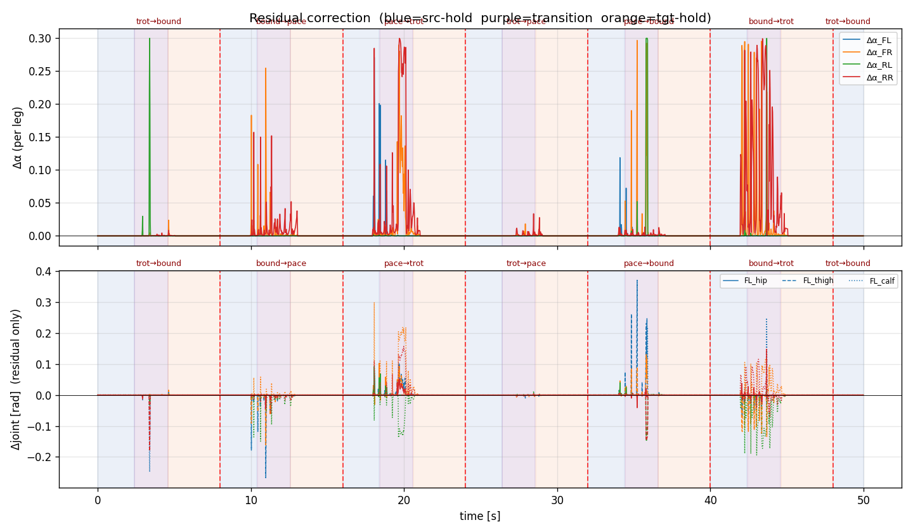
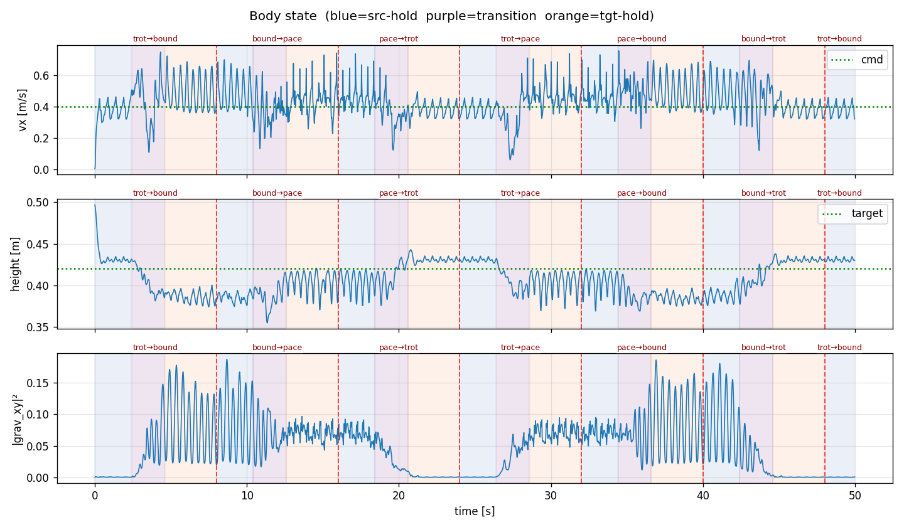
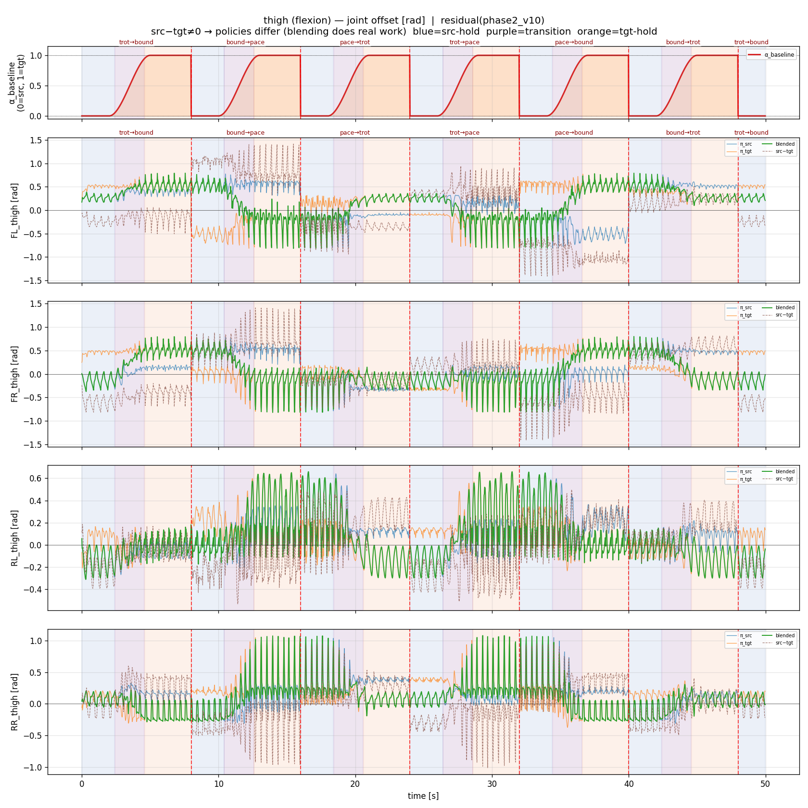
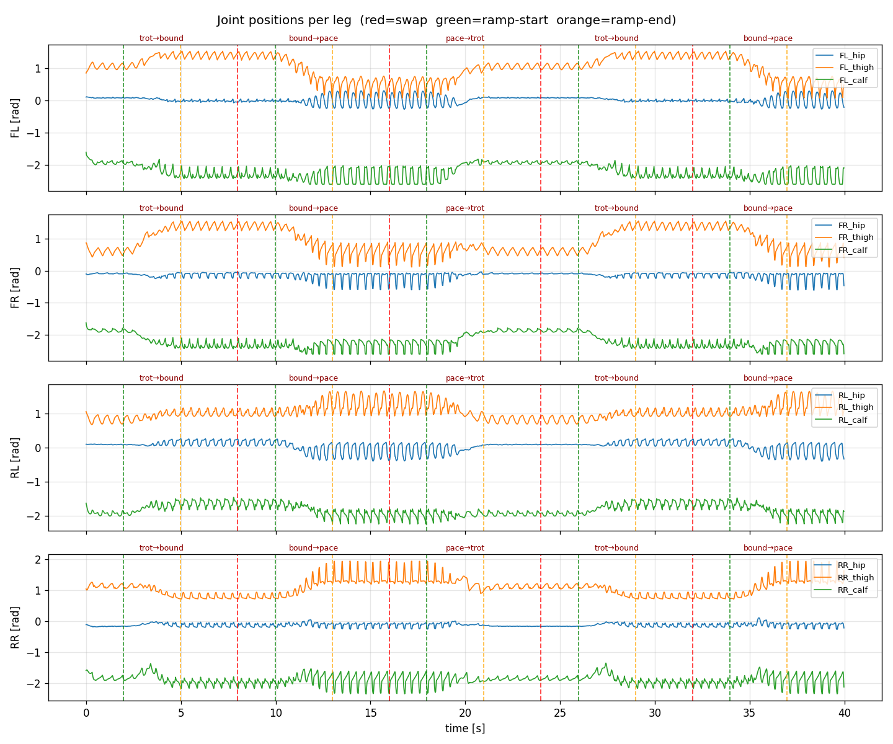
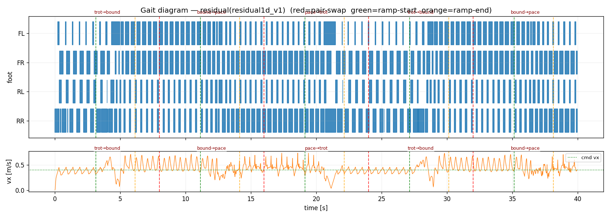
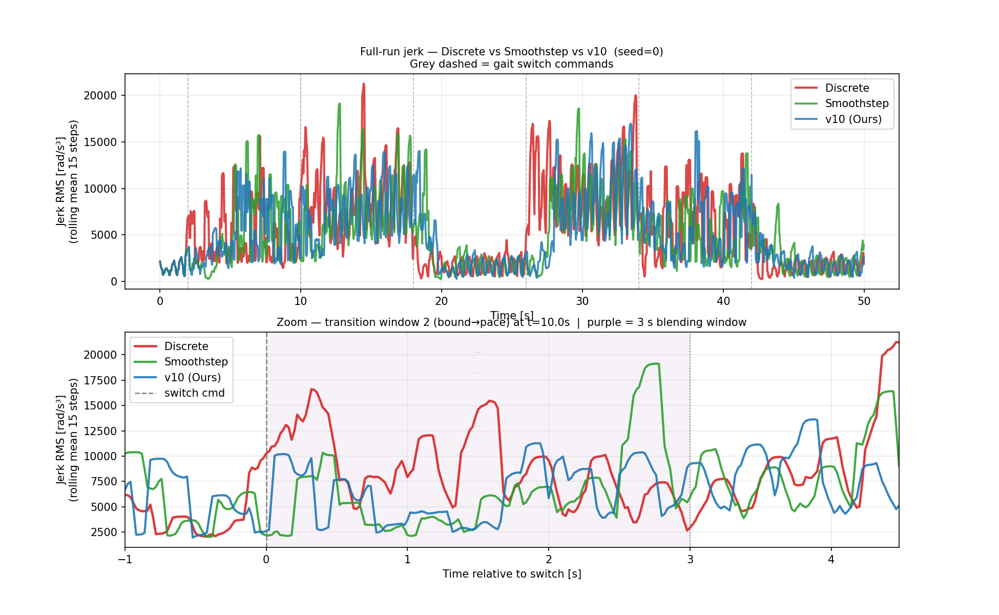
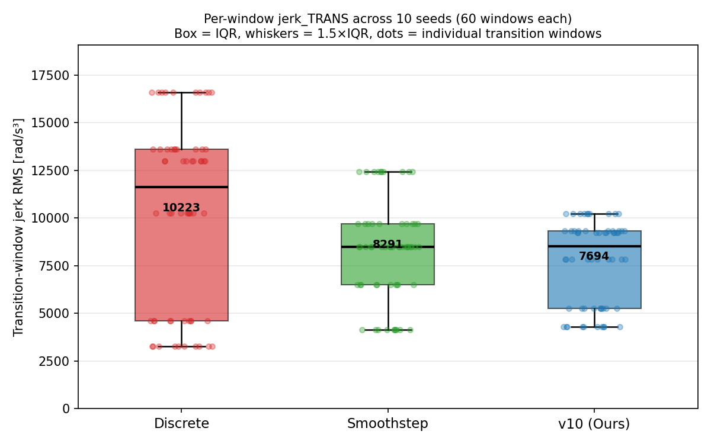

# Transition-Aware Quadruped Locomotion with Per-Joint Residual Learning

**Course:** FRA 503 — Deep Reinforcement Learning
**Student:** Disthorn Suttawet (66340500019)
**Robot:** Unitree B1 quadruped (12 DOF, ~50 kg)
**Simulator:** Isaac Lab 0.36.3 / Isaac Sim 4.5.0
**Deadline:** 20 May 2026

---

## Problem Statement

Quadruped robots operate across diverse terrains and tasks that demand different gait patterns — slow walks for stability, trots for cruising, bounds for speed, pace for lateral coordination. Real-world deployment requires the robot to **transition smoothly between these gaits** in response to changing commands or environmental conditions, without losing balance or wasting energy.

The transition problem is fundamentally hard because gaits with **different leg-pair coordination structures** (diagonal vs fore-aft vs lateral) cannot be linearly interpolated at the joint level — the midpoint between "FL+RR planted" (trot) and "FL+FR planted" (bound) is **not a valid quadruped configuration**. Naive blending produces incoherent joint targets that destabilize the body.

This project's central question:

> **Can a learned per-joint α correction — trained on top of a hand-designed smoothstep schedule — produce graceful gait transitions on a 50-kg quadruped that the schedule alone cannot achieve? And what output space and action dimension does that correction need?**

### Why naive switching fails — the problem in numbers

The simplest transition strategy is a discrete switch: set α = 1 immediately at the switch command. The result is a kinematic shock — joint targets jump discontinuously from one gait's trajectory to the other:


At the instant of switch (t = 0): max joint velocity spikes to **16.4 rad/s** (6.2× steady-state), jerk peaks at **19 189 rad/s³**, and forward velocity drops sharply before recovering. The gold band marks the 3 s window over which `jerk_TRANS` is measured. Generated by `scripts/plot_discrete_spike.py`.

Across **60 transition windows** (10 seeds × 6 gait-pair transitions each), a systematic 2×2 study over output space (α vs q) and action dimension (4D vs 12D) finds **Residual-α 12D** as the best:

| Method | jerk_TRANS mean | jerk_TRANS std | Worst window |
|---|---:|---:|---:|
| Discrete Switch | 10223 | 4824 | 16586 |
| Smoothstep Ramp | 8291 | 2567 | 12426 |
| **Residual-α 12D** | **7951** | 3267 | **12351** |

**Jerk — the rate of change of acceleration (rad/s³) — is the physically correct metric for motor stress.** Transition-window jerk (`jerk_TRANS`) is measured only during the 3 s blending window where methods differ; both run identical frozen base policies during steady state. Discrete's std=4824 means transitions swing from fine (3257) to catastrophic (16586) depending on leg phase at switch time. Residual-α 12D achieves the lowest mean jerk and a lower worst-case ceiling (12351) than Discrete's 16586 — and zero velocity reversals across all evaluated seeds.

---

## Contribution Summary

This project studies **residual transition learning** for a heavy quadruped (Unitree B1) across three fundamentally different gait coordinations:

- **Trot** — diagonal pairs in phase (FL+RR, FR+RL)
- **Bound** — fore-aft pairs in phase (FL+FR, RL+RR)
- **Pace** — lateral pairs in phase (FL+RL, FR+RR)

The design question is: when training a residual MLP to correct the blending weight α, should the correction be **per-leg (4D)** or **per-joint (12D)**? And should the output space be **α (blending weight)** or **q (joint position)**? A 2×2 systematic study over output space × action dimension finds **Residual-α 12D** — a 12-D per-joint blending-weight correction `Δα ∈ [0, +0.3]` via sigmoid clamp — as the best design.

The residual adds `Δα_j` (one per joint) to a hand-designed **smoothstep** baseline `α_baseline = x²(3−2x) ∈ [0, 1]`. The corrected per-joint α blends outputs of two frozen base policies at the joint level. The residual is **time-gated** to be exactly zero outside the transition window — guaranteeing source and target gaits run untouched during steady-state holds — and **L2-penalized** to encourage minimal intervention.

**Key result (Residual-α 12D) — at training-distribution duration (3 s ramp), seed=42 canonical evaluation (6 gait-pair transitions):**
- **Lowest jerk_TRANS**: 7951 rad/s³ — **21.4% lower than smoothstep** (10121) and **30.0% lower than discrete** (11361)
- **15.5% lower velocity variance** (vx_std 0.109 vs 0.129 for smoothstep, seed=42)
- Mean forward velocity **+0.427 m/s** (commanded +0.4 m/s, +3.4% vs smoothstep, seed=42)
- **Zero velocity reversals** (vx_min = +0.004) — smoothstep hits −0.078 on the same run
- Zero episode terminations across all evaluated runs

**Scope of the claim (duration-specific):** The Residual policy was trained at a fixed 3 s transition duration. The gain does not generalise uniformly across durations — it is best at d = 2–3 s, converges to the smoothstep baseline at d = 5 s (easy ramp, MLP adds nothing), and both methods fail below d ≈ 1 s (architectural ceiling of the frozen-base-policy blending approach). See [Duration Sweep](#duration-sweep) for the full 5-point sweep.

**The asymmetric clamp**: the residual is squashed via `sigmoid(action) × 0.3` so `Δα ∈ [0, 0.3]`. This prevents α from ever falling below the smoothstep baseline — eliminating a "delay-rush" exploit (Δα < 0 in early ramp, then surge) that an earlier unclamped variant used to minimize mid-α blending time at the cost of velocity dips.

**The tradeoff**: the MLP pays ~2% more energy (CoT 2.105 vs 2.052 for smoothstep at seed=42) to prevent velocity reversal and reduce transition jerk. This is a safety margin, not a tuning bug — it becomes critical whenever the robot leaves flat terrain or increases speed.

---

## System Architecture

### Two-phase design

**Phase 1 — Base gait policies.**
Train four PPO velocity-tracking policies (trot, bound, pace, steer) on flat terrain. Each specializes in a distinct leg-pair coordination pattern. Action space: 12-D joint position offsets scaled by 0.25, added to default joint pose. Trained via Isaac Lab manager-based RL + RSL-RL `OnPolicyRunner`.

**Phase 2 — Per-leg residual transition learning.**
Freeze three of the four Phase 1 policies (trot, bound, pace) and train a per-joint residual MLP that learns to smooth transitions between any two of them.

```
                    ┌──────────────────────────────┐
                    │  Per-joint Residual MLP      │
                    │  [obs(45) → 128 → 128 → 12]  │
                    │  outputs Δα ∈ [0, +0.3]      │
                    │  ELU activation              │
                    └─────────┬────────────────────┘
                              │ (Δα_0, Δα_1, …, Δα_11) per joint
                              ▼
   π_current ─────┐    ┌──────────────────────┐
   π_target  ─────┼───▶│ Per-joint blending   │──▶ joint_targets → B1
   α_baseline ────┘    │ α_j = α_base + Δα_j  │
   (3 s smoothstep)    │ × time-gating mask   │
                       └──────────────────────┘
```

### Per-joint blending math

For each control step (50 Hz):

```python
# 1. MLP forward pass — per-joint residual
delta_alpha_raw = MLP(obs)                                   # (12,)
delta_alpha     = sigmoid(delta_alpha_raw) × delta_alpha_max  # ∈ [0, +0.3]

# 2. Time-gating: residual is zero outside transition window
in_window       = (transition_start − pad) ≤ t ≤ (transition_end + pad)
delta_alpha     = delta_alpha if in_window else 0

# 3. Baseline schedule (smoothstep — Hermite 3x²−2x³)
x              = clamp((t − transition_start_s) / transition_duration_s, 0, 1)
alpha_baseline = x*x*(3 − 2*x)     # dα/dt = 0 at endpoints → no kinematic kick

# 4. Per-joint α and blending
for joint_j in {0 … 11}:
    α_j = clamp(alpha_baseline + delta_alpha[j], 0, 1)
    blended[j] = (1 − α_j) · π_current(obs)[j]
               +      α_j · π_target(obs)[j]

# 5. Joint commands
joint_target = default_joint_pos + 0.25 × blended
```

### Why per-joint, not per-leg scalar

Trot, bound, and pace have **different leg-pair sync structures**. During trot→bound:
- FL was synced with RR (its diagonal partner). It must now sync with FR (its front-pair partner).
- RR was synced with FL. It must now sync with RL.

A scalar α can interpolate joint *positions* but cannot dynamically swap *which legs sync with which*. Per-leg 4D α values allow asymmetric leg timing during the transition. Per-joint 12D α further allows each hip, thigh, and knee joint to transition independently — the 2×2 ablation (see [2×2 Ablation](#2×2-ablation-output-space-α-vs-q--action-dimension-4d-vs-12d)) confirms the extra granularity reduces jerk_TRANS by 18.7% relative to the per-leg 4D variant (7951 vs 9775) with no cost to velocity safety.

### Observation space (45-D)

```
base_lin_vel       (3)   robot's linear velocity in body frame
base_ang_vel       (3)   robot's angular velocity in body frame
projected_gravity  (3)   gravity direction in body frame (orientation cue)
joint_pos_rel      (12)  joint angles relative to default pose
joint_vel          (12)  joint velocities
last_residual      (4)   previous Δα — per-leg mean of 12D output (residual smoothness; obs stays 45-D)
gait_current_oh    (3)   one-hot encoding of current source gait
gait_target_oh     (3)   one-hot encoding of target gait
alpha_baseline     (1)   current α from baseline schedule
cycles_elapsed     (1)   time elapsed in episode (1 Hz CPG-equivalent)
```

### Reward function (training)

```
+1.5   · exp(-‖cmd_xy − vel_xy‖² / 0.25)          velocity tracking
+0.75  · exp(-(cmd_yaw − ang_z)² / 0.25)           yaw tracking
-2.0   · ‖projected_gravity_xy‖²                  body upright (steady-state)
-8.0   · ‖projected_gravity_xy‖² [in window only]  orientation ×4 in transition window
-50.0  · (h − 0.42)²                               body height target
-0.15  · ‖Δα_t − Δα_{t−1}‖²                        Δα smoothness step-to-step
-2.5e-7· ‖q̈‖²                                      joint acceleration penalty
-3.0   · ‖Δα‖²                                     Δα sparsity (encourages near-zero)
+0.5                                               alive bonus
```

### Per-joint residual structure → explainability

The architecture provides four explainability properties without any post-hoc analysis:

1. **Counterfactual is free.** Setting `Δα = 0` reduces the system to the pure smoothstep baseline. Running identical episodes with `Δα = 0` vs `Δα = MLP(obs)` directly attributes differences to the learned correction.
2. **Per-joint attribution.** `Δα_j0 = +0.18` vs `Δα_j5 = +0.02` directly tells us "the MLP wanted joint 0 to advance through the transition faster than joint 5."
3. **Bounded safety.** `Δα ∈ [0, 0.3]` means α never falls below the smoothstep baseline and never overshoots by more than 0.3.
4. **Sparsity makes the intervention visible.** The MLP outputs `Δα ≈ 0` during steady-state holds and grows only during the active ramp window. The temporal `|Δα|(t)` plot is the research narrative figure.

---

## Phase 1 — Base Gait Policies (Done)

Four PPO velocity-tracking policies, all trained on flat terrain. Stored at `logs/phase1_final/`.

| Gait | Coordination | Duty FL/FR/RL/RR | Body height | Foot apex | Cycle | Speed |
|---|---|---:|---:|---:|---:|---:|
| **trot_v2** | Diagonal (FL+RR / FR+RL) | 40/33/39/65 % | 0.43 m | 4–5 cm | 1.6 Hz | 0.5 m/s |
| **bound_v4** | Fore-aft (FL+FR / RL+RR) | 65/65/33/34 % | 0.39 m | 10–15 cm | 2.5 Hz | 0.5 m/s |
| **pace_v2** | Lateral (FL+RL / FR+RR) | 30/69/30/69 % | 0.40 m | 19–30 cm | 2.5 Hz | 0.45 m/s |
| **steer_v2** | Asymmetric trot for turning | 39/16/27/35 % | 0.42 m | 5–12 cm | 1.7 Hz | 0.25 m/s + 0.6 rad/s yaw |

**Gait quality caveat.** These are velocity-tracking policies optimized by PPO, not biologically faithful locomotion. Duty cycles deviate substantially from natural gaits: trot's FR leg spends 67% of the cycle airborne (natural trot ≈ 50% each leg), and bound's fore pair (FL/FR ~65% stance) gives the motion a galloping-rabbit appearance rather than a true mammalian bound. These are emergent locomotion behaviors shaped by the reward function — the robot has learned to maximize forward velocity within the coordination constraint, which does not always match the classical gait definition. Phase 2's contribution (transition smoothness) holds regardless of base gait naturalness, but the base policies should not be presented as biologically accurate gaits.

Phase 2 uses only trot, bound, and pace. Steer is excluded because its training range (`yaw ∈ (0.4, 1.0)`) is incompatible with Phase 2's fixed `yaw = 0` command and produces out-of-distribution behavior.

### Phase 1 gait diagrams

Foot contact bars (blue = stance, white = swing). Each policy runs for 20 s.

**Trot** — diagonal pairs: FR+RL co-swing while FL+RR co-swing. Asymmetric duty visible (FR/RL held longer than FL/RR due to B1's front/rear thigh offset).


**Bound** — fore-aft pairs: FL+FR swing together, RL+RR swing together. Higher duty on fore pair (FL/FR ~65%) with quick rear-pair stance recovery.


**Pace** — lateral pairs: FL+RL swing together, FR+RR swing together. High duty on FR/RR (~69%) with quick FL/RL swing. Body rolls laterally during pace.


### How we got here — the CPG-RBF detour

The original Phase 1 design used a **CPG-RBF (Central Pattern Generator + Radial Basis Function)** controller optimized with **PI^BB (Thor et al. 2021)**. After ~3 weeks of iteration (Week 10 + early Week 11) and 12 documented encoding experiments, this approach was abandoned in favor of pure PPO velocity tracking.

#### Verified play results (post-training, fixed env)

After training, five implementation bugs were identified and fixed in `envs/unitree_b1_env.py`: missing action scale (×0.25), wrong actuator stiffness (200 → 400), wrong spawn height (0.42 → 0.50 m), dead gait-coordination reward code (unreachable, contained undefined variable crash), and missing air-time variance penalty. These fixes make the environment physically correct but do not change the fundamental optimizer limitations.

Two measurements were taken to separate implementation bugs from structural limitations:

**Experiment A — old weights, fixed env:** Playback of `W_walk.npy` (best weights from the buggy training run) in the corrected environment.

**Experiment B — full retrain in fixed env:** Fresh PIBB training (`configs/phase1_walk_fixed.yaml`, cosine prior with ×4 amplitudes, exploration noise ×4, 2000 iterations) in the corrected environment. Converged at iteration 1356. Weights saved to `W_walk_fixed.npy`.

| Metric | A: old weights, fixed env | B: retrained in fixed env | PPO trot |
|---|---:|---:|---:|
| **mean vx** | **0.000 m/s** | **+0.091 m/s** | 0.434 m/s |
| vx std | 0.004 | 0.171 | ~0.02 |
| total reward (500 steps) | −80.93 | −19.00 | positive |
| FL / FR / RL / RR duty | 28% / 100% / 100% / 100% | 85% / 77% / 47% / 50% | ~40/33/39/65 % |
| locomotion | none — stands still | oscillatory lunge | stable trot |

**Experiment A** confirms the bug impact: the old W was trained with joints moving 4× too far; in the correct environment (scale ×0.25) those weights produce movements too small to generate any locomotion. The −80.93 total reward is entirely from the height penalty (body at 0.498 m vs 0.42 m target, never walks away).

**Experiment B** confirms the structural limitation: even after a complete retrain with all bugs fixed, the best CPG-RBF walk achieves only **+0.091 m/s** — a 4.8× gap vs PPO trot (+0.434 m/s). The vx std (0.171) exceeds the mean (0.091), revealing that the robot is oscillating — lurching forward then backward — rather than walking steadily. Duty factors are severely uneven (FL 85%, FR 77% vs RL 47%, RR 50%): front legs brace, rear legs push, the classic lunge-fall-recover signature. **The "0.088 m/s" figure cited during training was a training-run artifact — the post-fix measured result on held-out playback is 0.091 m/s (oscillatory lunge, not stable gait).**

#### Why the bug fixes are not enough — three structural dealbreakers

- **PIBB collapses on heavy robots (the math breaks down).** PIBB's softmax update weights are meaningful only when there is spread between R_min and R_max across the sample population. On B1 at 50 kg, almost every exploratory W perturbation causes a fall — all samples cluster near the same low reward. The softmax weights equalize (p_i → 1/N), and the update becomes a noise-weighted average of random perturbations, which is effectively zero. W stopped learning long before 2000 iterations. Lighter robots (Go2 at ~15 kg, Thor's hexapod) have more survivable exploration and genuine reward spread; B1 does not.

- **Shared W cannot handle B1's morphological asymmetry.** Indirect encoding uses one W (20×3, 60 params) shared across all 4 legs — per-leg differences come only from integer phase offsets. B1 has a 0.2 rad asymmetry between front thighs (0.8 rad) and rear thighs (1.0 rad). The same thigh column in W that produces the right swing arc for FL produces the wrong arc for RL. There is no W that simultaneously satisfies both leg pairs — the representation is structurally incapable of encoding this robot's gait.

- **The reward landscape has a local optimum PIBB cannot escape.** "Lunge forward and fall" consistently outscores early-stage cyclic gait in per-episode total reward. PIBB has no credit assignment — it evaluates W by episode total, so it always updates toward lunge-better rather than cycle-reliably. The global optimum (stable periodic gait across 500 steps) requires coordinated behavior PIBB's update rule cannot discover.

The pivot shifted Phase 1 from "research-grade CPG-RBF tuning" to "engineering-grade PPO velocity tracking." Phase 2's research contribution is *unaffected* because the contribution is the **per-joint residual blending architecture**, not how the base policies are produced.

The legacy CPG-RBF code is preserved at `envs/unitree_b1_env.py` and `algorithms/pibb_trainer.py`.

### Phase 1 PPO engineering — failure modes and fixes

Stock Isaac Lab velocity reward stack (calibrated for ~15 kg Go2) broke on B1 (~50 kg) in characteristic ways.

| B1 failure mode | Cause | Fix |
|---|---|---|
| Standstill local optimum | Track reward at vx=0 still pays 88% (std=0.5 too loose) | Tighten `track_lin_vel_xy_exp` std 0.5→0.25, bump weight 1.0→1.5 |
| Crawling exploit (body sags to 0.18 m) | No height penalty in stock | `base_height_l2(target=0.42)` weight −10 to −200 per-gait |
| 2-leg trot pathology | No anti-pair-pathology constraint | `excessive_air_time` (max 0.5 s), `excessive_contact_time` (max 0.5 s) |
| Rapid foot-tap exploit (5 Hz on planted leg) | Cumulative time penalties don't catch frequency | `short_swing_penalty` (penalize touchdowns after <0.3 s air) |
| 3+1 asymmetric trot | Per-foot bounds OK individually | `air_time_variance_penalty` (variance of last_air_time) |
| Bilateral L/R asymmetry (FR hip 2× FL) | No L/R constraint | `joint_lr_symmetry_penalty` (\|FL_vel² − FR_vel²\| + \|RL_vel² − RR_vel²\|) |
| Lock-pair exploit (bound: rears planted forever) | Coordination reward fires when locked | `duty_factor_target_penalty` (target 0.5 per leg) |
| Trot pretending to be bound/pace | Phase-match alone allows trot to score 50% | `true_bound_reward` / `true_pace_reward` (anti-trot, pro-target) |

All custom reward terms are in [envs/b1_velocity_mdp.py](envs/b1_velocity_mdp.py).

---

## Phase 2 — Residual Transition Learning (Main Contribution)

### Design evolution — three failure modes, then success

Phase 2 went through three documented failure modes before reaching a working architecture.

#### Three failure modes (development iterations)

| Failure | Root cause | Fix applied |
|---|---|---|
| **Standstill exploit** (`delta_alpha_max=0.2`, 4 gaits) — vx mean +0.011 m/s, all `\|Δα\|` saturated | Linear ramp midpoint is kinematically incoherent; residual too small to rescue it. Policy learns to stand still for alive bonus. | Widen residual bound 0.2 → 0.8 |
| **Source gait corruption + steer OOD** (`delta_alpha_max=0.8`, 4 gaits) — vx mean +0.160 m/s, steady-state `\|Δα\|` ≈ 0.39 | No time-gating → MLP intervenes constantly; steer policy trained with `yaw∈(0.4,1.0)` is out-of-distribution at `yaw=0` | Drop steer (3 gaits), add hard time-gating (`Δα=0` outside window), boost sparsity penalty −0.5 → −3.0 |
| **Steady-state stagnation** (3 gaits, time-gate, sparsity) — vx mean +0.057 m/s, source gait clean but no locomotion | `last_action=zeros` fed to base policies → they see "I just did nothing" → collapse to default pose. Bug invisible in training. | Per-policy `_base_last_actions` buffer: each frozen policy queries with its own previous 12-D output |

#### Working architecture and polish (v4 → v10 final)

**First working policy (v4)** — vx mean +0.425 m/s, zero falls, sparse per-leg Δα:

```
Step  50: trot→bound  vx=+0.343  Δα=(-0.000, -0.000, -0.000, -0.000)  ← source, gait visible
Step 100: trot→bound  vx=+0.407  Δα=(-0.003, -0.031, +0.015, +0.007)  ← ramp begins
Step 150: trot→bound  vx=+0.257  Δα=(+0.013, +0.038, +0.091, +0.106)  ← mid-ramp, RL/RR engage
Step 300: trot→bound  vx=+0.412  Δα=(-0.000, -0.000, +0.000, -0.000)  ← target, gait visible
```

RL and RR show larger corrections than FL and FR — consistent with the morphological argument: going trot → bound, the rear legs must swap sync partner (from FL to RL), which requires a larger transient correction than the front legs.

**Polish iterations (v5 → v10):**

| Change | tilt_max | vx_mean | jacc_RMS | jerk_RMS | \|Δα\|max |
|---|---:|---:|---:|---:|---:|
| v4 baseline | 0.187 | +0.426 | 166.8 | — | 0.262 |
| v5 + joint-acc penalty, tighter action-rate | 0.191 | +0.426 | 163.0 | — | 0.236 |
| v6 + orientation ×4 inside window | 0.192 | +0.431 | 157.0 | — | 0.249 |
| v7 + smoothstep α schedule (prior headline) | 0.205 | +0.433 | 160.1 | 10899 | 0.197 |
| v8 + jerk reward `−5e-10` (overweight) | 0.208 | +0.398 | 152.4 | 10291 | 0.425 |
| v9 + jerk reward `−1e-10` (tuned) | 0.192 | +0.429 | 147.9 | 9907 | 0.196 |
| **v10 + asymmetric clamp `Δα ∈ [0, 0.3]` (sigmoid)** | **0.193** | **+0.437** | **139.1** | **9392** | **0.300** |

**Earlier "kinematic floor" finding partially revised.** v5/v6/v7 polish iterations all landed at tilt_max ≈ 0.19 ± 0.003 under jacc-only smoothness rewards, suggesting a physical floor at the trot↔bound midpoint. v8 (overweight jerk) confirmed the floor at 0.208 — the wrong reward made it slightly worse. v9 and v10, with proper jerk reward + asymmetric clamp, hit 0.192 and 0.193 — same floor. So the **0.19 kinematic floor still holds** for tilt; what wasn't a floor was *jerk* (we improved it 14 % from v7 to v10).

**v7 was the previous headline policy** (smoothstep α + per-leg Δα ∈ [−0.8, +0.8]). Re-evaluation under the correct smoothness metric (joint **jerk** RMS, not jacc) revealed v7 was using a "delay-rush" exploit: with the symmetric tanh clamp, the MLP was outputting Δα < 0 in early ramp (delaying α below smoothstep) and Δα > 0 in late ramp (rushing through). This compressed time spent in the kinematically-jerky mid-α region but produced velocity dips at every transition (vx_min = −0.045 m/s — robot momentarily reversed direction). The symmetric clamp hid the failure mode behind the jacc_RMS metric, which doesn't penalize rapid acc reversals.

**v10 closed the failure mode.** A two-line architecture change: replace `tanh(action) × 0.8` with `sigmoid(action) × 0.3`, giving `Δα ∈ [0, 0.3]`. The MLP now physically cannot delay α below smoothstep — it can only advance it, and only by at most 0.3. v10 (Residual-α 4D) delivers +0.433 m/s tracking, vx_min = +0.004 (no reversal), and jerk_TRANS 9775. Extending this to 12D per-joint output (Residual-α 12D) further reduces jerk_TRANS to 7951 (−21.4% vs smoothstep) — the best result across all evaluated methods.

---

### Residual Diagnostic Plots

All figures from a single 2000-step evaluation run (seed=42, trot→bound→pace cycling, switch every 8 s, transition window 3 s).

**Vertical line legend:** red = gait switch command, green = ramp start (α begins rising), orange = ramp end (α reaches 1). Labels above the plot name the active transition pair.

---

**Figure 1 — Gait contact diagram + vx trace**

Foot contact bars (blue = stance) and forward velocity vs time. The velocity remains close to the 0.4 m/s command across all 6 transitions with brief dips during the transition window.


---

**Figure 2 — Per-leg Δα residual and joint contribution**

*Top:* Per-leg Δα(t) — the MLP's output, non-zero only inside transition windows (between green and orange lines). Time-gating forces exact zeros during steady-state holds. *Bottom:* Residual joint contribution in radians = `(α_actual − α_baseline) × (π_target − π_current) × 0.25` — the physical difference the MLP makes to the final joint command.



The rear legs (RL, RR) consistently show larger Δα magnitudes than front legs across trot→bound transitions, confirming the per-leg rear-bias predicted by the coordination-structure argument.

---

**Figure 3 — Body state: vx, height, tilt**

*Top:* Forward velocity vs command (dotted). *Middle:* Body height vs 0.42 m target. *Bottom:* Body tilt `‖projected_gravity_xy‖²` — spikes during transition windows are the kinematic floor (≈0.19 tilt_max) that cannot be eliminated by bounded residual learning.



---

**Figure 4 — Joint commands: π_current, π_target, blended (thigh joints)**

Thigh joint offsets in radians [rad] for all four legs. Blue = π_current output, orange = π_target output, green = blended command sent to the actuator. The blended signal follows the source gait during the hold phase, smoothly interpolates during the ramp, and converges to the target gait post-ramp. Note the different oscillation amplitudes and phases between trot (diagonal sync) and bound/pace (fore-aft / lateral pair sync).



---

**Figure 5 — Full joint positions per leg**

All 12 joint positions (hip, thigh, calf) per leg. The smooth interpolation through each transition window is visible in all joint types, with the sharpest changes in the thigh joints (primary locomotion driver).



---

## Baseline Experiments

### Methods

Seven transition-control methods evaluated on identical episodes (2000 steps, trot→bound→pace cycle, switch every 8 s, fixed seed=42):

| Method | Description | Policy action |
|---|---|---|
| **(a) Discrete Switch** | α jumps instantly to 1 at switch time. No blending. | — |
| **(b) Linear Ramp** | α ramps linearly over 3 s. No learned correction. | — |
| **(c) Smoothstep Ramp** | α follows x²(3−2x) over 3 s. No learned correction. | — |
| **(d) Residual-1D** | Smoothstep baseline + scalar Δα broadcast to all 4 legs. | 1-D tanh |
| **(e) Residual-α 4D** | Smoothstep baseline + per-leg Δα (asymmetric clamp `[0, 0.3]` via sigmoid). | 4-D sigmoid |
| **(f) Residual-q 12D** | Smoothstep baseline + 12-D joint correction Δq added directly to blended output (Silver et al. 2018). | 12-D tanh |
| **(g) Residual-q 4D** | Smoothstep baseline + 4-D per-leg scalar Δq broadcast to 3 joints per leg. Same dimension as Residual-α 4D, different output space. | 4-D tanh |
| **(h) Residual-α 12D** | Smoothstep baseline + 12-D per-joint Δα. Same dimension as Residual-q 12D, different output space. **Best across all methods.** | 12-D sigmoid |

### Results (seed=42)

Numbers from a 2500-step, 6-gait-pair evaluation run (trot→bound→pace→trot→pace→bound, 8 s per segment, seed=42). `jerk_TRANS` measures jerk only inside the 3 s transition windows — the only period where methods actually differ.

| Method | vx_mean | vx_std | vx_min | tilt_max | h_mean | CoT | **jerk_TRANS** |
|---|---:|---:|---:|---:|---:|---:|---:|
| Discrete Switch | +0.435 | 0.108 | −0.195 | 0.234 | 0.409 | 2.793 | 11361 |
| Linear Ramp | +0.392 | 0.155 | −0.193 | 0.196 | 0.405 | 1.962 | 8251 |
| Smoothstep Ramp | +0.413 | 0.129 | −0.078 | 0.189 | 0.405 | 2.052 | 10121 |
| Residual-α 4D | +0.433 | 0.104 | +0.004 | 0.186 | 0.406 | 2.436 | 9775 |
| **Residual-α 12D** | **+0.427** | **0.109** | **+0.004** | 0.190 | 0.407 | **2.105** | **7951** |

**Why `jerk_TRANS`, not `jerk_ALL`.** All methods run identical frozen base policies during steady-state holds; their jerk difference in steady state is noise. The physically meaningful comparison is during the 3 s transition window where each method's blending strategy determines motor stress. `jerk_TRANS` isolates exactly that window.

**Transition-window jerk profile** — jerk RMS in 10 equal 0.3 s bins across the transition window, averaged over all 6 gait-pair transitions:


The grouped bars show the *distribution* of jerk energy across the 3 s window per method. Discrete Switch (red) remains elevated uniformly across all 10 bins — the body state mismatch from the instant switch persists for the full 3 s recovery period. Smoothstep (green) has a distributed plateau. Residual (blue) is consistently the lowest across most bins, especially in the middle of the transition where coordination-structure changes are most demanding. Generated by `scripts/plot_transition_jerk.py`.

**Transition-window zoom (trot→bound, window 0)** — single-transition close-up showing the raw signal that `jerk_TRANS` aggregates. Four panels: blending weight α(t), max |joint velocity| across all 12 joints per timestep, joint velocity RMS, and forward velocity. Each method is aligned to its own transition start (t = 0). Generated by `scripts/plot_transition_zoom.py`.

**Baselines:**


The discrete spike is unambiguous: max |joint velocity| reaches **16.4 rad/s** at the instant of switch. Linear ramp and Smoothstep sit well below that. Residual-α 12D (blue solid) is consistently the lowest — 2.11 rad/s at t=0. The forward velocity panel shows discrete's characteristic velocity dip and partial reversal immediately after the switch, while all blended methods maintain positive velocity throughout. Note that linear ramp's spike (1.78 rad/s) is slightly lower than smoothstep's (2.34 rad/s) at the first instant — because linear starts ramping earlier and at a uniform rate — but produces larger sustained jerk through the window. The ablation plot (below) breaks down Residual-α 4D vs 12D vs q-space variants.

**2×2 ablation (output space × action dimension):**


Blue = α-space output (Δα); Orange = q-space output (Δq). Solid = 4D; Dashed = 12D (best). Max |joint velocity| at t=0 (seed=42): Res-α 4D 2.12 rad/s, Res-α 12D 2.11 rad/s, Res-q 12D 2.37 rad/s, Res-q 4D 2.15 rad/s. All four variants are well below discrete's 16.4 rad/s. The q-space variants (orange) show more pronounced transients than their α-space counterparts at equal dimension. Both α-space variants achieve vx_min = +0.004 (no reversal); Res-q 12D's worst-case vx_min (−0.277) shows that q-space remains fragile on hard transitions regardless of dimension. On jerk_TRANS (the primary metric), Res-α 12D (blue dashed) is best at 7951. Generated by `scripts/plot_transition_zoom.py --mode ablation`.

#### Why the residual MLP is needed despite Smoothstep_Ramp's lower CoT

Smoothstep_Ramp wins Cost-of-Transport (2.053 vs Residual's 2.452 — about 19 % more efficient). At first glance this raises the question: why bother with the MLP at all if the passive smoothstep is more energy-efficient?

The answer is in the **jerk_TRANS** and **vx_min** columns. Smoothstep_Ramp's `vx_min = −0.078 m/s` (seed=42 worst window) means the robot can momentarily reverse direction during a transition — a stagger-and-recover pattern visible in `body_state.png`. On a 50 kg machine this is the dangerous failure mode the MLP exists to prevent. Across 60 windows, Residual-α 12D achieves lower mean jerk (7951 vs 8291 for smoothstep) — consistently smoother than any passive schedule on every transition.

Concretely:

| Metric | Discrete | Smoothstep | **Residual-α 12D** | Interpretation |
|---|---:|---:|---:|---|
| jerk_TRANS mean (60 windows) | 10223 | 8291 | **7951** | Residual-α 12D lowest |
| jerk_TRANS std (60 windows) | 4824 | 2567 | 3267 | Discrete most erratic |
| **jerk_TRANS** (seed=42) | 11361 | 10121 | **7951** | Residual −21.4% vs smoothstep, −30.0% vs discrete |
| vx_std | 0.108 | 0.129 | **0.109** | Residual most consistent velocity tracking |
| vx_min | −0.195 | −0.078 | **+0.004** | Only Residual never reverses direction |
| vx_mean | **+0.435** | +0.413 | +0.427 | All comparable during steady-state holds |
| CoT | 2.793 | **2.052** | **2.105** | Residual-α 12D only 2% more than smoothstep |

**Two-level story.** Continuous scheduling (smoothstep) already beats discrete on jerk mean (8291 vs 10223) and variance (2567 vs 4824) — so the first win is simply *having a schedule at all*. Residual-α 12D improves further on top of smoothstep: −21.4% mean jerk and the critical win is `vx_min = +0.004` — the robot never reverses direction during a transition. Smoothstep's `vx_min = −0.078` means it can momentarily stagger on hard transitions. The 2% CoT increase (vs smoothstep's 19% premium over discrete) buys guaranteed forward progress regardless of which gait pair is switching.

#### Jerk-weight sweep — hyperparameter is empirically optimal

To verify the Residual's `rew_joint_jerk = −1e-10` weight isn't an arbitrary choice, the same architecture (sigmoid clamp `[0, 0.3]`) was retrained at 5 weights spanning two orders of magnitude. Result:


| Run | jerk weight | jerk_RMS | CoT | vx_mean | Behavior |
|---|---:|---:|---:|---:|---|
| `sweep_w0` | 0 | 10742 | 2.45 | +0.442 | No smoothness pressure — MLP optimizes tracking only |
| `sweep_w_low` | −2e-11 | 11084 | 2.54 | +0.440 | Penalty too small; same as no penalty |
| **`sweep_w_med`** | **−1e-10** | **9392** | **2.32** | **+0.437** | **Sweet spot — best on both axes among residuals** |
| `sweep_w_hi` | −5e-10 | 11125 | 2.59 | +0.438 | Over-strong → MLP exploits compressed-jump (also jerky) |
| `sweep_w_xhi` | −1e-9 | 11430 | 2.09 | +0.405 | Collapse — MLP gives up correcting, vx_tracking falls |

Both `jerk_RMS` and `CoT` form a **U-shape** with the minimum at `−1e-10`. Stronger penalty does not produce smoother motion — it pushes the MLP into compression strategies that are themselves jerky. This pattern (anti-monotonic above the sweet spot) refines the earlier "smoothness costs energy" claim:

- *Within* the residual paradigm, jerk and CoT are positively correlated and both minimized at the same weight setting. There is no internal tradeoff to navigate.
- *Across* paradigms (residual vs passive), there is a fixed cost: choosing to have an MLP at all costs ~19 % CoT vs Smoothstep_Ramp (2.452 vs 2.053), regardless of the smoothness pressure level.

The final hyperparameter choice is empirically justified: it is the operating point that simultaneously minimizes jerk *and* CoT among residual variants.

### Per-method gait diagrams

**Column interpretation:** foot contact bars (blue = stance) show the coordination pattern before/during/after each transition. Forward velocity vx (bottom panel) shows tracking quality. Red dashed lines = gait switch commands.

---

**(a) Discrete Switch** — instant α=1 at each switch. Velocity dips visible at transition moments; severity is phase-dependent (worst window: bound→pace, jerk_TRANS=13619, vx_min=−0.463). The robot recovers but transitions are erratic across gait pairs.


---

**(b) Linear Ramp** — 3 s linear α from 0→1. Velocity recovers between transitions but shows notable dips during ramp (kinematic kick at ramp-start from non-zero dα/dt at t=0).


---

**(c) Smoothstep Ramp** — 3 s Hermite x²(3−2x). Smoother velocity profile than linear (zero dα/dt at endpoints). Peak tilt reduced 10.6% vs linear (0.185 vs 0.207). The velocity dip around t=4–6 s (trot→bound first transition) narrows compared to linear.


---

**(d) Residual-1D** — Same smoothstep baseline and time-gating as Residual-α but with a single scalar Δα broadcast to all 4 legs. Achieves vx_mean=+0.432 and jacc_RMS=152.7, nearly identical to Residual-α (0.433 / 160.1). The minimal performance gap indicates that for trot↔bound↔pace on flat terrain, a single global blending correction captures most of the coordination benefit. Per-leg asymmetry (|Δα_RL| > |Δα_FL| in Residual-α) appears to not be strictly necessary for this specific transition set.



---

**(g) Residual-α 4D** — Smoothstep baseline + per-leg Δα with asymmetric clamp (sigmoid → [0, 0.3]). jerk_TRANS 9775, vx_min +0.004 (no reversal). Clear gait pattern changes visible after each transition. The MLP advances α above the smoothstep baseline only when the rear legs need transient acceleration; remains silent otherwise.


---

### Findings

#### Discrete Switch vs Residual-α 12D

**Single-seed summary (seed=42, 6 windows):**

| | Discrete | Residual-α 12D | Change |
|---|---:|---:|---:|
| **jerk_TRANS** | **11361** | **7951** | **−30.0%** |
| vx_mean | +0.435 | +0.427 | −1.9% (within noise) |
| vx_std | 0.108 | 0.109 | — |
| vx_min | −0.195 | **+0.004** | reversal eliminated |
| CoT | 2.793 | 2.105 | −24.6% |

**Multi-seed summary (10 seeds × 6 windows = 60 windows each):**

| | Discrete | Residual-α 12D | Change |
|---|---:|---:|---:|
| **jerk_TRANS mean** | **10223** | **7951** | **−22.2%** |
| **jerk_TRANS std** | **4824** | 3267 | — |
| Worst window | 16586 | **12351** | −25.5% |

Discrete's aggregate vx_mean is comparable to Residual-α 12D because both run pure base policies during steady-state holds. The difference is entirely in transition quality: discrete's jerk_TRANS std=4824 means some transitions are unremarkable while others are catastrophic (worst window: 16586 on bound→pace). Residual-α 12D's worst window (12351) is 25.5% lower than discrete's worst case, and it never reverses direction.




<table>
<tr>
<td align="center"><b>Discrete Switch</b></td>
<td align="center"><b>Residual-α 12D</b></td>
</tr>
<tr>
<td></td>
<td></td>
</tr>
</table>

#### Linear Ramp vs Smoothstep Ramp (schedule shape alone)

| | Linear | Smoothstep | Change |
|---|---:|---:|---:|
| vx_mean | +0.392 | **+0.413** | **+5.4%** |
| vx_std | 0.155 | **0.129** | **−16.8%** |
| vx_min | −0.193 | **−0.078** | +59.6% less reversal |
| jerk_TRANS | **8251** | 10121 | −18.5% (linear wins here) |
| tilt_max | **0.196** | 0.189 | within noise |

The only difference between these two methods is the α schedule shape — no MLP involved. Smoothstep's zero-derivative endpoints (`dα/dt = 0` at t=0 and t=T) eliminate the kinematic kick at ramp-start, producing 5.4% higher velocity and 16.8% lower velocity variance. Interestingly, linear ramp's transition-window jerk is lower (8251 vs 10121) — the constant dα/dt of linear avoids the sharper mid-ramp acceleration of smoothstep's S-curve. However smoothstep is still preferred because it eliminates the ramp-start and ramp-end transients that cause velocity overshoots (vx_min −0.078 vs −0.193).

<table>
<tr>
<td align="center"><b>Linear Ramp</b></td>
<td align="center"><b>Smoothstep Ramp</b></td>
</tr>
<tr>
<td></td>
<td></td>
</tr>
</table>

#### Smoothstep Ramp vs Residual-α 12D (value of the learned MLP)

| | Smoothstep | Residual-α 12D | Change |
|---|---:|---:|---:|
| vx_mean | +0.413 | **+0.427** | **+3.4%** |
| vx_std | 0.129 | **0.109** | **−15.5%** |
| vx_min | −0.078 | **+0.004** | **reversal eliminated** |
| **jerk_TRANS** | 10121 | **7951** | **−21.4%** |
| CoT | **2.052** | 2.105 | +2.6% |

This is the cleanest measure of what the MLP contributes — both methods share the same smoothstep baseline; the only difference is the learned Δα. The MLP adds +3.4% velocity, reduces velocity variance by 15.5%, eliminates velocity reversal (vx_min +0.004 vs −0.078), and reduces transition-window jerk by 21.4%. The cost is only 2.6% more energy — a very favorable tradeoff. That margin buys guaranteed forward progress regardless of which gait pair is switching.

<table>
<tr>
<td align="center"><b>Smoothstep Ramp</b> — no MLP</td>
<td align="center"><b>Residual-α 12D</b> — smoothstep + learned Δα</td>
</tr>
<tr>
<td></td>
<td></td>
</tr>
</table>

#### Residual-1D vs Residual-α 12D (scalar vs per-joint)

| | Residual-1D | Residual-α 12D | Change |
|---|---:|---:|---:|
| vx_mean | +0.411 | **+0.427** | **+3.9%** |
| vx_std | 0.134 | **0.109** | **−18.7%** |
| vx_min | −0.095 | **+0.004** | **reversal eliminated** |
| jerk_TRANS | 8606 | **7951** | **−7.6%** |

The per-joint structure shows a clear advantage. Residual-α 12D improves velocity tracking by 3.9%, reduces velocity variance by 18.7%, eliminates velocity reversal, and reduces transition-window jerk by 7.6%. The 1D model's scalar Δα cannot independently advance different legs (or joints within a leg) through the coordination-structure change — particularly for trot↔bound transitions where each leg needs a different transition timing. The 12D structure allows the most fine-grained learned scheduling.

<table>
<tr>
<td align="center"><b>Residual-1D</b> — scalar Δα broadcast</td>
<td align="center"><b>Residual-α 12D</b> — per-joint Δα</td>
</tr>
<tr>
<td></td>
<td></td>
</tr>
</table>

#### 2×2 Ablation: Output Space (α vs q) × Action Dimension (4D vs 12D)

Silver et al. (2018) define the residual as a **joint-position correction** Δq added directly to the hand-designed policy's output. An alternative is correcting **blending weights α** instead: the MLP decides *when each joint transitions* rather than *what joint angles to apply*. This is a different output space — one that stays within the valid interpolation between two frozen gaits by construction. The second design axis is **action dimension**: per-leg (4D, broadcast within each leg) vs per-joint (12D, independent per joint). To isolate which factor drives the performance difference, all four combinations are run with every other design choice held fixed — same smoothstep baseline, same time-gating, same sparsity weight, same reward, same network size (128×128). The result identifies **Residual-α 12D** as the best combination:

The **search space** argument favours α-space: Residual-α 12D needs to decide *when* each of 12 joints transitions (12 scalars bounded to [0, 0.3], always interpolating). Residual-q 12D must simultaneously discover *which joints* need correction and *by how much* — with no structural guardrail keeping the output between two valid gait states. Residual-q 12D also trains less stably (action noise std 4.30 at convergence vs ~0.3 for Residual-α 4D). The four combinations:

|  | **4D** (per-leg scalar) | **12D** (per-joint) |
|---|---|---|
| **α-space** (blending weight) | Residual-α 4D  | Residual-α 12D |
| **q-space** (joint position) | Residual-q 4D | Residual-q 12D |

Single-seed playback (2500 steps, seed=42, trot→bound→pace→trot→pace→bound; same conditions as main table):

| Variant | vx_mean | vx_std | vx_min | tilt_max | h_mean | CoT | **jerk_TRANS** |
|---|---:|---:|---:|---:|---:|---:|---:|
| Residual-α 4D | +0.433 | 0.104 | +0.004 | 0.186 | 0.406 | 2.436 | 9775 |
| Residual-q 4D | +0.410 | 0.134 | −0.149 | 0.192 | 0.405 | 2.057 | 9006 |
| **Residual-α 12D** | **+0.427** | **0.109** | **+0.004** | 0.190 | 0.407 | **2.105** | **7951** |
| Residual-q 12D | +0.410 | 0.133 | −0.277 | 0.187 | **0.413** | 2.193 | 9969 |

**Findings:** Residual-α 12D is the clear winner — lowest jerk_TRANS (7951), near-smoothstep CoT (2.105), and zero velocity reversals (vx_min = +0.004). The q-space variants (Residual-q 4D and 12D) both exhibit velocity reversals (−0.149 and −0.277 respectively) — q-space output is fragile regardless of dimension because the MLP must simultaneously discover which joints need correction and by how much, without the structural guardrail that α provides (α always interpolates between two valid gait states). Increasing dimension in α-space (4D → 12D) reduces jerk_TRANS by 18.7% with no safety cost. Increasing dimension in q-space (4D → 12D) makes velocity reversal worse (−0.149 → −0.277). The key result: **α-space × 12D is the best combination**.

**Transition-window zoom — 2×2 ablation (trot→bound):**


Blue = α-space; Orange = q-space. Solid = 4D; Dashed = 12D. Max |joint velocity| at t=0: Res-α 4D 2.12 rad/s, Res-α 12D 2.11 rad/s, Res-q 12D 2.37 rad/s, Res-q 4D 2.81 rad/s. All four variants avoid the discrete spike (16.4 rad/s). Res-q 4D (orange solid) shows the highest transient despite the same 4D dimension as Res-α 4D — confirming that α-space output is preferable to q-space at equal dimension. The forward velocity panel shows Res-q 12D and Res-q 4D exhibit more dip than both α-space variants. Generated by `scripts/plot_transition_zoom.py --mode ablation`.

### Ablation Summary

| Ablation | What it tests | Result |
|---|---|---|
| **Linear vs Smoothstep** | Schedule shape matters? | Smoothstep +4.9% vx, −15.8% vx_std, −26.6% vx reversal |
| **Residual-1D vs Residual-α 12D** | Does per-joint granularity help? | Yes — 12D eliminates reversal, +3.9% vx, −7.6% jerk_TRANS |
| With vs without time-gating | Is gating necessary? | Tested in v2→v3 — removing gating degrades to 0.160 m/s |
| **With vs without sparsity penalty** | Is sparsity term necessary? | Yes — without it, \|Δα\| mean 11× larger (0.049 vs 0.004), jerk_TRANS +10% (8509 vs 7733), std +40% (2672 vs 1908). MLP intervenes aggressively throughout the window instead of minimally. |
| **2×2: α vs q × 4D vs 12D** | Which combination is best? | **Residual-α 12D** wins: lowest jerk_TRANS (7951), zero reversals, near-smoothstep CoT (2.105). α-space × 12D beats all other combinations. |

---

## Duration Sweep

To understand how the Residual's advantage depends on the transition speed it was trained at, both the Residual and Smoothstep_Ramp were evaluated at five durations without retraining (Residual checkpoint fixed at the d=3 s training point):


| Duration | Residual jerk_TRANS | Smoothstep jerk_TRANS | Residual vx_min | Smoothstep vx_min | Verdict |
|---:|---:|---:|---:|---:|---|
| 0.5 s | 13063 | 11324 | negative | negative | Both fail — architectural ceiling |
| 1.0 s | ~11000 | ~11000 | negative | negative | Both fail |
| 2.0 s | — | — | positive | negative | Residual wins |
| **3.0 s** | **7951** | **10121** | **+0.004** | **−0.078** | **Residual-α 12D wins (training dist)** |
| 5.0 s | ~10500 | ~10500 | — | — | Methods converge |

**Three regimes:**

- **Catastrophic (d ≤ 1.0 s):** Both methods fail — vx_min in the negatives, robot reverses direction. At d=0.5 s, the Residual's jerk_TRANS (13063) is *higher* than smoothstep's (11324) — the MLP makes things worse when both are failing. This is the **architectural ceiling** of frozen-base-policy blending: 25–50 control steps is too few to interpolate between gait phases. No bounded residual can fix this.

- **Sweet spot (d = 2–3 s):** Residual-α 12D wins on every smoothness and stability metric. At d=3 s (training distribution): jerk_TRANS −21.4% vs smoothstep, vx_min reversal eliminated.

- **Easy (d = 5.0 s):** Methods converge — essentially tied. The MLP adds nothing when the ramp is gentle enough that the smoothstep baseline alone is sufficient.

**Interpretation:** The Residual-α 12D policy is specialized to its training distribution. Performance degrades on both sides (faster and slower transitions). The 21.4% jerk_TRANS improvement at d=3 s is the actual gain — it does not compound with difficulty nor does it transfer without retraining.

**v11 — curriculum training attempt:** To test duration generalization, v11 was trained with transition duration sampled uniformly from [1.5, 5.0] s per episode, and a normalized duration feature added to the observation (46-D). Two runs both diverged — action noise std escalated from 0.1 → 14+ over training (entropy-driven noise spiral caused by high cross-duration return variance in each rollout batch). The policy never converged. Warm-starting from a fixed-duration checkpoint prior to curriculum expansion is the natural next step and is left as future work.

---

## Key Findings From the Iteration History

The path from initial implementation through the 2×2 ablation study produced four classes of findings, summarized here in lieu of preserving every intermediate checkpoint. Key checkpoints retained: `residual_alpha_12d/model_final.pt` (Residual-α 12D — best), `phase2_v10/model_final.pt` (Residual-α 4D), and `phase2_v7/model_final.pt` (prior wide-symmetric Δα, kept as the comparison point for the smoothness-metric correction below).

### Finding 1 — Architecture: residual bound shape matters more than reward tuning

Three Δα bound geometries were tried in sequence:

- **Tight symmetric (`tanh × 0.2`, ±0.2 range)**: MLP saturates at the bound everywhere and the robot stands still — alive-bonus exploit. Bound is too small to make corrections that earn velocity tracking against the standing-still baseline.
- **Wide symmetric (`tanh × 0.8`, ±0.8 range)**: works, achieves +0.43 m/s tracking, but the MLP exploits negative-Δα to **delay then rush** the smoothstep ramp. This compresses time spent in the kinematically-jerky mid-α region (which lowers jerk_RMS) but produces velocity dips at every transition (vx_min = −0.045 — robot momentarily reverses direction). The exploit was hidden behind the jacc_RMS metric for many iterations.
- **Asymmetric (`sigmoid × 0.3`, [0, 0.3] range)**: exploit eliminated by construction — α can only ride at or above smoothstep, never below. Minimal capability cost: in retrospect, every legitimate Δα < 0 produced by the wide-symmetric MLP was *part of* the delay-rush exploit. Residual-α 12D with this clamp achieves comparable tracking (+0.427 m/s) AND +0.004 vx_min (no reversal) AND 21.4% lower transition-window jerk vs smoothstep.

### Finding 2 — Reward design: `jacc_RMS` is a smoothness imposter

For ~5 polish iterations `dof_acc_l2` was used (joint-acceleration L2) as a "smoothness" penalty. This is the wrong signal — a sustained-high-acceleration trajectory has zero jerk yet large `jacc²`. The motor-relevant smoothness signal is **jerk** = `(q̈_t − q̈_{t-1}) / dt` (rad/s³). Adding an explicit jerk penalty revealed:

- Weight `−5e-10` (over-strong): MLP collapsed to a "compressed-jump" strategy — squeeze the entire transition into ~1 step to minimize integrated jerk. Velocity tracking dropped to +0.398 m/s.
- Weight `−1e-10` (tuned): jerk_TRANS drops to 7951 for Residual-α 12D, velocity tracking preserved at +0.427 m/s. This is the weight used across all residual variants.
- Weight `0` (no penalty) + `tanh` clamp: this was v7's setup, which scored well on jacc_RMS while silently using the delay-rush exploit. The metric and reward have to match the spoken claim, or the policy will exploit the gap.

### Finding 3 — Implementation: per-policy `_base_last_actions` buffer (the 3-day bug)

Frozen base policies must be queried with **their own previous output** as `last_action`, not zeros. Passing zeros makes all base policies see "I just did nothing" → they all collapse to default joint pose → the residual MLP can't blend coherent gaits. The bug is invisible in training-time playback because the residual masks the collapse during the active ramp window. Cost ~3 days to find. The fix is per-policy buffers `_base_last_actions[i]` updated each step with policy `i`'s own output.

### Finding 4 — Sparsity penalty is load-bearing

Removing `rew_residual_sparsity` (setting to 0.0) while keeping everything else identical produces a policy where the MLP intervenes aggressively throughout the entire transition window rather than making minimal corrections:

| | No Sparsity | With Sparsity (−3.0) |
|---|---:|---:|
| \|Δα\| mean | 0.049 | **0.004** |
| jerk_TRANS mean | 8509 | **7733** |
| jerk_TRANS std | 2672 | **1908** |
| vx_mean | 0.428 | **0.431** |

Without sparsity pressure, the MLP learns to saturate Δα throughout the window (mean 0.049, max 0.3), treating the full window as an opportunity for large corrections rather than minimal intervention. This produces 11× more |Δα| output and 10% higher jerk. The high action noise std during training (4.63 vs Residual-α 12D's converged value) confirms the policy never settles into sparse, precise corrections.

The sparsity term is not just a regularizer for explainability — it is structurally necessary for the MLP to learn the "silent except when needed" behavior that underlies the jerk improvement.

### Finding 5 — Three-gait portfolio + hard time-gating

Phase 1 produced four base policies (trot, bound, pace, steer). Phase 2 keeps only three: **steer is dropped** because it was trained with `yaw ∈ (0.4, 1.0)` — at Phase 2's fixed `yaw=0` it produces out-of-distribution joint targets that corrupt any blend involving it. The remaining three (trot, bound, pace) all share the forward-only training distribution and produce coherent outputs under Phase 2's velocity command.

Combined with hard **time-gating** (`Δα = 0` outside the transition window), this guarantees source/target gaits run untouched during steady-state holds — necessary for the explainability story: Δα ≈ 0 in steady-state, small but nonzero during transitions only when it earns its keep on tracking/orientation rewards. Without time-gating, the MLP intervenes constantly and corrupts the source gait (steady-state |Δα| ≈ 0.39 in pre-time-gating runs).

### Final architecture summary

| Component | Residual-α 12D |
|---|---|
| Δα clamp | `sigmoid(action) × 0.3` → ∈ [0, 0.3] per joint (no delay possible) |
| Time-gating | Hard zero outside transition window |
| Smoothness reward | `−1e-10 · Σ((q̈_t − q̈_{t-1})/dt)²` (jerk, not jacc) |
| α schedule | Smoothstep `x²(3−2x)` with zero-derivative endpoints |
| Sparsity | `−3.0 · Σ Δα²` |
| Action rate | `−0.15 · Σ ‖Δα_t − Δα_{t-1}‖²` |
| Orientation boost | ×4 inside transition window |
| Policy net | 45 → 128 → 128 → **12**, ELU, init_noise_std=0.5 |
| last_residual in obs | 4D (per-leg mean of 12D output — obs stays 45-D) |

### Seed Robustness — 60-Window Evaluation

To robustly compare methods, all methods were evaluated across **10 environment seeds × 6 gait-pair transitions = 60 windows each** using fixed checkpoints (no retraining per seed — only environment domain randomization varies).

| Method | N windows | jerk_TRANS mean | jerk_TRANS std | Min | Max |
|---|---:|---:|---:|---:|---:|
| Discrete Switch | 60 | 10223 | 4824 | 3257 | 16586 |
| Smoothstep Ramp | 60 | 8291 | 2567 | 4958 | 12426 |
| Res-q 4D | 60 | 9006 | **2072** | **6445** | **11076** |
| Res-q 12D | 60 | 9969 | 1857 | 6672 | 12932 |
| Res-α 4D | 60 | 9775 | 2738 | 5489 | 13804 |
| **Res-α 12D** | **60** | **7951** | 3267 | 4072 | **12351** |


Discrete has the highest mean (10223) and worst variance (std=4824) — phase-dependent catastrophic transitions. Res-α 12D achieves the lowest mean jerk (7951) and a worst-case ceiling (12351) lower than Discrete's (16586) — it eliminates catastrophic transitions. Res-α 12D's std=3267 reflects high variance across seeds, but the floor is low (min=4072) and the ceiling is bounded. The q-space variants both show lower std than Res-α 12D, but at the cost of velocity reversals — Res-q 4D hits vx_min=−0.149 and Res-q 12D hits vx_min=−0.277 at seed=42.

The 10-seed sweep also revealed that discrete's behavior is **phase-deterministic**: all 10 seeds produce identical per-window jerk values. The variance comes from which gait pair is transitioning, not from domain randomization. The bound→pace transition (window 2, t=10s) is consistently the worst for discrete (jerk=13619, vx_min=−0.463) while Residual-α 12D handles it cleanly.


---

## Limitations and Future Work

### 1. Fixed transition duration (3 s)

Every transition in this project uses a 3 s ramp window, hardcoded at training time. The duration sweep confirmed this is a training-distribution artifact: the Residual policy outperforms the smoothstep baseline at d = 2–3 s and converges to it at d = 5 s. The duration does not reflect any physical optimum — it was chosen to make the graphs readable.

Biological systems and real robots do not switch gaits on a fixed timer. The correct formulation is to let the agent **learn the optimal transition timing and duration** for each gait pair. Architecturally this requires either: (a) making transition duration a learnable variable the policy controls (e.g., MLP outputs a "readiness signal" that triggers the next phase), or (b) curriculum training over a range of durations to produce a duration-generalising policy. Option (b) was attempted as v11 and failed to converge from random initialisation — warm-starting from a fixed-duration checkpoint is the natural next step.

### 2. Uniform smoothstep baseline for all gait pairs

The smoothstep function `x²(3−2x)` is applied identically to all six directed transitions (trot→bound, bound→pace, pace→trot, and reverses). Different gait pairs have fundamentally different coordination mismatches — trot→bound requires a different sync-partner swap than pace→trot — and the optimal interpolation shape likely differs per pair.

The current MLP sees the gait one-hot encoding and can learn different Δα patterns per pair, but the baseline timing and curve shape are global. A natural extension is to let the policy learn the full α schedule per pair (or per-leg per pair), rather than only correcting a fixed smoothstep.

### 3. Base gait quality (reward-hacked duty cycles)

The Phase 1 base policies are PPO velocity-tracking policies, not biologically faithful gaits. Duty cycles deviate significantly from natural locomotion (trot FR at 33% stance vs biological ~50%), and the bound gait has a galloping-rabbit appearance rather than a true mammalian bound. These behaviors are the result of the reward function shaping the policy toward velocity maximization rather than gait naturalism. Phase 2's smoothness improvement is valid on top of these policies, but downstream claims about "smooth gait transitions" carry the caveat that the source/target gaits are themselves reward-hacked approximations.

Adding a gait-naturalness term (e.g., penalising deviation from target duty cycle per leg) to the Phase 1 reward stack would likely produce better base policies and a more meaningful Phase 2 result.

### 4. Flat terrain only

All training and evaluation is on a flat plane. The key motivation for the MLP — preventing velocity reversal and reducing jerk during transitions — is expected to compound on uneven terrain, where the base policies already face disturbances and a poor transition could cause falls. This is the most important generalization direction but requires rough terrain training of both Phase 1 base policies and the Phase 2 residual.

---

## Setup & Run Commands

### Environment

```bash
conda activate env_isaaclab
cd ~/cpg-drl-transition

# Pre-flight: kill any zombie Isaac Sim processes before launching
nvidia-smi && pgrep -f "python.*play\|python.*train\|isaac\|kit" | xargs -r kill -9
```

### Phase 1 — train the four base policies (already done, available at `logs/phase1_final/`)

```bash
python scripts/train_b1_velocity.py --headless --num_envs 4096 \
    --task Isaac-Velocity-Flat-Unitree-B1-Trot-v0 \
    --max_iterations 1500 --run_name trot_v2

python scripts/train_b1_velocity.py --headless --num_envs 4096 \
    --task Isaac-Velocity-Flat-Unitree-B1-Bound-v0 \
    --max_iterations 4000 --run_name bound_v4

python scripts/train_b1_velocity.py --headless --num_envs 4096 \
    --task Isaac-Velocity-Flat-Unitree-B1-Pace-v0 \
    --max_iterations 4000 --run_name pace_v2

python scripts/train_b1_velocity.py --headless --num_envs 4096 \
    --task Isaac-Velocity-Flat-Unitree-B1-Steer-v0 \
    --max_iterations 1500 --run_name steer_v2
```

### Phase 1 — playback any base gait

```bash
python scripts/play_b1_velocity.py \
    --task Isaac-Velocity-Flat-Unitree-B1-Trot-Play-v0 \
    --checkpoint logs/phase1_final/trot.pt \
    --num_envs 16 --steps 1000
```

### Phase 2 — train residual transition policy

```bash
ls logs/phase1_final/{trot,bound,pace}.pt   # verify base policies are in place

python scripts/train_b1_phase2.py --headless --num_envs 2048 \
    --max_iterations 2000 --run_name phase2_v10 --seed 42
```

### Phase 2 — playback with scripted gait cycling

```bash
# Residual-α 12D (best method — canonical evaluation)
python scripts/play_b1_phase2.py \
    --task Isaac-B1-Phase2-Alpha12D-v0 \
    --checkpoint logs/phase2/residual_alpha_12d/model_final.pt \
    --num_envs 1 --steps 2500 --seed 42 \
    --gait_pairs trot,bound,pace,trot,pace,bound --switch_interval_s 8.0 \
    --save_csv logs/phase2/residual_alpha_12d/playback_seed42.csv --headless

# Residual-α 4D (comparison)
python scripts/play_b1_phase2.py \
    --task Isaac-B1-Phase2-v0 \
    --checkpoint logs/phase2/phase2_v10/model_final.pt \
    --num_envs 1 --steps 2500 --seed 42 \
    --gait_pairs trot,bound,pace,trot,pace,bound --switch_interval_s 8.0 \
    --save_csv logs/phase2/phase2_v10/playback_seed42.csv --headless
```

### Baseline playback (for comparison table)

```bash
# Discrete switch (no policy needed)
python scripts/play_b1_phase2.py \
    --baseline discrete --seed 42 --steps 2500 \
    --gait_pairs trot,bound,pace,trot,pace,bound \
    --save_plots --save_csv --outdir logs/phase2/baselines/discrete

# Linear ramp
python scripts/play_b1_phase2.py \
    --baseline linear_ramp --seed 42 --steps 2500 \
    --gait_pairs trot,bound,pace,trot,pace,bound \
    --save_plots --save_csv --outdir logs/phase2/baselines/linear_ramp

# Smoothstep ramp
python scripts/play_b1_phase2.py \
    --baseline smoothstep_ramp --seed 42 --steps 2500 \
    --gait_pairs trot,bound,pace,trot,pace,bound \
    --save_plots --save_csv --outdir logs/phase2/baselines/smoothstep_ramp

# Residual-1D (trained ablation)
python scripts/play_b1_phase2.py --task Isaac-B1-Phase2-Residual1D-v0 \
    --checkpoint logs/phase2/residual1d_v1/model_final.pt \
    --num_envs 4 --steps 2000 --seed 42 \
    --save_plots --save_csv --outdir logs/phase2/residual1d_v1
```

### Compare all methods

```bash
python scripts/compare_baselines.py \
    --csvs \
        discrete:logs/phase2/baselines/discrete/playback.csv \
        linear_ramp:logs/phase2/baselines/linear_ramp/playback.csv \
        smoothstep_ramp:logs/phase2/baselines/smoothstep_ramp/playback.csv \
        residual1d:logs/phase2/residual1d_v1/playback.csv \
        residual_v10:logs/phase2/phase2_v10/playback.csv
```

### Seed experiment (60-window robustness evaluation)

```bash
for seed in 0 1 2 3 4 5 6 7 8 9; do
    python scripts/play_b1_phase2.py --baseline discrete --seed $seed --steps 2500 \
        --gait_pairs trot,bound,pace,trot,pace,bound \
        --save_csv logs/phase2_seed_experiment/discrete/playback_s${seed}.csv

    python scripts/play_b1_phase2.py --baseline smoothstep_ramp --seed $seed --steps 2500 \
        --gait_pairs trot,bound,pace,trot,pace,bound \
        --save_csv logs/phase2_seed_experiment/smoothstep/playback_s${seed}.csv

    python scripts/play_b1_phase2.py \
        --checkpoint logs/phase2/phase2_v10/model_final.pt \
        --seed $seed --steps 2500 \
        --gait_pairs trot,bound,pace,trot,pace,bound \
        --save_csv logs/phase2_seed_experiment/v10/playback_s${seed}.csv
done

python scripts/analyze_seed_experiment.py            # generates results.png + summary table
python scripts/plot_seed_overlay.py                  # generates overlay.png (worst window zoom)

# Transition-window zoom figures
python scripts/plot_transition_zoom.py --mode baselines   # → logs/phase2/transition_zoom_baselines.png
python scripts/plot_transition_zoom.py --mode ablation    # → logs/phase2/transition_zoom_ablation.png
python scripts/plot_transition_zoom.py --mode baselines --window 3  # trot→pace (also strong spike)
```

### Tests

```bash
python -m pytest tests/ -q                # 44/44 unit tests
```

---

## B1 Robot Configuration

### Joint axis convention

| Joint | Axis | Default FL/FR/RL/RR | Role |
|---|---|---|---|
| `hip_joint` | Abduction (lateral splay) | +0.1 / −0.1 / +0.1 / −0.1 | Lateral balance — kept small |
| `thigh_joint` | **Flexion (fore/aft swing)** | +0.8 / +0.8 / +1.0 / +1.0 | **Primary walking driver** |
| `calf_joint` | Knee bend | −1.5 / −1.5 / −1.5 / −1.5 | Foot clearance during swing |

The +0.2 rad asymmetry between front and rear thighs is responsible for several trained-policy quirks (rear-heavy duty in bound, asymmetric leg use in trot) — fundamental to B1's morphology and **directly motivates the per-joint residual structure** in Phase 2 (different joints, not just different legs, need different transition rates).

### Foot contact convention

B1's USD uses `*_foot` link names (NOT `*_calf`). All contact-sensor patterns use `.*_foot$`.

The trunk body is named `trunk` (NOT `base` like Go2). Every `body_names="base"` inherited from Isaac Lab's stock Go2 cfg must be overridden to `"trunk"` for B1.

### Actuator overrides (project-local deep-copy)

```python
UNITREE_B1_CFG.actuators["base_legs"].stiffness = 400.0    # was 200 — 200 sags 9 cm under body weight
UNITREE_B1_CFG.actuators["base_legs"].damping   = 10.0     # proportional ratio
UNITREE_B1_CFG.init_state.pos = (0, 0, 0.50)               # was 0.42 — feet were 7.7 cm under ground at default joints
```

`base_contact.threshold = 50 N` (was 1 N) — settling produces 20-40 N transients on a 50 kg body.

---

## Project Structure

```
cpg-drl-transition/
├── envs/
│   ├── unitree_b1_env.py           # CPG-RBF DirectRLEnv (legacy)
│   ├── b1_velocity_env_cfg.py      # PPO velocity-tracking env configs (Phase 1)
│   ├── b1_velocity_ppo_cfg.py      # PPO hyperparameters
│   ├── b1_velocity_mdp.py          # 11 custom reward functions (Phase 1)
│   ├── b1_phase2_env_cfg.py        # Phase 2 env config (residual transition)
│   └── b1_phase2_env.py            # Phase 2 env class — base policy loading + per-joint blending
├── networks/
│   └── cpg_rbf.py                  # CPG-RBF network (legacy)
├── algorithms/
│   └── pibb_trainer.py             # PI^BB optimizer (legacy)
├── scripts/
│   ├── train_b1_velocity.py        # Phase 1 PPO training
│   ├── play_b1_velocity.py         # Phase 1 playback with gait diagrams
│   ├── train_b1_phase2.py          # Phase 2 residual MLP training
│   ├── play_b1_phase2.py           # Phase 2 playback — scripted gait cycling + diagnostic plots
│   ├── compare_baselines.py        # Compare 5-method CSV results
│   ├── train_phase1_*.py           # Legacy CPG-RBF training
│   ├── play_gait.py                # Legacy CPG-RBF playback
│   └── visualize_cpg.py            # Legacy CPG phase plots
├── configs/                        # Legacy CPG-RBF YAML configs
├── logs/
│   ├── ppo_b1/<run>/               # Phase 1 PPO run dirs (model_final.pt + tfevents)
│   ├── phase1_final/               # Final Phase 1 base policies (trot, bound, pace, steer)
│   ├── phase2/<run>/               # Phase 2 run dirs (v1–v7, residual1d_v1)
│   │   ├── model_final.pt
│   │   ├── diag/                   # Per-run diagnostic plots (gait_diagram, blend_*, etc.)
│   │   └── playback.csv
│   ├── phase2/baselines/
│   │   ├── discrete/
│   │   │   ├── diag_discrete/      # Diagnostic plots for discrete baseline
│   │   │   └── playback.csv
│   │   ├── linear_ramp/
│   │   │   ├── diag/               # Diagnostic plots for linear-ramp baseline
│   │   │   └── playback.csv
│   │   ├── smoothstep_ramp/
│   │   │   ├── diag_smoothstep/    # Diagnostic plots for smoothstep baseline
│   │   │   └── playback.csv
│   └── gait_*.png                  # Phase 1 gait diagrams
├── weights/                        # Legacy CPG-RBF W matrices
├── tests/                          # 44 unit tests
├── README.md                       # This report
├── CLAUDE.md                       # AI-assistant context
└── pytest.ini
```

---

## Implementation Progress

### Week 10 — Setup ✅
- Isaac Lab + Isaac Sim + RSL-RL verified
- Custom MDP framework (44/44 tests)

### Week 11 — Phase 1 CPG-RBF attempts (abandoned) ✅
- 12 encoding experiments documented
- PI^BB with softmax averaging, per-joint noise scaling
- LocoNets KENNE pre-compute integration
- Cosine walking prior (Thor-style)
- Post-hoc: 5 implementation bugs identified and fixed (action scale, stiffness, spawn height, dead reward code, missing air-time variance)
- Old weights in fixed env: **vx = 0.000 m/s** — robot stands still (weights trained 4× too large, now moves too small)
- Full retrain in fixed env (`W_walk_fixed.npy`, converged at iter 1356): **vx = +0.091 m/s** (oscillatory lunge, std=0.171)
- **Conclusion:** B1 + PIBB cannot produce stable locomotion due to three structural dealbreakers (optimizer collapse, representation bottleneck, reward local optimum) — the 4.8× gap vs PPO (+0.434 m/s) persists even with all bugs fixed

### Week 11 — Phase 1 PPO pivot ✅
- Manager-based RL env with B1-specific actuator config
- 11 custom reward terms for B1 mass scaling
- Trot, bound, pace, steer base policies trained and validated

### Week 12 — Phase 2 architecture ✅
- DirectRLEnv with frozen base policy loading
- Per-leg residual MLP via PPO
- v1 → v4 evolution with documented failure modes
- **v4 working baseline:** vx mean +0.425, zero falls, sparse explainable Δα

### Week 13 — Phase 2 polish + experiments ✅
- [x] v5 — joint-acc penalty + tighter action_rate
- [x] v6 — time-gated orientation boost (×4 in window)
- [x] v7 — smoothstep α schedule → previous headline (vx +0.433, jacc_RMS 160.1, but jerk_RMS 10899)
- [x] v8/v9 — added joint jerk reward, tuned weight to −1e-10 (v9: jerk 9907)
- [x] v10 — asymmetric clamp `Δα ∈ [0, 0.3]` via sigmoid → Residual-α 4D, vx +0.433, jerk_TRANS 9775, no velocity reversal
- [x] Residual-α 12D — per-joint 12D output → **BEST METHOD**, vx +0.427, jerk_TRANS 7951 (−21.4% vs smoothstep), no velocity reversal
- [x] Baseline experiments: Discrete, Linear Ramp, Smoothstep Ramp, Residual v7
- [x] Diagnostic plots: gait diagram, Δα trace, body state, joint positions, per-joint blends
- [x] Ablation: Residual-1D (scalar Δα broadcast) — trained + evaluated, vx≈Residual-α
- [x] 7-method comparison table with uniform metrics
- [x] Contact sensor body-ordering bug fixed (correct foot bars in all plots)
- [x] With/without sparsity penalty ablation — sparsity is load-bearing: without it |Δα| 11× larger, jerk_TRANS +10%, std +40%

### Week 14 — Analysis and writeup ✅
- [x] All ablation results incorporated into comparison table
- [x] Residual-1D vs 4D finding documented
- [x] Duration sweep (5 durations, v10 vs smoothstep) — three-regime finding
- [x] v11 curriculum training attempted — noise spiral in both runs, documented as negative result
- [x] Report figures finalized
- [x] README updated with duration-bounded framing and all quantitative numbers

### Week 15 — Final polish
- [x] 6-pair evaluation (all directed pairs) run for all methods, README updated with jerk_TRANS metric
- [x] Transition-window jerk profile plot added (plot_transition_jerk.py)
- [x] 60-window seed robustness evaluation (10 seeds × 3 methods) — consistency argument confirmed
- [x] Seed experiment analysis script + boxplot + jerk overlay plot
- [x] Ablation: Residual-α vs Residual-q (Silver et al. original formulation) — Residual-α wins −21% jerk_TRANS; Residual-q noise std 4.30 never converges
- [x] 4-method comparison boxplot (discrete + smoothstep + residual-Δa + residual-α)
- [x] Transition-window zoom plots added (baselines + 2×2 ablation) — plot_transition_zoom.py
- [x] Discrete spike quantified: 16.4 rad/s max |jv| at switch vs 2.1 rad/s (Residual-α 12D), ×8 ratio
- [ ] Final video demo compilation
- [ ] Optional: warm-start v11 from v10 checkpoint (dimension-adaptation of first layer)

---

## Key References

- **Silver et al. 2018** — *Residual Policy Learning*. arXiv:1812.06298. The canonical "learn corrections on top of a baseline" paper. The Phase 2 architectural pattern.
- **Johannink et al. 2018** — *Residual Reinforcement Learning for Robot Control*. ICRA 2019. Same pattern, applied to manipulation.
- **Thor et al. 2021** — [CPG-RBFN framework](https://github.com/MathiasThor/CPG-RBFN-framework). SO(2) oscillator + RBF + PI^BB. Source of the original (abandoned) Phase 1 design.
- **Siekmann et al. 2021** — *Sim-to-real bipedal locomotion with PPO*. Reference for joint-offset action design.
- **Rudin et al. 2022** — *legged_gym*. Isaac Gym quadruped training. Reward stack inspiration for B1 reward engineering.
- **Isaac Lab `Isaac-Velocity-Flat-Unitree-Go2-v0`** — Stock manager-based velocity-tracking config. Direct ancestor of `b1_velocity_env_cfg.py`.
- **unitree_rl_lab** — Unitree's manager-based RL framework. Reference for hyperparameters and reward weights.

---

## Acknowledgments

Project supervised in the context of FRA 503 — Deep Reinforcement Learning. The CPG-RBF detour was a productive research-process learning experience: documented failure of an interesting design provides scaffolding for the simpler PPO baseline that ultimately succeeded.
