# Transition-Aware Quadruped Locomotion: A Study of Residual Correction Spaces

**Course:** FRA 503 — Deep Reinforcement Learning
**Student:** Disthorn Suttawet (66340500019)
**Robot:** Unitree B1 quadruped (12 DOF, ~63 kg per URDF)
**Simulator:** Isaac Lab 0.36.3 / Isaac Sim 4.5.0

---

## Table of Contents

1. [Project Overview](#1-project-overview)
2. [Mathematical Foundation: Blending Kinematics](#2-mathematical-foundation-blending-kinematics)
3. [Two Hypotheses: Schedule vs. Action Residual](#3-two-hypotheses-schedule-vs-action-residual)
4. [Phase 1 — Base Gait Policy Generation](#4-phase-1--base-gait-policy-generation)
5. [Phase 2 — Architecture](#5-phase-2--architecture)
6. [Development History — From Prototype to Design-Space Study](#6-development-history--from-prototype-to-design-space-study)
7. [Systematic Design-Space Study (2×2)](#7-systematic-design-space-study-22)
8. [Experiments and Metrics](#8-experiments-and-metrics)
9. [Results](#9-results)
10. [Discussion](#10-discussion)
11. [Limitations and Future Work](#11-limitations-and-future-work)
12. [Anticipated Committee Questions](#12-anticipated-committee-questions)
13. [Reproducibility](#13-reproducibility)
14. [B1 Robot Configuration](#14-b1-robot-configuration)

---

## 1. Project Overview

**Experiment B — residual learning on top of Smoothstep (seed=42, all 6 directed gait-pair transitions, 3 s blend):**

| Schedule Residual 4D | Schedule Residual 12D |
|:---:|:---:|
| 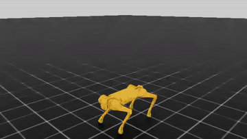 | 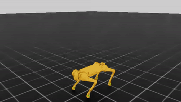 |
| **Action Residual 4D** | **Action Residual 12D** |
| 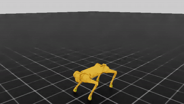 | 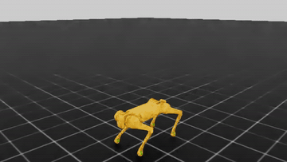 |

*All four variants maintain positive forward velocity throughout every transition. Smoothstep baseline (no learning) reverses direction on 3 of 6 pairs. Details in Section 7 and Section 9.*

---

### Act 1 — The Problem

Trot, bound, and pace have fundamentally different leg-pair coordination structures:
- **Trot** — diagonal pairs in phase (FL+RR, FR+RL)
- **Bound** — fore-aft pairs in phase (FL+FR, RL+RR)
- **Pace** — lateral pairs in phase (FL+RL, FR+RR)

Switching between them abruptly creates a kinematic shock: joint targets jump discontinuously, jerk spikes to ~19 000 rad/s³, and the robot can momentarily reverse direction. A hand-designed **smoothstep** blending schedule already fixes the worst of this: its zero-slope endpoints guarantee that joint velocity is continuous at the transition start and end. But smoothstep still produces velocity reversal on hard gait-pair transitions. The derivation in Section 2 explains why: smoothstep guarantees velocity continuity but **not acceleration continuity**. The gap is proportional to the phase mismatch between the two frozen policies at the switch moment — a quantity no fixed schedule can control.

### Act 2 — Two Hypotheses

Two fundamentally different ways to close the smoothstep gap:

**Hypothesis A — Schedule Residual (Δα):** Correct *when* to blend. If the residual policy can delay or advance the blend on a per-leg or per-joint basis, it may be able to wait for better phase alignment before committing to the target gait. This is a **timing** correction.

**Hypothesis B — Action Residual (Δq):** Correct *where joints end up*. Add a direct position correction after blending. Rather than changing when the blend happens, directly prevent the joint configuration from reaching a dangerous state during the transition. This is a **position** correction.

Both hypotheses are tested at two action-dimension resolutions:
- **4D** — one scalar per leg, broadcast to all joints in the leg
- **12D** — independent correction for each of the 12 joints (hip, thigh, calf × 4 legs)

This produces the **2×2 design space** studied in this project.

### Act 3 — What We Built

Two experiments tested the two hypotheses. Both share the same 2×2 architecture (Section 5):

| Dimension | Schedule Residual | Action Residual |
|---|---|---|
| Correction target | α blending weight | q joint position |
| Form | Δα ∈ [−0.3, +0.3], `tanh` | Δq ∈ [−0.25, +0.25] rad, `tanh` |
| Bidirectional | Yes — can delay OR advance blend | Yes — positive or negative offset |
| 4D variant | Per-leg scalar Δα | Per-leg scalar Δq |
| 12D variant | Per-joint Δα | Per-joint Δq |
| Fallback | Δα = 0 → pure Smoothstep | Δq = 0 → pure Smoothstep |

**Experiment A — Direct Jerk Optimization:** Jerk penalty in reward (−2×10⁻¹⁰ · ‖joint jerk‖²), advance-only sigmoid clamp (Δα ∈ [0, +0.3]), fixed 3 s transition duration. Purpose: test whether directly rewarding jerk reduction produces a useful residual policy.

**Experiment B — Velocity Safety without Jerk Reward:** No jerk penalty. Replaced with vx-window penalty (−2.0 · velocity error during transition). Bidirectional `tanh` clamp, policy-phase observation (π_current + π_target in obs), randomized duration ∈ [1.5, 5.0] s. Two observation variants: *policy-output* (frozen policy actions) and *contact-phase* (adds binary foot contact FL/FR/RL/RR). Purpose: test whether removing the jerk signal and directly penalizing velocity drops yields safer transitions.

### Act 4 — Key Results

**Canonical evaluation** (seed=42, 2500 steps, 6 directed gait-pair transitions, duration pinned to 3 s):

Metrics: **Δvx_trans** = mean(vx_pre − vx_min_window) over 6 windows; **vx_min_trans** = global minimum; **rev** = windows where vx_min < 0.

**Headline comparison — baselines vs best of each experiment:**

One learned method is shown per experiment. Experiment A's best result is its Sched-α 12D variant (lowest jerk among trained methods). Experiment B's best result is its Action-q 12D variant with contact-phase observation — this is the **final Experiment B design** (contact-phase obs = most refined observation; see Section 5 and Section 7 for full 2×2 breakdown).

| Method | vx_mean | vx_std | **vx_min_trans** | **Δvx_trans** | jerk_TRANS | CoT | **rev** |
|---|---:|---:|---:|---:|---:|---:|---:|
| Discrete Switch | +0.435 | 0.108 | −0.195 | 0.266 | 11361 | 2.793 | 1/6 |
| Linear Ramp | +0.390 | 0.157 | −0.206 | 0.477 | 7441 | 1.955 | 4/6 |
| Smoothstep Ramp | +0.415 | 0.129 | −0.096 | 0.438 | 8508 | 2.090 | 3/6 |
| **Exp A** Sched-α 12D | +0.431 | 0.099 | **+0.061** | 0.263 | **8320** | 2.454 | **0/6** |
| **Exp B** Action-q 12D (contact) | +0.420 | **0.077** | **+0.267** | **0.131** | 10701 | 2.157 | **0/6** |

*Experiment A = jerk-penalty reward, advance-only sigmoid, fixed 3 s (Section 7/9 for all 4 variants). Experiment B = vx-window penalty, bidirectional tanh, contact-phase obs, randomized duration (Section 7/9 for all 4 variants and both obs types).*

**CoT caveat:** All CoT values were computed using `robot_mass_kg = 50.0` (the play-script default). The B1 URDF total mass is ~62.6 kg (trunk 29.45 + 4 thighs + 4 calves + 4 feet + joints). Corrected CoT = displayed value × (50/62.6) ≈ × 0.80. Relative rankings between methods are unchanged.

**Pareto finding — jerk and velocity safety compete:**

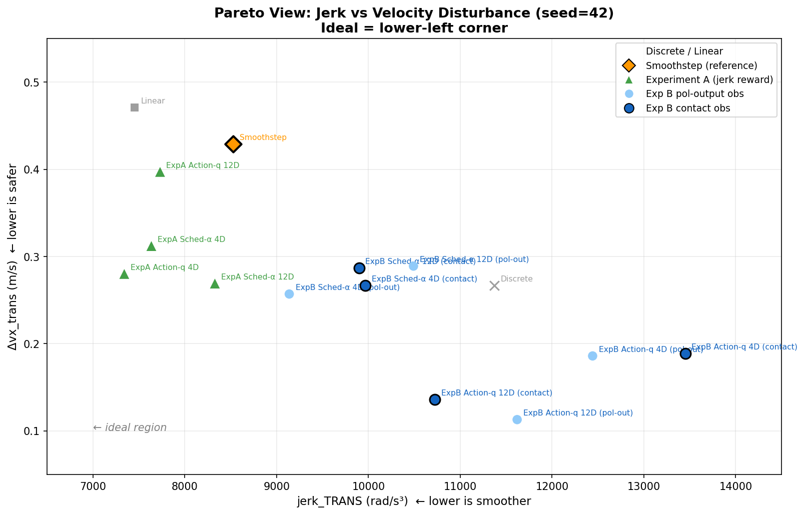

- **Experiment A** (jerk penalty): best jerk_TRANS = 8320 (−2.3% vs Smoothstep 8508). Velocity drop Δvx_trans = 0.263 (−40% vs Smoothstep). Zero reversals at seed=42 for the best variant. *But*: the MLP output is near-zero for 40% of timesteps — the jerk reward suppressed intervention.
- **Experiment B** (vx-window penalty): best Δvx_trans = 0.131 (−70% vs Smoothstep). Zero reversals for all four variants. *But*: jerk_TRANS = 10 701 (+25.8% vs Smoothstep) — no jerk reward means the MLP intervenes harder.
- **No single winner.** Smoothstep is near-optimal for jerk with no training. Residual learning trades that advantage for velocity safety. Choosing between them depends on whether jerk or forward-momentum loss is the harder constraint for the target deployment.

Full design-space results in Section 7 and Section 9.

---

## 2. Mathematical Foundation: Blending Kinematics

### The Blending Formula

Every gait transition in this project uses per-joint linear interpolation between frozen policy outputs:

```
q(t) = (1 − α(t)) · π_src(obs) + α(t) · π_tgt(obs)
```

where α(t) is a scalar blending weight ∈ [0, 1] and π_src, π_tgt are the joint-position targets from the source and target frozen policies respectively.

### Joint Velocity at the Transition Start

Differentiating:

```
q̇ = α̇ · (π_tgt − π_src) + (1 − α) · π̇_src + α · π̇_tgt
```

Let Δπ = π_tgt − π_src denote the "phase gap" at any moment. At t = 0 (transition start):

```
q̇(0) = α̇(0) · Δπ(0) + π̇_src(0)
```

For **Smoothstep** α(x) = 3x² − 2x³, x = t/T:

```
dα/dt = (6x − 6x²) / T   →   α̇(0) = 0
```

Therefore: **q̇(0) = π̇_src(0)** — joint velocity is continuous at the start of blending. ✓

For **Discrete switch**: α jumps from 0 to 1 in one step, so α̇(0) → ∞. The term α̇ · Δπ dominates, producing the velocity spike seen at switch time. For **Linear ramp**: α̇(0) = 1/T ≠ 0, so there is a velocity kick proportional to Δπ(0)/T at the start of the ramp.

### Joint Acceleration at the Transition Start

Differentiating q̇:

```
q̈ = α̈ · Δπ + 2α̇ · Δπ̇ + (1 − α) · π̈_src + α · π̈_tgt
```

At t = 0: α(0) = 0, α̇(0) = 0. For Smoothstep:

```
d²α/dt² = (6 − 12x) / T²   →   α̈(0) = 6/T²
```

Therefore:

```
q̈(0) = (6/T²) · Δπ(0) + π̈_src(0)
```

**Joint acceleration is continuous at t = 0 only if Δπ(0) = 0** — i.e., only if the two frozen policies are commanding exactly the same joint positions at the switch moment (perfect phase alignment). In general, Δπ(0) ≠ 0, so an acceleration discontinuity exists proportional to the phase gap.

**Magnitude:** For T = 3 s: 6/T² = 0.67 rad/s² per rad of phase mismatch. For T = 0.5 s: 6/T² = 24 rad/s² per rad of phase mismatch — this is why short transition durations are catastrophic even with smoothstep.

### What Each Schedule Guarantees

| Guarantee | Discrete | Linear Ramp | Smoothstep | Ideal (Δπ = 0) |
|---|:---:|:---:|:---:|:---:|
| q continuous at t = 0 | ✗ | ✓ | ✓ | ✓ |
| q̇ continuous at t = 0 | ✗ | ✗ | ✓ | ✓ |
| q̈ continuous at t = 0 | ✗ | ✗ | ✗ | ✓ |

Smoothstep is the best passive schedule: it removes the velocity kick at the transition boundary. But the acceleration gap — driven by Δπ(0) — is a property of the **phase state of the two frozen policies at switch time**, not of the schedule shape alone. No fixed schedule can control Δπ(0).

### Implication: Why Residual Learning Is Needed

The residual policy has the opportunity to reduce the effective Δπ seen during blending. There are exactly two ways to do this:

1. **Change when α ramps** — adjust the timing so the blend starts or accelerates when |Δπ| is momentarily smaller. This is the *Schedule Residual* approach.
2. **Directly correct the joint positions** — regardless of what Δπ is, add a compensation term that prevents dangerous intermediate configurations. This is the *Action Residual* approach.

Both are valid hypotheses. Neither can be predicted superior a priori: schedule correction is more structured (stays within the convex combination of frozen policies) but depends on favorable phase dynamics; action correction is more direct but unconstrained and relies on the MLP learning safe offsets.

---

## 3. Two Hypotheses: Schedule vs. Action Residual

### Hypothesis A — Schedule Residual

**Claim:** The primary source of transition jerk is α̇(t) · Δπ(t) — the product of blend rate and phase gap. A policy that adjusts *when* α moves can reduce this product by waiting for phases to align before accelerating the blend.

**Implementation:** The MLP outputs Δα per leg (4D) or per joint (12D). The effective blending weight becomes:

```
α_eff(t) = clamp(α_smoothstep(t) + Δα(t), 0, 1)
```

- **Experiment A (advance-only):** `Δα = sigmoid(a) × 0.3 → [0, +0.3]` — MLP can only advance the blend. *(Experiment A is the jerk-penalty experiment defined in Section 7/9.)*
- **Experiment B (bidirectional):** `Δα = tanh(a) × 0.3 → [−0.3, +0.3]` — MLP can delay (Δα < 0) OR advance (Δα > 0). *(Experiment B is the velocity-safety experiment defined in Section 7/9.)*

Bidirectionality is critical: if the source policy is mid-swing when the switch command arrives, the correct action is to *delay* the transition until the source policy returns to a stable stance configuration. The Experiment A advance-only constraint prevented this.

**What schedule correction can fix:** Timing of blend onset per leg/joint. This can reduce Δπ(0) by choosing better switch moments.

**What it cannot fix:** Even perfect timing can only wait for a momentarily smaller Δπ — it cannot eliminate the gap entirely for arbitrary gait frequencies (trot 1.6 Hz vs bound 2.5 Hz have incommensurable periods). And the MLP cannot observe the actual phase state of the frozen policies — only their outputs π_current and π_target in Experiment B.

### Hypothesis B — Action Residual

**Claim:** The phase mismatch Δπ(0) is irreducible for arbitrary frozen policy pairs. The correct response is to directly correct the joint-position command after blending.

**Implementation:** The MLP outputs Δq per leg (4D) or per joint (12D). The joint command becomes:

```
q_target = q_default + scale × (q_blended + Δq)
```

- `Δq = tanh(a) × 0.25 → [−0.25, +0.25] rad` (bidirectional in both experiments)
- Corrections are added after blending, directly to joint targets

**What action correction can fix:** Joint configurations that would otherwise be unsafe. If the blended command produces a dangerous posture at mid-transition, a per-joint offset can steer away from it.

**What it cannot fix:** Action residuals are unconstrained — the policy can output any Δq within the clamp range, including commands that deviate from both frozen policy outputs. This requires the MLP to have learned safe offsets during training, which may not generalize to unseen phase conditions.

### Experiment B: Both Hypotheses Share a Common Observation Space

In Experiment B, both schedule and action residuals receive the same observation (Section 5), which includes π_current(12D) + π_target(12D) — direct outputs of the two frozen policies at the current timestep. This gives the MLP what it needs to implement phase-conditional corrections:

- For schedule residual: compare π_current and π_target to assess phase alignment → delay or advance the blend accordingly
- For action residual: observe the mismatch between what both policies would command → directly compensate

This closes the information gap that limited Experiment A: the Experiment A MLP received only one-hot gait labels and α_baseline, with no access to the actual phase states.

---

## 4. Phase 1 — Base Gait Policy Generation

### Initial Direction — CPG-RBF + PIBB

The original Phase 1 design used a **CPG-RBF (Central Pattern Generator + Radial Basis Function)** controller optimized with **PI^BB (Thor et al. 2021)**. After ~3 weeks of iteration and 12 documented encoding experiments, this approach was abandoned.

The structural failure was a **representation mismatch**: the indirect RBF encoding uses one weight matrix W (20×3, 60 params) shared across all 4 legs — per-leg differences come only from integer phase offsets. B1 has a 0.2 rad asymmetry between front thighs (0.8 rad) and rear thighs (1.0 rad). No single W can simultaneously produce the correct swing arc for both front and rear leg pairs.

**Experiment A** (old weights, corrected env): vx = 0.000 m/s — robot stands still.
**Experiment B** (retrain in corrected env): vx = +0.091 m/s — oscillatory lunge. Compare: PPO trot achieves +0.434 m/s.

| Metric | A: old weights | B: retrained | PPO trot |
|---|---:|---:|---:|
| mean vx | 0.000 m/s | +0.091 m/s | 0.434 m/s |
| FL/FR/RL/RR duty | 28/100/100/100% | 85/77/47/50% | ~40/33/39/65% |
| locomotion | stands still | oscillatory lunge | stable trot |

### Pivot to PPO Base Gait Policies

Four PPO velocity-tracking policies trained on flat terrain. Stored at `logs/phase1_final/`.

| Gait | Coordination | Duty FL/FR/RL/RR | Body height | Cycle | Speed |
|---|---|---:|---:|---:|---:|
| **trot_v2** | Diagonal (FL+RR / FR+RL) | 40/33/39/65% | 0.43 m | 1.6 Hz | 0.5 m/s |
| **bound_v4** | Fore-aft (FL+FR / RL+RR) | 65/65/33/34% | 0.39 m | 2.5 Hz | 0.5 m/s |
| **pace_v2** | Lateral (FL+RL / FR+RR) | 30/69/30/69% | 0.40 m | 2.5 Hz | 0.45 m/s |
| **steer_v2** | Asymmetric trot for turning | 39/16/27/35% | 0.42 m | 1.7 Hz | 0.25 m/s |

**Gait quality caveat.** These are velocity-tracking policies, not biologically faithful gaits. Duty cycles deviate from natural locomotion (e.g., trot FR at 33% stance vs biological ~50%). Phase 2's transition-smoothness results hold on top of these policies, but the base policies themselves should not be presented as accurate gait models.

Phase 2 uses only trot, bound, and pace. Steer is excluded because its training range (`yaw ∈ (0.4, 1.0)`) is incompatible with Phase 2's fixed `yaw=0` command.

### Phase 1 Gait Diagrams

Foot contact bars (blue = stance, white = swing):

**Trot** — diagonal pairs: FR+RL co-swing while FL+RR co-swing.


**Bound** — fore-aft pairs: FL+FR swing together, RL+RR swing together.


**Pace** — lateral pairs: FL+RL swing together, FR+RR swing together.


---

## 5. Phase 2 — Architecture

### Architecture Overview

```
                    ┌────────────────────────────────────┐
                    │  Residual MLP                      │
                    │  obs(70–82) → 128 → 128 → out     │
                    │  Schedule: Δα = tanh(a) × 0.3      │
                    │  Action:   Δq = tanh(a) × 0.25     │
                    └──────────────┬─────────────────────┘
                                   │ 4D or 12D correction
                                   ▼
   π_current ─────┐    ┌──────────────────────────────┐
   π_target  ─────┼───▶│ Per-joint blending + residual │──▶ joint_targets → B1
   α_baseline ────┘    │ SCHEDULE: α_j = α_base + Δα_j │
   (smoothstep)        │ ACTION:   q_j = blend_j + Δq_j │
                       └──────────────────────────────┘
```

Both modes share the same PPO training loop, same network depth, and same observation space. They differ only in what the residual corrects: the blending weight or the joint target.

### Per-Joint Blending Math

**Schedule Residual (Δα mode):**

```python
# Experiment B: bidirectional — MLP can delay (Δα < 0) or advance (Δα > 0)
delta_alpha = tanh(actions) * delta_alpha_max     # ∈ [−0.3, +0.3]
delta_alpha *= in_transition_window               # gated: zero outside window

# Baseline schedule (smoothstep)
x          = clamp((t − t_start) / T, 0, 1)
alpha_base = x*x*(3 − 2*x)                       # dα/dt = 0 at endpoints

# Per-joint effective alpha
for j in 0..11:
    alpha_j = clamp(alpha_base + delta_alpha[j], 0, 1)
    blended[j] = (1 − alpha_j) * pi_src[j] + alpha_j * pi_tgt[j]

joint_target = q_default + 0.25 * blended
```

**Action Residual (Δq mode):**

```python
# Experiment B: bidirectional — MLP adds or subtracts from blended command
delta_q   = tanh(actions) * delta_q_max           # ∈ [−0.25, +0.25] rad
delta_q  *= in_transition_window

# Baseline blending (smoothstep, no residual on α)
alpha_base = x*x*(3 − 2*x)
for j in 0..11:
    blended[j] = (1 − alpha_base) * pi_src[j] + alpha_base * pi_tgt[j]

joint_target = q_default + 0.25 * (blended + delta_q)
```

### 2×2 Design Space (Experiment B)

|  | **4D** (per-leg scalar) | **12D** (per-joint) |
|---|---|---|
| **Schedule Residual** | Δα one scalar per leg, broadcast → 3 joints | Δα independent per joint (12 values) |
| **Action Residual** | Δq one scalar per leg, broadcast → 3 joints | Δq independent per joint (12 values) |

All four variants: same smoothstep baseline, same time-gating, same network (128×128), same 2000-iteration budget, same sparsity (−0.5 for 4D, −0.167 for 12D), same vx-window penalty (−2.0), same action-rate penalty (−0.5). Only output target and action dimension differ.

**Sparsity normalization for 12D:** 12D action sums 3× more terms in `‖Δ‖²` than 4D. To maintain equal per-dimension sparsity pressure: −0.5 × 4/12 = −0.167.

### Observation Space

**4D variants (70-D total):**

```
base_lin_vel       (3)   body-frame linear velocity
base_ang_vel       (3)   body-frame angular velocity
projected_gravity  (3)   gravity direction in body frame
joint_pos_rel      (12)  joint angles relative to default pose
joint_vel          (12)  joint velocities
last_residual      (4)   per-leg last correction (mean of 12D for schedule; raw 4D for action)
gait_current_oh    (3)   one-hot: current source gait
gait_target_oh     (3)   one-hot: target gait
alpha_baseline     (1)   current α from smoothstep schedule
cycles_elapsed     (1)   time elapsed in episode (1 Hz equivalent)
─────── Experiment B additions ────────────────────────────────────
norm_duration      (1)   transition duration / 5.0  (MLP conditions on ramp speed)
pi_current         (12)  frozen source policy's current joint-position output
pi_target          (12)  frozen target policy's current joint-position output
```

**12D variants (78-D total):** Same as above, but `last_residual` is the full 12D per-joint correction (not summarized to 4D mean).

The 12 values of `pi_current` and `pi_target` are the most important Experiment B additions: they give the MLP direct visibility into what each frozen policy is commanding at every timestep, enabling phase-conditional corrections.

### Contact-Phase Observation Variant (Experiment B final)

This variant adds 4D binary foot contact (FL/FR/RL/RR stance/swing) on top of the policy-output observation:

```
foot_contact  (4)  contact force > 1.0 N threshold — binary stance/swing per leg
```

- **4D variants (contact):** 74-D total (70 + 4)
- **12D variants (contact):** 82-D total (78 + 4)

**Why foot contact over π_current + π_target alone:** Joint position from `pi_current` is ambiguous — the same joint angle occurs twice per gait cycle (swing-up and swing-down). Binary contact state is unambiguous: it tells the MLP whether each leg is currently in stance (safe to transfer weight) or swing (unsafe moment to accelerate blend). This closes the phase-ambiguity gap that `pi_current` alone cannot resolve.

Checkpoints: `logs/phase2_new_approach/{schedule,action}_residual_{4d,12d}_v3/`

### Reward Function (Experiment B)

| Term | Weight | Description |
|---|---:|---|
| Velocity tracking | +1.5 | `exp(−‖cmd_xy − vel_xy‖² / 0.25)` |
| Yaw tracking | +0.75 | `exp(−(cmd_yaw − ωz)² / 0.25)` |
| Body orientation | −2.0 | `‖projected_gravity_xy‖²` |
| Orientation (in-window) | −8.0 | Same ×4 during transition window |
| Body height | −50.0 | `(h − 0.42)²` |
| **Action rate** | **−0.5** | `‖Δ_t − Δ_{t−1}‖²` — temporal smoothness of MLP corrections |
| **Δ sparsity** | **−0.5 (4D) / −0.167 (12D)** | `‖Δ‖²` — pushes residual toward zero |
| **vx window penalty** | **−2.0** | `(vx − cmd)² × in_window` — velocity-drop **penalty** during transition window only (negative weight = penalize error) |
| Joint jerk | 0.0 | **Removed in Experiment B** (see note below) |
| Joint acceleration | 0.0 | **Removed in Experiment B** (see note below) |
| Alive bonus | +0.5 | Per-step survival |

**Why no jerk penalty in Experiment B:** Smoothstep's lower jerk vs linear ramp is partly an artifact of the robot nearly stopping during transitions. Active corrections necessarily increase jerk relative to a near-stationary baseline. Experiment A's jerk penalty created a degenerate attractor: the lowest-jerk strategy was to do nothing (Δα ≈ 0) and let the robot slow down. Experiment B replaces the jerk penalty with a **vx-window penalty** (−2.0) that directly penalizes velocity drop during the transition window.

**Note on sign:** `rew_vx_window` must be **negative** — the formula computes `(vx − cmd)² × in_window × weight`. A positive weight would reward velocity error (a previous bug in early development).

### Training Setup

| Parameter | Value |
|---|---|
| Episode length | 10 s (500 control steps at 50 Hz) |
| Parallel environments | 1024 |
| Control dt | 0.02 s (physics dt = 0.005 s, render interval = 4) |
| Velocity command | vx = 0.4, vy = 0, yaw = 0 m/s |
| Transition start hold | Uniform(1.5, 3.5) s — random gait phase at switch |
| **Transition duration** | **Uniform(1.5, 5.0) s — randomized per episode** |
| Termination | Base contact > 50 N OR `‖gravity_xy‖² > 1.0` |
| Training iterations | 2000 |

**PPO hyperparameters:** (same across both experiments)

| Parameter | Value |
|---|---|
| Algorithm | PPO (rsl_rl) |
| Steps per env per update | 24 |
| Mini-batches | 4 |
| Learning epochs per update | 5 |
| Learning rate | 5×10⁻⁴ (adaptive) |
| Clip parameter ε | 0.2 |
| Entropy coefficient | 0.005 |
| Discount γ | 0.99 |
| GAE λ | 0.95 |
| Desired KL | 0.01 |
| Init noise std | 0.5 |

---

## 6. Development History — From Prototype to Design-Space Study

### Why v1–v10 Used Schedule Residual (α) 4D

The v1–v10 sequence was a **framework development phase**, not the final architectural claim. The 4D per-leg schedule residual was used as a controllable prototype because it is simpler, faster to debug, and easier to interpret than 12D. The goal was to make residual transition learning work at all — the question of the best architecture came later.

### Problems Solved in v1–v10

| Version | Problem | Fix |
|---|---|---|
| v1–v2 | Standstill exploit (alive bonus dominates) | Velocity tracking weight ×3 |
| v2–v3 | No time-gating — MLP corrupts source gait | Hard zero outside window |
| v3–v4 | Steer policy out-of-distribution | Drop steer from Phase 2 |
| v4–v5 | Base policies queried with wrong `last_action` | Per-policy `_base_last_actions` buffer |
| v5–v7 | Wrong smoothness metric (`jacc_RMS` not jerk) | Replace with `(q̈_t − q̈_{t-1})/dt` |
| v7 | Symmetric `tanh × 0.8` clamp → delay-rush exploit | Asymmetric `sigmoid × 0.3` in v10 |
| v8–v9 | Jerk weight too high → compressed-jump strategy | Sweep to `−1e-10` |
| v10 | No sparsity → MLP saturates Δα throughout window | Add `−3.0 · ‖Δα‖²` |

**v7 delay-rush exploit:** the symmetric clamp allowed the MLP to output Δα < 0 in the early ramp (delaying α below smoothstep) and Δα > 0 in the late ramp (rushing it). This compressed mid-α blending time but produced velocity dips (vx_min = −0.045 m/s). The exploit was hidden by the `jacc_RMS` metric. Fixing this in v10 required the asymmetric sigmoid clamp — but that came at the cost of preventing legitimate delay corrections. Experiment B restores bidirectionality via `tanh` now that the evaluation metric is correctly defined.

**v10 (Schedule-α 4D prototype)** achieves +0.433 m/s, vx_min ≈ 0, jerk below smoothstep. This stable recipe was then used as the foundation for the 2×2 design-space study.

### From Prototype to Design-Space Study

Once v10 established a stable residual-learning recipe, the project expanded to ask:

> *"Does schedule correction (Δα) or action correction (Δq) better address the phase-mismatch problem? Does per-joint (12D) control outperform per-leg (4D) control?"*

Silver et al. (2018) defined the residual as a **joint-position correction** Δq — directly corresponding to Hypothesis B (Section 3). This project asks whether correcting **blending weights** (Hypothesis A) is preferable, and whether the answer depends on action dimension.

*"The v1–v10 sequence should be read as the development of a stable residual-learning recipe, not as the final architectural claim."*

---

## 7. Systematic Design-Space Study (2×2)

### Research Question

After establishing a working residual recipe, two design dimensions remained open:

1. **Correction target**: schedule (when to blend) or action (where joints end up)?
2. **Action dimension**: per-leg 4D or per-joint 12D?

### 2×2 Design Space (see also Section 3)

Final Experiment B design — contact-phase observation (policy-output obs + binary foot contact):

|  | **4D** (per-leg scalar) | **12D** (per-joint) |
|---|---|---|
| **Schedule Residual (Δα)** | `Isaac-B1-Phase2-V3-Alpha4D-v0` | `Isaac-B1-Phase2-V3-Alpha12D-v0` |
| **Action Residual (Δq)** | `Isaac-B1-Phase2-V3-Joint4D-v0` | `Isaac-B1-Phase2-V3-Joint12D-v0` |

*An intermediate variant using policy-output observation only (without foot contact) was also trained and is included in the results below for comparison. Checkpoints at `logs/phase2_new_approach/*_v2/`.*

**Why 4D per-leg is still included:** Broadcasting one scalar to all three joints per leg maintains intra-leg kinematic consistency (hip, thigh, calf all move together). This is physically simpler but less expressive. For schedule residual, it means all joints in one leg transition at the same rate — the robot cannot independently delay the hip while advancing the knee.

**Why 12D per-joint is included:** Different joints have different mechanical roles (hip = lateral splay, thigh = primary walking drive, calf = foot clearance). The trot→bound transition requires decoupling diagonal-pair synchrony, which may benefit from per-joint timing. The 0.2 rad front/rear thigh asymmetry of B1 also suggests different joints need different correction rates (Section 13).

---

### Experiment A Results (seed=42 canonical)

Jerk penalty in reward, advance-only sigmoid Δα ∈ [0, +0.3], fixed 3 s, no policy-phase obs.

| Variant | vx_mean | vx_std | **vx_min_trans** | **Δvx_trans** | jerk_TRANS | CoT | **rev** |
|---|---:|---:|---:|---:|---:|---:|---:|
| Smoothstep (ref) | +0.415 | 0.129 | −0.096 | 0.438 | 8508 | 2.090 | 3/6 |
| Schedule-α 4D | +0.430 | 0.113 | −0.086 | 0.318 | 7617 | 2.171 | 1/6 |
| **Schedule-α 12D** | +0.431 | 0.099 | **+0.061** | 0.263 | **8320** | 2.454 | **0/6** |
| Action-q 4D | +0.416 | 0.100 | −0.024 | 0.276 | **7320** | 2.158 | 1/6 |
| Action-q 12D | +0.408 | 0.130 | −0.122 | 0.405 | 7719 | 2.064 | 2/6 |

*Exp A Schedule-α 12D is the only variant with 0/6 reversals. Action-q 4D achieves lowest jerk (7320, −14% vs Smoothstep) but still reverses once. Action-q 12D is the worst: 2/6 reversals.*

### Experiment B Results (seed=42 canonical)

No jerk penalty. vx-window penalty (−2.0), bidirectional tanh, policy-phase observation, randomized duration.

**Policy-output observation (π_current + π_target, 24D added to obs):**

| Variant | vx_mean | vx_std | **vx_min_trans** | **Δvx_trans** | jerk_TRANS | CoT | **rev** |
|---|---:|---:|---:|---:|---:|---:|---:|
| Smoothstep (ref) | +0.415 | 0.129 | −0.096 | 0.438 | 8508 | 2.090 | 3/6 |
| Schedule-α 4D | +0.435 | 0.092 | +0.121 | 0.257 | 9108 | 2.175 | 0/6 |
| Schedule-α 12D | +0.426 | 0.094 | +0.009 | 0.291 | 10463 | 2.207 | 0/6 |
| Action-q 4D | +0.421 | 0.082 | +0.182 | 0.179 | 12404 | 2.400 | 0/6 |
| **Action-q 12D** | +0.420 | **0.078** | **+0.251** | **0.104** | 11752 | 2.230 | **0/6** |

**Contact-phase observation (pol-out + binary foot contact FL/FR/RL/RR, 4D added):**

| Variant | vx_mean | vx_std | **vx_min_trans** | **Δvx_trans** | jerk_TRANS | CoT | **rev** |
|---|---:|---:|---:|---:|---:|---:|---:|
| Smoothstep (ref) | +0.415 | 0.129 | −0.096 | 0.438 | 8508 | 2.090 | 3/6 |
| Schedule-α 4D | +0.434 | 0.091 | +0.089 | 0.258 | 9964 | 2.116 | 0/6 |
| Schedule-α 12D | +0.432 | 0.097 | +0.064 | 0.286 | 9870 | 2.245 | 0/6 |
| Action-q 4D | +0.420 | 0.081 | +0.219 | 0.185 | 13412 | 2.906 | 0/6 |
| **Action-q 12D** | +0.420 | **0.077** | **+0.267** | **0.131** | 10701 | 2.157 | **0/6** |

*vx_min_trans = minimum vx inside any 150-step transition window. Δvx_trans = mean(vx_pre − vx_min_win) over 6 windows. rev = reversals/6.*

**Key interpretation (Experiment B):**
- All 8 Experiment B variants: **0/6 reversals** — bidirectional tanh + vx-window penalty together eliminate velocity reversal at seed=42
- **Action-q 12D contact** achieves best velocity safety: vx_min_trans = +0.267, Δvx_trans = 0.131 (−70% vs Smoothstep 0.438)
- **Schedule-α 4D pol-out** best on vx_mean (+0.435, matches Discrete) with lower vx_std (0.092)
- Contact observation helps Action-q 12D most: jerk 10701 vs pol-out 11752 (−8.9%). Mixed results for other variants.
- Tradeoff: all Exp B variants exceed Smoothstep on jerk_TRANS — no jerk reward by design

---

## 8. Experiments and Metrics

### Methods Compared

**Baselines (no learning):**

| Method | Description | Action |
|---|---|---|
| **(a) Discrete Switch** | α = 1 instantly at switch. | — |
| **(b) Linear Ramp** | α ramps linearly over 3 s. | — |
| **(c) Smoothstep Ramp** | α follows x²(3−2x) over 3 s. | — |

**Experiment A — Direct Jerk Optimization** (jerk penalty, advance-only sigmoid [0, +0.3], fixed 3 s, one-hot obs):

| Method | Description | Action |
|---|---|---|
| **(d) ExpA Schedule-α 4D** | Smoothstep + per-leg Δα, sigmoid [0, +0.3]. | 4-D |
| **(e) ExpA Schedule-α 12D** | Smoothstep + per-joint Δα. Same clamp. | 12-D |
| **(f) ExpA Action-q 4D** | Smoothstep + per-leg Δq, tanh ×0.25. | 4-D |
| **(g) ExpA Action-q 12D** | Smoothstep + per-joint Δq, tanh ×0.25. | 12-D |

**Experiment B — Velocity Safety** (vx-window penalty, bidirectional tanh, pol-phase obs, rand. duration):

| Method | Description | Action |
|---|---|---|
| **(h) ExpB Schedule-α 4D (pol-out)** | Per-leg Δα, tanh [−0.3, +0.3], π obs. | 4-D |
| **(i) ExpB Schedule-α 12D (pol-out)** | Per-joint Δα, same clamp. | 12-D |
| **(j) ExpB Action-q 4D (pol-out)** | Per-leg Δq, tanh ×0.25, π obs. | 4-D |
| **(k) ExpB Action-q 12D (pol-out)** | Per-joint Δq, tanh ×0.25, π obs. | 12-D |
| **(l) ExpB Schedule-α 4D (contact)** | As (h) + binary foot contact FL/FR/RL/RR in obs. | 4-D |
| **(m) ExpB Schedule-α 12D (contact)** | As (i) + foot contact. | 12-D |
| **(n) ExpB Action-q 4D (contact)** | As (j) + foot contact. | 4-D |
| **(o) ExpB Action-q 12D (contact)** | As (k) + foot contact. | 12-D |

### Metrics

**Primary metric — `jerk_TRANS`:** Jerk RMS (rad/s³) over the 3 s transition window, 12 joints, 150 steps = 1800 values. Jerk = `(joint_acc[t+1] − joint_acc[t]) / dt`. Window starts when `alpha_base` first exceeds 0.02.

**Footfall contamination caveat:** The 3 s window contains ~5 full trot strides at 1.6 Hz. Each footfall produces a jerk spike. jerk_TRANS is not pure blending-schedule disturbance — it includes underlying footfall noise. Differences between methods (e.g., 8508 vs 8320) should be read as real but small relative to the footfall floor. All methods are evaluated under the same window definition, so relative rankings are valid.

**Secondary metrics:**
- `Δvx = vx_mean − vx_min` — velocity drop through the worst transition window. Hardware-independent measure of transition disruption.
- `vx_min` — absolute minimum forward velocity. Negative = robot momentarily reversed. Interpret with caution: B1's thigh asymmetry creates a lower-than-commanded steady-state baseline.
- `vx_mean`, `vx_std` — tracking quality and consistency.
- `CoT` — Cost of Transport (energy efficiency).
- `tilt_max` — maximum body tilt (orientation stability).

### Evaluation Protocol

**Canonical Evaluation (seed=42):** Fixed seed, 6 gait-pair transitions (trot→bound→pace→trot→pace→bound), 2500 steps, 8 s per segment.

**Multi-Seed Robustness Evaluation (N=60):** 10 seeds × 6 gait pairs, `--randomize_start`. Different seeds hit the switch at different gait phases. Two bugs were fixed before this evaluation was valid:
1. IsaacLab resets numpy's global RNG during env init — fixed by using an isolated `np.random.default_rng(seed)` generator
2. Discrete baseline had `_transition_start_steps` hardcoded to `int(2.0/dt)` — fixed by using `_current_hold_s`

**Duration Sweep:** For each Experiment B (policy-output obs) variant, evaluate at pinned durations (1.5, 2.0, 3.0, 4.0, 5.0 s) using `--transition_duration_s`. Tests generalization of models trained on Uniform[1.5, 5.0] s. **Not available for Experiment B (contact-phase obs) or Experiment A variants.** See `logs/duration_sweep/`.

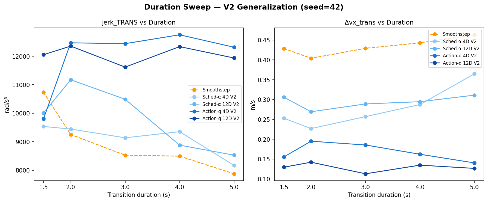

*Left: jerk vs duration. Right: Δvx vs duration. Action-q 12D maintains low Δvx across all durations. Smoothstep jerk (orange dashed) decreases at longer durations — both baselines and residual variants improve with slower transitions.*

**Why Smoothstep jerk scales with duration — and why short durations are catastrophic:**

The dominant jerk source in the blending equation is α̈ · Δq (blending acceleration × phase gap). For Smoothstep, the maximum second derivative is:

$$\ddot{\alpha}_{\max} = \frac{6}{T^2}$$

| Duration T | α̈_max | Relative to T=3s |
|---|---|---|
| 5.0 s | 0.24 rad/s² per rad | 0.36× |
| 3.0 s | 0.67 rad/s² per rad | 1× (baseline) |
| 1.5 s | 2.67 rad/s² per rad | 4× |
| 0.5 s | 24.0 rad/s² per rad | 36× |

This 1/T² scaling explains three observations in the plot:
1. **Smoothstep jerk drops at longer T** — it's geometric, not learned. Halving duration quadruples α̈_max and therefore jerk.
2. **Short transitions are catastrophic even with Smoothstep** — at T=1.5s, α̈_max is 4× higher than at T=3s. No fixed schedule can avoid this.
3. **Action-q jerk is flat across durations** — Action-q corrects in joint space directly, bypassing the α̈·Δq term entirely, so it does not benefit from longer T the way schedule-based methods do.

**N=60 Multi-Seed Evaluation:** Available only for Experiment A variants (7 methods total including baselines). The N=60 evaluation was not run for Experiment B. Treat Experiment B results as seed=42 only.

---

## 9. Results

### Discrete Spike Analysis


At switch time: max joint velocity 16.4 rad/s (6.2× steady-state), jerk 19 189 rad/s³. Generated by `scripts/plot_discrete_spike.py`.

### Why Passive Blending Helps — Smoothstep vs Discrete

| | Discrete | Smoothstep | Change |
|---|---:|---:|---:|
| jerk_TRANS | 11361 | 8508 | −25.1% |
| vx_min_trans | −0.195 | −0.096 | less reversal |
| Δvx_trans | 0.266 | 0.438 | Smoothstep worse on Δvx |

Smoothstep's zero-derivative endpoints remove endpoint kinematic kicks: the derivation in Section 2 shows α̇(0) = 0 → q̇(0) = π̇_src(0). But α̈(0) ≠ 0, so jerk still occurs proportional to Δπ(0).

**Why Discrete Switch has lower Δvx_trans than Smoothstep (counter-intuitive):** `Δvx_trans` is the mean of `(vx_pre − vx_min_window)` averaged across all 6 transition windows. Discrete Switch produces one catastrophic window (vx = −0.195, the single reversal counted in 1/6), but the other 5 windows the robot snaps immediately to the target gait and recovers — those windows contribute small Δvx. Smoothstep blends over 150 steps (3 s): the robot spends the entire window in an interpolated state that belongs to neither gait, which suppresses forward velocity consistently across 3/6 windows. The per-window average therefore accumulates. In short: Discrete is **concentrated** (one severe event, five clean ones); Smoothstep is **diffuse** (moderate degradation throughout every blending window).

### Schedule Shapes Alone — Linear vs Smoothstep

| | Linear | Smoothstep | Change |
|---|---:|---:|---:|
| vx_mean | +0.390 | **+0.415** | **+6.4%** |
| vx_std | 0.157 | **0.129** | **−17.8%** |
| vx_min_trans | −0.206 | **−0.096** | less reversal |
| jerk_TRANS | **7441** | 8508 | linear wins on jerk |

Linear ramp has lower jerk but worse velocity reversal. Smoothstep's S-curve produces higher dα/dt at midpoint (dα/dt = 1.5/T vs linear's 1/T), increasing mid-window jerk. But the zero-derivative endpoints protect transition boundaries. Smoothstep is chosen as the residual baseline because it has better velocity safety, not lower raw jerk.

### Experiment A Results (seed=42, canonical)

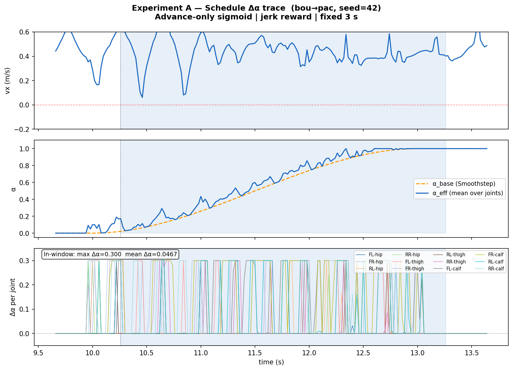

*Δα near-zero for most timesteps — the jerk reward created a near-static attractor.*

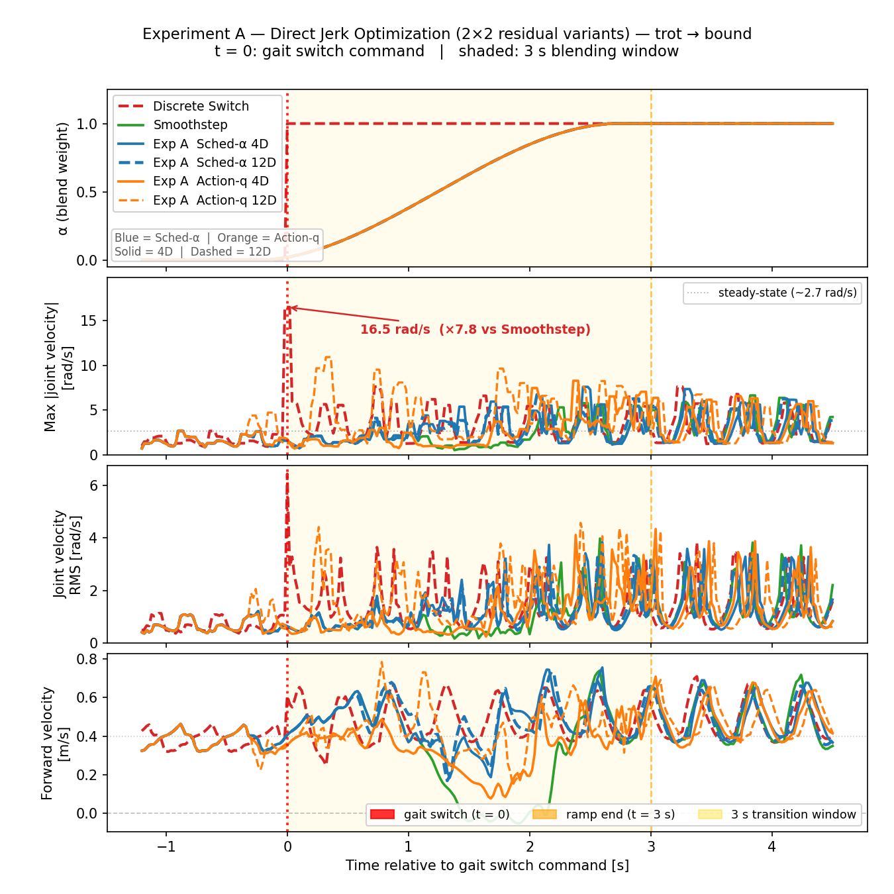

*Transition zoom (trot→bound, seed=42). All 4 residual variants cluster near Smoothstep on forward velocity — no variant clearly wins. Discrete spike is annotated for reference.*

| Method | vx_mean | vx_std | **vx_min_trans** | **Δvx_trans** | jerk_TRANS | CoT | **rev** |
|---|---:|---:|---:|---:|---:|---:|---:|
| Smoothstep (ref) | +0.415 | 0.129 | −0.096 | 0.438 | 8508 | 2.090 | 3/6 |
| Schedule-α 4D | +0.430 | 0.113 | −0.086 | 0.318 | 7617 | 2.171 | 1/6 |
| **Schedule-α 12D** | +0.431 | 0.099 | **+0.061** | 0.263 | **8320** | 2.454 | **0/6** |
| Action-q 4D | +0.416 | 0.100 | −0.024 | 0.276 | **7320** | 2.158 | 1/6 |
| Action-q 12D | +0.408 | 0.130 | −0.122 | 0.405 | 7719 | 2.064 | 2/6 |

Best result: Schedule-α 12D, jerk_TRANS = 8320 (−2.3% vs Smoothstep 8508), 0/6 reversals.

### Base-Swap Validation (Experiment A)

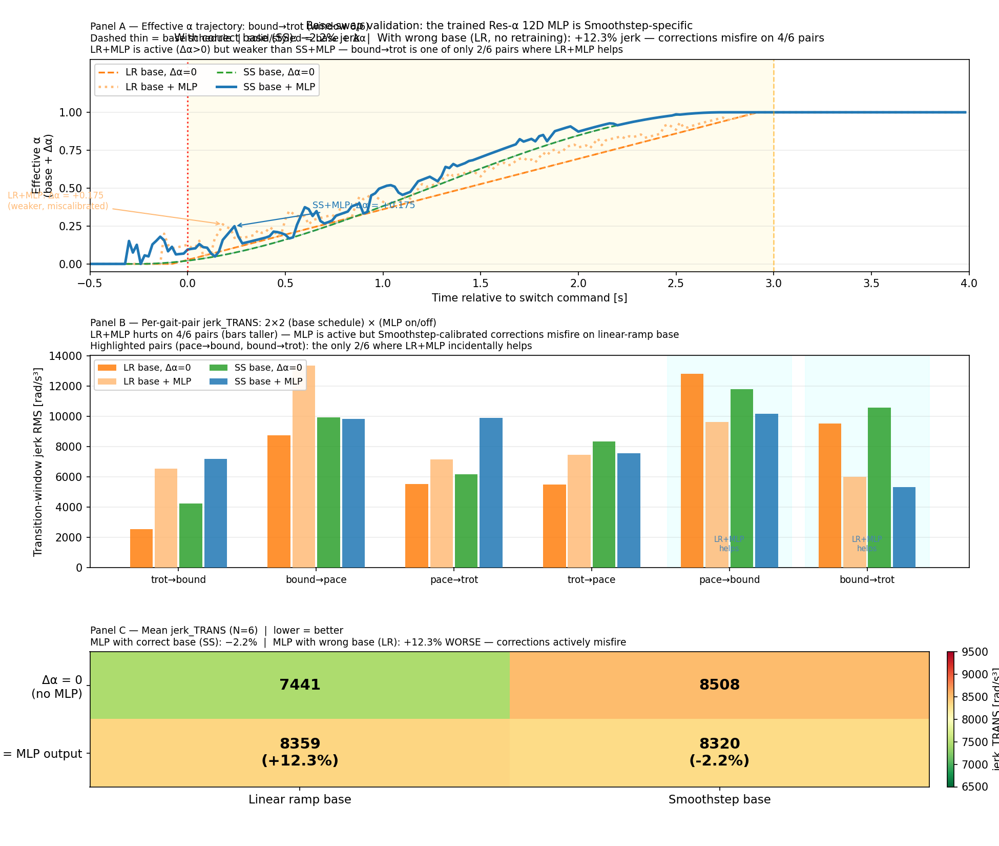

*Inspired by Silver et al. (2018): the trained Exp A Sched-α 12D MLP is swapped to run on top of a linear-ramp base (no retraining). With the correct Smoothstep base: −2.2% jerk. With the wrong linear-ramp base: +12.3% jerk — corrections misfire on 4/6 gait pairs. This shows the MLP is Smoothstep-calibrated, not a general transition controller.*

### Base-Swap Validation (Experiment B)

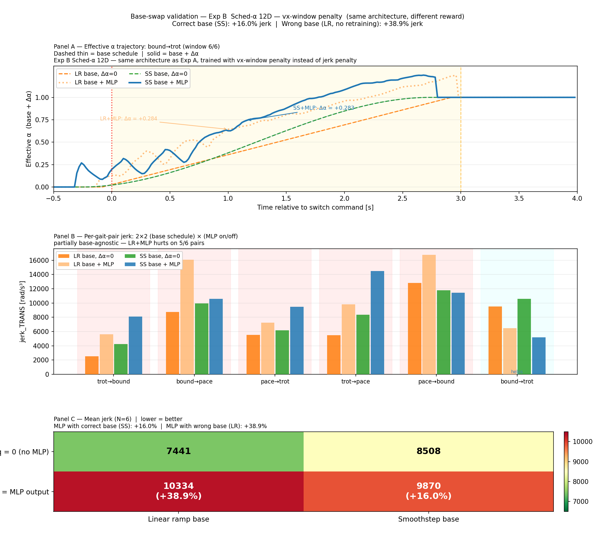

*Same architecture as Exp A (Sched-α 12D), trained with vx-window penalty instead of jerk penalty. With the correct Smoothstep base: +16.0% jerk. With the wrong linear-ramp base: +38.9% jerk — misfires on 5/6 gait pairs. Both experiments are Smoothstep-specific, but for different reasons:*

| | Exp A (jerk penalty) | Exp B (vx-window penalty) |
|---|---:|---:|
| SS base + MLP vs SS base | −2.2% jerk | +16.0% jerk |
| LR base + MLP vs LR base | +12.3% jerk | +38.9% jerk |
| MLP behaviour | Conservative — near-zero Δα | Aggressive — pushes α > 1.0 to hold vx |

*Exp A's jerk reward suppressed MLP intervention (near-static attractor) — little room to improve or misfire. Exp B's vx-window reward encouraged aggressive corrections that raise jerk even on the correct base, and raise it far more on the wrong base. The α > 1.0 overshoot visible in Panel A is the MLP over-blending to maintain forward velocity. Both MLPs are Smoothstep-calibrated; Exp B's corrections are simply stronger.*

### Experiment B Results (seed=42, canonical)

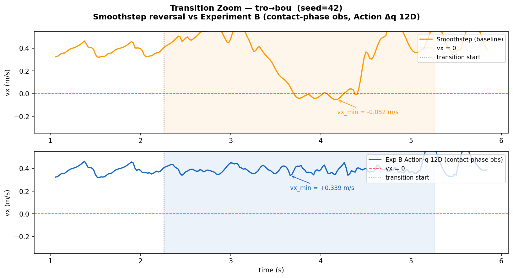

*Left: Smoothstep produces velocity reversal on trot→bound. Right: Exp B Action-q 12D stays positive.*

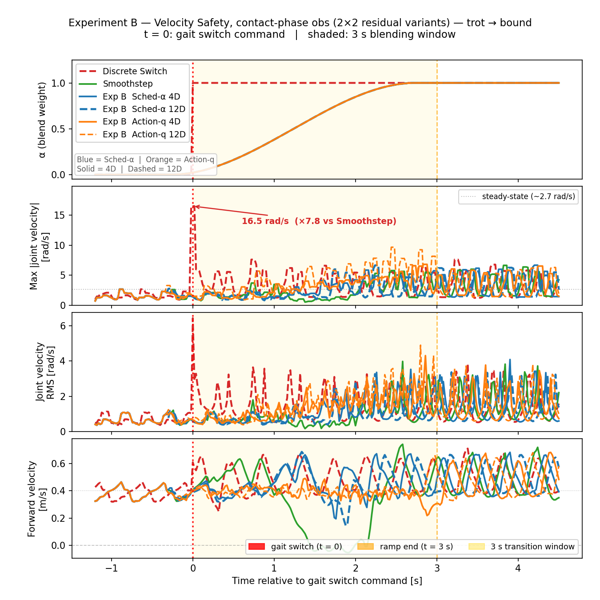

*Transition zoom (trot→bound, seed=42, contact-phase obs). All 4 Exp B variants maintain positive forward velocity — contrast with Smoothstep (green) which dips negative.*

**Policy-output observation:**

| Method | vx_mean | vx_std | **vx_min_trans** | **Δvx_trans** | jerk_TRANS | CoT | **rev** |
|---|---:|---:|---:|---:|---:|---:|---:|
| Smoothstep (ref) | +0.415 | 0.129 | −0.096 | 0.438 | 8508 | 2.090 | 3/6 |
| Schedule-α 4D | +0.435 | 0.092 | +0.121 | 0.257 | 9108 | 2.175 | 0/6 |
| Schedule-α 12D | +0.426 | 0.094 | +0.009 | 0.291 | 10463 | 2.207 | 0/6 |
| Action-q 4D | +0.421 | 0.082 | +0.182 | 0.179 | 12404 | 2.400 | 0/6 |
| **Action-q 12D** | +0.420 | **0.078** | **+0.251** | **0.104** | 11752 | 2.230 | **0/6** |

**Contact-phase observation (pol-out + foot contact):**

| Method | vx_mean | vx_std | **vx_min_trans** | **Δvx_trans** | jerk_TRANS | CoT | **rev** |
|---|---:|---:|---:|---:|---:|---:|---:|
| Smoothstep (ref) | +0.415 | 0.129 | −0.096 | 0.438 | 8508 | 2.090 | 3/6 |
| Schedule-α 4D | +0.434 | 0.091 | +0.089 | 0.258 | 9964 | 2.116 | 0/6 |
| Schedule-α 12D | +0.432 | 0.097 | +0.064 | 0.286 | 9870 | 2.245 | 0/6 |
| Action-q 4D | +0.420 | 0.081 | +0.219 | 0.185 | 13412 | 2.906 | 0/6 |
| **Action-q 12D** | +0.420 | **0.077** | **+0.267** | **0.131** | 10701 | 2.157 | **0/6** |

**Exp B best vs Smoothstep:**

| | Smoothstep | Action-q 12D contact | Change |
|---|---:|---:|---:|
| vx_mean | +0.415 | +0.420 | +1.2% |
| vx_std | 0.129 | **0.077** | **−40.3%** |
| vx_min_trans | −0.096 | **+0.267** | reversed → safe |
| **Δvx_trans** | 0.438 | **0.131** | **−70.1%** |
| reversals | 3/6 | **0/6** | eliminated |
| jerk_TRANS | **8508** | 10701 | **+25.8%** |
| CoT | **2.090** | 2.157 | +3.2% |

### All Experiment B Methods — Overview

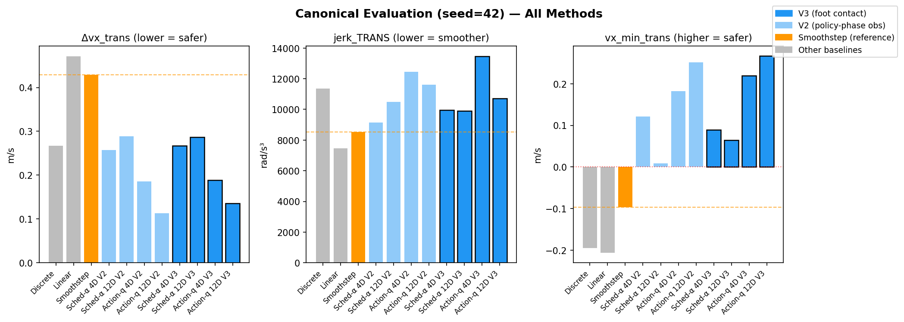

*Bar chart: all Exp B methods (pol-out = light blue, contact = dark blue) vs baselines. Orange dashed = Smoothstep reference.*

### What Foot Contact Adds (contact vs pol-out obs)

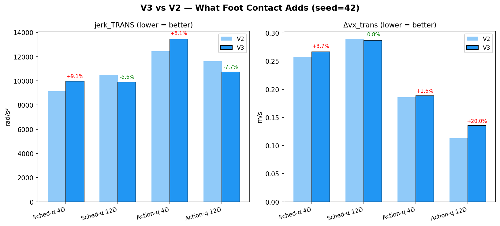

*Contact obs helps Action-q 12D most (−7.7% jerk). Sched-α 4D jerk worsens (+9.1%). Effect is mixed — contact obs is not universally better.*

### Pareto: Jerk vs Velocity Safety


No method occupies the lower-left corner (low jerk AND low Δvx). Experiment A pushes toward lower jerk (best: 7320, −14%) but at the cost of reversals. Experiment B pushes toward lower Δvx (best: 0.104, −76%) but at the cost of higher jerk. Smoothstep is near the jerk frontier without any training.

---

## 10. Discussion

### What the Two Experiments Reveal

**Smoothstep Ramp** is the strongest passive baseline — no training required, low CoT (2.090), simple to implement. It still produces reversal on hard gait-pair transitions because no fixed schedule can control the phase mismatch at switch time.

**Experiment A** (jerk penalty, advance-only sigmoid): Best result is Schedule-α 12D — jerk_TRANS = 8320 (−2.3% vs Smoothstep), 0/6 reversals. The improvement is marginal: Smoothstep is already near-optimal for jerk. The MLP learned to output near-zero Δα for ~40% of timesteps — the jerk reward and sparsity penalty together created a near-static attractor. Action residuals under Experiment A performed worse: Action-q 12D had 2/6 reversals and the highest Δvx_trans (0.405).

**Experiment B** (vx-window penalty, bidirectional, pol-phase obs, rand. duration): All eight variants (2 obs types × 4 architectures) achieve 0/6 reversals at seed=42. Action-q 12D with contact observation achieves the best velocity safety: Δvx_trans = 0.131 (−70% vs Smoothstep 0.438), vx_min_trans = +0.267. Cost: jerk_TRANS = 10701 (+25.8% vs Smoothstep). The contact observation helps Action-q 12D specifically (jerk −8.9% vs pol-out variant); other architectures show mixed results.

**The core tradeoff:** jerk and velocity safety compete. Experiment A optimizes the wrong objective (jerk is already low). Experiment B achieves the target (velocity safety) but increases jerk. No single method is better on all metrics.

### Why Simple Residual Learning Is Not Enough

**Smoothstep is already near the jerk frontier.** Remaining jerk after smoothstep is caused by phase mismatch (Δπ ≠ 0). The derivation in Section 2 shows α̈(0) · Δπ(0) is the source of the discontinuity. No bounded residual correction to α can reduce |Δπ(0)| — it can only retime when the blend passes through problematic α values. Experiment A confirmed this: best jerk improvement is −14% (Action-q 4D, but with reversals) or −2.3% (Schedule-α 12D, no reversals).

**The MLP cannot observe or fix phase alignment.** Experiment A used only gait one-hots and α_baseline. Experiment B adds π_current and π_target (richer) and foot contact (unambiguous stance/swing) — but these are still snapshots of outputs, not the internal CPG phase state.

**Frozen policies have no training coverage of blended states.** Both base policies were trained exclusively on single-gait steady-state. The interpolated states during blending are out-of-distribution for both. This is the fundamental ceiling of the frozen-policy approach. AllGaits (Bellegarda et al., 2024) avoids this by training a single policy continuously across all CPG phase states. In an AllGaits replication on B1, all six directed gait-pair transitions maintain positive forward velocity without any explicit transition mechanism. No blending schedule, however learned, can fully compensate for policies that have never experienced blended regimes.

**Bidirectionality is necessary for schedule residual.** Experiment A was advance-only (sigmoid). Experiment B's tanh clamp allows delaying the blend — Experiment B Schedule-α variants achieve 0/6 reversals where Experiment A advance-only variants did not consistently.

### Design Lessons

- **Reward design is the dominant factor.** Jerk penalty → near-static attractor (Exp A). vx-window penalty → active velocity protection but higher jerk (Exp B). The reward determines what the MLP learns, independent of architecture.
- **Action residual outperforms schedule residual on velocity safety**, at seed=42, once the reward is correctly specified. Direct per-joint correction is more effective than timing correction for phase-misaligned transitions.
- **Evaluation diversity is required.** Seed=42 is one phase configuration. Multi-seed N=60 was run for Experiment A; not run for Experiment B — Experiment B results should be treated as preliminary.
- **Observation design and reward design must be co-designed.** Adding foot contact without changing the reward is not enough; the reward must give the MLP an incentive to use the additional information.

### Three Questions Answered

**Q1: Does bidirectional schedule correction improve over advance-only?**
Yes. Experiment A (advance-only sigmoid): still produces reversals at some seeds. Experiment B (bidirectional tanh): 0/6 reversals at seed=42 for all variants. Bidirectionality allows the MLP to delay the blend during unfavorable phase alignment.

**Q2: Does policy-phase observation enable better corrections?**
Yes, combined with the vx-window penalty. Experiment B with pol-out obs: Δvx_trans reduced 76% for Action-q 12D vs Smoothstep. Contact obs further improves Action-q 12D specifically (−70% Δvx, −8.9% jerk vs pol-out variant).

**Q3: Does duration randomization produce better generalization?**
Experiment A trained at fixed 3 s and degraded away from 3 s. Experiment B (policy-output obs) trained on [1.5, 5.0] s; duration sweep results are in `logs/duration_sweep/`. Contact-phase obs variants (Experiment B final) were not duration-swept — treat 3 s as the valid evaluation point.

### Main Finding

**The jerk–velocity-safety tradeoff is the core result.** Smoothstep is near-optimal for jerk without any training. Residual learning can solve velocity reversal (Experiment B, all 0/6) but increases jerk. For a ~63 kg robot where forward momentum loss is dangerous (stairs, slopes), Experiment B's tradeoff is likely correct: eliminating reversal at +26% jerk is better than accepting 3/6 reversal to save 2% jerk.

---

## 11. Limitations and Future Work

### 1. Phase Alignment Is the Core Problem

The Section 2 derivation shows that acceleration discontinuity is proportional to Δπ(0). No bounded residual correction to α or q can change what Δπ(0) is — it is determined by the relative gait phases of the two frozen policies at the switch moment. The correct solution is one of:
- A policy trained continuously across all gait-phase states (AllGaits architecture)
- Phase locking: waiting for a favorable switch condition (requires phase state observation)
- Randomized transition-start (Experiment B does this during training, reducing the effect of worst-case phases)

### 2. Policy-Phase Observation + vx-Window Penalty Eliminates Reversal (Experiment B Result)

Experiment B confirms that combining policy-phase observation (π_current + π_target in obs) with a vx-window penalty (−2.0) eliminates velocity reversal at seed=42 for all four variants. Adding foot-contact obs (Experiment B contact variant) further improves Action-q 12D specifically but mixed results for other variants.

The next untested configuration: **policy-phase observation + explicit jerk reward** (Experiment B obs space, Experiment A-style jerk penalty). This combination may recover low jerk while keeping the safety improvements from phase-aware corrections.

### 3. Fixed Transition Duration in Experiment A Creates Training Bias

Experiment A trained at fixed 3 s. Performance degrades away from 3 s — a training-distribution artifact. Experiment B trains across [1.5, 5.0] s. Duration sweep results available for policy-output obs variants; contact-phase obs variants not swept.

### 4. Frozen Policy Out-of-Distribution Problem

The most fundamental limitation. Both frozen policies were trained on single-gait steady-state. They have never seen blended joint commands during their own training. The blended regime is out-of-distribution for both. This means the quality of frozen-policy outputs during blending is unknown, and no supervised signal exists to improve it.

### 5. Base Gait Quality

Phase 1 base policies have duty cycles that deviate significantly from natural locomotion. Better base gaits would produce a more meaningful residual problem — the quality of the transition is bounded by the quality of the source and target gaits.

### 6. Flat Terrain Only

All training and evaluation is on flat terrain. Transition jerk and velocity reversal compound on uneven terrain.

### 7. Joint Stiffness K_p = 400 N·m/rad

An independent AllGaits replication found K_p = 600 as the working value for B1. Our K_p = 400 is below this. Absolute jerk_TRANS values would be higher at K_p = 600. All internal comparisons and relative rankings are unaffected.

### 8. Simulation Only

Sim-to-real transfer requires: (a) base policy sim-to-real, (b) verification that bounded residual corrections remain safe on real hardware, (c) confirmation that jerk_TRANS reduction translates to reduced mechanical wear.

### Summary: What Would Be Redesigned

1. Use a single continuous policy trained across all gait-phase states (AllGaits-style) rather than frozen-policy blending
2. Add policy-phase state to the observation from the start, combined with an explicit jerk reward
3. Train across multiple transition durations from day 1
4. Use multi-objective reward that jointly optimizes jerk, CoT, and velocity safety
5. Evaluate across diverse gait-phase conditions from day 1 — N=6 is insufficient
6. Raise K_p to 600 N·m/rad

---

## 12. Anticipated Committee Questions

**Q1: Jerk increased +26% — how is this a smooth transition?**

The answer depends on what *smooth* means for a 63 kg quadruped. Jerk measures kinematic harshness (vibration, mechanical wear), but velocity reversal is a locomotion safety failure: the robot briefly moves backward, which on a slope or near an obstacle is dangerous. Experiment B accepts +26% jerk in exchange for eliminating 3/6 reversals (Smoothstep) → 0/6 reversals. For a heavy robot where forward momentum loss is costly, this tradeoff is deliberate. The core finding of this project is that "smooth" must be defined as a multi-objective problem — jerk and velocity safety compete, and the right balance depends on the deployment scenario. Section 10 discusses this tradeoff explicitly.

**Q2: Why not use AllGaits instead of frozen-policy blending?**

Frozen-policy blending is a realistic deployment constraint: you may have trained specialist gaits and want to transition between them without retraining. The architectural lesson — that the blending problem has a theoretical ceiling at Δπ(0) (Section 2) that no bounded residual correction can eliminate — is a valuable finding regardless of architecture. AllGaits removes the ceiling by training across all gait-phase states, but this project's contribution is precisely demonstrating *where that ceiling is* and *why fixed schedules are already strong*. Section 11 discusses AllGaits as the correct long-term direction.

**Q3: Experiment B has only seed=42 — how reliable are the results?**

Directly: Experiment B results should be treated as preliminary. Multi-seed N=60 robustness was run for Experiment A but not for Experiment B — this is clearly stated in Section 8 and Section 12. At seed=42, all 8 Experiment B variants achieve 0/6 reversals, which is a consistent pattern (not a single-run artifact). But whether this holds across diverse gait-phase conditions at switch time is untested. N=60 for Experiment B is listed as explicit future work.

---

## 13. Reproducibility

### Environment

```bash
conda activate env_isaaclab
cd ~/cpg-drl-transition

# Kill any zombie Isaac Sim processes before launching
nvidia-smi && pgrep -f "python.*play\|python.*train\|isaac\|kit" | xargs -r kill -9
```

### Phase 1 — Train Base Policies (available at `logs/phase1_final/`)

```bash
python scripts/train_b1_velocity.py --headless --num_envs 4096 \
    --task Isaac-Velocity-Flat-Unitree-B1-Trot-v0 \
    --max_iterations 1500 --run_name trot_v2

python scripts/train_b1_velocity.py --headless --num_envs 4096 \
    --task Isaac-Velocity-Flat-Unitree-B1-Bound-v0 \
    --max_iterations 4000 --run_name bound_v4

python scripts/train_b1_velocity.py --headless --num_envs 4096 \
    --task Isaac-Velocity-Flat-Unitree-B1-Pace-v0 \
    --max_iterations 4000 --run_name pace_v2
```

### Phase 2 — Train Experiment B (Policy-Output Observation)

```bash
# Schedule-α 4D (bidirectional, policy-output obs, duration rand)
python scripts/train_b1_phase2.py --headless --num_envs 1024 \
    --task Isaac-B1-Phase2-V2-Alpha4D-v0 \
    --max_iterations 2000 --seed 42

# Schedule-α 12D (policy-output obs)
python scripts/train_b1_phase2.py --headless --num_envs 1024 \
    --task Isaac-B1-Phase2-V2-Alpha12D-v0 \
    --max_iterations 2000 --seed 42

# Action-q 4D (policy-output obs)
python scripts/train_b1_phase2.py --headless --num_envs 1024 \
    --task Isaac-B1-Phase2-V2-Joint4D-v0 \
    --max_iterations 2000 --seed 42

# Action-q 12D (policy-output obs)
python scripts/train_b1_phase2.py --headless --num_envs 1024 \
    --task Isaac-B1-Phase2-V2-Joint12D-v0 \
    --max_iterations 2000 --seed 42
```

Checkpoints saved to `logs/phase2_new_approach/<run_name>/model_final.pt`.

### Phase 2 — Train Experiment B (Contact-Phase Observation, Final)

```bash
# All 4 contact-phase variants sequentially (~3 hrs)
bash scripts/train_2x2_v3.sh

# Or individually:
python scripts/train_b1_phase2.py --headless --num_envs 1024 \
    --task Isaac-B1-Phase2-V3-Alpha4D-v0 \
    --max_iterations 3000 --seed 42 --run_name schedule_residual_4d_v3
```

Checkpoints: `logs/phase2_new_approach/{schedule,action}_residual_{4d,12d}_v3/model_final.pt`.

### Phase 2 — Canonical Playback (seed=42, all Experiment B variants)

```bash
# Run all 4 contact-phase obs canonical playbacks at once
bash scripts/playback_v3.sh

# Single variant — pin duration to 3.0s for fair comparison
python scripts/play_b1_phase2.py \
    --task Isaac-B1-Phase2-V3-Joint12D-v0 \
    --checkpoint logs/phase2_new_approach/action_residual_12d_v3/model_final.pt \
    --num_envs 1 --steps 2500 --seed 42 \
    --gait_pairs trot,bound,pace,trot,pace,bound --switch_interval_s 8.0 \
    --transition_duration_s 3.0 \
    --save_csv logs/phase2_new_approach/action_residual_12d_v3/playback_seed42.csv --headless
```

### Phase 2 — Baseline Playback

```bash
python scripts/play_b1_phase2.py \
    --baseline discrete --seed 42 --steps 2500 \
    --gait_pairs trot,bound,pace,trot,pace,bound \
    --save_csv logs/phase2/baselines/discrete/playback_seed42.csv --headless

python scripts/play_b1_phase2.py \
    --baseline smoothstep_ramp --seed 42 --steps 2500 \
    --gait_pairs trot,bound,pace,trot,pace,bound \
    --save_csv logs/phase2/baselines/smoothstep_ramp/playback_seed42.csv --headless

python scripts/play_b1_phase2.py \
    --baseline linear_ramp --seed 42 --steps 2500 \
    --gait_pairs trot,bound,pace,trot,pace,bound \
    --save_csv logs/phase2/baselines/linear_ramp/playback_seed42.csv --headless
```

### Multi-Seed Robustness (N=60, Experiment A only)

N=60 was run for Experiment A methods (baselines + all 4 residual variants with jerk penalty). Not available for Experiment B.

```bash
# Experiment A — seed experiment (10 seeds × 6 gait pairs)
bash scripts/run_seed_experiment_v2.sh

# Analyze results
python scripts/analyze_seed_experiment.py --mode all --source seeds \
    --seed_dir logs/phase2_seed_experiment_v2 \
    --out logs/phase2_seed_experiment_v2/results_all.png
```

### Duration Sweep (Experiment B policy-output obs only)

```bash
# Pre-generated CSVs at logs/duration_sweep/. Re-run:
for dur in 1.5 2.0 3.0 4.0 5.0; do
    python scripts/play_b1_phase2.py \
        --task Isaac-B1-Phase2-V2-Alpha4D-v0 \
        --checkpoint logs/phase2_new_approach/schedule_residual_4d_v2/model_final.pt \
        --transition_duration_s $dur --seed 42 \
        --steps 2500 --gait_pairs trot,bound,pace,trot,pace,bound \
        --save_csv logs/duration_sweep/schedule_alpha_4d_v2/dur${dur}.csv --headless
done
```

### Plot Generation

```bash
python scripts/plot_transition_zoom.py --mode baselines
python scripts/plot_transition_zoom.py --mode ablation
python scripts/plot_transition_jerk.py
python scripts/plot_body_acc_compare.py
python scripts/plot_discrete_spike.py \
    --csv logs/phase2/baselines/discrete/playback_seed42.csv
```

### Tests

```bash
python -m pytest tests/ -q    # 44/44 unit tests
```

### File Structure

```
cpg-drl-transition/
├── envs/
│   ├── b1_phase2_env_cfg.py        # Phase 2 env config (V2 + V3 variants)
│   └── b1_phase2_env.py            # Phase 2 env class — blending + residual
├── scripts/
│   ├── train_b1_phase2.py          # Train any Phase 2 variant
│   ├── train_2x2_v3.sh             # Train all 4 V3 variants sequentially
│   ├── play_b1_phase2.py           # Playback + diagnostic plots + CSV
│   ├── run_seed_experiment_v2.sh   # Multi-seed N=60
│   ├── analyze_seed_experiment.py  # per-gait-pair jerk analysis
│   ├── plot_transition_zoom.py
│   ├── plot_transition_jerk.py
│   ├── plot_body_acc_compare.py
│   ├── plot_discrete_spike.py
│   └── plot_base_swap.py
├── logs/
│   ├── phase1_final/               # Base policy checkpoints (trot, bound, pace)
│   ├── phase2/
│   │   └── baselines/              # Discrete / Linear / Smoothstep CSVs + video
│   ├── phase2_new_approach/        # V2 + V3 training results
│   │   ├── schedule_residual_4d_v2/   # Schedule-α 4D V2
│   │   ├── schedule_residual_12d_v2/  # Schedule-α 12D V2
│   │   ├── action_residual_4d_v2/     # Action-q 4D V2
│   │   ├── action_residual_12d_v2/    # Action-q 12D V2
│   │   ├── schedule_residual_4d_v3/   # Schedule-α 4D V3 (final)
│   │   ├── schedule_residual_12d_v3/  # Schedule-α 12D V3 (final)
│   │   ├── action_residual_4d_v3/     # Action-q 4D V3 (final)
│   │   └── action_residual_12d_v3/    # Action-q 12D V3 (final)
│   └── duration_sweep/             # V2 duration generalization CSVs
└── tests/
```

---

## 14. B1 Robot Configuration

### Joint Axis Convention

| Joint | Axis | Default FL/FR/RL/RR | Role |
|---|---|---|---|
| `hip_joint` | Abduction (lateral splay) | +0.1 / −0.1 / +0.1 / −0.1 | Lateral balance |
| `thigh_joint` | **Flexion (fore/aft swing)** | +0.8 / +0.8 / +1.0 / +1.0 | **Primary walking driver** |
| `calf_joint` | Knee bend | −1.5 / −1.5 / −1.5 / −1.5 | Foot clearance during swing |

The +0.2 rad asymmetry between front and rear thighs directly motivates the **per-joint residual structure** — different joints need different transition rates, and a per-leg scalar cannot capture this asymmetry.

### Known Hardware Asymmetries

Two physical asymmetries are known from simulation measurements:

1. **Thigh default-pose asymmetry** (Isaac Lab config): front thighs default to 0.8 rad, rear thighs to 1.0 rad. This is an `UNITREE_B1_CFG` choice, not present in the URDF. It creates unequal front/rear leg configurations at episode reset and contributes to a backward-walking local minimum during training.

2. **Lateral hip offset** (PhysX body_pos_w measurement): the RR hip joint sits approximately 34 mm wider laterally than the RL hip. This geometric asymmetry creates a permanent rightward torque during stance. It may explain the systematic rightward yaw tendency observed in forward-locomotion policies on B1.

Neither asymmetry was corrected in this project. Both affect base gait quality but not the relative comparison between transition methods (all methods use the same base gaits).

### Phase 2 Joint Order

```
j0  FL_hip    j1  FR_hip    j2  RL_hip    j3  RR_hip
j4  FL_thigh  j5  FR_thigh  j6  RL_thigh  j7  RR_thigh
j8  FL_calf   j9  FR_calf   j10 RL_calf   j11 RR_calf
```

Δα_j or Δq_j applies independently to each of j0–j11 in 12D variants. In 4D variants, one scalar is broadcast to all three joints per leg.

### Foot Contact Convention

`contact_forces[:, foot_ids, 2] > threshold` — vertical force on the four feet (FL, FR, RL, RR). Contact threshold: 1.0 N.

### ActuatorPD Configuration

| Parameter | Value | Note |
|---|---|---|
| K_p (stiffness) | 400 N·m/rad | Below AllGaits B1 reference (600) |
| K_d (damping) | 10 N·m·s/rad | |
| Effort limit | 60 N·m per joint | |

---
